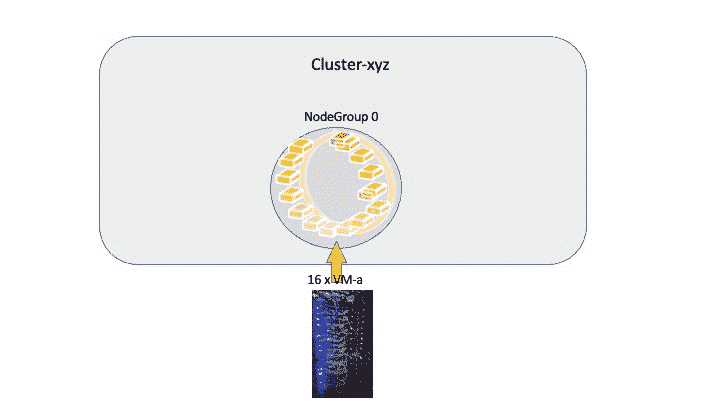
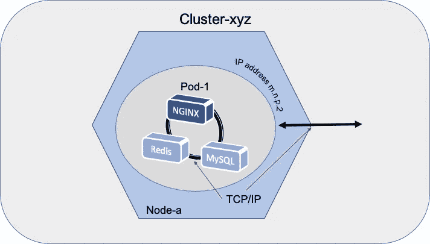

# 高效使用 Kubernetes 的第二个七个主要概念和代码示例

> 原文：<https://towardsdatascience.com/the-second-seven-primary-concepts-and-code-examples-for-using-kubernetes-productively-7170642c4094?source=collection_archive---------23----------------------->

## 这篇博客文章是第二篇解释 Kubernetes 的博客文章，没有深入研究其内部架构。我将通过 Minikube 代码示例讨论接下来的七个 Kubernetes 基本概念。


Kubernetes 协调了所有通过网络连接的虚拟机和应用程序的分布。照片由 S [amuel Sianipar](https://unsplash.com/@samthewam24?utm_source=unsplash&utm_medium=referral&utm_content=creditCopyText) 在 [Unsplash](https://unsplash.com/s/photos/orchestra?utm_source=unsplash&utm_medium=referral&utm_content=creditCopyText) 上拍摄

# 安装 kubectl

在这篇博客文章中，我经常提到`kubectl`。

`kubectl`是您的本地命令行界面(CLI ),用于与单个 Kubernetes 集群交换声明性或命令性指令。Kubernetes 群集位于您的本地沙盒中；我们使用 Minikube 或通过网络远程操作。

你需要[安装](https://kubernetes.io/docs/tasks/tools/)T2 才能继续。

大多数`[kubectl](https://kubernetes.io/docs/tasks/tools/)`命令的总结如下:

[](https://kubernetes.io/docs/reference/kubectl/cheatsheet/) [## kubectl 备忘单

### 这个页面包含一个常用 kubectl 命令和标志的列表。Kubectl 自动完成 BASH 源代码> ~/。bashrc #…

kubernetes.io](https://kubernetes.io/docs/reference/kubectl/cheatsheet/) 

# 安装 minikube

除了在这篇博客文章中使用`kubectl`，我还使用了`minikube.`

[Minikube](https://kubernetes.io/docs/setup/learning-environment/minikube/) 是一款流行的工具，可以在您的本地工作站上使用 Kubernetes 进行培训或测试。

Minikube 是您在本地计算机上运行 Kubernetes 的方式。

我认为 Minikube 是我安装在本地机器上的一个程序，用来训练或测试 Kubernetes。

下面这篇博客文章将更详细地介绍如何设置和更改哪个`[minikube](https://kubernetes.io/docs/tasks/tools/)`集群`kubectl`正在指向哪个集群。

[](https://itnext.io/is-minikubes-profile-a-kubernetes-cluster-c0f134c5e684) [## Minikube 的配置文件是 Kubernetes 集群吗？

### 我讨论了导致 Minikube 表现得像 Kubernetes 的稀疏记录的桥接概念。

itnext.io](https://itnext.io/is-minikubes-profile-a-kubernetes-cluster-c0f134c5e684) 

在继续之前，您需要[安装](https://kubernetes.io/docs/tasks/tools/) `[minikube,](https://kubernetes.io/docs/tasks/tools/)`。

# 前一篇博客文章的摘要

在第一篇博客文章中，我介绍了 Kubernetes 是分布式计算资源云的操作系统这一前提。

[](/the-first-nine-primary-concepts-and-code-examples-for-using-kubernetes-productively-d2aabccc0380) [## 高效使用 Kubernetes 的前九个主要概念和代码示例

### Kubernetes 的解释和使用不应该讨论内部架构组件。相反，我讨论…

towardsdatascience.com](/the-first-nine-primary-concepts-and-code-examples-for-using-kubernetes-productively-d2aabccc0380) 

我详细介绍了高效使用 Kubernetes 所需的前九个基本概念，同时避免了 Kubernetes 内部架构的复杂性。

前一篇博客文章的要点是 Kubernetes 编排了两个抽象维度。第一个维度是节点——计算资源。第二个维度是容器图像—应用程序。

在这篇博客文章中。我涵盖了节点、节点池、容器映像、pod、集群、入口和端点对象。

Kubernetes 与云无关，因为:

1.  将物理机引擎转变为虚拟机。然后将虚拟机映射到 Kubernetes 抽象*节点。*
2.  通过将应用程序放入[容器](https://www.cio.com/article/2924995/what-are-containers-and-why-do-you-need-them.html)映像中，将应用程序转换为一组虚拟应用程序。容器被映射到 Kubernetes 抽象*pod。*

Kubernetes 协调 pods，在*节点*上启动并初始化 *pods* ，如果无法到达，则在不同的*节点*上重新启动 *pods* (容错、复制(扩展)pods)，并在 pods 上执行其他分布式操作系统操作。

# 10.Kubernetes 节点和节点池抽象了计算引擎

我详述了 Kubernetes 节点的第一维主干——计算资源。

Kubernetes 的一个重要概念是独立于计算硬件的类型。Kubernetes 将计算引擎(硬件和操作)规范抽象为一个*节点*。

一个*节点*是主要云供应商的一组有限的虚拟机(VM)产品。每种服务类型都指定了计算资源和单位时间的租赁价格。

虚拟机类型描述了 CPU、GPU 和 xPU 的混合；记忆的数量和类型(快速记忆)；磁盘的数量和类型(慢速内存)；以及免费的 Linux 变种操作系统(OS)。

从现在开始，我使用术语虚拟机(VM)来指代计算引擎。

每个云供应商都允许您使用其他想要添加或替换的资源来构建定制的虚拟机类型。

***注*** *:云厂商提供 MS Windows NT 等其他 OS 变种。*

您将一个 VM 类型分配给 Kubernetes 外部的一个节点。因此，Kubernetes 配置是云独立的，因为它只知道哪些*节点*被分配给*集群*，并且独立于该节点的实际计算类型。

由于 Kubernetes 编排服务的异构性(如故障转移和复制)造成的限制，云实施只允许将同构节点(相同虚拟机类型)的节点池添加到 Kubernetes 集群中。

在云上部署 Kubernetes 时，我们需要将一个 Kubernetes 节点映射到云中的一个 VM。

因为 Kubernetes 与 VM 类型无关，所以 Kubernetes 与云类型无关。

云计算硬件如何映射到 Kubernetes 节点在特定云供应商的文档中。它不在 Kubernetes 文档中。

下面引用的博客文章向您展示了如何为四种不同的云类型指定 Kubernetes 节点的计算资源:

[](/how-to-assign-computing-resources-for-four-different-cloud-kubernetes-services-aks-eks-gke-and-b3f4deb722bc) [## 如何为四种不同的云 Kubernetes 服务分配计算资源:AKS、EKS、GKE 和…

towardsdatascience.com](/how-to-assign-computing-resources-for-four-different-cloud-kubernetes-services-aks-eks-gke-and-b3f4deb722bc) 

***注*** *:您可以用* `[*kubectl*](https://kubernetes.io/docs/tasks/tools/)` *指定虚拟机类型，或者让云厂商根据负载分配虚拟机类型。我建议您从云供应商自动分配开始，然后优化您的体验或当成本失控时。*

# 11.什么是 Kubernetes 集群，它有什么作用？

Kubernetes 是一个用于通过网络连接的节点(VM)的分布式操作系统。一个特定的节点网络就是 Kubernetes *集群*。

一个或多个节点池被分配给 Kubernetes 集群(节点)。节点池被分配给一个群集，不能在其他群集之间共享。

Kubernetes 在一个集群中协调您分配的多个节点池。

***注*** *:一个集群最多可以有 5000 个节点的限制，每个节点最多可以有 110 个 pod。在一个集群中，容器映像的数量最多可达 300，000 个。文档陈述了这些数字。对于任何给定的云供应商？我不知道。我不知道有谁曾经接近过这些数字。*

Kubernetes 可以命名和管理云上的许多集群。Kubernetes 的基础是虚拟机。



图一。物理硬件被描述为云中的虚拟机(VM)。每个虚拟机都映射到一个节点。相同虚拟机类型的节点被分组到一个节点池中。一个或多个节点池被分配给一个群集。群集不能共享池，节点池也不能共享节点。结果是虚拟机被分配到一个集群。此图显示了分配给节点池 0 的 16 台虚拟机，分配给节点池 1 的两台不同类型的虚拟机，以及分配给节点池 2 的一台虚拟机。作者的动画。

***注*** *:如果您熟悉 DAG(有向无环图)，那么一条直线型 DAG 将虚拟机连接到节点，节点池连接到命名集群。*

***注意*** *:因为是在一台本地计算机上，所以一个 Minkube 实例代表该计算机上的一个集群。*

## **描述集群的 kubectl 命令。**

您可以执行以下命令来打印活动上下文(集群)的集群信息:

```
kubectl cluster-info
```


“kubectl cluster-info”的输出

执行以下命令，打印出 kubeconfig 文件中所有集群上下文的一些详细信息:

```
minikube start sanbox --cpus "10" --memory "3260m" --nodes 5
kubectl config get-contexts
```


“kubectl config get-contexts”的输出

***注*** *:命令* `*minikube start*` *只加载刀具 minikube 的默认簇* `*minikube*` *。*

***注*** *:输出显示错字。提示:集群名称。*

记住，`kubectl`它被映射到一个特定的集群:

```
kubectl config use-context <cluster-name>
```


“kubectl 配置使用上下文 minikube”的输出

最后，停止`sanbox:`

```
minikube stop sanbox
```


# 12.什么是 Kubernetes 容器，它有什么用？

记住，作为一个分布式操作系统，Kubernetes 的一个主要目标是应用程序独立性。

Kubernetes 以与计算引擎独立相同的方式实现应用程序独立。一个应用程序及其所有依赖项被封装成一个容器映像，也可以称为虚拟应用程序(VA)。

***注****:Kubernetes 的不同实现支持不同的 VM 和 VA 技术提供者。例如，Kubernetes 支持几种容器运行时:* [*Docker*](https://docs.docker.com/engine/) *，*[*Container d*](https://containerd.io/docs/)*，*[*CRI-O*](https://cri-o.io/#what-is-cri-o)*，以及任意实现的* [*Kubernetes CRI(容器运行时接口)*](https://github.com/kubernetes/community/blob/master/contributors/devel/sig-node/container-runtime-interface.md) *。*

> 容器是一个小型虚拟机，没有独立的操作系统、驱动程序和常规虚拟机的其他组件。相反，容器打包了所有必需的依赖项，以便在不同的计算环境上分发和运行相同的代码，同时与相同硬件上的其他容器共享相同的操作系统。

> 容器映像表示封装了应用程序及其所有软件依赖项的二进制数据。容器映像是可执行的软件包，可以独立运行，并对其运行时环境做出非常明确的假设。—[https://kubernetes.io/docs/concepts/containers/images/](https://kubernetes.io/docs/concepts/containers/images/)

我用来制作 Kubernetes 容器图像的工具是 Docker。

***注*** *: Docker 对图像和容器的定义是分开的但几乎相同，这可能会造成混淆。Docker 映像由应用程序及其所有软件依赖项的二进制数据封装组成。Docker 容器是一个可执行映像，Kubernetes 也称为 K8s，称之为容器映像。然而，根据文档作者的不同，有时 Kubernetes 将容器图像称为容器。*

我从 Docker 注册表中获取容器映像，或者创建应用程序的容器映像，并将其推送到注册表中。一旦进入 docker 注册表，我就会将车开进一个 [K8s Po](https://kubernetes.io/docs/concepts/containers/images/) d。

```
minikube start sanbox --cpus "10" --memory "3260m" --nodes 5
*# start the pod running ubuntu application, freeware Debian linux* #  NOTICE create depolyment (of pod)
kubectl create deployment --image=ubuntu ubuntu-pod
kubectl get po
kubectl get pod
```


kubectl 接受明确的对象类型名。kubectl 没有受到影响，因为对象类型不到 40 种。记住古老的编码口头禅——“如果你认为它很聪明，就删掉它。

现在，我打扫卫生:

```
# Again, deployment not pod object type.
kubectl delete deployment ubuntu-pod
```


***重要说明:*** *Kubernetes 默认的图片注册表是* [*Docker 公共注册表。*](https://hub.docker.com/_/registry)

> 虽然 Kubernetes 支持的[容器运行时](https://kubernetes.io/docs/setup/production-environment/container-runtimes)不仅仅是 Docker， [Docker](https://www.docker.com/) 是最常见的运行时，它有助于使用 Docker 中的一些术语来描述 Pods。—[https://kubernetes.io/docs/concepts/workloads/pods/](https://kubernetes.io/docs/concepts/workloads/pods/)

> Kubernetes 使您能够将容器化的应用程序分组到逻辑单元中，跟踪它们并自动伸缩它们。也就是说，当容器不在使用时，它会自动关闭它们，当应用程序需要它们来满足按需需求时，它会启动新的容器。

做完这些之后，我们准备好展示如何将应用程序转换成 Kubernetes 容器映像了吗？抱歉，不在这里。

不幸或幸运的是，从应用程序创建容器映像的过程超出了本文的范围，这取决于您如何看待它。

我和其他人充分报道了 Docker，并描述了我们与 Docker 的冒险经历:

[](https://levelup.gitconnected.com/our-enterprise-docker-solution-for-migration-to-the-cloud-d7bb9d1a796b) [## 我们面向云迁移的企业 Docker 解决方案

### 这是一个关于我们第一次推出 Docker 的故事，它发生在我以前作为承包商工作过的一家公司。代码，作为…

levelup.gitconnected.com](https://levelup.gitconnected.com/our-enterprise-docker-solution-for-migration-to-the-cloud-d7bb9d1a796b) [](https://dr-bruce-cottman.medium.com/a-docker-solution-for-the-test-groups-use-cases-8e8ed6c28e11) [## 我们将 Docker 企业解决方案的速度提高了一倍

### 我们收到了大量关于 Docker 解决方案 0.0.2 版本的反馈。反馈有一个共同的主题:只有 R&D…

dr-bruce-cottman.medium.com](https://dr-bruce-cottman.medium.com/a-docker-solution-for-the-test-groups-use-cases-8e8ed6c28e11) [](https://levelup.gitconnected.com/a-tutorial-on-the-behavior-of-linux-environment-variables-and-docker-containers-environment-29218a982220) [## 改变 Linux 环境变量和 Docker 容器环境的十七种方法…

### Docker 容器从它们的主机继承环境变量，在启动时在外部设置，或者在…

levelup.gitconnected.com](https://levelup.gitconnected.com/a-tutorial-on-the-behavior-of-linux-environment-variables-and-docker-containers-environment-29218a982220) [](https://itnext.io/is-minikubes-profile-a-kubernetes-cluster-c0f134c5e684) [## Minikube 的配置文件是 Kubernetes 集群吗？

### 我讨论了导致 Minikube 表现得像 Kubernetes 的稀疏记录的桥接概念。

itnext.io](https://itnext.io/is-minikubes-profile-a-kubernetes-cluster-c0f134c5e684) [](/fifteen-jupyter-notebook-extensions-to-a-docker-image-4dce942faadc) [## 一个 Docker 映像的十五个 Jupyter 笔记本扩展

### 我们的 Jupyter Python 和 R 用户的 Docker 映像要求他们在每隔…之后设置他们的 Nbextensions 首选项

towardsdatascience.com](/fifteen-jupyter-notebook-extensions-to-a-docker-image-4dce942faadc) [](https://betterprogramming.pub/what-goes-into-a-dockerfile-ff0ace591060) [## docker 文件包含哪些内容？

### 从头开始构建 Dockerfile 文件，不需要任何经验

better 编程. pub](https://betterprogramming.pub/what-goes-into-a-dockerfile-ff0ace591060) 

我们将虚拟机映射到 Kubernetes 节点以实现计算资源独立性，并且我们需要将容器映像映射到 Kubernetes *pods* 中。

我们现在有了作为 Kubernetes pod 执行的计算资源和应用程序的基础。

# 13.Kubernetes Pod 对象是什么？

Kubernetes pod 对象是集群中正在运行的进程的一个实例。pod 包含一个或多个容器图像，通常是 [Docker 容器](https://kubernetes.io/docs/concepts/containers/)。当 Pod 运行多个容器映像时，容器映像作为单个实体进行管理，并共享 Pod 的资源。

***注意****:Kubernetes*[*支持其他容器创建工具，*](https://kubernetes.io/docs/concepts/containers/) *不仅仅是 Docker。*

Pod 共享资源包括:

*   共享存储，如卷；
*   联网，作为唯一的集群 IP 地址；
*   关于运行每个容器的信息，例如容器映像版本或要使用的特定端口。

例如，一个 Pod 可能包括

1.  NGINX web 服务器容器，
2.  向 NGINX 容器提供页面模板的 MySQL 关系数据库服务器(RDBMS)容器，以及
3.  提供内存(参数)键值缓存的 Redis 容器。



图二。有三个容器的吊舱；NGINX，Redis，MySQL。图片由作者提供。

该群集使用云内部互联网协议(IP)地址形成虚拟专用网络(VPN)。

Pod 中的容器共享云内部 IP 地址，并在同一节点上的共享上下文中运行。

一个 Pod 模拟一个特定于应用程序的*“逻辑主机”*，并且可以包含由 VPN 的内部 IP 地址连接的不同应用程序容器。

VPN IP 地址位于云内部，不能通过云外部的互联网进行外部访问。

我们需要一个服务来在 VPN 云内部 IP 和互联网外部 IP 之间进行转换(或映射)。

在 Kubernetes 中，地址转换是由 Ingress 对象处理的，我将在后面详细介绍。

在下一篇博客文章中，我将讨论 Kubernetes 部署对象，其中我使用了一个 YAML 文件来详细描述声明性的 pod、服务和工作负载。图 2 显示了一个包含三个 pod 的集群。

## Redis，NGINX 和 MySQL 的一个旁注。

在这篇博客文章中，到目前为止，我已经讨论了 Kubernetes 的关键构建块概念:集群、节点、节点池、容器和 pod。

我先简单介绍一下我们在博客文章项目中使用的容器——在 Kubernetes 上部署 web 服务。

## Redis 和 Kubernetes 有什么关系？

Redis 是一个流行的开源内存参数(密钥对)存储和缓存。如果你熟悉 Python，是不是一个快速的字典存储服务。Redis 与 Kubernetes 没有关系。

我们将 Redis 容器化，放在需要缓存参数数据存储的 Kubernetes pods 中。

在 Kubernetes 中使用 Redis 的详细清单如下:

[](https://medium.com/swlh/production-checklist-for-redis-on-kubernetes-60173d5a5325) [## Kubernetes 上 Redis 的生产清单

### Redis 是一个流行的开源内存数据存储和缓存，已经成为构建可伸缩的…

medium.com](https://medium.com/swlh/production-checklist-for-redis-on-kubernetes-60173d5a5325) 

Redis 不是 Kubernetes 发行版的一部分，也不是 Kubernetes 托管云服务的一部分。然而，所有主要的云提供商都将 Redis 作为软件即服务(s as)提供。比如说。Redis 是由[亚马逊 elastic Cache](https://aws.amazon.com/elasticache/)、 [Azure Cache for Redis](https://azure.microsoft.com/en-us/services/cache/) 、 [GCP Memorystore](https://cloud.google.com/memorystore) 提供的 SaS。您可能需要一个 Redis 容器，用于不同于 Kubernetes SaaS 版本所提供的配置和控制。

## NGINX 和 Kubernetes 有什么关系？

NGINX 是一个流行的开源 web 服务器。

我们将 NGINX 容器化，放在需要 web 服务的 Kubernetes 容器中。

NGINX 与 Kubernetes 没有关联，尽管 Kubernetes 的实现者使用 NGINX 作为 Kubernetes 入口对象的核心。

不要担心；我还没有详细说明入口物体。

## MySQL 和 Kubernetes 有什么关系？

MySQL 是一种流行的开源 RDBMS，与 Kubernetes 无关。

MySQL 不是 Kubernetes 发行版的一部分，也不是 Kubernetes 托管云服务的一部分。所有主要的云提供商都提供 MySQL 作为软件即服务(SaaS)。您可能想要一个 MySQL 容器，用于不同的版本、配置和控制，而不是云供应商提供的。

***注意*** *: MySQL 是一个复杂的 Kubernetes 容器镜像，因为它也是一个 Volume 对象。另一篇博客文章的主题。*

# 14.什么是 Kubernetes 入口控制器和入口对象？

当人们在云之外时，他们如何访问云托管的服务？

您可以通过一个 Ingress 对象进入 Kubernetes 云，该对象将 HTTP 和 HTTPS 路由从云外部公开给集群中的[服务](https://kubernetes.io/docs/concepts/services-networking/service/)。

使用入口控制器和入口规则，单个 IP 地址将流量路由到 [Kubernetes 云集群中的多个服务。](https://kubernetes.io/)

> 进入:进入或进入的行为或事实。[牛津词典](https://languages.oup.com/google-dictionary-en/)

入口控制器为位于云服务和外部世界访问之间的入口对象提供不同的功能。

可配置的流量路由始终是入口的基本功能。流量路由由入口资源(路由表)上定义的规则控制。

在路由之上，最流行的入口功能是负载平衡。

你可以使用任何软件作为入口控制器，但我总是看到部署了 [NGINX](https://kubernetes.github.io/ingress-nginx/) web 服务器。

NGINX web 服务器提供了入口控制器所需的一切。


图 9。Kubernetes 的入口对象。图片来源: [Kubernetes 文档](https://kubernetes.io/docs/concepts/services-networking/ingress/)中人物的作者桌面截图

# 15.什么是 Kubernetes 端点对象？

Kubernetes *端点*源自网络协议术语。端点通常是 IP(互联网协议)地址。

在 Kubernetes 的情况下，端点是 Kubernetes Pod 的 IP 地址。它是网络连接的终点(点)，也是 Kubernetes Pod 的起点。

***注意*** *:你可能会看到一个引用****<>****的端点。例如，HTTP 端点。在我所知道的所有情况下，引用实际上是指 IP 地址。*

我定义端点这个术语是因为在 Kubernetes 文档中经常会遇到它。

在 Kubernetes 中，您可以使用 pod 集群，而不需要知道端点是什么或做什么。

例如:

> 当一个**服务**选择器匹配一个 pod 标签时，该 IP 地址被添加到您的**端点。**

可以表述为:

> 当 pod 标签与服务选择器匹配时，一个**服务**由 pod 组成。

我认为 Kubernetes 的一点点实现正在渗透进来。也许在未来的 Kubernetes 文档中，端点会被删除。

# 16.用于调试的晦涩但有用的 kubectl 命令。

这些 kubectl 命令中的许多都像 docker 作用于容器一样作用于 Kubernetes pods。我们使用下面的 kubectl 命令来调试我们的 Kubernetes pods 的行为。

首先，我启动一个名为`ngnix-pod`的 Kubernetes pod，图片来自 Docker 注册表，名为`ngnix:`

```
minikube start sanbox --vm-driver=docker --apiserver-ips 127.0.0.1 --apiserver-name localhost --cpus "10" --memory "3260m" --nodes 
kubectl create deployment --image=nginx nginx-pod
kubectl get pods --show-labels
```


下面的 kubectl 命令运行一个交互式 bash 会话，该会话只能在带有一个容器的 pods 上运行。

```
kubectl exec -it  nginx-pod-796c9b5fdb-jjxgx -- sh
```


`kubectl exec -it` nginx-pod-796 c 9 b5 FD b-jjxgx `-- sh"`输出

哇哦。这是一个错误。有一个解决方法。在这篇博客文章中，我把它作为一个练习。在下一期文章中，将给出一个变通解决方案。

# 摘要

这篇文章过去的版本有 8000 字，并且还在增加。我觉得它太长了，不适合在媒体上发表。

然而，作为参考，它需要留在一起。

我通过反向链接以前发表的文章解决了“在一起”*。也可以单独阅读。*

1.  *前面的博客文章是第一部分；*

*[](/the-first-nine-primary-concepts-and-code-examples-for-using-kubernetes-productively-d2aabccc0380) [## 高效使用 Kubernetes 的前九个主要概念和代码示例

### Kubernetes 的解释和使用不应该讨论内部架构组件。相反，我讨论…

towardsdatascience.com](/the-first-nine-primary-concepts-and-code-examples-for-using-kubernetes-productively-d2aabccc0380) 

2.这篇博客文章涵盖了 Kubernetes 集群、节点、pod、容器映像、端点和入口对象的七个概念。我使用了对象类型部署。不幸的是，我将在以后的博客中详细介绍部署。

3.第三篇博客文章涵盖了 Kubernetes 的种类、部署、服务和其他六个概念。

4.在第三篇博客之后，也许在这之前，我会展示如何在阿里巴巴、AWS、Azure、GCP 和甲骨文上获得免费但有限的账户。

4.我计划写一篇博客文章，详细介绍我们使用的丰富的工具生态系统。

在上一篇博客文章中，我注意到 Kubernetes 的安全性很低。嗯，我刚刚看到了一篇名为“ [Kubernetes 强化指南:网络安全技术报告](https://www.nsa.gov/News-Features/Feature-Stories/Article-View/Article/2716980/nsa-cisa-release-kubernetes-hardening-guidance/utm_medium/email/utm_campaign/awareness/mkt_tok/MTA3LUZNUy0wNzAAAAF_FAjAkUgx3M3_YdLsZ38y6jmapbz2KZ658-fPVhfKazo6icV9Xq04W-lb4kz22bbBOnLDjtohgLdCDHqmlcs8S02aGUo888Xd6ORp4Sxfu0YXpw/?utm_source=topic+optin&utm_content=20210823+infraops+nl)”的技术文章我打算今晚读它(也许开始读)。只有五十页。

每个博客都有你可以使用的代码。

快乐高效地编码！*