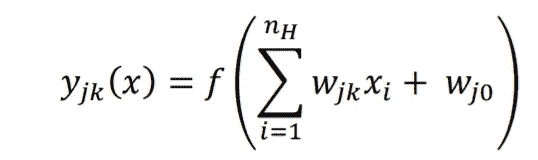
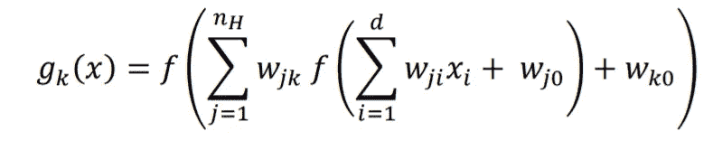
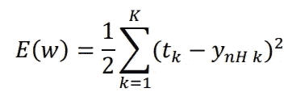
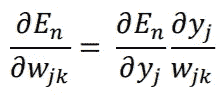
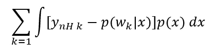
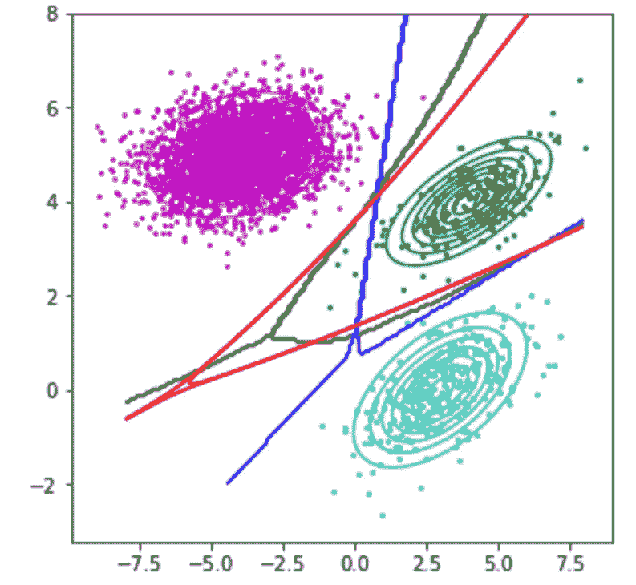

# 背后的秘密神经网络

> 原文：<https://towardsdatascience.com/the-secret-behind-neural-networks-8c9a77235a8a?source=collection_archive---------38----------------------->

## 机器学习中的必备知识

## 为什么神经网络实际上是后验概率的直接估计

照片由[法库里安设计](https://unsplash.com/@fakurian?utm_source=medium&utm_medium=referral)在 [Unsplash](https://unsplash.com?utm_source=medium&utm_medium=referral) 上拍摄

每个机器学习算法的背后都存在偏差-方差困境。机器学习模型越复杂，它的泛化能力就越好，但过度拟合的倾向就越高。理论上，高斯分类器为正态分布数据提供了最佳分类器。但正是神经网络的灵活性使得它们在最近几年变得更加重要。

# **普适逼近定理**

对于任何函数，不管有多复杂，都有一个神经网络可以完美地将输入映射到该函数的输出。

神经网络是分层排列的非线性单元的组合。非线性单元通常被称为感知器，它们的方程形式如下:

其中 f 是非线性函数。神经网络或多层感知器(MLPs)通过将一个神经元(x)的输入改变为前一个神经元的输出，将这些函数堆叠成层，如下所示:

通过分层堆叠这些感知器，可以实现输入和输出之间的复杂映射。这产生了一个极其通用和灵活的架构，如果足够复杂，可以有效地学习任何功能。这就是众所周知的通用近似定理。

# **优化网络的权重**

为了优化神经网络的权重，模型的误差可以相对于权重来表示。然后可以计算梯度，并且可以使用类似梯度下降的优化器来更新权重。这就是所谓的反向传播算法。

误差函数可以表示如下。

误差是神经网络的输出和目标值之间的平方差之和。我们知道，最后一层的输出是网络中所有权重的函数，因此通过获取梯度并应用微分链规则，我们可以获得网络中每个权重的梯度。

# **作为后验概率估计器的神经网络**

使用贝叶斯定理，可以形成给定数据的最佳权重的表达式。正如我的一些[其他文章](/drawing-out-the-posterior-probability-surface-of-a-gaussian-classifier-a1f6044ab5ae)中提到的，这是网络权重的后验概率超平面，最大化这个返回最优权重。

可以看出，对于无限数据，最小化上面所示的误差函数等同于最小化下面的函数:

其中 p(w|x)是权重相对于数据的后验概率。因此，**对于无限数据，一个足够大的神经网络是后验概率的直接估计器。**

# 例子

以下示例显示了最大后验概率决策边界(黑色)、浅层神经网络估计(蓝色)和深层神经网络(红色)。

作者图片

如您所见，最大后验概率绘制了一个与深度神经网络非常相似的决策边界。浅层神经网络虽然在分类问题上做得还不错，但离真正的后验概率还很远。

# **结论**

如果足够复杂，任何函数都可以通过神经网络完美地表示出来。此外，在无限数据的情况下，神经网络可以完美地重建后验概率。这两种说法是机器学习理论的关键部分。他们一起解释了为什么过去二十年中计算能力的增加导致了机器学习世界中神经网络的兴起。

## 支持我

希望这对你有所帮助，如果你喜欢它，你可以[跟随我！](https://medium.com/@diegounzuetaruedas)

您也可以成为 [**中级会员**](https://diegounzuetaruedas.medium.com/membership) 使用我的推荐链接，访问我的所有文章以及更多:[https://diegounzuetaruedas.medium.com/membership](https://diegounzuetaruedas.medium.com/membership)

## 你可能喜欢的其他文章

[可微发电机网络:简介](/differentiable-generator-networks-an-introduction-5a9650a24823)

[傅立叶变换:直观的可视化](/fourier-transforms-an-intuitive-visualisation-ba186c7380ee)