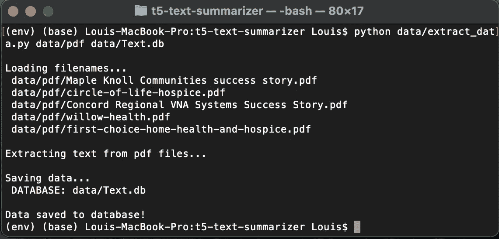
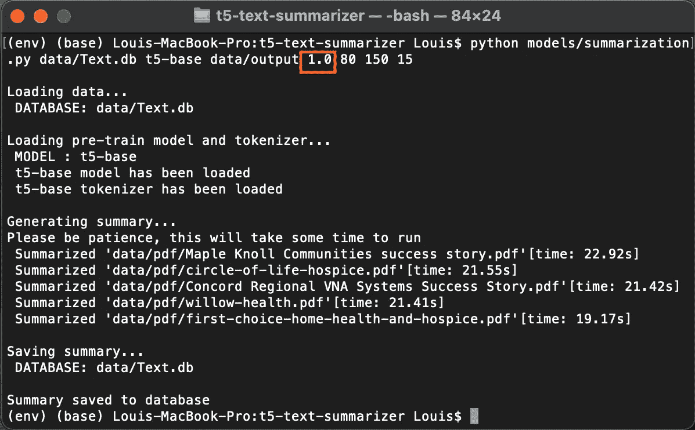
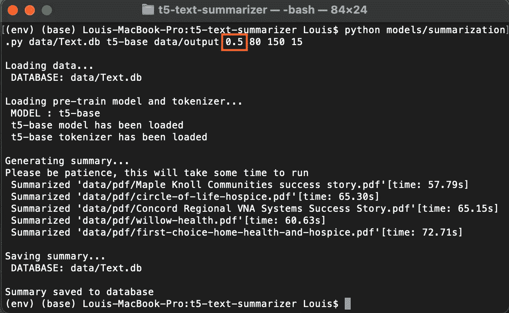

# 类人文本摘要的秘密指南

> 原文：<https://towardsdatascience.com/the-secret-guide-to-human-like-text-summarization-fcea0bfbe801?source=collection_archive---------21----------------------->


在 [Unsplash](https://unsplash.com?utm_source=medium&utm_medium=referral) 上 [NeONBRAND](https://unsplash.com/@neonbrand?utm_source=medium&utm_medium=referral) 拍摄的照片

## 使用谷歌最先进的 T5 模型来总结你的内容

摘要已经成为解决数据过载问题的一种非常有用的方法。在我之前的[故事](/report-is-too-long-to-read-use-nlp-to-create-a-summary-6f5f7801d355)中，我分享了你如何使用摘录方法创建你的个人文本摘要——如果你已经尝试过，你可能已经注意到，因为没有新的句子从原始内容中生成，有时你可能很难理解生成的摘录摘要。

在这个故事中，我将分享我如何使用 Google 的 T5(文本到文本转换转换器)模型，只用几行代码就创建了一个类似人类的摘要器！

作为奖励，我也将分享我的文本摘要器管道，在那里我结合了提取和抽象的方法来为任意长度的 PDF 文档生成有意义的摘要…

# **文本摘要技术**

有两种技巧可以概括一篇长文章:

i. **摘录摘要** —从长内容中摘录重要句子。

二。**抽象摘要** —通过从原始内容生成新句子来创建摘要。

抽象摘要是一种相对更困难的技术，因为它涉及深度学习，但由于谷歌预先训练的模型可供公众使用，创建一个有意义的抽象摘要不再是一项令人生畏的机器学习任务！

# T5 文本摘要器

您可以使用 Google 的 T5 预训练模型构建简单但功能强大的抽象文本摘要器。我将使用 [HuggingFace](https://huggingface.co/transformers/) 最先进的变形金刚框架和 [PyTorch](https://pytorch.org) 来构建一个摘要器。

**安装包**

请确保您安装了两个 Python 包。

```
pip install torch
pip install transformers
```

**加载模型和标记器**

加载 T5 的预训练模型及其标记器。

```
import torch
from transformers import AutoTokenizer, AutoModelForSeq2SeqLMmodel = AutoModelForSeq2SeqLM.from_pretrained('t5-base')
tokenizer = AutoTokenizer.from_pretrained('t5-base')
```

共有五种 t5 型号可供选择:t5 小型、t5 底座、T5 大型、t 型 3B 和 T5–11B。它们各有不同的参数。我会选择‘t5-base’模型，它总共有 2.2 亿个参数。请随意尝试不同的 T5 型号。

**输入文字**

让我们载入一篇 CNN [新闻](https://edition.cnn.com/2021/04/21/media/netflix-earnings-analysis/index.html)文章，关于 ***【网飞需要下一件大事】****——*仅仅是因为这是相当有趣的商业新闻——看看我们的总结者表现如何。

```
text = """New York (CNN Business)Netflix is synonymous with streaming, but its competitors have a distinct advantage that threatens the streaming leader's position at the top.Disney has Disney+, but it also has theme parks, plush Baby Yoda dolls, blockbuster Marvel movies and ESPN. Comcast (CMCSA), Amazon (AMZN), ViacomCBS (VIACA), CNN's parent company WarnerMedia and Apple (AAPL) all have their own streaming services, too, but they also have other forms of revenue.As for Netflix (NFLX), its revenue driver is based entirely on building its subscriber base. It's worked out well for the company — so far. But it's starting to look like the king of streaming will soon need something other than new subscribers to keep growing.The streaming service reported Tuesday it now has 208 million subscribers globally, after adding 4 million subscribers in the first quarter of 2021\. But that number missed expectations and the forecasts for its next quarter were also pretty weak.That was a big whiff for Netflix — a company coming off a massive year of growth thanks in large part to the pandemic driving people indoors — and Wall Street's reaction has not been great.The company's stock dropped as much as 8% on Wednesday, leading some to wonder what the future of the streamer looks like if competition continues to gain strength, people start heading outdoors and if, most importantly, its growth slows."If you hit a wall with [subscriptions] then you pretty much don't have a super growth strategy anymore in your most developed markets," Michael Nathanson, a media analyst and founding partner at MoffettNathanson, told CNN Business. "What can they do to take even more revenue out of the market, above and beyond streaming revenues?"Or put another way, the company's lackluster user growth last quarter is a signal that it wouldn't hurt if Netflix — a company that's lived and died with its subscriber numbers — started thinking about other ways to make money.**An ad-supported Netflix? Not so fast**There are ways for Netflix to make money other than raising prices or adding subscribers. The most obvious: selling advertising.Netflix could have 30-second commercials on their programming or get sponsors for their biggest series and films. TV has worked that way forever, why not Netflix?That's probably not going to happen, given that CEO Reed Hastings has been vocal about the unlikelihood of an ad-supported Netflix service. His reasoning: It doesn't make business sense."It's a judgment call... It's a belief we can build a better business, a more valuable business [without advertising]," Hastings told Variety in September. "You know, advertising looks easy until you get in it. Then you realize you have to rip that revenue away from other places because the total ad market isn't growing, and in fact right now it's shrinking. It's hand-to-hand combat to get people to spend less on, you know, ABC and to spend more on Netflix."Hastings added that "there's much more growth in the consumer market than there is in advertising, which is pretty flat."He's also expressed doubts about Netflix getting into live sports or news, which could boost the service's allure to subscribers, so that's likely out, too, at least for now.So if Netflix is looking for other forms of near-term revenue to help support its hefty content budget ($17 billion in 2021 alone) then what can it do? There is one place that could be a revenue driver for Netflix, but if you're borrowing your mother's account you won't like it.Netflix could crack down on password sharing — a move that the company has been considering lately."Basically you're going to clean up some subscribers that are free riders," Nathanson said. "That's going to help them get to a higher level of penetration, definitely, but not in long-term."**Lackluster growth is still growth**Missing projections is never good, but it's hardly the end of the world for Netflix. The company remains the market leader and most competitors are still far from taking the company on. And while Netflix's first-quarter subscriber growth wasn't great, and its forecasts for the next quarter alarmed investors, it was just one quarter.Netflix has had subscriber misses before and it's still the most dominant name in all of streaming, and even lackluster growth is still growth. It's not as if people are canceling Netflix in droves.Asked about Netflix's "second act" during the company's post-earnings call on Tuesday, Hastings again placed the company's focus on pleasing subscribers."We do want to expand. We used to do that thing shipping DVDs, and luckily we didn't get stuck with that. We didn't define that as the main thing. We define entertainment as the main thing," Hastings said.He added that he doesn't think Netflix will have a second act in the way Amazon has had with Amazon shopping and Amazon Web Services. Rather, Netflix will continue to improve and grow on what it already does best."I'll bet we end with one hopefully gigantic, hopefully defensible profit pool, and continue to improve the service for our members," he said. "I wouldn't look for any large secondary pool of profits. There will be a bunch of supporting pools, like consumer products, that can be both profitable and can support the title brands.""""
```

**对文本进行标记**

T5 可用于执行其他任务，如文本生成、翻译等。；添加 T5 特定前缀“summarize:”将告诉模型执行汇总任务。

```
tokens_input = tokenizer.encode("summarize: " + text,
                              return_tensors='pt',
                              max_length=tokenizer.model_max_length,
                              truncation=True)
```

这里，我们将把文本标记为模型的最大可接受标记输入长度。如果标记化的输入超过了模型的最大标记长度，它将被截断。

**生成汇总**

让我们通过传入编码的令牌来生成摘要，然后将生成的摘要解码回文本。

```
summary_ids = model.generate(tokens_input, min_length=80, 
                           max_length=150, length_penalty=15, 
                           num_beams=2)summary = tokenizer.decode(summary_ids[0], skip_special_tokens=True)
```

该模型采用编码的令牌和以下输入参数:

*   **min_length** :标记化文本的最小长度。
*   **max_length** :标记化文本的最大长度。
*   **length_penalty** :值> 1 强制模型生成一个较长的摘要，值< 1 强制模型生成一个较短的摘要。
*   num_beams :值 2 允许模型探索生成[更有希望的预测](https://en.wikipedia.org/wiki/Beam_search)的记号。

***注意:*** *保持最小和最大标记化文本长度在 80 和 150 之间，并且长度惩罚为 15，将允许模型生成 60 到 90 个单词的合理摘要。* *我们将对其余的输入参数使用默认值(上面没有显示)。*

**输出汇总**

```
Netflix (NFLX) reported Tuesday it now has 208 million subscribers globally. that number missed expectations and the forecasts for its next quarter were also pretty weak. the streaming service's stock dropped as much as 8% on Wednesday, leading some to wonder what the future of the streamer looks like. if competition continues to gain strength, people start heading outdoors and if, most importantly, its growth slows, it wouldn't hurt if Netflix started thinking about other ways to make money - like selling ads.
```

哇！这看起来是一个相当不错的总结。

…但是，如果您阅读全文并再次阅读摘要，您会注意到全文的后半部分没有得到摘要，这是因为标记化的输入在超过最大模型标记输入长度 512 后被截断。

如果你担心在后面的文本中遗漏一些重要的细节，你可以使用一个简单的技巧来解决这个问题:首先对原文进行提取摘要，然后进行抽象摘要。

# 伯特摘录摘要

在我们继续之前，请确保 pip 已经在您的终端上安装了 BERT extractive summarizer。

```
pip install bert-extractive-summarizer
```

[BERT](https://iq.opengenus.org/bert-for-text-summarization/#:~:text=Machine%20Learning%20(ML)%20BERT&text=Extractive%20Text%20summarization%20refers%20to,approach%20to%20perform%20NLP%20tasks.) 代表变压器的双向编码器表示。这是谷歌开发的基于转换器的自然语言处理(NLP)机器学习技术。它使用了一个强大的扁平结构和句间转换层来获得最好的摘要效果。

```
from summarizer import Summarizerbert_model = Summarizer()
ext_summary = bert_model(text, ratio=0.5)
```

以下是 BERT 生成的摘要。通过将摘要比率设置为 0.5，我特意将其设置为生成长度为原始文本 50%的摘要。您可以随意使用不同的比率将您的长文档调整到合适的长度。

```
New York (CNN Business)Netflix is synonymous with streaming, but its competitors have a distinct advantage that threatens the streaming leader's position at the top. Disney has Disney+, but it also has theme parks, plush Baby Yoda dolls, blockbuster Marvel movies and ESPN. It's worked out well for the company - so far. But that number missed expectations and the forecasts for its next quarter were also pretty weak. Or put another way, the company's lackluster user growth last quarter is a signal that it wouldn't hurt if Netflix - a company that's lived and died with its subscriber numbers - started thinking about other ways to make money. Not so fast
There are ways for Netflix to make money other than raising prices or adding subscribers. His reasoning: It doesn't make business sense. "It's a judgment call... It's a belief we can build a better business, a more valuable business [without advertising]," Hastings told Variety in September. " You know, advertising looks easy until you get in it. Then you realize you have to rip that revenue away from other places because the total ad market isn't growing, and in fact right now it's shrinking. It's hand-to-hand combat to get people to spend less on, you know, ABC and to spend more on Netflix." So if Netflix is looking for other forms of near-term revenue to help support its hefty content budget ($17 billion in 2021 alone) then what can it do? Netflix could crack down on password sharing - a move that the company has been considering lately. "Basically you're going to clean up some subscribers that are free riders," Nathanson said. " That's going to help them get to a higher level of penetration, definitely, but not in long-term." The company remains the market leader and most competitors are still far from taking the company on. We used to do that thing shipping DVDs, and luckily we didn't get stuck with that. We define entertainment as the main thing," Hastings said. He added that he doesn't think Netflix will have a second act in the way Amazon has had with Amazon shopping and Amazon Web Services. Rather, Netflix will continue to improve and grow on what it already does best. I wouldn't look for any large secondary pool of profits.
```

现在让我们通过 T5 模型输入摘要。

# **抽象的摘要**

```
Netflix's lackluster user growth is a signal that it wouldn't hurt if it started thinking about other ways to make money. the company remains the market leader and most competitors are still far from taking the company on. the company could crack down on password sharing - a move that the company has been considering lately. "it's a judgment call... it's a belief we can build a better business, a more valuable business," hastings said.
```

哇…生成的摘要现在覆盖了原始文本的整个上下文。

为了您的方便，我总结了下面的代码。

**您也可以点击** [**此处**](https://github.com/louisteo9/t5-text-summarizer) **进入我的 GitHub 获取用于 T5 文本摘要器和文本摘要器管道准备的 Jupyter 笔记本，以及您可以在终端上运行的管道脚本，以汇总多个 PDF 文档。**

# 奖金…t5 文本摘要管道。

我已经建立了一个文本摘要器管道，可以从 PDF 文档中提取文本，总结文本，并将原始文本和摘要存储到 SQLite 数据库中，并将摘要输出到文本文件中。

要总结一个长的 PDF 文档，您可以首先应用摘要来缩短文本，然后再通过 T5 模型生成一个类似人类的摘要。



按作者分类的图像:运行数据管道从 pdf 文件中提取文本数据并保存到 SQLite 数据库中



作者图片:运行摘要管道(仅 T5)来摘要文本数据，将摘要保存到文本文件，并将摘要存储到数据库

***注:*** *如果只想用 T5 模型概括文本，键入‘1.0’。*



作者图片:运行摘要管道(BERT & T5)来摘要文本数据，保存摘要到文本文件和存储摘要到数据库

***注:*** *如果您希望在运行 T5 摘要之前使用 BERT 摘要缩短文本，请键入一个低于“1.0”(例如“0.5”)的比率。用这种方式生成摘要需要更长的时间，因为每个文本都要经过两个不同的摘要器。*

# 结论……和未来的工作

这就对了——你只需要 7 行代码(包括导入库和模块)就可以让 Google 的 T5 预训练模型为你总结一个内容。

为了使长内容的摘要更有意义，您可以首先应用提取摘要来缩短文本，然后应用抽象摘要。

T5 预训练模型支持迁移学习:这意味着我们可以使用自定义数据集进一步训练模型。

**对于未来的工作**，观察模型在经过定制训练以总结特定内容(如医学期刊和工程期刊)后的表现将会非常有趣。