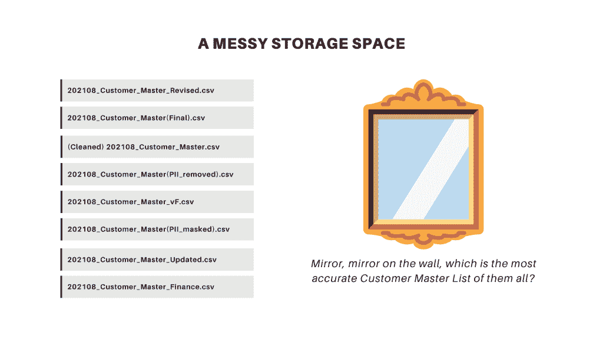
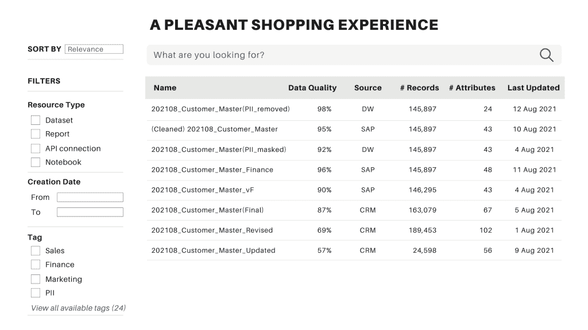
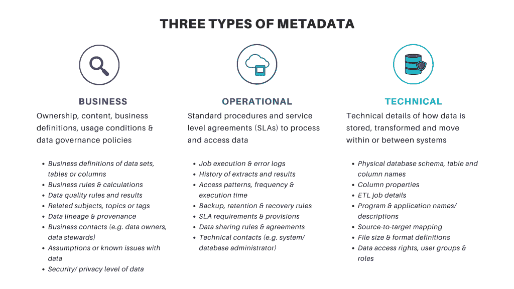

# 元数据的秘密生活

> 原文：<https://towardsdatascience.com/the-secret-life-of-metadata-eb3fd653fd99?source=collection_archive---------24----------------------->

## 对元数据一无所知并不是犯罪——只是从数据中产生商业价值非常不方便。

*照片由* [*卢卡斯*](https://unsplash.com/@lucassankey?utm_source=unsplash&utm_medium=referral&utm_content=creditCopyText) *上* [*下*](https://unsplash.com/?utm_source=unsplash&utm_medium=referral&utm_content=creditCopyText)

如果你曾经试图在互联网上阅读关于元数据的文章，你很可能会遇到恐怖故事(围绕着新的元数据保留法的一些令人毛骨悚然的安全漏洞，会让我们所有人都完蛋)或乌托邦童话(嘿，元数据是数据民主化和实现你的分析梦想的神奇银弹)。

虽然元数据似乎正在改变世界，但它秘密地融入背景，保持安静，并被视为理所当然，直到某些事情爆发。

不管是好是坏，元数据将永远是从数据中提取价值和确保适当治理之间平衡行为的一部分。对于那些一直想了解元数据是什么、它在大数据世界中为什么重要以及我们应该如何开始思考它的人来说，这只是一个简单的故事。忘记那些令人费解的术语或不切实际的神话，让我们开始吧。

**在这篇文章中，你将学到:**

*   什么是元数据？
*   大数据、数据湖和元数据
*   三种类型的元数据
*   元数据管理的障碍

# 什么是元数据？

让我们从正确定义什么是元数据开始。我敢打赌，您可能已经遇到过这个非常熟悉的定义:元数据是“关于数据的数据”。嗯，没什么帮助，对吧？

我个人喜欢下面的定义，因为它抓住了元数据的定义和目的。

> *元数据是描述、解释、定位或以其他方式使信息资源更容易检索、使用或管理的结构化信息。*
> 
> *-国家信息标准组织*

如果你在超市购物，元数据是包装上的营养信息。如果你正在网上商店寻找下一双鞋，产品的图片、尺寸、颜色、品牌和价格标签都是关于产品本身的元数据。

在业务上下文中，如果您向同事发送电子邮件，则“发件人”和“收件人”电子邮件地址、主题和发送日期就是元数据。如果您希望在团队的 OneDrive 上找到包含最新产品列表的特定 Excel 文件，文件名、“最后更新”日期和文件类型是有价值的元数据，可帮助您准确找到您需要的内容。

元数据无处不在。但是我希望你能看到这里的模式。 ***元数据不代表对某个项目的主观看法。取而代之的是，它捕捉到了对一种资源的相当客观的描述，这种资源是容易获得的，并且意味着可以被多人共享。***

# 大数据、数据湖和元数据

## 数据湖:大数据的一站式在线商店

在企业内部和不同组织之间共享资源以节省时间和提高生产率的想法并不新鲜。同样的逻辑也适用于大数据。

给定适当的批准和访问权限，如果 Simon 需要最新的客户列表，而 Fiona 已经如此努力地为她的项目创建了完美的列表，那么 Simon 就不应该浪费时间重新发明轮子。相反，他应该联系 Fiona，并重新使用该列表来分析如何产生新的收入流或增强客户体验。

这样的想法可能非常适合每个人都互相认识的小团队。但在拥有数百名员工和数千个数据集的大型组织中，四处打听谁拥有什么将是一场噩梦。所以许多企业选择建立一个数据湖。

什么是数据湖？嗯，数据湖就像一个百货商店。你几乎得到了家庭所需的所有东西(例如，衣服、鞋子、美容产品、玩具、礼物等。)在一家大型商店里，而不必像无头鸡一样在几十家商店里跑来跑去。

同样， ***数据湖可以让你通过一站式访问不同的信息资源，进行分析和决策*** 。通过数据湖，不同的用户可以共享和重用信息资源(例如，文本、图像、视频、报告、仪表板、数据集、代码片段等。).由于花费在数据分析项目上的大部分时间都与识别、清理和集成来自不同来源的数据有关，因此投资构建数据湖是值得的。

## 元数据:功能数据湖的秘密成分

**凌乱的储物空间**

让我们假设，经过一些巨额投资和痛苦的团队合作，我们现在有一个数据湖。各种数据都很好地存储在单一的存储空间，等待你去发现。

您想要查找截至 2021 年 8 月的最新客户列表。因此，您急切地访问数据湖的位置，进行搜索，这就是您的发现。

不同的文件对用户来说可能看起来同样令人困惑和模糊——图片由作者提供

你有没有发现自己走进了一家看起来像迷宫一样的商店，却找不到你需要的东西，最终走开了？同样的事情也可能发生在我们非常亲爱的数据湖身上，当一切看起来都同样混乱和模糊的时候。由于我们没有在墙上挂魔镜，如果找不到自己需要的东西太痛苦，大多数人都会离开凌乱的储物空间。

**愉快的购物体验**

人们没有耐心，除了即时的满足之外别无所求。我们需要让他们快速、轻松地识别和找到他们需要的东西。所以，让我们把搜索数据想象成你经历过的最愉快的网上购物体验。会是什么样子？

展示典型数据目录的屏幕模型——图片由作者提供

一个简单的 UI，如上图所示，用来搜索、排序、过滤和定位你需要的数据，通常被称为*数据目录(*或*数据日志)*，有点像现代的在线购物网站。

现在，我们仍然有相同的 8 个可能的数据集，但是我们也有更多关于每个资源的信息，以将一个资源与其他资源区分开来。例如，使用指示数据质量、数据范围、记录数量和其他简洁的“产品描述”的元数据，您可以很容易地确定什么资源与您的需求最相关、最值得信赖。

还有呢？找到您需要的东西，以及关于谁拥有数据的元数据后，您可以发送请求来获取数据集。许多现代数据目录还依赖于关于数据所有者的元数据来创建请求批准和查询的自动化工作流。不再有没完没了的来回电子邮件，往往让我们无处可去！

其他元数据，如数据源、存储位置、格式和访问权限，也使公司能够自动化数据配置过程。您确定您需要什么信息资源，添加到购物车，然后结账，同时后端流程协调所有必要的步骤，将数据直接发送到您的首选位置。这种“网上购物体验”可以毫不费力地自助满足你的数据需求，人们称之为*数据民主化*。

简单地说， ***元数据是创建一个实用的、可扩展的数据湖平台的秘密成分。它有效地将数据资源推广给正确的受众，在相关资源之间建立联系，并通过数据目录为数据消费者创造“愉快的购物体验”。***

# 三种类型的元数据

重要的是要认识到元数据是复杂的、多样的，并且有不止一种类型的元数据。在理解和管理信息资源时，它们中的每一个都可以服务于非常不同的目的。下面是根据[数据管理知识体系](https://www.dama.org/cpages/body-of-knowledge)总结的三种主要类型的元数据。

作者图片

看起来又长又复杂，对吧？别担心。我只有两个要点需要你记住。

首先，一些元数据可能与搜索数据集的业务用户更相关，而其他细节则决定了企业如何保护敏感数据、遵守隐私法和降低安全风险。 ***高质量的元数据不仅有助于数据发现(从而加快洞察时间)，还能确保数据治理和风险管理。***

其次，元数据由组织内不同的利益相关者创建、消费和评估。就像太多的厨师糟蹋汤一样， ***如果每个人都想按自己的方式行事，元数据很容易变得一团糟。因此，精心规划、实施和控制的适当管理对于创建和维护高质量的元数据绝对是必不可少的。***

# 元数据管理的障碍

由于元数据管理(以及如何正确地进行管理)是一个值得单独撰写一篇文章的主题，所以我将把它留到以后再说。但是你有没有想过为什么元数据的生命如此神秘？一些专门的团队偶尔会谈论它，也许少数人知道如何处理它，只有组织中最有特权的人在考虑如何管理它。

如果高质量的元数据对组织中处理数据的人如此重要，为什么我们没有给予元数据应有的重视？

嗯，有无数的理由对元数据保持无知，更不用说采取新的举措来管理它了。您应该了解元数据管理计划的两个主要障碍。

## 不明确的有形利益和激励

伊恩·施耐德在 [Unsplash](https://unsplash.com/?utm_source=unsplash&utm_medium=referral&utm_content=creditCopyText) 上拍摄的照片

你可能拥有最大的热情和惊人的想法来帮助你的公司以正确的方式管理元数据。但是不要忘了你的公司时间和金钱是有限的，但却不缺少紧迫的问题。

因此，为了创建和管理元数据而创建和管理元数据很少能很好地工作。归根结底，如果这些计划不能帮助企业解决任何最重要的问题，那么它们就没有任何意义。

当既没有明确的有形利益也没有关键风险来证明元数据管理投资的合理性时，不要强迫它成为议程。 相反，你可能只想记住元数据管理。因为迟早，随着组织处理和分析大量的数据，元数据管理将成为房间里的大象，任何利益相关者都不能忽视。

元数据管理要求人们改变他们每天与数据交互的方式。 ***问题是，即使对一些人来说好处和风险显而易见，其他人可能也不觉得有必要遵循新的流程或以不同的方式做事。*** 毕竟不同角色的人有着非常不同的需求。

那么，为什么元数据管理对于组织的生存或发展是必要的呢？更重要的是，这对他们有什么好处？ ***如果不对那些受元数据管理影响的人清楚地说明好处和激励措施，使其具有关联性和吸引力，那么首先就很难获得急需的支持和承诺来启动该计划。***

## 乏味、无聊且难以实现

照片由 [meredith hunter](https://unsplash.com/@mere_hunter?utm_source=unsplash&utm_medium=referral&utm_content=creditCopyText) 在 [Unsplash](https://unsplash.com/s/photos/bored?utm_source=unsplash&utm_medium=referral&utm_content=creditCopyText) 上拍摄

元数据是如何创建的？虽然一些元数据是由不同的系统自动生成的，但许多细节需要人类用户进行一些艰苦的工作。例如，您可能需要在一个表中提供 50 个不同列的业务定义。一开始听起来还不错，对吧？

但是如果还有 30 多桌呢？是的，一旦你完成了，你的工作就是保持这些定义的更新。你会有什么感觉？不出所料，许多人甚至不想提起它，担心这些乏味、劳动密集型和完全无聊的任务会落到他们头上。

还有呢？为了确保每个人在处理元数据时都在同一页面上，您需要建立标准。这意味着让不同的人就描述信息资源的最佳方式达成一致，并确保他们在做正确的事情。元数据管理很难实现。难怪大部分人都不想和它扯上关系。

不幸的是，无论您喜欢与否，对适当的元数据管理的需求很快就会赶上您。可能是法规要求(例如 GDPR、CCPA)跟踪您的公司正在获取哪些个人身份信息，以及您如何保护这些敏感数据。也许一旦数据和分析达到一定规模，您的公司就再也无法承受将随时可用的信息资源锁在孤岛中。

也就是说，下面是开始考虑元数据管理的三个一般原则。

*   ***少即是多:*** 不要试图覆盖所有的信息资源和所有类型的元数据，而是优先考虑对业务最重要并且在 1-3 个月内可以实现的特定用例。元数据应该保持最少，并且与用户的数据发现和治理需求相关。
*   ***自动化取代手工劳动:*** 与其让您的数据管家默默忍受，不如考虑在到达湖泊时自动捕获元数据的工具和技术。如今，自动化数据分类、数据谱系跟踪和数据目录的选择真是无穷无尽。
*   ***用户便利为王:*** 在发现信息资源和治理数据时，不要追求完美，要以简单和用户便利为目标。描述信息资源的术语和词汇的选择应该反映商业用户的需求。

# 离别的思绪

诚然，可以从元数据中推断出许多关于某人生活的信息。[2015 年发表的一篇文章](https://www.abc.net.au/news/2015-08-24/metadata-what-you-found-will-ockenden/6703626?nw=0)显示，一名记者手机中一年的元数据揭示了他在哪里生活和工作，如何上班，何时搬家，父母住在哪里，以及何时去看望他们。

毫不奇怪，当讨论元数据和隐私问题时，报纸标题喜欢使用引人注目的短语和可怕的语气。但这只是故事的一部分。

那么还缺少哪些部分呢？

首先， ***元数据有助于用简单的文字描述复杂的项目。通过这种方式，人们可以很容易地发现他们所拥有的东西，以及在一个混乱无序的世界中是否有任何对他们有用或相关的东西。***

其次，数据湖承诺能够通过一站式商店为更多的企业用户提供信息资源，从而产生新的收入流、优化成本并改善客户体验。然而， ***如果没有数据目录，没有强大的元数据管理基础，数据湖很难发挥作用，最终无法实现预期的业务价值。***

最后，元数据管理可能是一个漫长的过程，有许多障碍。有些人可能会觉得太犹豫，甚至不敢开始，而其他忠诚的灵魂可能会中途放弃。这不是一个系统实现项目。 ***这是一个充满挑战的变化之旅，需要大量的积极倾听、合作和共鸣。***

我真诚地希望你喜欢读这篇博客，就像我喜欢研究和写这个话题一样。感谢您的阅读。对我如何能做得更好有反馈，或者只是想聊天？在评论里告诉我或者在 [LinkedIn](https://www.linkedin.com/in/skyetran/) 上找到我。女士们先生们，祝你们愉快！

# 参考

1.  [费德里科·卡斯塔涅多、斯科特·吉德利的《理解元数据》](https://learning.oreilly.com/library/view/understanding-metadata/9781491988992/)
2.  [Jeffrey Pomerantz 的元数据](https://mitpress.mit.edu/books/metadata)
3.  [丽贝卡·卢巴斯、艾米·杰克逊和英格丽·施耐德的元数据手册](https://learning.oreilly.com/library/view/the-metadata-manual/9781843347293/)

*原载于 2021 年 8 月 15 日*[*http://thedigitalskye.com*](http://thedigitalskye.com/2021/08/16/the-secret-life-of-metadata/)T22。