# 量子纠缠的秘密

> 原文：<https://towardsdatascience.com/the-secret-of-quantum-entanglement-1452fd4c890?source=collection_archive---------20----------------------->

## 爱因斯坦无法相信的方程式

量子机器学习要不要入门？看看 [**动手量子机器学习用 Python**](https://www.pyqml.com/page?ref=medium_einstein&dest=/) **。**

阿尔伯特·爱因斯坦生动地拒绝了量子纠缠的概念，称之为“超距作用”。

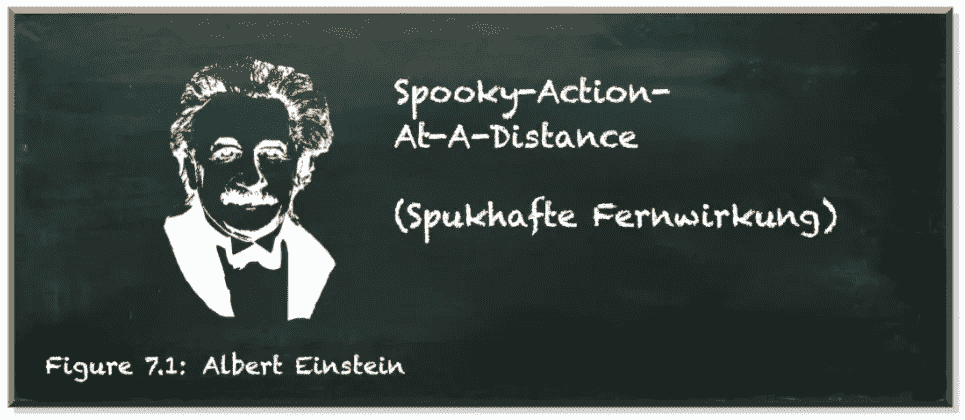

作者弗兰克·齐克特的图片

通俗地说，量子纠缠就是分布式粒子共享一个量子叠加态的能力，准确地说是。

听起来不恐怖吗？也许我们应该更新叠加的概念。

粒子有自旋。向上或向下。旋转的方向直到你测量后才能确定。但是一旦你测量了它，它会瞬间塌缩到任一个自旋方向供你观察。这是单个粒子的叠加。

量子纠缠说两个粒子可以共享一个叠加态。他们的自旋相互关联。一旦你测量了一个粒子的自旋，另一个粒子的状态会立即改变。

听起来不恐怖吗？也许我们应该谈谈音阶。

当我们说这两个粒子是分布的时，它们可以是同一个原子内的直接邻居。他们可以相距几英尺远。但它们也可能相隔数光年。没关系！

当我们说粒子的状态瞬间改变时，我们指的是瞬间。几秒钟后就不行了。不到一秒钟。但是瞬间。

这两个粒子可能相距数光年，然而当我们测量其中一个粒子时，另一个粒子会在精确的时刻改变它的状态。

听起来很诡异，对吧？

***“但是我们怎么知道？”***

我们还没有用光年以外的粒子测试过这样的设置。但是我们知道基本的数学原理。

早在第一个实验提供证据之前，一群天才就开发出了预测一对纠缠粒子行为的公式。爱因斯坦是其中之一。虽然他理解数学语言的能力无人能及(很少有人能……也许)，但他不喜欢这次数学告诉他的东西。

# 单量子比特叠加

在量子力学中，我们用矢量来描述量子态。表示量子状态向量的一种流行方式是狄拉克符号的“ket”——看起来像|ψ⟩.的构造

量子系统中有两个基本向量，我们可以测量两个值，例如粒子自旋可以向上或向下，或者量子位(量子位)可以是 0 或 1。

对于量子位，这些是:

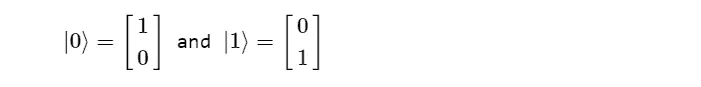

量子叠加是这两种基态的组合。

值α和β是概率幅度。它们的平方表示测量量子位的概率为`0` (α^2)或`1` (β^2).)α越大，测得量子位为`0`的概率越大。β越大，测得量子位为`1`的概率越大。

因为概率的总和必须是 1，我们可以说它们的总和必须是`1`。

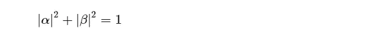

# 量子变换矩阵

在量子力学中，我们也使用向量来转换量子位状态。狄拉克符号的“bra”结构(⟨0|)代表一个行向量。当我们将一个列向量与一个行向量相乘时，我们构建了外积。它产生了这样一个矩阵。

所以，我们可以从向量中创建矩阵。例如，我们可以做三个简单的矩阵。

*   单位矩阵

*   非(X)矩阵

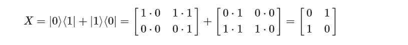

*   哈达玛矩阵

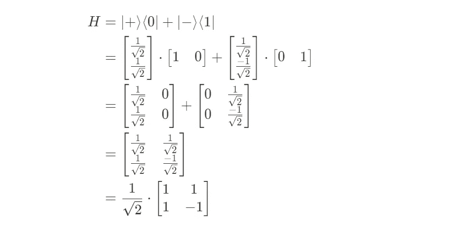

# 转换单个量子位

当我们将一个矩阵乘以一个列向量(我们的量子态)时，结果是另一个列向量，就像这样:

当我们将 I-gate 矩阵与一个向量相乘时，我们得到未改变的向量作为输出。

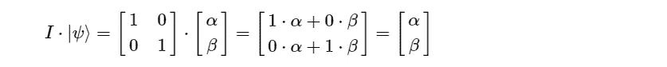

X 门矩阵翻转了向量的概率幅度。

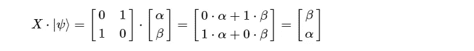

H 门将一个量子位从基态放入叠加态

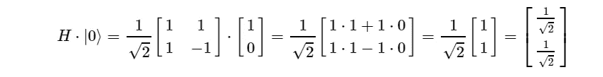

# 两量子比特状态

现在，假设我们有两个量子位。让我们称他们为|a⟩和|b⟩.两个量子位中的每一个都有其概率振幅:

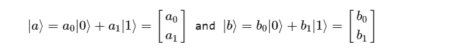

当我们同时观察这两个量子位时，有四种不同的基态组合。这些组合中的每一种都有其概率幅度。这些是两个相应状态的概率振幅的乘积。

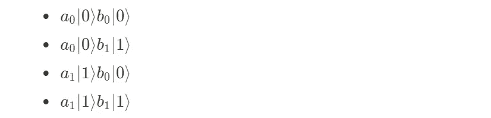

这四种状态各自形成一个量子系统。我们可以用一个方程来表示它们。虽然我们可以自由地为这个态选择一个任意的名字，但是我们使用|ab⟩，因为这个态是|a⟩和|b⟩的集体量子态

在这个等式中，|ab⟩是一个任意的名字。最后一项是重新排序的四个组合，其振幅位于开头。但是|a⟩⊗|b⟩是什么意思呢？

术语|a⟩⊗|b⟩是两个向量|a⟩和|b⟩.的张量积

张量积(用符号⊗表示)是计算振幅的数学方法。一般来说，两个向量 v 和 w 的张量积是所有组合的向量。像这样:

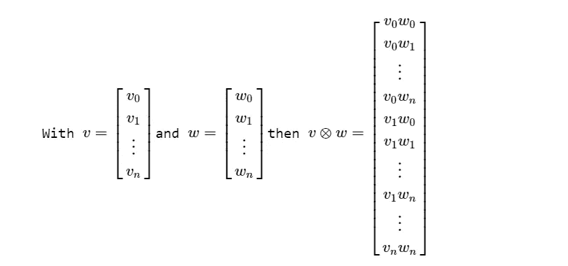

对于我们的两个量子比特的系统，它是

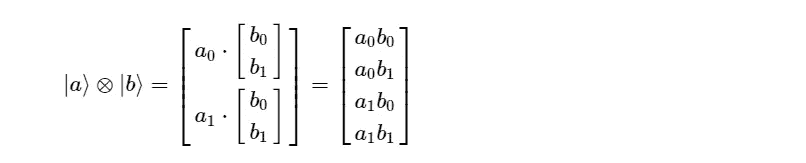

事实上，张量积|a⟩⊗|b⟩是|a⟩|b⟩.的显式符号这两个术语意思相同。

我们可以用一个列向量或者状态和振幅的总和来表示一个量子位系统。

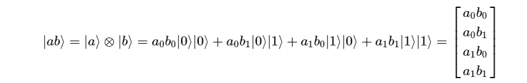

量子位状态的这种表示类似于单量子位状态|ψ⟩.的表示唯一的区别是双量子位系统有更多的维度。它有四个基本状态向量，而不是两个。

所有支配单一量子位元的规则，也适用于由两个量子位元组成的系统。它的工作原理相似。因此，所有概率的总和(记住状态的概率是振幅的平方)必须是 1:

不出所料，用两个量子位的系统工作与用一个量子位的系统工作是相似的。唯一的区别是，向量和矩阵的维数更大。

# 双量子比特变换

假设我们想要将 h 门应用于第一个量子位|a⟩，将 x 门应用于第二个量子位|b⟩，如下图所示。

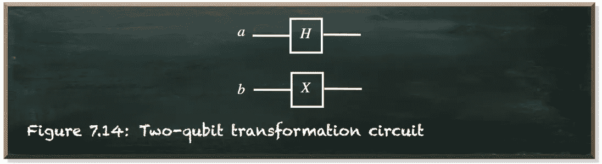

作者弗兰克·齐克特的图片

如上所述，我们可以通过在向量前添加变换矩阵来表达门的应用，比如 M⋅v.。在我们的具体例子中，我们在每个向量前添加一个矩阵，比如 H|a⟩⊗X|b⟩.此外，张量积是结合的。这意味着我们可以将术语重组如下:

那么，让我们来计算由 H⊗X.表示的矩阵

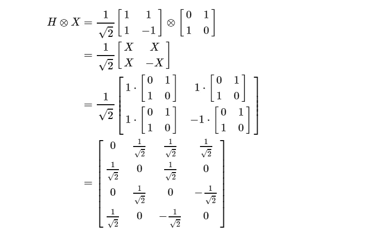

我们可以看到一个两量子位变换门的矩阵有 4 乘 4 维。它对应于两个量子位的状态向量所具有的四维空间。

除了更多的维度，这里没有什么特别的。我们可以将这个矩阵预先放置在两个量子位的系统中。

手工处理这种大小的矩阵很麻烦。幸运的是，我们有计算机来计算矩阵和张量积。

首先，我们用两个量子位创建`QuantumCircuit`(第 4 行)。我们对一个量子位应用 X 门，对另一个量子位应用 H 门(第 7-8 行)。

*注意:关于矩阵计算，Qiskit 从后向前排列量子位，所以我们需要交换位置。*

这一次，我们使用不同的 Qiskit 模拟器作为后端，即`UnitarySimulator`(第 10 行)。这个模拟器执行电路一次，返回电路本身的最终变换矩阵。请注意，这个模拟器不包含任何测量。

结果就是我们的电路所代表的矩阵。

如果我们只想将 H 门应用于其中一个量子位，而让另一个保持不变，会怎么样？我们将如何计算这样一个两量子位的变换矩阵？

在计算张量积时，我们可以用 I 门作为占位符。例如，如果我们想将 H 门应用于第一个量子位，而让第二个量子位保持不变，我们计算变换矩阵如下:

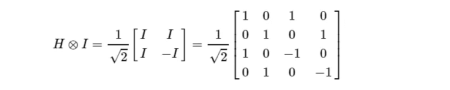

这些两个量子位的门在单一步骤中转换量子位，但是量子位保持相互独立。结果，我们无意中引入了另一个约束。

当我们再次查看两个量子位态的公式时，更具体地说，在振幅方面，我们可以看到外态振幅(|0⟩|0⟩和|1⟩|1⟩)的乘积等于内态振幅(|0⟩|1⟩和|1⟩|0⟩)的乘积，如下式所示。

这种约束来自于将两个量子位系统创建为两个独立的单量子位的组合。我们甚至研究了这两个量子位，但只是作为独立的量子位。

上面等式中的 H⊗X)|ab⟩项明确显示了我们应用于|ab⟩.的变换这是

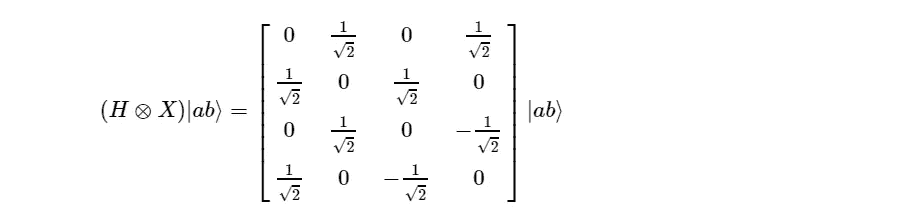

# 纠缠

如果我们以不同的方式构造两个量子比特的系统会怎么样？当我们舍弃四个基态组成(a0，b0，…)的因子，用一般变量代替。对于任意的两个量子位系统，我们可以陈述下面的等式。

我们坚持所有概率之和的归一化必须是 1。

但是我们**不**坚持认为αβ=γδ。

在上一节中，我们了解了 CNOT 门。只有当我们将控制量子位测量为`1`时，它才会将 X-gate 应用于控制量子位。

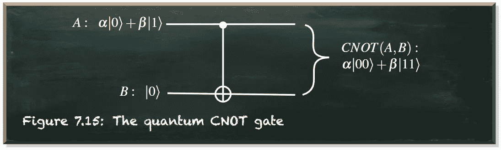

作者弗兰克·齐克特的图片

我们可以通过交换最后两个元素的顺序，从两个量子位的单位矩阵中创建 CNOT 门，就像这样:

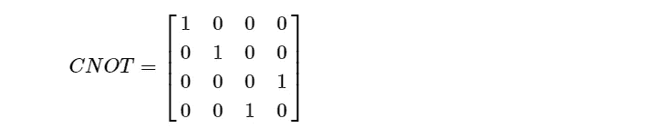

CNOT 门接受两个输入，给出两个输出。第一个输入称为控制量子位。第二个输入称为受控量子位。

如果控制量子位处于基态|0⟩或|1⟩.，那么“非门”的结果是非常超前的如果控制量子位是|0⟩，那么什么都不会发生。输出等于输入。如果控制量子位是|1⟩，那么 CNOT-gate 在控制量子位上应用 X-gate(非门)。它翻转了受控量子位的状态。

下图描述了 CNOT 门的真值表。

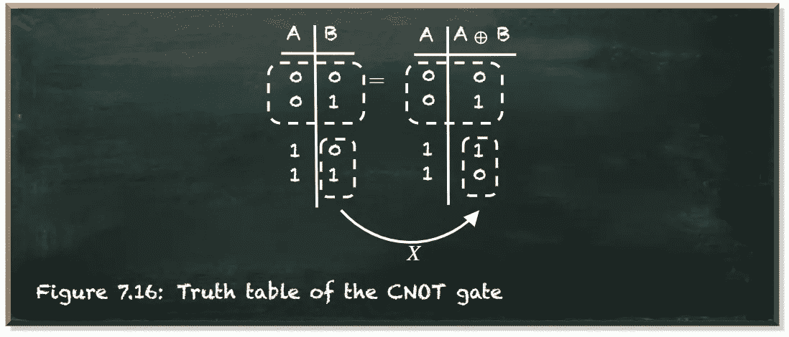

作者弗兰克·齐克特的图片

当控制量子位处于叠加态时，就变得有趣了。例如，当我们在应用 CNOT 门之前，对第一个量子位应用哈达玛门。

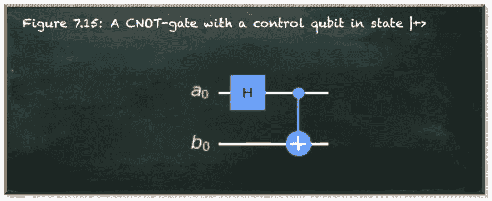

作者弗兰克·齐克特的图片

下面的等式表示我们的两量子位系统的状态。

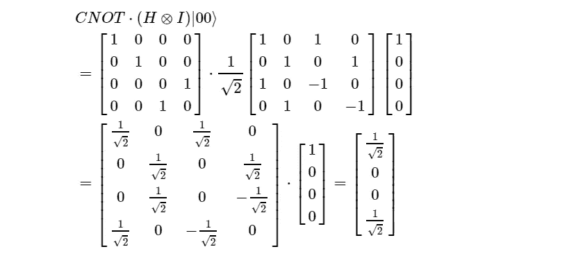

要计算多门的后续应用，我们需要从后往前乘矩阵。我们从 CNOT 门开始，然后是哈达玛门。与数字乘法不同，矩阵乘法的顺序至关重要。

当我们从后向前阅读术语 CNOT⋅(H⊗I)|00⟩时，我们从初始状态(|00⟩)开始，将哈达玛门应用于第一个量子位，并将 CNOT 门应用于组合的两个量子位系统。

在下一步中，我们用各自的矩阵(我们之前在本节中推导过)代替门，用相应的向量代替初始状态。然后，在最后一步中应用于状态向量之前，我们计算整体转换矩阵。

此外，我们可以将向量重写为加权(振幅)基态的和。我们忽略了|a0⟩|b1⟩和|a1⟩|b0⟩for，它们的振幅为 0。为了清楚起见，我们将不同的基础国家命名为|a0⟩和|b0⟩，而不是简单的|0⟩.

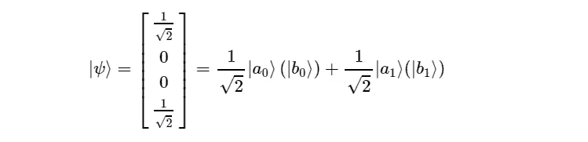

通常，我们同时测量两个量子位。概率幅度告诉我们在这种情况下会发生什么。我们要么得到`00`要么得到`11`，各有 1/2 的概率。但是我们也可以测量单个量子位。

在上面的等式中，我们暂时忽略括号内的项。这代表了我们只测量第一量子位|a⟩.的情况我们以 1/2 的概率测量为`0`，以同样的概率测量为`1`。一旦我们测量了它，另一个量子位|b⟩就会跳到括号内的状态。因此，如果我们测量|a⟩为`0` |b⟩跳转到状态|b0⟩.如果我们把|a⟩比作`1`，|b⟩会跳到|b1⟩.

当我们测量|a⟩时，|b⟩改变了它的状态。值得注意的是，一旦你衡量|a⟩.，|b⟩并没有崩溃它不会坍缩成 T6 或 T7，而是跳到另一个量子态|0⟩或|1⟩.测量两个纠缠量子位中的一个只会瓦解一个子系统。不可测量的休息跳到一个不纠缠的状态。

跳到|0⟩或塌缩成 T8 之间的区别似乎有点技术性，因为一旦你测量|0⟩，你不可避免地会得到 T9。但是不可测量的量子位元跳到的状态可以是任何量子状态。

让我们稍微编辑一下我们的例子。我们不是让受控量子位保持不变(应用 I 门)，而是应用 RY 门。我们在上一节介绍了 RY-gate。RY 门将量子位状态绕 y 轴旋转一个给定的角度。下面的等式显示了它的变换矩阵。

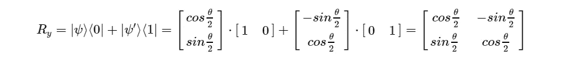

让我们将受控量子位旋转π/3 的角度，得到图中所示的电路。

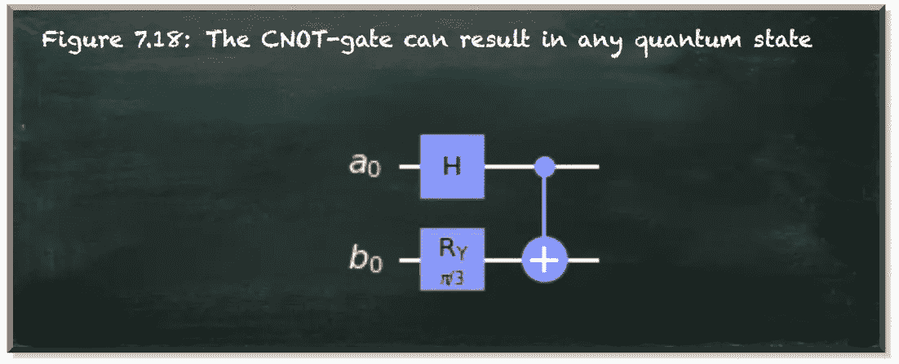

作者弗兰克·齐克特的图片

和前面一样，我们通过矩阵乘法计算变换矩阵。例如，下面的等式显示了结果向量。

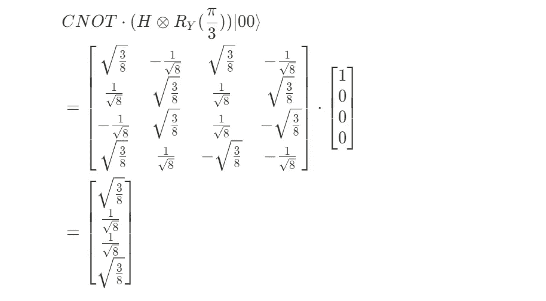

我们可以很容易地看到，最终的状态是纠缠的。所得向量的外部概率幅度都是 sqrt(3/8)，它们的乘积是 3/8。内部幅度都是 1/sqrt(8)，它们的乘积是 1/8。所以，当然是 1/8≠3/8。

同样，我们把这个量子态写成它的基态的和。

我们想找出公因数 1/sqrt(2)和量子位的状态|a⟩.所以，让我们重写这个等式。

|a0⟩和|a1⟩两个州具有相同的概率幅度 1/sqrt(2)。因此，我们有 50:50 的机会测量量子位|a⟩为`0`或`1`。当我们测量|a⟩为`0`时，量子比特|b⟩就跳到这个状态

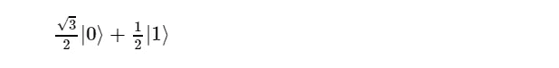

那么，我们有一个概率

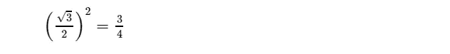

测量|b⟩为`0`和一个概率

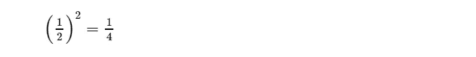

测量它为`1`。

但是当我们测量|a⟩为`1`时，我们在测量|b⟩.时有完全相反的概率那么，我们有 1/4 的概率把|b⟩测量为`0`，有 3/4 的概率把它测量为`1`。

当我们单独测量纠缠的量子位时，我们不会把两个量子位都压缩到有限的值。但是当我们测量一个量子位时，另一个会跳到一个未纠缠的量子态。它不限于产生基态。它可以跳到任何有效的量子态。

当我们单独测量纠缠的量子位时，我们所测量的可能是随机的。只有当我们观察这两个测量值时，我们才发现它们按照它们的纠缠态是完全相关的。纠缠量子位持有的信息并不单独存在于任何一个量子位中。一个纠缠的双量子位系统在两个量子位之间的关联中非局部地保存它的信息。

# 结论

如果这个条件成立，那么两个量子比特——或者说粒子——就纠缠在一起了。它们共享一个量子叠加态。我们不能再用两个独立的州来代表他们的州了。但是他们的状态仅仅是:

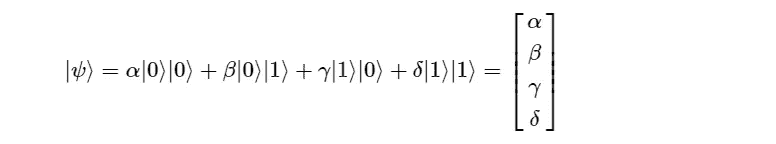

一旦我们测量了其中一个粒子，另一个就不可避免地改变了它的状态。这两个粒子可以相距很远。不管有多远。但是，另一个粒子会立即改变它的状态。而且，瞬间就是瞬间的意思。

这与爱因斯坦的局部实在论相矛盾。因此，他拒绝了纠缠粒子是“spukhafte Fernwirkung or Telepathie”的想法。翻译成英语，它是“幽灵般的超距行动或心灵感应”

直到爱因斯坦死后，第一个实验证据才支持了量子纠缠理论。

量子机器学习要不要入门？看看 [**动手用 Python 学习量子机器**](https://www.pyqml.com/page?ref=medium_einstein&dest=/) **。**

在这里免费获得前三章。