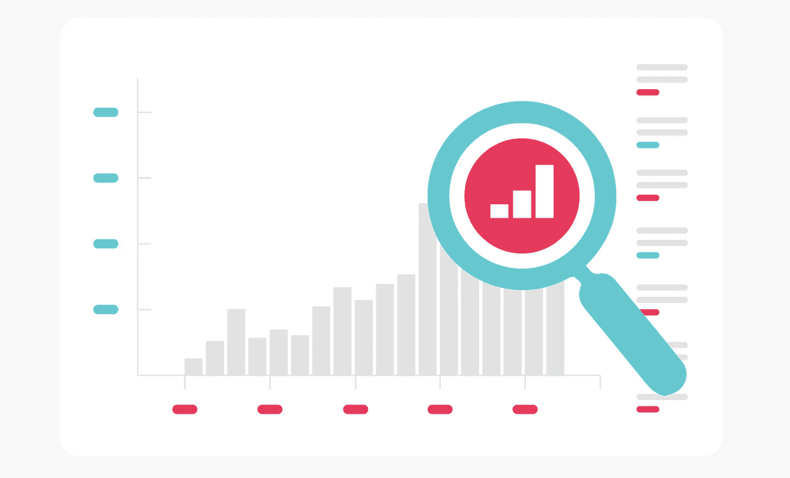

# 成功监控的秘密

> 原文：<https://towardsdatascience.com/the-secret-to-successful-monitoring-3180bc0670d5?source=collection_archive---------25----------------------->

## 获得粒度，但避免噪音

资料来源:莫纳实验室公司

在过去的 3 年里，我一直与团队合作，使用 ML/DL、NLP、RPA 和许多其他技术实施自动化工作流，用于各种业务功能，从欺诈检测、音频转录到卫星图像分类。

在不同的时间点，所有这些团队都意识到，除了自动化带来的好处，他们还增加了额外的风险。他们已经失去了“在球场上的眼睛和耳朵”，这是人类在这个过程中得到的自然监督。现在，如果出了问题，没有人来通知他们，如果有可以改进的地方，可能没有人来考虑和推荐。

换句话说，他们意识到人类不仅执行现在自动化的任务，他们也在那里，至少部分地，监控和 QA 实际的工作流程。

虽然每个业务功能都是不同的，并且使用的每个自动化或人工智能都有其自身无数的复杂性和需要监控和观察的事情，但将所有这些用例联系在一起的一个共同线索是，改进的问题和机会通常出现在口袋中，而不是全面的大范围。

# **精细跟踪是发现问题和机会的关键**

让我们详细阐述一下那些出现问题/机会的地方…

假设你有一个欺诈检测系统。为了让这个系统正常工作，您需要在用户的浏览器上使用从 cookies 中提取的输入数据。

现在，假设 Chrome 浏览器有了新的测试版。在这个版本中，cookies 的存储方式略有不同。这可能会破坏您使用 cookie 数据的欺诈预测。

幸运的是，这种情况只发生在很小一部分流量中，因为这个新版本是测试版，还没有被广泛采用。但随着时间的推移，这个测试版将成为事实上的版本，并可能占你的流量的主要部分。这可能是个问题。

如果您监控这个欺诈检测系统，您会尽早发现这个问题吗？只有当你在一个粒度上进行监控，也就是说，*只有当你在浏览器版本级别* l 上自动跟踪你的欺诈预测者的表现

# 利用新信息的粒度跟踪可能是一个强大的偏差检测器

现在，假设你有一个机器学习模型，可以检测对话中所说的语言(即音频文件)。

您训练了该模型的一个变体来检测法语，利用了法语对话的数据集。你不知道的是，在训练集中有一个偏见。法国的一个特定地区，口音特别，没有得到很好的代表。

这个模型是生产级的，在生产中，新的输入(用于推理)包括地理信息。你可以知道新的对话来自哪个地区。

因此，只有在您利用新的可用维度来自动跟踪每个区域中的相关 KPI(例如，模型的输出置信度)时，才能发现训练集中的偏差。如果您已经实现了这种级别的监控，您可以得到关于表现不佳区域的警告，并将其与有偏差的数据集联系起来。

# **粒度挑战—噪音**

现在，假设您已经完成了工作，并为您的系统实现了粒度监控。如果有任何数据段表现不佳或异常行为，您会立即收到警报。这本身并不是一件容易的事情，但是现在的问题是你会收到太多的警告，并且不知道如何处理它们。

所有这些噪音的原因是数据中的一个异常可能以多种方式出现。换句话说，许多明显的异常可能与一个根本问题(罪魁祸首)相关。

为了解释，让我们以上一段讨论的法语区偏见为例。

通过细致的监控，您可能会遇到 5 个不同的客户，他们的数据来自这个地区。因为您现在会收到任何表现不佳的客户的提醒，所以您会收到 5 个额外的提醒。

但只要看看这个地区，就能很好地描述所有这些客户的真正问题。为了避免收到 6 次警报并因此产生警报疲劳，您必须有某种机制来了解所有这些“特定于客户”的问题实际上是一个区域内的问题，应该只收到一次警报。

# **总结**

根据我的经验，我们行业的现状如下:

所有垂直业务领域的人工智能或自动化团队要么工作流和流程受到严重监控，要么他们试图在内部建立监控，但被大量噪音淹没。

在前一种情况下，我还包括购买和部署了市场上大多数现有监控解决方案的团队，因为这些解决方案仅提供基本的智能，查看所有数据的功能和输出，只有在为时已晚的情况下才改变您的“漂移”。

正如我们在上面的示例中所看到的，真正的问题会发生，并且必须在数据的特定子群体中捕获，当整体发生变化时发出警报并不能防止损害您的业务 KPI 或帮助您随着时间的推移而改进。

那么，你如何系统地在亚人群中搜索问题，而不被噪音淹没呢？如何从数据/指标中发现的许多异常中找出真正的罪魁祸首？这是一个可以解决的巨大挑战，但这是另一篇更深入的文章的主题。

目前，我的两点意见是，应该认真对待粒度跟踪和智能降噪，这两者都应该是您的监控策略中不可或缺的元素。