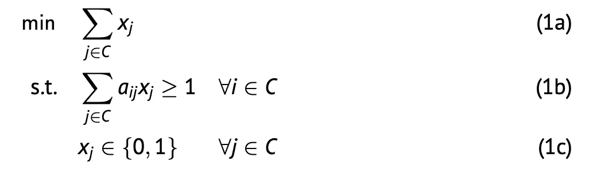

# 机盖又开始变热了

> 原文：<https://towardsdatascience.com/the-set-cover-is-becoming-hot-again-17b3d8b78da0?source=collection_archive---------30----------------------->

## [行业笔记](https://towardsdatascience.com/tagged/notes-from-industry)

## 三行代码如何改善蓬勃发展的商业模式

由[布雷特·乔丹](https://unsplash.com/@brettjordan?utm_source=medium&utm_medium=referral)在 [Unsplash](https://unsplash.com?utm_source=medium&utm_medium=referral) 上拍摄的照片

2021 年可能成为 **10 分钟送达服务**之年。当我骑自行车穿越我的家乡时，我看到许多像 Getir、Gorillas、Zapp 和 Flink 这样的新公司的**骑手正在奔向一个客户。这个概念很简单:你在一个应用程序上订购食品后，商品会在**黑暗商店**被收集，并由骑手送货上门。这一切都发生在(大约)10 分钟内！**

虽然很多人，大多数是年轻人，经常使用这项服务，但这个市场也有一些不利因素。竞争激烈，利润微薄。此外，还有一些关于骑车人在穿越交通时的安全性的争论。在我看来，后者没有必要。因此，我想谈谈**暗店**，尤其是它们的**位置**。

## 设置封面

在这么短的时间内完成大部分订单的诀窍不是骑自行车。相反，将你的商店**放置在城市的最佳位置**会有更好的效果。如果我负责来自大猩猩的数据科学团队，我会问自己以下两个问题:

1.  为了在 10 分钟内到达阿姆斯特丹的所有邮政编码，我需要开多少家商店？
2.  我应该在哪里打开它们??

在运筹学中，这被称为**集合覆盖问题**。本文讨论的问题版本是 **NP-hard** ，这是对问题复杂性的一种度量。

## 绝非微不足道

or 问题有不同的复杂程度，包括 P、NP、NP 完全和 NP 困难。NP 类包含了所有存在算法的问题，给定一个建议的解决方案，该算法可以检查该解决方案是否正确。P 是所有能在多项式时间内解决的 NP 问题的集合。**NP-Complete**NP 中那些至少和 NP 中其他任何问题一样难的问题。对于 **NP-Hard** 问题，其解的正确性无法在多项式时间内验证。

到目前为止，*假设*认为 **P ≠ NP** 。然而，如果你能证明它(或者相反)，你就能赢得由克莱数学研究所提出的 100 万美元的**千年奖问题**中的一个。在多项式时间内解决这样一个问题，就像集合覆盖一样，将会对(数学)世界产生巨大的影响。许多聪明的人已经试图用一个证明来回答这个问题，但是至今没有一个人成功。因此，可以肯定地说，解决一个 NP-Hard 问题，如 Set Cover 是**而不是微不足道的**。

## 几种方法

要找到集合覆盖的(次)最优解，有许多条通往罗马的道路。如果你的问题实例是实质性的，你可能会选择**启发式**。这种方法的好处是速度快。然而，应该在质量上进行权衡，因为在大多数情况下，它不会给出最佳结果。一个例子是**贪婪算法**，它在搜索过程的每个阶段选择局部最优。顾名思义，这个选项并不复杂，但是运行速度相当快。大多数公司在日常运营中需要集合覆盖问题的结果，因此选择启发式方法。

另一方面，小问题实例可以在合理的时间内**准确地**得到解决。因此，不需要在几小时(或几天)内获得这些结果的企业更喜欢这种方法，因为它提供了最佳解决方案。建模这种问题的一种常见方法是**整数线性规划** (ILP)。在下面的段落中，我将给你一个最简单形式的集合覆盖的 ILP 公式。目前，我认为试探法超出了本文的范围，因此不会详细讨论它们。

你可以在这篇文章的末尾找到更多关于如何制定一个 ILP 的信息。

## 数学公式

所以，我们想找到在一个城市中最少要开的**家店**，以及它们对应的**家店**。为了简单起见，我们用**邮政编码**来划分城市。骑自行车 10 分钟以内至少有一家商店可以到达每个邮政编码。而且，每个邮编最多只能开一家店。当然，您可以通过用街道替换邮政编码来使模型更细粒度。然而，这会给模型更多的选择，从而使问题变得更加复杂。

用数学术语来说，你可以把这个问题公式化如下:

集封面的数学符号，来源: [R. Roberti](https://www.linkedin.com/in/roberto-roberti-0a5079b2/) 来自 VU 阿姆斯特丹。

*C* 表示邮政编码的**集合**。aᵢⱼ是一个二进制**参数**，如果从邮政编码*j*∈c 骑车 10 分钟内可到达邮政编码*I*t8】∈c，则等于 1，否则等于 0。二进制**决策变量** xⱼ如果在邮政编码 j **∈** C 的地区开店，则等于 1，否则等于 0。模型中的每一行解释如下:

*   (1a)模型的**目标**是最小化覆盖所有邮政编码的商店数量。因此，决策变量在 *C* 上求和。
*   (1b)每个邮政编码 *i* **∈** C 应在至少一家商店骑自行车 10 分钟内到达**。**
*   (1c)完整性约束，其指示邮政编码可以具有开放商店(1)或者不具有(0)。

决策变量的结果值给了我们两个答案:

*   **应开店的最少数量**。这可以通过对所有决策变量求和来计算。
*   **哪个邮政编码**应该有商店？如果 xⱼequals 1 对于某个邮政编码*j*t36】∈c，模型推荐在 *j* 开店。对应的决策变量等于 0 的所有邮政编码都没有商店。

## 限制

像许多其他数学模型一样，这个相对简单的模型中没有考虑到一些实际问题。例如，我们假设每个邮政编码都**适合**开店，然而现实生活中可能并非如此。还有，你如何**测量两个邮政编码之间的距离**？你取两个中心之间的距离还是最大距离？有很多选择。最后，你如何确定 **10 分钟自行车范围**？毕竟，骑车人在郊区骑车可能比在市中心骑得快。你应该如何在模型中实现高峰时间或交通堵塞？这些问题不容易在我们的 ILP 中实现。

## 更聪明地工作，而不是更努力

我想说的是，对于这些大的创业公司来说，一个大的**战略问题**可以(部分地)归结为一个经典的数学问题:集合覆盖。作为一个重要且众所周知的问题，研究人员提出了**多种解决方案**，其中之一是 **ILP** 。

在其最简单的形式中，器械包封面可以用**三行**来建模。然而，这种提法没有考虑到许多实际问题。结合这个问题是 **NP-Hard** 的事实，这使得从理论上处理这个问题变得更加复杂。尽管如此，我发现它仍然值得与你分享。

所以，下次你看到一个骑手在城市中狂奔，你不应该责怪他/她，而是在一个尴尬的位置开店的运营经理。我的建议？他们应该**工作**(一点点)**更聪明，而不是更努力**。

*我希望你喜欢阅读这篇文章，它给了你一些关于数学优化的新见解。如果您想了解更多关于 ILPs 的知识，您可以查看下面这篇关于自己制定 ILPs 的文章:*

</five-questions-that-will-help-you-model-integer-linear-programs-better-3256731a258c>  

另外，别忘了关注我，获取更多关于这个话题的文章。下次见！