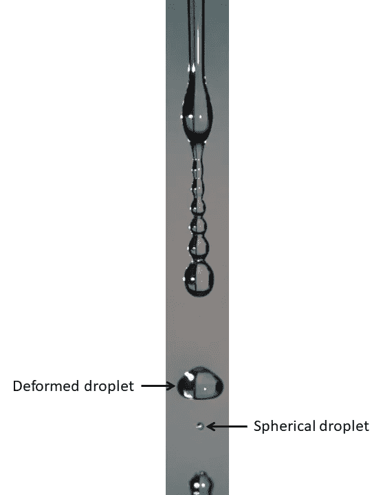
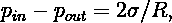
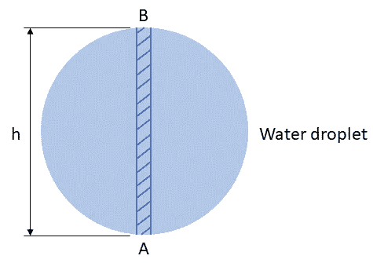
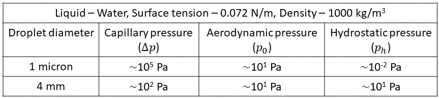
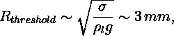
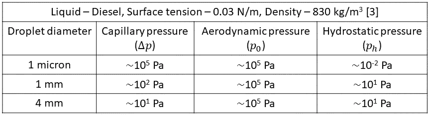

# 水滴的形状

> 原文：<https://towardsdatascience.com/the-shape-of-a-water-droplet-cb902b69e9cb?source=collection_archive---------16----------------------->

## 为什么有些水滴是球形的，而另一些不是

何塞·斯佩金斯在 [Unsplash](https://unsplash.com?utm_source=medium&utm_medium=referral) 上拍摄的照片

厨房里滴水的水龙头是一件看起来很普通的日常用品。一股水流从水龙头中流出，形成一滴水滴。有时，线足够大，以至于它分裂成一系列的液滴。从水的喷射/线形成水滴在物理学上非常丰富，绝对美丽(我鼓励你看看类似现象的高速镜头[这里](https://myopticaltrek.wordpress.com/high-speed-photography/))。这些液滴有不同的大小和形状。它们不总是球形的(图 1)。

雨滴形成云朵。当它们落下时，它们聚结并形成更大的液滴。这些较大的水滴然后分裂成较小的水滴(雨滴的解剖[)。根据](https://www.youtube.com/watch?v=46otS0Wjz-E) [Villermaux 和 Bossa](https://www.nature.com/articles/nphys1340) 的说法，雨滴在开始分解之前会变形/变平，就像在这部美丽的[电影](https://www.nature.com/articles/nphys1340#Sec6)中看到的那样。仔细观察表明，在分裂事件之后，较小的子液滴几乎是球形的，而较大的子液滴则振荡/变形。很可能这些较大的子液滴不会经历进一步的分裂，而是保持振荡/变形。他们甚至可以实现看起来像小圆面包的平衡形状，类似于 Alistair McClymont 的这幅美丽的[艺术品](https://www.youtube.com/watch?v=a9CRrGvQwe0)中的水滴形状(其中水滴使用垂直风洞悬浮，它具有看起来像小圆面包的平衡形状)。

因此，一些液滴是球形的，而另一些不是。具有非球形形状的液滴与我们在高中物理中学到的形成对比:由于表面张力的作用，液滴呈现球形，因为它试图在给定体积下最小化液滴的表面积。因此，除了表面张力之外，还必须有其他力来对抗表面张力对液滴形状的稳定影响。在这篇文章中，我们将研究自然现象和实际应用中作用于液滴的力，并使用数量级分析来确定主导力。知道了主导力，我们就能预测液滴的命运。

图 1 显示了一个滴水的水龙头，其中水线分裂成不同大小和形状的水滴(较小的水滴几乎是球形的，而较大的水滴看起来是变形的)。这些液滴在重力作用下下落时会受到什么力的作用？请先猜猜，然后再继续。

图一。滴水(来源:[https://myopticaltrek.wordpress.com/](https://myopticaltrek.wordpress.com/))。

三个主要的力作用在这些液滴上:(a)重力，(b)由于空气和液滴之间的相对速度而产生的空气动力，以及(c)表面张力。为了了解这些力如何决定液滴的形状[甚至是它的最终命运(分裂/解体)]，我们来做一个简单的思想实验。

# 思维实验

考虑两个直径分别为 1 微米和 4 毫米的水滴，假设它们在重力作用下穿过静止的空气下落 1 米的高度。当它们下落时，表面张力试图使它们保持球形，而空气动力和重力试图使它们变形。换句话说，表面张力的稳定作用被空气动力和重力的干扰作用所抵消。让我们通过简单的数量级分析来看看这些力之间的竞争是如何决定液滴形状的。

## 数量级分析—毛细管压力

对于球形液滴，拉普拉斯定律表明，

其中 *pᵢₙ* 和 *pₒᵤₜ* 为液滴内外的压力值， *σ* 为液体的表面张力， *R* 为液滴半径。表面张力产生附加压力*δp*，也称为毛细管压力和*δp =**pᵢₙ*—*pₒᵤₜ*。毛细压力有助于液滴获得或保持球形。对于 1 微米和 4 毫米的水滴，毛细管压力分别为*10⁵pa 和 10 Pa 量级(对于水， *σ=* 0.072 N/m)。*

*毛细管压力对液滴形状的稳定影响受到空气动力和静水压的干扰影响，空气动力和静水压分别由空气动力和重力引起。为了确定毛细管压力的稳定影响与空气动力和流体静压力的干扰影响相比有多强，我们可以计算它们的数量级，并与毛细管压力的数量级进行比较。*

## *数量级分析——气动压力*

*当液滴穿过静止的空气下落时，在其底部形成一个驻点。驻点处的气动压力( *p₀* )为 *p₀≈ρₐU /2* ，其中 *ρₐ* 为空气密度， *U* 为液滴与周围空气的相对速度(驻点处的气动压力表达式可通过写出终止于液滴驻点的流线的伯努利方程获得)。由于在这种情况下空气是静止的(思想实验)， *U* 代表液滴的速度。我们可以有把握地假设，试图使液滴变形的气动压力的数量级为*p₀*【5】*。**

**p₀* 的顺序取决于 *ρₐ* 和 *U. ρₐ* 的顺序~1 kg/m .当思想实验的液滴从 1 米的高度下落时，它们在经过 1 米的距离后达到最大速度( *Uₘₐₓ* )使用落体的[方程( *s = 0.5gt* 和 *v = gt* ， 其中 *s* 是下落物体在时间 *t* 内移动的距离， *g* 是重力加速度， *v* 是时间 *t* 后下落物体的瞬时速度)，我们可以计算出 *Uₘₐₓ* ，对于两个液滴来说都是 10 m/s 的数量级(对于 1 的高度，空气阻力不会显著降低 *Uₘₐₓ* 因此， *p₀* 的数量级为 10 Pa。现在，我们有了毛细压力和空气动力压力的数量级。让我们对静水压力做一个类似的分析。](https://en.wikipedia.org/wiki/Equations_for_a_falling_body)*

## *数量级分析——静水压力*

*考虑在重力作用下下落的液滴内部的狭窄中心圆柱体 AB，如图 2 所示。静水压力( *pₕ* )，因为重力( *g* )，被给定为 *pₕ = ρ* ₗ *gh，*其中 *ρ* ₗ是液体密度， *h* ，在这种情况下，是液滴直径。*

**

*图二。水滴中圆柱体 AB 的示意图。*

*A 处的静水压力高于 B 处的静水压力。对于多个位置，如 A(液滴底侧)和 B(液滴顶侧)，也可以做出类似的陈述。这会使液滴变形(除非静水压力被毛细管压力补偿)。对于 1 微米和 4 毫米的水滴， *pₕ* 分别为10⁻帕和 10 Pa 的数量级。*

## *评论*

*让我们比较毛细管压力、空气动力压力和流体静压力的数量级，以确定它们中的哪一个对思想实验中水滴的形状有主要影响。表 1 列出了这些压力的顺序。*

**

*表 1。思想实验中水滴的毛细管压力、空气动力压力和流体静压力的顺序。*

*1 微米液滴的毛细管压力比相应的空气动力学压力高四个数量级。相比之下，4 mm 液滴的毛细管压力仅比相应的空气动力学压力高一个数量级。这意味着，当考虑由空气动力压力引起的液滴变形时，与较大液滴相比，毛细管压力对较小液滴的稳定影响更显著。因此，对于相同的外部空气动力压力，较大的液滴可能比较小的液滴变形更多。如果空气动力学压力明显大于毛细管压力(实际应用中通常是这种情况)，液滴就会变形并分裂成大量的产品液滴(关于液滴分裂的更多信息，你可以阅读我早先的[帖子](https://www.cantorsparadise.com/the-breakup-of-a-liquid-droplet-5c1529a6a3c3))。*

*让我们比较一下毛细压力和流体静压力的数量级。1 微米液滴的毛细压力比相应的流体静压力高 7 个数量级，而 4 毫米液滴的毛细压力仅比相应的流体静压力高一个数量级。*

*总之，与空气动力学和流体静力学压力的干扰影响相比，1 微米液滴的毛细管压力的稳定影响明显高于 4 毫米液滴的毛细管压力的稳定影响。因此，与 4 毫米液滴相比，1 微米液滴在其下落过程中更可能保持球形。*

*我们再来回顾一下上面讨论的雨滴分手的例子。较大的子液滴由于空气动力学和流体静力学压力的组合干扰影响而振荡/变形。然而，较小的子液滴倾向于保持球形，因为与空气动力学和流体静力学压力相比，毛细管压力明显更强。*

**注:读者可以跳过下一节(有趣的点)直接下结论，而不会失去连贯性。不过，顾名思义，下一节就有意思了* **🙂。***

## *有趣的观点*

## *(a)静水压力*

*有趣的是，静水压力的数量级仅取决于地球表面液体的液滴直径。这就引出了一些有趣的问题:(a)是否存在一个临界尺寸，超过这个尺寸，液滴就会变得不稳定并可能破裂，(b)如果(a)的答案是肯定的，我们能否计算出水滴的这个尺寸？*

*对于水滴在地球表面变得不稳定， *ρₗgh ≫ σ/R* ，其中 *h~R* 。从这个等式中，我们得到水滴的临界半径(也称为毛细管长度),*

**

*超过该值它就不稳定(毛细管压力可能不足以稳定液滴)。因此，我们没有看到直径大于约 6 毫米的稳定水滴。我们还可以指出，如果我们只考虑重力的干扰效应，来自思想实验的 4 毫米水滴是稳定的，并可能在其旅程中保持球形。*

**(思考:月球上水滴的 R_threshold 是多少？)**

## *空气动力压力*

*在许多实际应用中，空气动力压力对液滴变形和破碎的干扰作用明显强于流体静压力。让我们看一个柴油喷雾的例子。*

*柴油喷雾中液滴的典型速度范围为 300-600 米/秒。取 *U* =500 米/秒，空气动力压力约为 10⁵帕。表 2 显示了不同尺寸柴油液滴的毛细管压力、空气动力压力和静水压的顺序。*

**

*表二。不同尺寸柴油液滴的毛细管压力、空气动力压力和流体静压力的数量级。*

*从表 2 可以看出，与空气动力压力相比，静水压力小得可以忽略不计。因此，它在液滴变形(和破碎)中的作用可以忽略。对于 1 微米的柴油液滴，空气动力学压力是毛细管压力的数量级。这可能导致液滴变形/振动。对于 1 毫米和 4 毫米的柴油液滴，空气动力学压力足以使液滴变形和破裂。因此，在液滴经受高速的实际应用中，静水压力的影响通常被忽略。*

**注:在上述分析中，未考虑粘度的影响。粘性阻止液滴变形。对于类似水的液体，与其他因素相比，粘度的影响可以忽略不计。但是，对于高粘度液体(甘油、蜂蜜等。)，粘性效应不可忽略。**

## *结论*

1.  *液滴越大，毛细管压力的稳定作用越弱，而静水压力的破坏作用越强。*
2.  *毛细管压力、空气动力和流体静压力之间的竞争决定了液滴的命运(假设粘性效应可以忽略不计，这通常是类水液体的情况)。如果空气动力压力或流体静压力或两者都显著高于毛细管压力，则液滴变形并破裂。如果这些压力在同一数量级，液滴可能会变形/振动。*
3.  *在许多实际应用中，毛细管压力和空气动力压力之间的竞争决定了液滴的命运。静水压力的作用小到可以忽略不计。*
4.  *在对问题进行更深入的分析之前，数量级分析可能是一个很好的起点。Adrien Bejan 在他的书《对流传热》中正确地推荐了数量级分析，称之为“获取单位脑力劳动最多信息的首要方法”。*

*感谢阅读！建设性的批评和反馈总是受欢迎的！*

## *参考资料:*

1.  *A.《物理学的奇迹》,世界科学。*
2.  *[数量级](https://en.wikipedia.org/wiki/Order_of_magnitude)，维基百科。*
3.  *A.Molea，P. Visuian，I. Barabás，R. C .苏休和 N. V. Burnete，[柴油-乙醇混合物的关键燃料性质和发动机性能，使用四氢呋喃作为表面活性剂添加剂](https://iopscience.iop.org/article/10.1088/1757-899X/252/1/012077/pdf) (2017)，IOP 会议系列:材料科学与工程。*
4.  *阿德里安·贝扬，[对流传热](https://books.google.co.in/books/about/Convection_Heat_Transfer.html?id=9yC91-gpU8sC&redir_esc=y)，威利。*
5.  *长度 Opfer，I. V. Roisman 和 C. Tropea，液滴的空气动力学碎裂:液体袋的动力学，ICLASS，2012 年。*

*谢谢 T. G. Vignesh 对这篇文章的校对。*

* [## 加入我的介绍链接-苏米特乔希媒体

### 阅读 Sumit Joshi(以及媒体上成千上万的其他作家)的每一个故事。您的会员费直接支持…

sjosh90.medium.com](https://sjosh90.medium.com/membership)  [## 每当 Sumit Joshi 发布时收到电子邮件。

### 每当 Sumit Joshi 发布时收到电子邮件。通过注册，您将创建一个中型帐户，如果您还没有…

sjosh90.medium.com](https://sjosh90.medium.com/subscribe)*