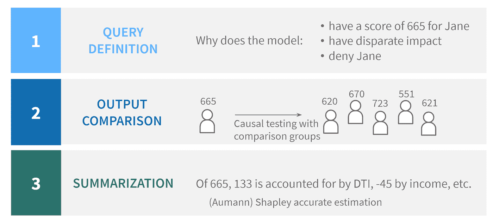
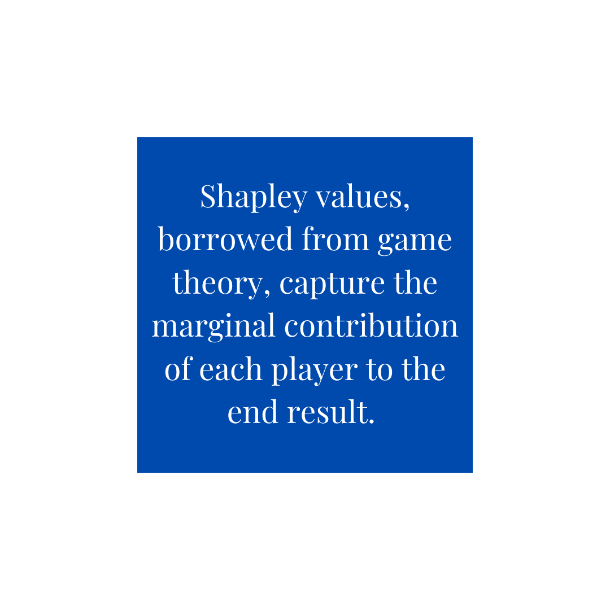
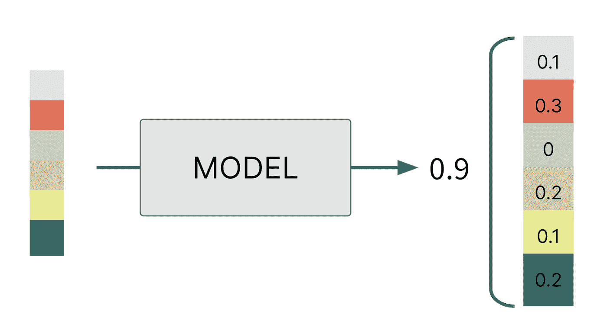
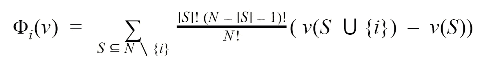
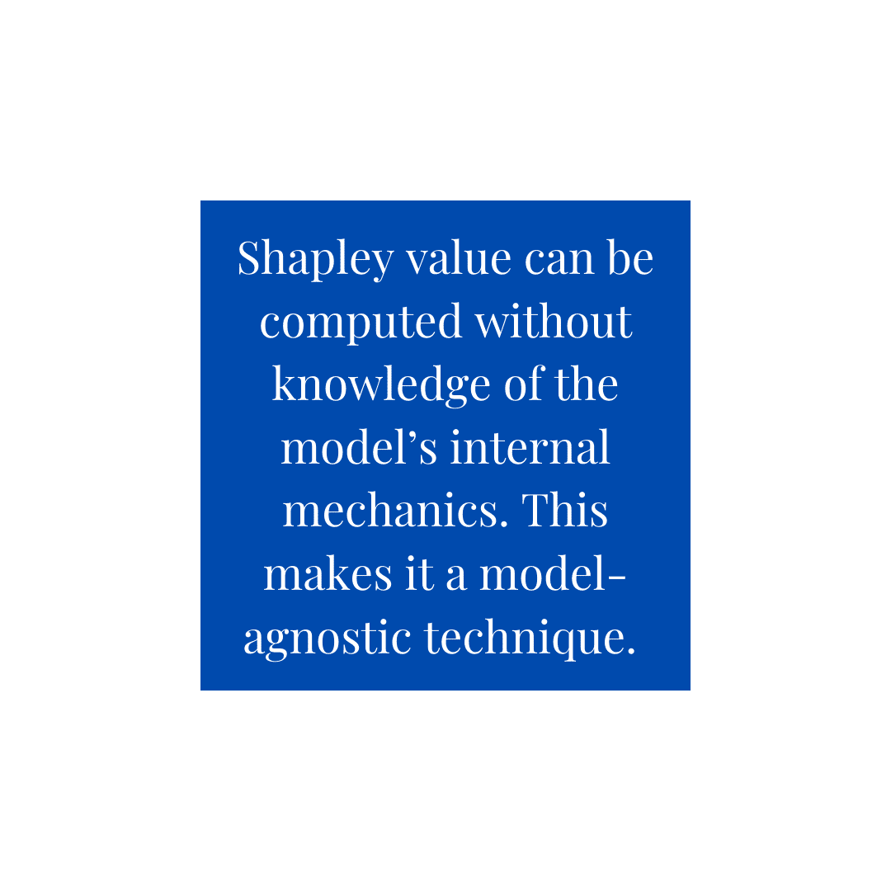

# ML 模型的 Shapley 值

> 原文：<https://towardsdatascience.com/the-shapley-value-for-ml-models-f1100bff78d1?source=collection_archive---------1----------------------->

## 值得信赖的人工智能

## 什么是 Shapley 值，为什么它对许多可解释技术至关重要？

*本文由大卫·黑川合著。*

在我们的[上一篇文章](/picking-an-explainability-technique-48e807d687b9)中，我们提出了一个案例，说明为什么可解释性是确保你的 AI/ML 模型质量的关键因素。我们还介绍了解释方法的分类，以帮助比较和对比解释模型的不同技术。

在这篇文章中，我们将深入探讨沙普利值的概念。许多流行的解释技术——比如 [QII](https://ieeexplore.ieee.org/document/7546525) 和[SHAP](https://arxiv.org/abs/1705.07874)——都在他们的计算中使用了沙普利值。那么什么是 Shapley 值，为什么它是这么多可解释技术的核心？

# 沙普利价值观回答了哪些问题？

在高层次上，Shapley 值方法试图解释为什么 ML 模型报告它对输入所做的输出。例如，对于识别申请人是否应该获得抵押贷款的模型，我们可能想知道为什么退休人员 Jane 被拒绝贷款，或者为什么模型认为她的违约概率为 70% —这是查询定义。

在这些问题中隐含的是，为什么 Jane 被拒绝贷款，而其他人没有，或者为什么她被认为有 70%的违约机会，而平均申请人从模型中仅获得 20%的机会。将这个问题与 Jane 和其他人的不同联系起来有助于回答更微妙的问题。例如，当与所有被接受的申请人进行比较时，我们会发现她被拒绝的一般原因——比如她需要大幅增加收入。但通过将她与所有被录取的退休申请人进行比较，她可能会发现她高于平均水平的信用卡债务是她预测的高违约率的关键原因。这样，Shapley 值就与比较组联系在一起了。

因此，Shapley 值方法采用 Jane 模型的输出以及一些申请人的比较组，并确定 Jane 和比较组之间的差异有多少是由每个特征造成的。例如，她 70%的预计违约率和被接受的退休申请人 10%的预计违约率，有 60%的差异需要解释。Shapley 可能会将 40%分配给她的信用卡债务，15%分配给她的低净值，5%分配给她退休后的低收入——测量每个特征对总得分差异的平均边际贡献。稍后，我们将通过精确的 Shapley 值公式使这一点更加具体。

图片作者。

# 什么是沙普利价值观？

Shapley 值是从合作博弈论文献中借用的一个概念，可以追溯到 20 世纪 50 年代。在它们最初的形式中，Shapley 值用于公平地将玩家的贡献归因于游戏的最终结果。假设我们有一个合作游戏，一组玩家每个人都合作创造一些价值。如果我们可以衡量游戏的总收益，Shapley 值捕捉每个玩家对最终结果的边际贡献。例如，如果朋友们共用一辆出租车去不同的地点，则总账单可以基于 Shapley 值来分割。

图片作者。

如果我们认为我们的机器学习模型是一个游戏，其中各个特征“合作”产生一个输出，这是一个模型预测，那么我们可以将预测归因于每个输入特征。正如我们将在后面探讨的，Shapley 值在公理上是唯一的，因为它们满足测量每个特征对最终结果的贡献的期望属性。

在高层次上，Shapley 值是通过仔细扰动输入要素并查看输入要素的变化如何与最终模型预测相对应来计算的。然后计算给定特征的 Shapley 值，作为对整体模型分数的平均边际贡献。Shapley 值通常是相对于作为解释的“基线”的比较或背景组来计算的，这消除了问题“与所有批准的申请人相比，Jane 为什么被拒绝贷款？”来自“与所有获批的女性相比，为什么简被拒绝贷款？”

图片作者。单个特征如何影响模型得分的示例。

# 沙普利值有什么了不起的？

Shapley 值的特殊之处在于，它是满足一组强大公理的唯一值，这些公理可能是您在归因策略中所期望的。在本帖中，我们不会讨论这个唯一性的[证明，但是让我们强调其中的一些公理:](https://link.springer.com/article/10.1007/BF01769885)

*   **完备性/效率:**每个玩家(特征)的贡献总和必须加起来等于总收益(模型得分)减去比较组的平均收益(模型得分)。
*   **假人:**对游戏没有贡献的玩家不能获得任何回报。在 ML 模型的情况下，模型不使用的输入特征必须被分配为零的贡献。
*   **对称:**对称玩家(特征)对最终收益(模型分数)的贡献相等。
*   **单调性:**如果一个玩家(特征)A 比一个玩家(特征)B 对收益(模型得分)的贡献持续更大，那么玩家(特征)A 的 Shapley 值必须反映这一点，并且高于玩家(特征)B 的 Shapley 值。
*   **线性**:让我们假设游戏收益(模型分数)是基于两个中间值之和确定的，每个中间值都来自输入特征。然后，分配给每个玩家(特征)的贡献必须是玩家(特征)对中间值的贡献之和。

# Shapley 值在 ML 模型中是如何使用的？

我们提到过，Shapley 值计算的是功能𝒙对模型分数的**平均边际贡献**。这在实践中是如何计算的？

让我们首先尝试为一个合作博弈制定这个。假设我们有一个 *n* 玩家游戏，玩家有 *1，2，…，n* 和一些价值函数 ***v*** ，它接受玩家的子集，如果只有这些玩家参与，则返回游戏的实值收益。那么形式上，玩家 *i* 的贡献**φ**定义为

图片作者。Shapley 值的数学公式。

其中 **S** 是玩家的联盟或子集。简单地说，Shapley 值是通过计算当参与人 *i* 被包括在排除 *i* 的所有联盟中时，参与人*I*提供的加权平均收益来计算的。

在最简单的 ML 设置中，这个合作博弈的参与者由 ML 模型的特征代替，收益由模型输出本身代替。让我们回到之前的抵押贷款例子，让这一点更清楚。假设我们有一个模型，它被训练来预测个人拖欠贷款的可能性。Jane 有 70%的违约几率，我们想知道她的收入(这恰好是特写 *i* )在决定模特的决策时有多重要。我们首先会选择一个随机的特征子集 **S** 提供给模型。例如，SCO 可以包括 Jane 的信用卡债务和净资产。然后，我们将测量边际贡献*v(S ∨{ I })-v(S)*，这告诉我们，相对于仅使用信用卡债务和净值作为特征的模型的输出，将 Jane 的收入包括到模型中(特征 *i* )会改变模型的输出多少。换句话说，边际贡献捕获了收入对模型输出的增量贡献，同时考虑了它与信用卡债务和净值特征的相互作用。Shapley 值是所有这些边际贡献在不同的 **S** 上的加权平均值。

对于最大似然模型，在确定预测时不可能仅仅“排除”一个特征。因此，ML 上下文中 Shapley 值的公式通过对特征值的经验分布进行采样并对多个样本进行平均来模拟“被排除”的特征。根据采样策略的不同，这可能会很棘手，而且计算成本很高，这就是为什么大多数计算 ML 模型 Shapley 值的真实方法都是产生真实 Shapley 值的估计值。这些算法之间的核心差异，如 QII 和 SHAP，在于各自选择干预和干扰特征的细微方式。

计算 Shapley 值只需要黑盒访问模型作为预测器，只要您知道其输入和输出，就可以在不了解模型内部机制的情况下计算 Shapley 值。这使得它成为一种与模型无关的技术，也有助于跨不同模型类型直接比较输入要素的 Shapley 值。

图片作者。

此外，因为 Shapley 值可以相对于单个数据点计算，所以它们提供了局部解释的粒度，同时允许外推。例如，通过分析跨多个数据点的哪些要素具有较高的 Shapley 值，可以深入了解模型的全局推理。

# Shapley 值的局限性

尽管 Shapley 值的动机是公理化的，但是它们在 ML 环境中的使用还是有一些明显的局限性。

计算 Shapley 值需要选择特征的组合或子集，这在特征的数量上呈指数级增长。这通过使用近似技术和利用已知的特定模型结构(例如在树或线性模型中)来减轻，但是通常 Shapley 值计算难以精确计算。

一个更概念性的问题是，Shapley 值可能严重依赖于模型如何作用于不切实际的输入。例如，一个将纬度和经度作为独立要素的房价模型可以在湖中央的房地产上进行查询。有一些定义公式试图弥补这一点，但是它们受到其他问题的困扰——通常需要无法获得的大量数据。这种“不切实际的输入”问题甚至已经被证明可以被攻击者利用，因为可以构建与原始模型几乎相同地执行的模型，但是其 Shapley 值几乎是随机的。

# 沙普利价值观:一个强有力的解释工具

Shapley 值借用了合作博弈论的见解，并提供了一种接近机器学习解释的公理化方法。这是为数不多的解释技术之一，它是由一个好的解释看起来像什么的直觉概念支持的，它允许局部和全局推理，并且它是模型类型不可知的。结果，许多流行的解释技术利用 Shapley 值来解释 ML 模型。在这篇博文中，我们概述了 Shapley 值背后的理论直觉，以及为什么它对 ML 解释能力如此强大。