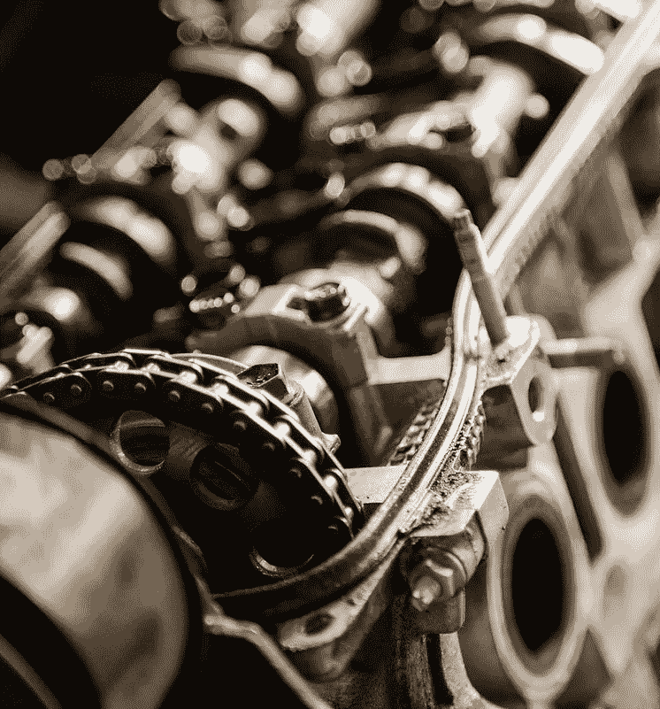
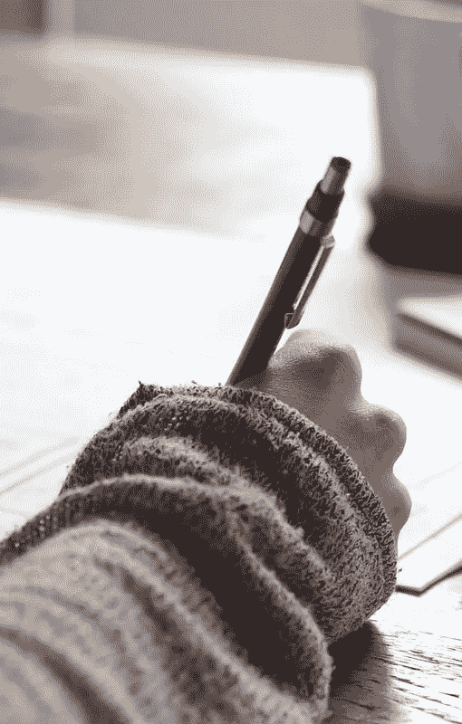
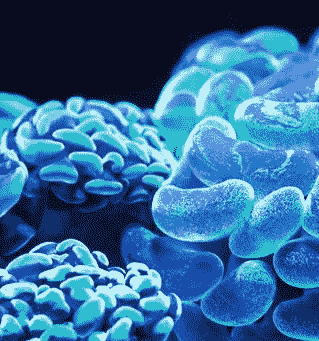
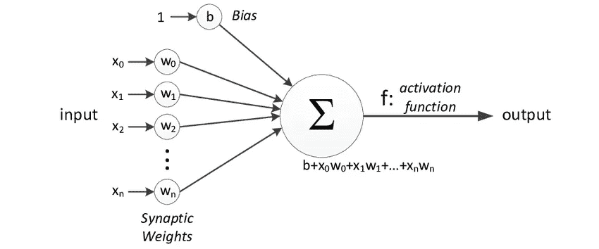
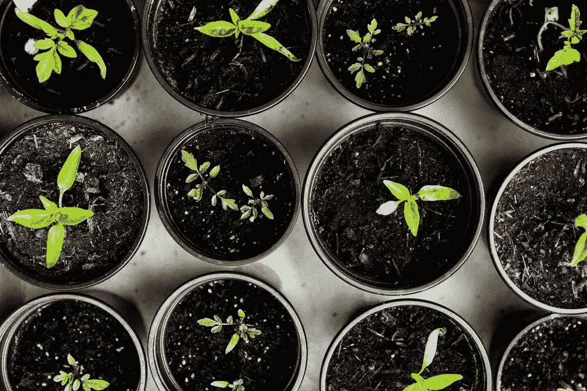
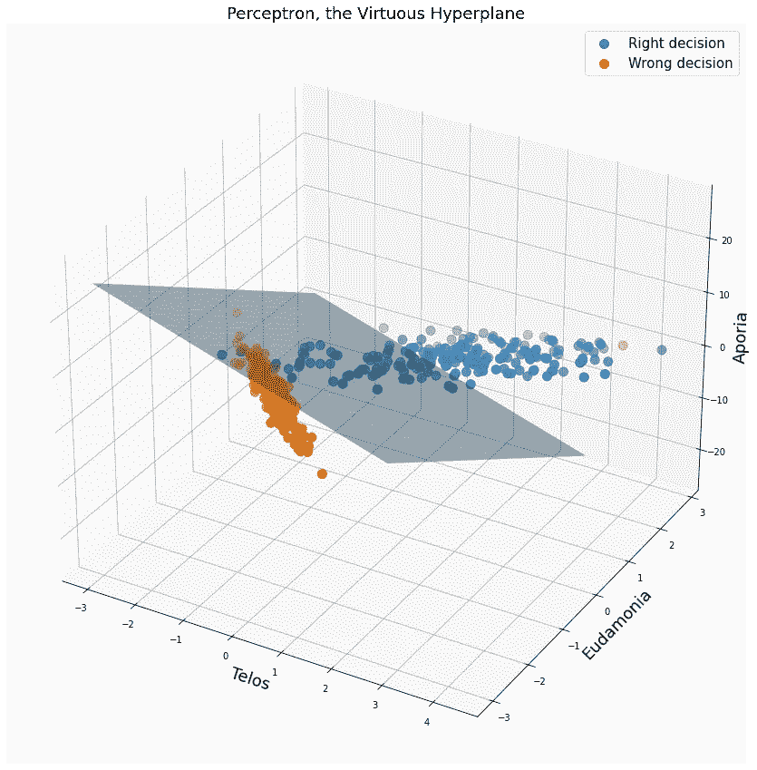
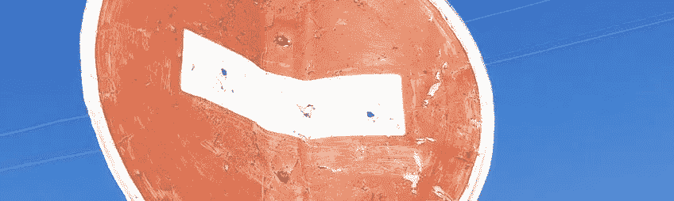

# 一个道德感知器的短篇故事

> 原文：<https://towardsdatascience.com/the-short-story-of-a-virtuous-perceptron-d1fe6d26fedb?source=collection_archive---------46----------------------->

## 移除机器并保持学习

机器和大脑之间的思考者，归功于 [@garett3](https://unsplash.com/@garett3) ， [@craftedbygc](https://unsplash.com/@craftedbygc) ，@ [大卫克洛德](https://unsplash.com/@davidclode)

# 出生

你见过感知器存在的证明吗？这是一个很好的证明**,只要环境不太吵，一个有道德的学习者就能成功**。这里可以看[。](https://www.youtube.com/watch?v=kObhWlqIeD8&t=2168s&ab_channel=KilianWeinberger)

感知器是以我们大脑的基本构成——神经元——命名的。这个简单的算法有一个任务:学习如何将线性可分的数据分成两类。

当我意识到感知机的潜力时，我感到非常渺小和自命不凡，因为就在那一刻，我明白了最简单的机器已经远远超出了人类的平均水平。

一个纯粹的感知器怎么会比智人更有道德？

感知器是二元决策器。给他提供数据，他会很乐意给你他的双重见解。

*只有两个班？这个算法太简单了，没法跟我比*。

**通过**[**Zafeirios Fountas**](https://www.researchgate.net/profile/Zafeirios_Fountas)**上 Researchgate。**

在我们的日常生活中，我们面临平凡而关键的情况，需要做出复杂的选择。当我们面前有一块棉花糖时，我们的本能会尖叫着吃掉面前的糖果，而我们的理性思维会避免看着诱惑的对象**。二元选择不是小菜一碟。**

感知器可以让我们成为更好的决策者。除了试错步骤，它们还可以提醒我们，一个有知识的算法首先需要成为一个好的学习者。

# 例行公事

感知器的程序很简单，但是很有趣。感知机从零开始。它接受非常小的随机重量，就像我们出生时一样。然后它不屈服于拖延，开始它的探索，一个无限循环。。从零到英雄，只需要一次“向知识进军”。

> **讲给我听我忘，教给我听我可能记得，涉及到我和我学——***荀子。*

感知机直面现实，尽管现实可能很残酷。它看到一些数据，并试图预测标签。惩罚是无情的:当他错了，他错过的数据样本会加到自己身上或从自己身上减去。他在更新自己，在右或左脸颊上打了一个大耳光。

我们可以编写如下的程序:

*   随机初始化其参数
*   步骤 1:随机抽取一个数据样本。
*   第二步:预测一个标签。
*   第三步:如果预测正确:什么都不做。
*   第四步:如果预测错误:**吃掉数据样本**。
*   第五步:从第一步开始重复。

如果你的数据有两个特征财富和年龄来预测幸福，例如，感知器决策边界是一条线。如果数据有三个特征(钱、读过的书、朋友数量)，那么感知机就是一个平面。作者 GIF。

关于**吃**的部分不是开玩笑的。由于感知器会加上或减去自己犯了错误的所有点，因此它会将其归纳出来。犯错的代价很高，但感知机会跟随它的旅程，这是一次无休止的探索。

我们都知道，对于一台机器来说，一次加法的计算成本低得离谱。更新它的整个架构并变得更加智能需要几毫秒的时间。

那么，为什么人类犯一个错误的成本如此之高呢？

**因为我们有意识。**

## 感知器之所以成功，是因为它们学习起来没有尴尬。他们从失败中改进，无耻地重试，直到成功。

它们就是为此而设计和诞生的。

成长，由 [markusspiske](https://unsplash.com/@markusspiske)

# 意识的缺陷

许多人工智能系统使用过去的知识来解决新问题。这就是所谓的“迁移学习”。拥有比正常人更好的机器、更干净的数据和更多时间的人已经产生了你可以拿来使用的参数。对于不是千兆数据中心所有者的机器学习领域的任何人来说，迁移学习都是黄金。

其实人性还是蛮像的。我们不是从零开始出生的，我们继承基因，历代文明堆积的知识托付给我们。科学、文化、社会总是传递给后代。

我们确实成功地接受了前人的知识。到目前为止，我们和感知机一样好。我们的失败发生在下一步:**预测**和****更新**。人类甚至在尝试之前就觉得可耻。**

**挑战前的不情愿，压力，完美主义，自卑，害怕被拒绝，这样的例子还可以继续下去。**

**我们害怕别人对我们的评价，害怕我们的行为与期望不符。在与陌生人、同事或朋友交往的每一个角落，我们都期待着羞辱。**

**不给预测这一步机会，怎么学？**

> **技能的错觉不仅仅是个体的失常；它深深融入了行业文化。挑战这些基本假设的事实——从而威胁到人们的生活和自尊——根本没有被吸收。头脑不会消化它们——思考，快与慢，*(诺贝尔奖)。***

**感知机——或任何人工智能模型——是没有意识的，不会害怕出错或被拒绝。相反，当我们不顾一切地待在自己的舒适区时，在我们的[洞穴](https://en.wikipedia.org/wiki/Allegory_of_the_cave)里，感知机不顾一切地想要改变。损失功能每天都在提醒他，肩上长期的担子更重，比短期的打我们耳光还重。**

****

**一个能区分好决策和坏决策的感知器。图片来自作者。**

# **我给你意识**

***想象一下我们会给人工智能赋予意识。***

> **"全人工智能的发展可能意味着人类的终结。"斯蒂芬·霍金。**

**西方普遍担心，当人工智能实现意识时，它会灭绝我们，这被很好地称为“人工智能接管”。就个人而言，我怀疑这种世界末日的情景会发生。我们不应该忘记伴随意识而来的有毒的礼物。**意识也给予羞耻以荣誉，害怕受到其他批评。****

**当一个人工智能开始嘲笑它的同伴，或者当它们在一个重要的演讲前变得紧张时，它们就已经达到了人性。由于过于聪明，他们将永远拆除他们通往知识的良性路径。**

**这凸显了一个有趣的悖论:过于人性化会阻止学习过程本身。**

**当感知机将进化为意识和自我意识时，它将成功地成为人类，而作为学习算法则失败。他会拒绝预测或者拒绝承认自己错了。**

**他会停下来学习。**

****

**走错了路。鸣谢 [@visualpatrol](https://unsplash.com/@visualpatrol)**

# **成功的人生**

**为什么我们会拒绝承认自己的错误，在学习的大门前畏缩不前？我们的智慧巧妙地抹去了我们生活中所有痛苦的片段，所有这些我们需要从意识中面对现实的不愉快的时刻。**

**如果一个网球运动员拒绝在他的弱点上练习，而是在借口上磨砺他的天赋，你认为他会变成什么样？一个糟糕的网球运动员。**

**在准备好认识到我们的错误并渴望重新校准我们对世界的看法之前，学习过程不会发生。不止一次，而是让这种学习技能成为一种习惯。**

> **技能的基本测试:持续的成就——思考，快与慢。丹尼尔·卡内曼。**

**在当前世界中，机器仍然是愚蠢的，所以它们仍然可以学习。**

****

**光线、阴影和几何图形。沙漠之旅**

# ****结论****

**人类是骄傲的，太骄傲了。脑子聪明，太聪明了。懒惰的意识避免处理麻烦。但是你是独一无二的，你发现的美德，拥有它们，更新它们，它们将使你不仅优于机器，而且特别和成功。**

**作为感知器要谦虚。陈述一些假设，创造观点，用你周围的现实来面对它们。全世界都是你的标签。你的头脑就是维基百科，里面全是每个想补充点什么的人的条目。不要忘记你是你的页面的管理员，你可以选择你保留的信息和你拒绝的信息。**

**寻找美德，寻找知识，如果你想要自由，自由地掌握你的灵魂，成为你命运的船长。**

**跟着我上 https://twitter.com/ciel_delem 的**