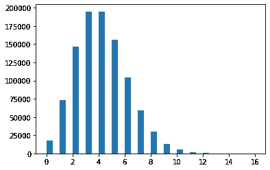

# 信号和噪音

> 原文：<https://towardsdatascience.com/the-signal-and-the-noise-d82b8630c3ad?source=collection_archive---------8----------------------->

## [入门](https://towardsdatascience.com/tagged/getting-started)

## 中心极限定理如何使数据科学成为可能


中心极限定理(图片由作者在 matplotlib 中生成)

从前，一家鞋店的老板想知道他应该买多少双每种尺码的鞋。

幸运的是，一位友好的统计学家帮助了他。“那容易！”他说，“我们有一个简单的方程式。”


这里μ是平均鞋号，σ是平均值的标准差。将这些代入你可以计算出每种尺码 x 你应该有多少双鞋，”统计学家解释道。

困惑的鞋子推销员开始问问题。“这是什么东西？”他指着 e 符号问道。

“嗯，这是微积分中一个有用的常数，选择它是为了使函数 e^x 的斜率在所有 x 点都等于 e^x”统计学家回答道。

“那是什么？”售货员指着π符号问道。

“嗯，这是一个几何常数，它将圆的半径和周长联系起来。”统计学家回答道。

"圆形和斜坡与鞋码有什么关系？"售货员问。

他说得有道理。

## 为什么是统计学？

我以前觉得统计学很无聊。这些公式对我来说就像对卖鞋的人一样有意义，我迫不及待地想回到重要的东西上(显然是物理和微积分)。直到我上了贝叶斯推理和统计力学的课程，我才爱上了这门学科，并最终意识到，尽管它无处不在，但统计学往往教得很差，而且几乎总是得不到重视。

大多数数学领域都有我们称之为基本定理的东西。微积分的基本定理把导数和反导数联系起来，代数的基本定理保证复多项式至少有一个复根。当基本原理被正确理解后，我们会突然把这些公式看作是一个中心思想的逻辑结果，而不是一堆塞进盒子里的工具。

在这里，我将尽力解释统计学的基本原理，希望一些年轻的科学家能比我更早有灵感。

## 信号和噪音

统计学是使用有限数量的测量来描述系统的艺术——实验结果、调查、传感器读数、掷骰子、掷硬币……让我们称其中一个测量的结果为*结果*。

我们可以将每个结果描述为有两个组成部分:T4 信号和噪声。


**信号**通常是我们想要理解的。这可能是一枚硬币的偏差，或者是一月的预期降雪量，或者是某个广告给客户带来的转换率。信号本身可能是我们感兴趣的潜在变量的函数——比如硬币的形状、12 月的海洋温度，或者特定客户的富裕程度和人生阶段。信号是一个*确定性*系统的产物，我们试图用统计学或机器学习模型来理解它。

**噪声**有些棘手——它意味着其他任何可能影响结果的东西，通常意味着宇宙中的任何东西。一些噪声源是我们无法测量的外部因素，因此被视为随机因素，一些是真正的随机效应，就像量子力学中的那些。简而言之，噪声是无数独立的伪随机力的总和，这些力会影响结果，并使*测量受挫*。

到目前为止一切顺利！但是如果噪音是随机的，我们怎么能希望理解信号呢？

## 不是随机的

随机变量不可能像它们看起来那样随机。它们几乎总是被限制在一定的范围内，它们可能偏向于某些值而不是其他值，并且通常遵循精确的方差。换句话说，随机性有很多种，我们可以*描述*这种随机性。

通常，我们使用一种称为**概率分布** P(x)的数学构造来描述**离散的**随机变量，就像掷骰子的结果一样，它将一个概率(P(x))与每个可能的结果(x)相关联。对于掷骰子，我们得到 P(x)=1/6，因为不管结果本身如何，每个结果都有 1/6 的机会发生。

对于**连续变量**，比如一月份的预期降雪量，这就有点复杂了，因为可能的结果数量实际上是无限的。我们可能会有 6.07 英寸的降雪，或者 6.07000001 英寸的降雪，或者 6.0700000001 英寸的降雪。这意味着 6.07 英寸降雪的总体概率实际上是 0。

因此，我们使用的是概率密度函数，而不是概率分布。这里的诀窍是*密度*允许我们计算随机过程的结果将落在某个范围内的绝对概率，因此我们可以指定一个有限的概率，在一月份有 6.06 到 6.08 英寸的雪。

PDF(x)为[a，b]范围内某个值的随机变量的概率由 x=a 和 x=b 之间曲线下的面积给出。在数学中，我们将该面积写成定积分:


a 和 b 之间的结果的概率由曲线下的阴影区域给出(图像由作者在 matplotlib 中生成)

通常，我们会强制要求[-∞，∞]范围内整个 PDF 下的面积等于 1，或者:


这可以解释为说*会有*会有*的某种*结果。

这可能会变得有点复杂，但是有一个好消息:自然中的 pdf 倾向于分成几个类别，数学家和物理学家已经提出了这些类别的方便的数学描述。我们将快速讨论其中的三种分布——将它们视为统计学家工具箱中的主要工具。

## 简单均匀分布

当我们想到随机数时，我们通常会想到均匀分布:任何结果都同样可能发生——想想掷骰子或掷硬币。我们也可以做一个统一的概率密度函数，有点像有无限边的骰子滚动。

让我们用 Python 模拟一百万次均匀分布的掷骰子，并绘制出结果的直方图。我们将使用`numpy.random`来模拟随机变量，使用`matplotlib.pyplot.hist`来绘制结果。

```
import numpy as np
import matplotlib.pyplot as plt

# Generate a sample of 1000000 values from a uniformly distributed random variable
ssize = 1000000
x = np.random.choice([1,2,3,4,5,6],size = ssize)

# Plot a histogram of the values
ax = plt.hist(x, bins=6)
```


结果是均匀分布(咄！).这告诉我们，例如，0 到 2 之间的结果的概率与 4 到 6 之间的结果的概率相同。

*注意，y 轴上的刻度明显不对。这是因为我们没有强制执行整个面积必须等于 1 的规则。经过适当的规格化后，这些条的高度为 1/6，面积为 6*1/6=1。*

## 泊松分布

我们经常遇到这样的情况，独立和不相关的事件以已知的平均速率λ发生。

例如，某人可能注意到他们平均每天收到 4 封信，并且从逻辑上来说，一封信不会影响任何未来的邮件，即，这些信是独立的，并且具有已知的平均速率λ=4。在这种情况下，一天 k 中收到的邮件数量服从泊松分布。


为了了解这种情况，让我们再次使用泊松分布模拟 1000000 天的邮件，并绘制结果。

```
# Generate a sample of 1000000 values from a Poisson distributed random variable
x = np.random.poisson(lam = 4, size = ssize)

# Plot a histogram of the values
ax = plt.hist(x, bins = 32)
```



*再次注意，这些值并未标准化，而是代表相对概率而非绝对概率*。

这种分布告诉我们，我们最有可能每天收到 3 或 4 封邮件，每封邮件的可能性是醒来时收到 2 或 6 封邮件的两倍。

## 二项式分布

二项分布应该从高中就熟悉了。f(k，n，p)度量在 n 次试验中获得 k 个结果的概率，其中每次试验的成功概率为 p。


例如，在硬币重量相等的情况下，在 10 次掷硬币中获得 5 个正面的机会有多大？就用 k=5，n=10，p=0.5。

让我们再次模拟一百万次这样的实验，并画出结果。

```
# Generate a sample of 1000000 values from a binomially distributed random variable
x = np.random.binomial(10,0.5,size = ssize)

# Plot a histogram of the values
ax = plt.hist(x, bins = 100)
```


这些分布在自然界中无处不在，描述了从棋盘游戏到皇家邮政的伪随机事件。

现在你可能已经注意到了这个列表中的一个明显的遗漏——不要担心，我们马上就要谈到这一点。

## 中心极限定理

请记住，我们的结果有两个组成部分:信号(这是我们试图分析的)和噪声(无数随机或伪随机变量的净效应)。在我们得到信号之前，我们需要了解噪声。

现在我们对分布有了一些了解，让我们想象一个简单的例子。我们有一些受多个独立噪声源影响的测量，为了简单起见，我们假设每个噪声源都像骰子一样均匀分布。噪声的总体分布是什么样的？

让我们使用`np.random`增加骰子的数量来模拟这个场景。

```
plt.figure(figsize=(20,15))
ndice = [1,2,5,10,50,100]
nbins = [4, 8, 16, 32, 64, 128]
for i in range(1,7):
    y = [np.sum(np.random.uniform(0.,6.,size = ndice[i-1])) for j in range(ssize)]
    plt.subplot(2, 3, i)
    plt.hist(y, bins=nbins[i-1])
    plt.title('N = ' + str(ndice[i-1]) + ' dice')
```


突然，我们有了一个非常独特而熟悉的形状:钟形曲线。

事实证明，这种分布在现实世界中无处不在，从成人鞋码的变化到量子测量，无处不在。我们称这种分布为*正态*分布也就不足为奇了。

这一切都不是巧合，事实上，中心极限定理，统计学的基本定理，指出了具有有限期望值和方差的无限独立随机变量的正确归一化和将是正态分布的。

换句话说**噪声**几乎总是**正态分布。**

为了表明这不仅仅是均匀分布噪声源的一个怪癖，我们可以更进一步，想象一个具有均匀、二项式和泊松噪声源的系统，看看结果是如何分布的。同样，我们可以用`np.random`来模拟这种情况。

```
y = [np.sum(np.random.uniform(size = 10)) \
     + np.sum(np.random.poisson(size = 10)) \
     + np.sum(np.random.binomial(50,0.05,size = 10)) \
     for i in range(ssize)]

ax = plt.hist(y, bins = 50)
```


猜猜是谁。

## 高斯分布

**高斯**或**正态**分布 N(μ，σ)由其均值μ和方差σ唯一标识。


中心极限定理意味着，如果我们有一些测量值，我们可以毫无争议地完全描述噪声的特征:只需找到数据的平均值和方差，就可以找到其唯一的正态分布。

这反过来意味着一个卖鞋的人可以在一瞬间知道每种鞋号该买多少，尽管鞋号是无数独立因素的函数，不管是生物因素还是其他因素，我们都没有希望去测量。他可以做到这一点，只知道小样本的均值和标准差，只需将它们代入正态分布。

一些人可能会觉得知道正态分布是最大熵的分布很有趣——考虑到上面的一切，这对物理学家来说应该是显而易见的。

但是为什么π和 e 会出现在这个神奇的方程中呢？这是留给读者的一个练习。

库珀·道尔