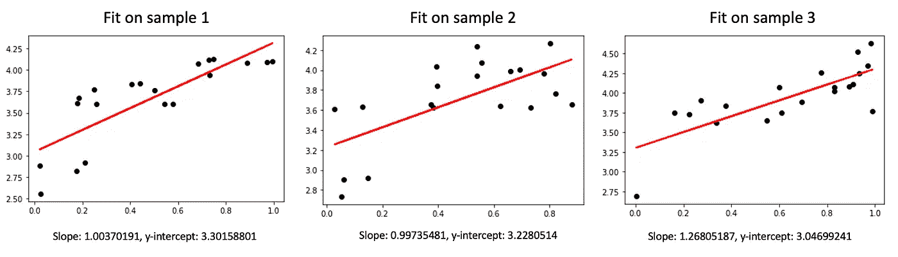
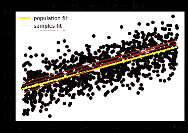
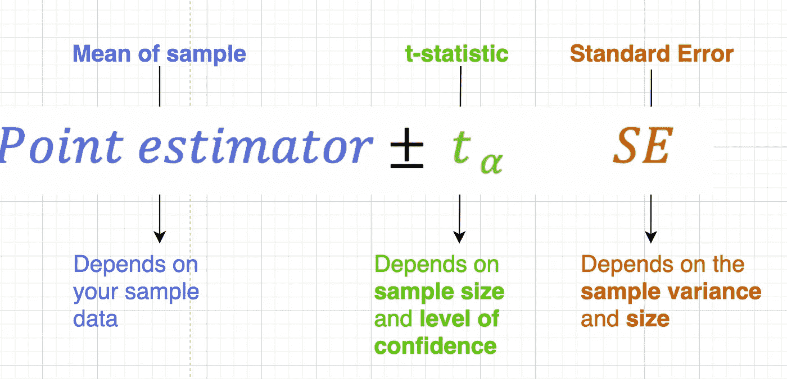
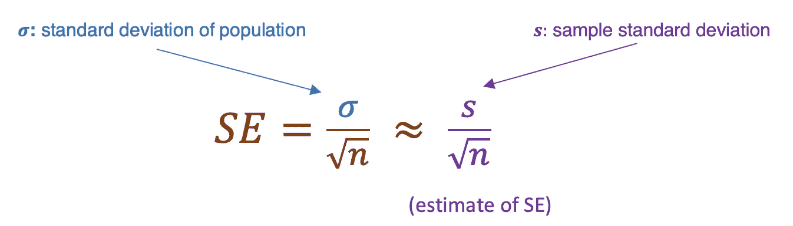
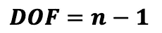
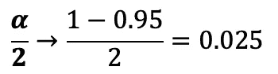
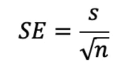
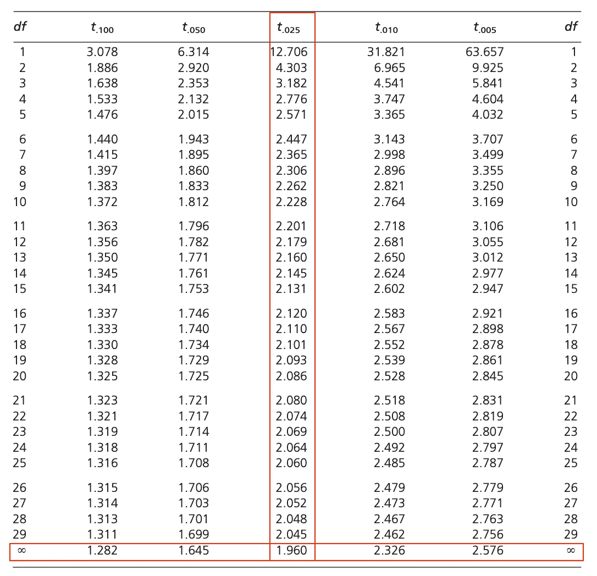
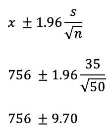

# 置信区间背后的简单直觉

> 原文：<https://towardsdatascience.com/the-simple-intuition-behind-confidence-intervals-part1-5419eda1b1b1?source=collection_archive---------42----------------------->

## 提高你对置信区间及其基本原理的理解。

我写这篇文章是为了:

*   给出一些关于置信区间的直觉。
*   澄清一些关于置信区间的经典误解(例如 95%的数据包含在置信区间中，或者总体和样本之间的不明确区分)

捕捉不确定性。来自 Unplash.com 的信用点数 [@maxfelner](https://unsplash.com/@maxfelner)

# 为什么要关心置信区间？

## 你想依靠你的猜测

当你寻找一个总体的特征值时，你首先从总体的一个样本中收集数据，并从这个样本数据中猜测参数(即:平均值、某些模型的系数等)。因为你不可能收集*所有*的数据，一个明显的问题出现了:

> “我的估计有多可靠”？

我想在这里强调一下**可靠**这个词。你可以用套索来比较置信区间，用栅栏柱来比较你的参数，如果你瞄准栅栏，有时你会抓住栅栏，有时你会错过。

有时你会失手。我们从来没有 100%的自信。

把戒指扔到黑板上，得到一个数字。演职员表[www.unplash.com·比万·凯](https://unsplash.com/@bevankay)

## 简单的例子

假设您收集了 n=100 个测量值来检查两个变量 X 和 y 之间的线性关系。在检查它们显著相关后，您可以将 n=100 个测量值分成三个训练集 n_tr=20 和一个测试集 n_te=40，并在每个训练集上拟合线性关系。您将获得 y 轴截距 *b̂* 和斜率*—*，使三个样本的残差平方和最小(见下图)*。*

由于三个样本包含不同的点(x，y)，所以对于每个训练样本来说，线性关系*—*x+*b̂*= y 将是不同的，并且**也将随着 ax+b(拟合在群体数据**上的回归线)而不同。

如何猜测真实的斜率和 y 轴截距值 **a，b** ？通过使用置信区间。

在对三个大小 n=20 的不同样本进行拟合后，我们用红色绘制回归线*x+*b*= y。*

95%的意思很简单。对于您从不同的训练数据集构建的每个置信区间，95%的置信区间将包含真实参数的值 **a，b.**

在上面绘制的例子中，每条红线都会给你一个真实参数所在的置信区间，其中 95%真的包括黄线(人口回归线)。魔法就是魔法！

我们比较拟合于总体的黄线 a**x+b**和拟合于样本的前一条线。

## **我应该使用假设检验还是置信区间？**

**答**:看情况。当你想从数据中证明一个是/否的问题(我的糖果棒都是一样大小的吗？这个老师给的分数比这个高吗？)用 p 值进行假设检验更快。

然而，如果你的数据没有显示出足够的重要性，你就不能得出任何结论。然而，不管结果如何，置信区间至少给了你**一个范围，在这个范围内应该是你寻找的参数。**

简单来说，**置信区间为你进行假设检验，也告诉你自变量对因变量的影响有多大**。例如，如果您对您的回归模型 *y=ax+b* 的斜率执行 95%置信度的假设测试，并且输出 p 值为< 0.005，您可以得出结论:在 *y* 和 *x* 之间存在显著的线性关系。同时，你可以确定，如果你建立了 95%的置信区间，斜率将不包含 0: **因此 *x* 在 95%** 时对 *y* 有影响！两种方法，一种结果！

现在我们了解了置信区间的重要性，让我们深入了解一下。

# 建造怪物

**当你用你的数据去猜测人群的行为时，先用一个** [**学生 t 分布**](https://en.wikipedia.org/wiki/Student%27s_t-distribution#:~:text=In%20probability%20and%20statistics%2C%20Student's,the%20population's%20standard%20deviation%20is) **来构造置信区间。**

要使用 t 分布，您需要:

*   检查:1) *总体是正常的*(至少您的数据是 mount shaped)。2) *随机抽取样品*。不要违反这些假设，否则，你会有麻烦。
*   使用以下公式建立您的置信区间:

因为**点估计值**是由您的数据(例如棒线大小的平均值)给出的，而**临界 t 统计值**是由置信水平 **α** 给出的，所以您只有一个职责:提供**标准误差**的合理估计值。

标准误差为**总体方差除以样本大小平方根的比率，如下图所示**。但是因为你不知道总体方差 *σ* ，你将使用从你的样本数据计算出的总体方差 *s* 的估计值。

轻松点。我可以对我的样本数据做 *s=numpy.std(array)* 作为标准差估计？在许多情况下**是的，**样本的方差/标准差是 *σ的最佳估计值。*

我们将在第 2 部分中看到当你比较几个群体时，或者当你比较两个群体之间的差异时，会发生什么。但是现在，让我们专注于基本案例。

继续深入，演职员表:**美国国家海洋和大气管理局对 unplash.com 的报道**

## 基本方法:

**第一步:**从样本量中减去 1，计算出你的自由度。

**第二步:**选择一个置信水平 **α** (图示为 95%)并除以二([双尾检验](https://stats.idre.ucla.edu/other/mult-pkg/faq/general/faq-what-are-the-differences-between-one-tailed-and-two-tailed-tests/))。

**第三步:**向 Google 或 Python 询问此 **α** /2 值的**临界值 t/z 统计值**。记住 **α** 是 t 分布曲线下的面积。

第四步:根据方差总体的估计值计算 SE(的估计值)。

**第 5 步**:计算你的 CI。

## 示例:

> 一位营养学家随机选择了 n=50 名成年男性，发现他们的乳制品日平均摄入量为 x_bar=756 克/天，标准偏差为 35 克/天。使用该样本信息构建男性乳制品平均每日摄入量的 95%置信区间[1]。

首先，95%置信度的 t 分布(相当于 n>30 的正态分布)的临界值是 **α** /2 = (1-0.95)/2=0.025，t_0.025 = 1.96。

来自“t 分布的百分点表”。经 Biometrika 编辑和受托人许可转载[1]。

我们使用临界值(在表中找到)、样本的标准偏差(由练习给出)和样本大小来计算置信区间。

因此，μ的 95%置信区间为每天 746.30 至 765.70 克。

# 增强你的自信:

你想估计在波瑞阿斯(一个虚构的国家)开始吸烟的平均年龄，你收集的数据给出了 18 岁的平均年龄，大约 20 岁。那么你的猜测就是垃圾，因为你人口的真实起始年龄应该在-2 岁到 38 岁之间，而你的平均年龄与此无关。

这就是我们喜欢窄置信区间的原因，为了获得小的置信区间，您可以:

*   **增加 n** 。平方根 n 是标准误差的分母，所以**样本量越大，标准误差**就越小，从而置信区间也就越小。
*   **增加 n 个**。自由度是 n-1，你可以在临界值 t 表中读到**自由度越多，临界值**越小。
*   **减少α(避免)。**如果你降低你的置信水平，你可以缩小你的置信区间(相同的置信程度见表 *t_0.100 < t_0.005* )。

# 结论

*   首先，我们看到置信区间是一个强大的工具，可以一次给你很多信息。我的猜测靠谱吗？统计显著？我真正的参数在哪里？一旦你选择了你的置信水平 **α** %,你就可以确定你的置信区间的 **α** %包含了你所寻找的参数。
*   其次，我们看到了如何**逐步构建基本案例的置信区间**。
*   最后，我们了解了**哪些参数影响了**置信区间。

# 参考资料:

[1]w . Mendenhall，r . j . Beaver 和 B. M. (2006 年)。*概率统计导论*。加州贝尔蒙特:汤姆森/布鲁克斯/科尔。APA(第 6 版。)