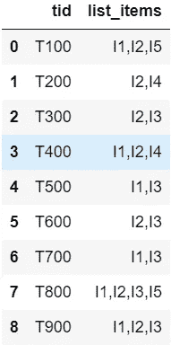
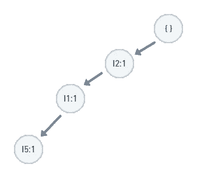
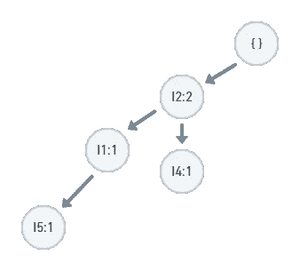
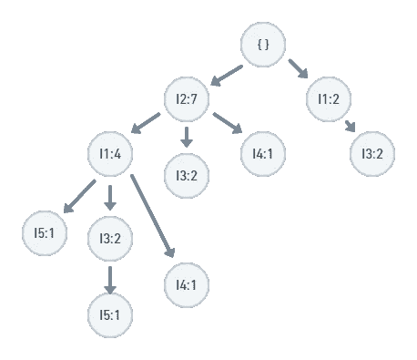
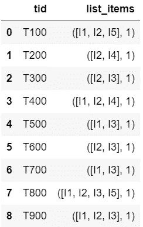
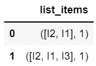
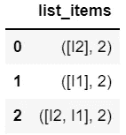

# 频繁模式增长方法(FP-Growth)的最简单解释

> 原文：<https://towardsdatascience.com/the-simplest-explanation-to-frequent-pattern-growth-methodology-fp-growth-8e03f8b0e3a7?source=collection_archive---------20----------------------->

## 使用流行的 FP-Growth 算法理解和实现对频繁模式的深度优先搜索

在 [Unsplash](https://unsplash.com/s/photos/supermarket?utm_source=unsplash&utm_medium=referral&utm_content=creditCopyText) 上由 [Mehrad Vosoughi](https://unsplash.com/@mehrad_vosoughi?utm_source=unsplash&utm_medium=referral&utm_content=creditCopyText) 拍摄的照片

频繁模式挖掘是指在事务性数据中寻找共现模式的过程。最突出的应用之一是市场篮分析。零售商找到顾客经常一起购买的物品，以进行有针对性的促销、广告宣传，并在他们的商店中实际摆放这些物品。然而，在聚类、生成建议和发现数据特征方面还有广泛的其他应用。

在本文中，我们假设您对频繁模式有一个基本的了解，并探索一种叫做模式增长的分而治之的方法，并特别关注于理解和实现 FP 增长算法。

# **为什么叫模式增长？**

我们必须理解分治策略在这里是如何工作的，在这一过程中，我们首先要解决几个重要的概念。我们将使用下面的事务数据库。I 是项目，T 是交易。

图 1:事务数据库

**项目排序**

事务中的项目按支持计数的降序排序。要对 T100 中的项目进行排序，请计算 I1、I2 和 I5 的支持计数，分别为 6、7 和 2。按项目排序的 T100 将是{I2，I1，I5}。
这可能是模式增长方法中最重要但最不受重视的步骤。它确保频繁模式是按排序的顺序构建的。这是下一个叫做前缀的概念的先决条件。

**模式前缀**

项目排序模式的前缀是模式中除最后一个项目之外的所有项目。在模式{I1，I2，I3}中，*前缀*是{I1，I2}。I3 被称为*后缀*。如果{I1，I2，I3}是一个频繁模式，那么它的前缀{I1，I2}也一定是频繁的。模式是通过确保前缀总是频繁出现(记住这一点)而形成的。

**FP 树**

称为 FP 树的树是通过一次处理一个事务来构建的。排序后的第一个事务{I1，I2，I5}变成了{I2，I1，I5}。为了将这个事务插入到 FP 树中，我们从根节点开始，并添加计数为 1 的新节点。

图 2:添加事务 T100 后的 FP 树

事务{I2，I4}接下来被插入同一树中。父根下已经存在节点 I2，所以我们没有创建新节点，而是遍历同一个节点，将它的计数增加 1，并添加 I4 作为新的子节点。如果一个事务没有它的第一个节点作为根的子节点，我们创建一个新节点。

图 3:添加交易 T200 后的 FP 树

我们这样继续下去，直到扫描完整个模式库。最后我们得到了一棵像这样的树。

图 4:在整个事务数据库上生成的 FP 树

**节点链接**

这是一个散列表，存储了一个项目的 FP 树中所有节点的引用列表。

**有条件模式基地(CPB)**

这是与特定前缀相关的事务数据库的截断版本。它是从 FP 树创建的，我们不必再次扫描数据库。它被传递给下一个函数调用。我们将在下面的实现中处理这个概念。

# **实现**

**接近**

我们构建了一个 3 步递归函数 *fp_growth* ，它需要 4 个参数。
1。 *transaction_db:* 这是当前的模式库。在算法开始时，这将是整个事务数据库。
2。 *min_sup:* 最小支持阈值
3。 *fp_list:* 收集发现的频繁模式的列表。
4。*前缀:*当前前缀中的项目列表。一开始，这是空的。

每个函数调用都会创建两个工件——一个 FP 树和一个称为“条件模式库”的新模式库。如果条件模式库包含事务，那么我们递归。在对 fp_growth 的递归调用中，我们传递更新的模式基和一个扩展的前缀。在我们学习 A、B 和 c 部分时，我们将建立这个函数。

代码片段 1:主函数的框架

**交易的元组结构**

我们将修改图 1 中*的数据帧，以创建如图 2* 中*所示的新数据帧，其中每个事务是一个元组，其第一个元素是项目列表，第二个元素是该事务在数据库中发生的次数。最初，我们假设每个事务发生一次(即使有重复)。*

图 5:事务的元组结构

**树形数据结构**

我们用 Python 构建了一个简单的树结构，其中树中的每个节点只知道它的名字和它的父节点。Parent 是对父节点的引用。(记住，引用是指向对象位置的指针，Python 在函数中通过引用传递对象。)

树中的一个节点具有这些属性。
*名称:*项的字符串名称，如“I1”
*父项:*对树中父项的引用
*计数:*该节点作为前缀在事务中出现的次数

现在，让我们来看一下 FP-Growth 的 3 个步骤，这是一个真正的分治算法。

**串联步骤(步骤 A)**

在这一步中，我们执行两个功能。

1.  在当前模式库中生成频繁 1-项集。这些基本上是在当前模式库中出现在超过 *min_sup* 个交易中的个别项目。
2.  对于第 1 部分中的每个项目，通过将当前前缀与 item 连接起来生成一个新的频繁项目集。如果您想知道新项目集是如何频繁的，那是因为您的前缀和 1-项目集都是频繁的。

代码片段 2:从模式库中获取频繁 1-项集的函数

代码片段 3:步骤 A

**生成 FP-Tree 的步骤(步骤 B)**

FP 树从根节点开始在当前模式基础上递归生成。先决条件是所有事务的项集必须按照支持计数的降序排序。这只需要做一次，那就是在根节点。

代码片段 4:对事务项集进行排序的函数

代码片段 5:检查树是否包含同名的父节点的函数

使用模式的前缀和后缀，一次使用一个事务来构建树。

让我们用图 2 来理解这一点。

*   为了将事务{I2，I1，I5}添加到树中，我们调用 *insert_tree* ，前缀为 I2，后缀为{I1，I5}。
*   *insert_tree* 函数将添加或更新前缀节点，并以 I1 为前缀和{I5}为后缀调用自身。
*   该函数现在添加 I2，并用前缀 I5 和一个空后缀{}调用自己。
*   将 I5 添加到树中后，函数停止，因为没有后缀可以继续。
*   现在，选择下一个交易并重复相同的过程，直到扫描完所有交易。

代码片段 6:递归构造 FP 树的函数

接下来，让我们将步骤 B 集成到主函数中。

代码片段 7:步骤 B

**生成条件模式库(步骤 C)**

对于每个 1-项集，我们遍历它的节点链接，并且对于每个链接，我们收集从链接节点到根节点的路径。该路径成为模式库数据库中的一个事务。节点链接的*计数*成为该事务在条件模式库中发生的次数。

理想情况下，我们会多次重复这个事务。但是这将违背拥有一个精简的数据库的目的，因此，相反，我们更新该事务的事务计数(还记得事务的元组结构中的第二个元素吗？).

参考图 4 中的 FP 树，从 1-项集 I5，我们在新的条件模式库中得到的事务是:

1.  计数= 1 的{I2，I1}
2.  计数= 1 的{I2，I1，I3}

图 5:I5 的条件模式库

从 1-项集 I3，我们在新的条件模式库中得到的事务是:

1.  计数= 2 的{I2，I1}
2.  计数= 2 的{I2}
3.  计数= 2 的{I1}

图 6:I3 的条件模式库

最后，我们将最后一步添加到我们的函数中。

对于每个 1-itemset，如果条件模式基包含事务，我们对其调用相同的函数。这一次，1-项集被追加到前缀。

**最终想法**

我希望现在，你已经感受到为什么这种方法被称为“模式增长”。这是因为我们正在从更小的子模式中发展更大的频繁模式。随着我们向更大的模式发展，我们扫描的数据库越来越小。