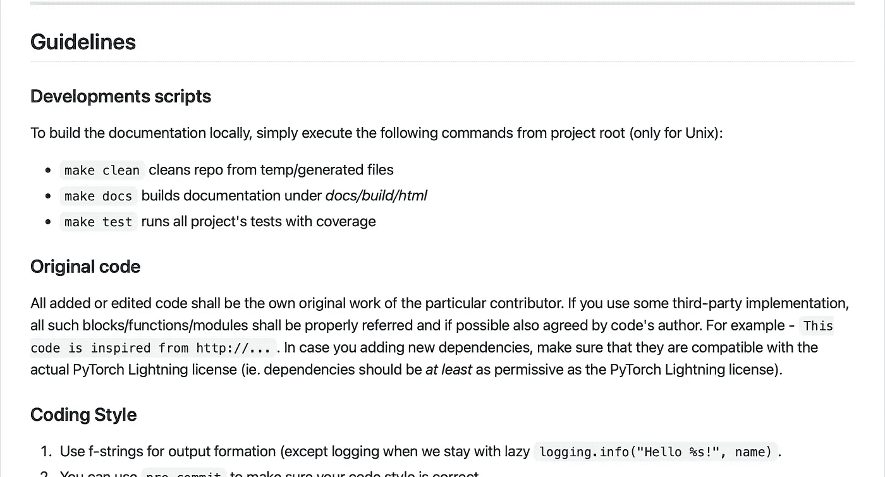
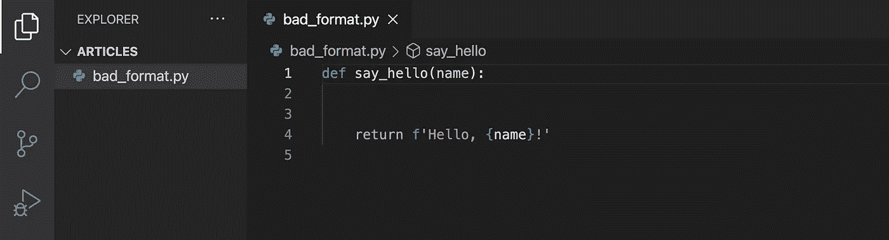
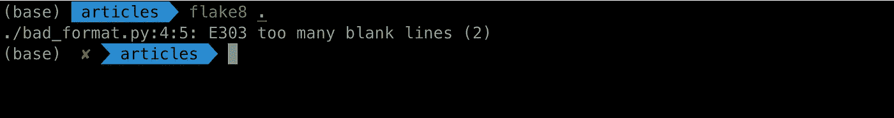
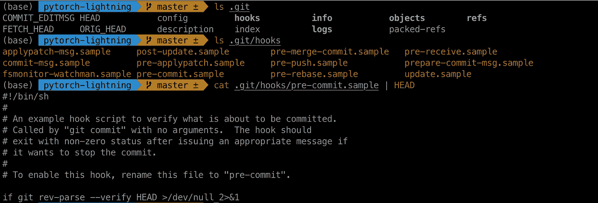
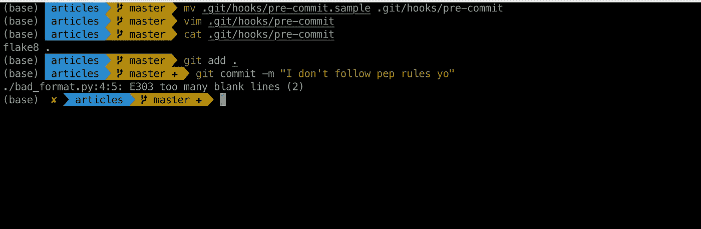
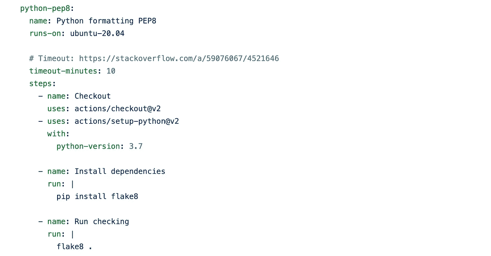
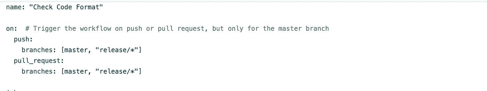
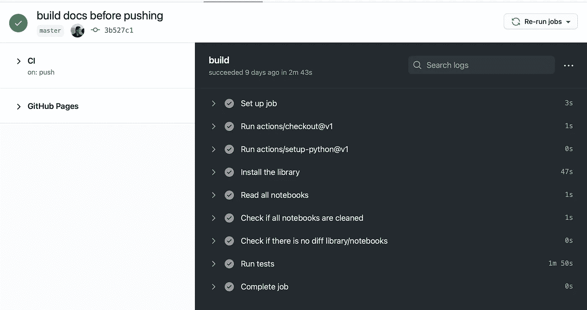

# GitHub 动作的最简单介绍

> 原文：<https://towardsdatascience.com/the-simplest-introduction-github-actions-43e86b05317?source=collection_archive---------29----------------------->

## …以及为什么您应该在未来的每个项目中使用它们


照片由 [Unsplash](https://unsplash.com/s/photos/action?utm_source=unsplash&utm_medium=referral&utm_content=creditCopyText) 上的[塞浦路斯·德拉波特](https://unsplash.com/@cypriendlp?utm_source=unsplash&utm_medium=referral&utm_content=creditCopyText)拍摄

# 介绍

你讨厌 PyTorch。不，别说了。你喜欢 PyTorch，但是，你讨厌它没有任何结构。你讨厌一遍又一遍地编写相同的训练循环，自己把东西放到 GPU 上，手动实现混合精度训练之类的最佳实践。

在所有的麻烦之后，即使你设法让一个项目的所有东西都工作了，你也不容易在下一个项目中复制它。

您希望 PyTorch 有一些抽象来帮助解决这些问题，不是很多，只是很薄的一层。这些抽象可以让你更专注于你的研究，而不是解决“张量形状不匹配”的错误。

你喜欢这个主意。你已经将人工智能投入生产很多年了，所以你知道怎么做，现在你进入了研究领域，你也知道研究社区需要什么。你要把快速迭代的创业心态融入到研究中。

你决定自己设计。一个分离工程和科学的包装器，让你的 PyTorch 代码快速运行。快如闪电。

你称之为 py torch-闪电。

起初，你只是把它作为你在 NYU 项目的模板。但是最后你花了一半的博士学位在它上面，它在脸书被采用，成为这个巨大的开源项目。

## 中断

我用了 [PyTorch 闪电队](https://medium.com/u/c2042c47910?source=post_page-----43e86b05317--------------------------------)的故事来戏剧性地介绍这篇文章。过了这一点，一切都是虚构的，纯粹是为了解释。

## 中场休息结束

但是最后你花了一半的博士学位在它上面，它在脸书被采用，成为这个巨大的开源项目。来自世界各地的贡献者开始提交针对他们个人痛点的 PRs。

审查这些 PRs 将会很困难。不是从实现的角度，不，你喜欢那部分。然而，要有效地做到这一点，您需要代码格式良好。你需要它符合 [PEP8 规则](https://www.python.org/dev/peps/pep-0008/)。

只有这样，您才能专注于代码逻辑，而不是对“第 32 行末尾的空格”吹毛求疵

## 该过程

您首先创建一个 CONTRIBUTING.md，其中详细列出了投稿指南。



来源:[https://github . com/PyTorchLightning/pytorch-lightning/blob/master/。github/CONTRIBUTING.md](https://github.com/PyTorchLightning/pytorch-lightning/blob/master/.github/CONTRIBUTING.md)

在本文中，我们将只深入一个指南，**使用 flake8 来确保我们的代码符合 PEP8 规则。**

有许多方法可以将 flake8 合并到项目中。

## 人工检查

当您开始使用 flake8 时，您刚刚在本地安装了它，如下所示:

```
pip install flake8
```

然后你只需要做`flake8 filename.py`或`flake8 .`来运行当前目录下的所有文件。

让我们用一个例子来测试一下。假设我们写了一个有很多空行的函数。



作者图片

如果我们用 flake8 检查这个文件…



作者图片

…它会抱怨。这有助于你识别和纠正这些错误。

> 注意:您可以编辑 flake8 配置文件来修改规则，或者告诉 flake8 忽略某些类型的错误。

你想让所有的公关都受到检查。然而，你知道不是所有的贡献者在提交 PR 之前都会在本地运行它。您需要一种方法来自动化这个过程。

## 使用测试模块

贡献者在提交 PR 之前要检查的一件事是是否所有的测试用例都通过了。Python 中最常见的测试库是 **pytest** 。您可以为 pytest 安装 [flake8 插件](https://pypi.org/project/pytest-flake8/)

```
pip install pytest-flake8
```

然后当你运行你的测试时，你可以用 flake8 选项来检查每一个 python 文件。

```
pytest --flake8
```

这比我们的第一个解决方案稍微好一点，但是仍然没有实施。

## 使用 [Git 挂钩](https://git-scm.com/book/en/v2/Customizing-Git-Git-Hooks)

如果您在 Git 跟踪的存储库中查看`.git`文件夹，那么您会看到一个名为 **hooks** 的文件夹。如果你打开那个文件夹，你会看到一堆钩子样本。



作者图片

这些是钩子将被调用的事件。在我们的例子中，如果我们在`pre-commit`钩子中使用 flake8，那么它将在提交之前运行 flake8，如果检查失败，提交将被中止。

为此，首先将`pre-commit.sample`重命名为`pre-commit`。然后编辑它以包含`flake8 .`命令。最后，尝试提交您的文件。



作者图片

这样，我们可以确保检查它提交的每个文件。

## 使用 [GitHub 动作](https://github.com/features/actions)

我们可以使用 GitHub 动作做和上面一样的事情。我们有一个`.github`文件夹，而不是`.git`。我们没有使用`pre-commit`钩子，而是使用了`yml`锉刀。看看下面的代码。



来源:[https://github . com/PyTorchLightning/pytorch-lightning/blob/master/。github/workflows/code-formatting . yml](https://github.com/PyTorchLightning/pytorch-lightning/blob/master/.github/workflows/code-formatting.yml)

就算你不懂，凭直觉你也能搞清楚我们是运行在 **ubuntu** 上。我们**检查**分支并设置 **Python 3.7** 。我们**安装** flake8，最后**检查我们所有的文件**。

每当我们推送或请求拉取时，都会这样做。



来源:[https://github . com/PyTorchLightning/pytorch-lightning/blob/master/。github/workflows/code-formatting . yml](https://github.com/PyTorchLightning/pytorch-lightning/blob/master/.github/workflows/code-formatting.yml)

## 为什么 [GitHub 动作](https://github.com/features/actions)准确？

现在你可能会想，“但是 Dipam，从这个例子来看，GitHub Actions 并没有提供比其他方法更多的优势。”

这只是一件事，而且是非常简单的一件事。你还有无数其他的事情想要确保。

*   您想要用当前的 requirements.txt 来验证您的包构建。
*   您想要确保您所有的测试用例都通过。很容易在做某件事情的时候却不小心弄坏了其他的东西。
*   您希望确保您的代码可以在不同的平台(Linux、Windows、Mac)上运行。我不知道以前是怎么做到的，但我猜这并不容易。
*   您希望在不同版本的 Python (3.6 以上)上测试它。同样，您必须为此创建单独的 conda 环境。
*   确保 PR 不会过多地降低代码覆盖率。
*   确保 PR 不会破坏文档(您正在使用 sphinx 和 RTD 自动生成文档)。
*   [代码可以在 CPU、GPU、多节点和 TPU 上运行。](https://devblog.pytorchlightning.ai/how-to-choose-a-ci-framework-for-deep-learning-d24ee9ef902c)
*   还有更多..

那只是 Python。还有前端，云服务，Docker，这么多组件交互在一起，需要检查。

你不能为所有这些设计钩子或者测试用例或者其他解决方法。而且你不能轻易地在每个项目中复制它。

这就是为什么 [GitHub 动作](https://github.com/features/actions)如此强大的原因。它们为您提供了一种方式，将所有这些任务集中到在某些**事件**上运行的**工作流**，执行某些**检查**，并为您提供这些检查的**详细报告。**

现在贡献者可以继续编辑他们的 PRs，直到他们在所有的测试中都得到绿色的勾号。在此之前，这些将被视为 PRs 草案。只有当一切正常时，维护人员才会看一眼。



来源:[https://github.com/deep-word/dword/runs/2495535846](https://github.com/deep-word/dword/runs/2495535846)

我发现学习 GitHub 动作的最好方法是:

*   如果可以的话，在项目中使用它们。只有自己去尝试，才会真正学会。
*   看其他回购的 yml 文件借鉴思路。

## 给初学者/学生的提示:

在从事大学项目时，很容易忽略行业实践，一次提交所有内容，不使用 GitHub Actions 或 Weights and Biases 或 Docker 之类的工具，因为它们很麻烦，目前没有提供太多价值。

我的建议？使用它们。不要把它当成另一个项目。把它当作你正在交付的产品。不仅要花时间训练最准确的模型，还要学习如何构建 CI/CD 管道，将其部署在云上并处理流量。

~快乐学习

## 进一步学习:

*   等我下一篇博文:p
*   [https://docs.github.com/en/actions](https://docs.github.com/en/actions)
*   [https://github . com/sdras/awesome-actions # machine-learning-ops](https://github.com/sdras/awesome-actions#machine-learning-ops)
*   [https://fast pages . fast . ai/actions/markdown/2020/03/06/fast pages-actions . html # a-gentle-introduction-to-github-actions](https://fastpages.fast.ai/actions/markdown/2020/03/06/fastpages-actions.html#a-gentle-introduction-to-github-actions)

## PyTorch 故事参考:

*   [https://youtu.be/LlXCUAVnn0Y](https://youtu.be/LlXCUAVnn0Y)

## 参考资料:

*   [https://flake8.pycqa.org/en/latest/](https://flake8.pycqa.org/en/latest/)
*   [https://pypi.org/project/pytest-flake8/](https://pypi.org/project/pytest-flake8/)
*   [https://git-scm.com/book/en/v2/Customizing-Git-Git-Hooks](https://git-scm.com/book/en/v2/Customizing-Git-Git-Hooks)
*   [https://ljvmiranda 921 . github . io/notebook/2018/06/21/pre commits-using-black-and-flake 8/](https://ljvmiranda921.github.io/notebook/2018/06/21/precommits-using-black-and-flake8/)