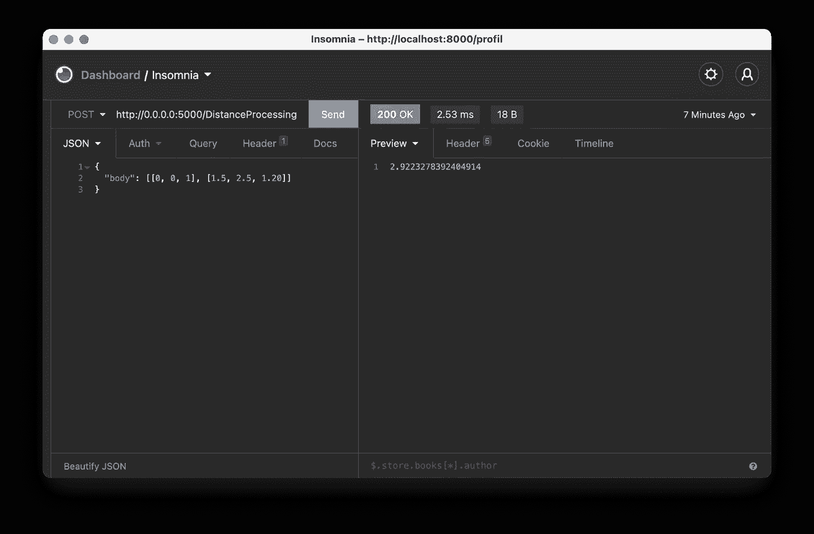

# 用 Falcon 和 Python 3.10 构建 REST API 最简单的方法:在空间几何中的应用

> 原文：<https://towardsdatascience.com/the-simplest-way-to-build-a-rest-api-with-falcon-and-python-3-10-application-in-spatial-geometry-c1ee305aed75?source=collection_archive---------22----------------------->

## [实践教程](https://towardsdatascience.com/tagged/hands-on-tutorials)

## 通过对机器人学的应用理解 Python 3 中的数据操作和编程接口:计算带有猎鹰、Gunicorn 和失眠的三维系统中两点之间的欧几里德距离。


由[泰勒维克](https://unsplash.com/@tvick?utm_source=medium&utm_medium=referral)在 [Unsplash](https://unsplash.com?utm_source=medium&utm_medium=referral) 上拍摄的照片

在远程服务器上用 Python 部署 REST API 可能是制作功能性应用程序的一个困难步骤。本文的目的是提出一个极其简化的 Falcon 模块配置代码，特别是对于希望使用远程计算工具的 web 编程初学者。尽管您对 Python 3 有基本的了解，但在 10 分钟内，您的第一台服务器就可以运行了。为了让这篇文章更有吸引力，让我们来看一个真实的问题，在空间中定位并计算三维参照系中两点之间的距离。在建模或机器人项目的环境中很有用，下面的程序将允许在远程机器上应用数学定理后，接收 JSON 请求，并以相同的格式发送响应，该机器配备有 Python 3.10 环境和更新的库。

**建议**

与 Python 3.10 的兼容性测试，在 MacOS 11.5.1 和 Linux Ubuntu Server 20.04 LTS 环境下执行。

使用的库:Falcon，Gunicorn，Math，Json。

```
pip3 install falcon gunicorn
```

源代码将首先观察其执行所必需的库的存在，然后在不存在的情况下下载它们，以便自动更新执行环境的软件配置。

为了使程序在最少人工干预的情况下可执行，并优化其在服务器上的部署，已经实现了升级、数据下载和异常处理的自治，特别是在 server_SMTP 类中。

首先，有必要在系统未使用的监听端口上初始化我们的 Gunicorn 服务器，在我们的例子中，端口 5000 似乎是一个完美的候选端口，应该不会造成任何不便。为此，请在终端窗口中输入以下命令:

```
gunicorn -b 0.0.0:5000 main — reload
```

> 注:为执行 Gunicorn，将文件命名为 main.py 是很重要的，不同的名称将导致异常，并且将无法到达服务器启动。

然后，您必须在 main.py 文件中配置应用程序，使用一组指向 Falcon 库的变量。

```
api = app = application = falcon.API()
```

从这一点开始，您依赖于 Falcon 的语法，特别是在处理。有关猎鹰的更多信息，请访问图书馆网站([https://Falcon . readthedocs . io](https://falcon.readthedocs.io/en/stable/))。例如，要解释 JSON 格式的请求，必须使用“stream”类:

```
request = json.loads(req.stream.read())
```

为了测试我们的服务器的响应和程序的正确执行，我们将使用一个开源 API 客户端失眠症。

[](https://insomnia.rest) [## API 设计平台和 API 客户端

### 如果你还在用 postman 进行手动 REST/GraphQL API 测试，我可以强烈推荐改用@GetInsomnia…

失眠。休息](https://insomnia.rest) 

软件启动后，在左侧窗格的下拉菜单中将方法设置为“POST ”,然后插入服务器的目标 URL。在我们的案例中:

```
[http://0.0.0.0:5000/DistanceProcessing](http://0.0.0.0:5000/DistanceProcessing)
```

最后一步是制定我们的 JSON 查询。对于我们的例子，我们将在“body”中发送一个列表列表，包含一个三维框架中的两个点的坐标。同时:【B 点 x 位置，B 点 y 位置，B 点 z 位置】和【A 点 x 位置，A 点 y 位置，A 点 z 位置】。

```
{
 “body”: [[0, 0, 1], [1.5, 2.5, 1.20]]
}
```



关于失眠的 JSON 请求和响应的编写示例。

让我们考虑机器人学中的一个应用，其中物体在空间中的定位可能是一个基本功能。如果我们允许要定位的物体具有接近三维参考系的坐标，则要应用的公式保持简单:


在编程层面上，可以编写一个简单的函数，允许应用上述公式:

对于 POST 方法返回的响应，我们将使用标准状态 200 和 Json 库的“dumps”函数。

> API 的构造可用于许多应用程序，您现在已经了解了其开发的基础，这一介绍允许您构建您的第一个架构，尤其是在创建专用于机器学习或远程计算的编程接口方面。

Louis Brulé Naudet 拥有巴黎萨克莱大学的法律和经济学/管理学双学位。

[](https://louisbrulenaudet.com) [## 路易·布鲁莱·诺代

### Clover 和 Lemone 共同基金会，商务和财政法专业，程序设计界面概念…

louisbrulenaudet.com](https://louisbrulenaudet.com)