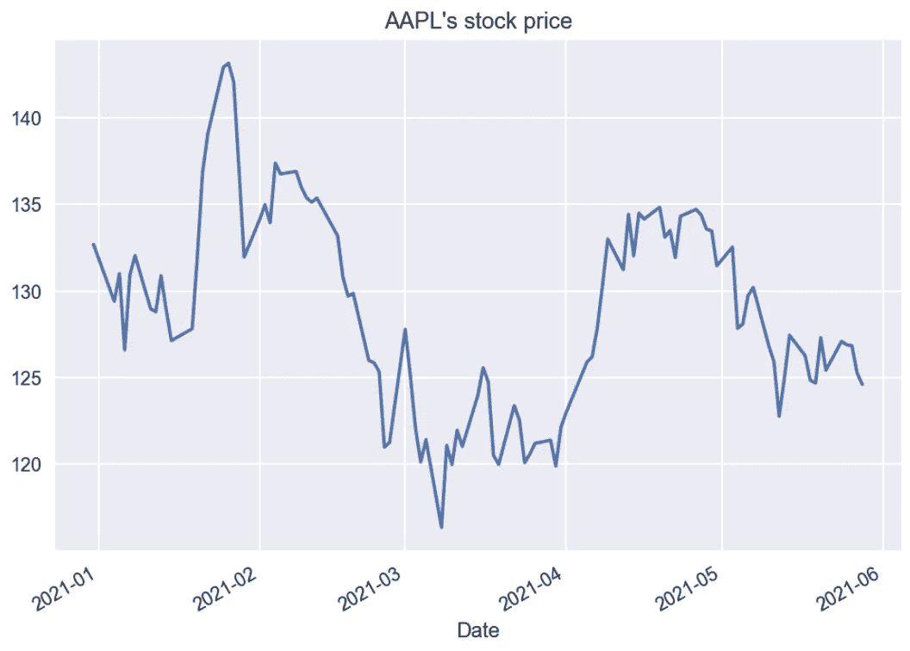
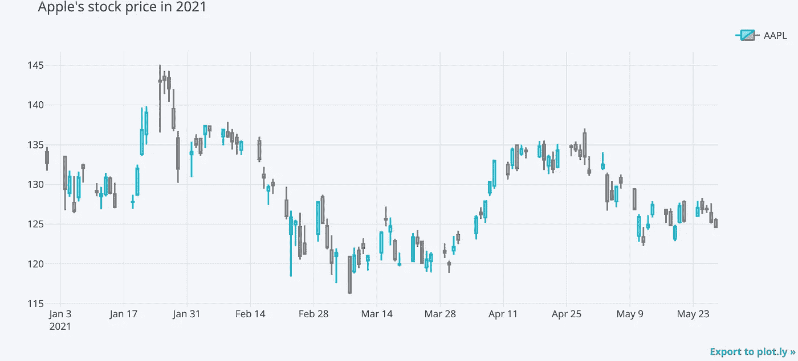
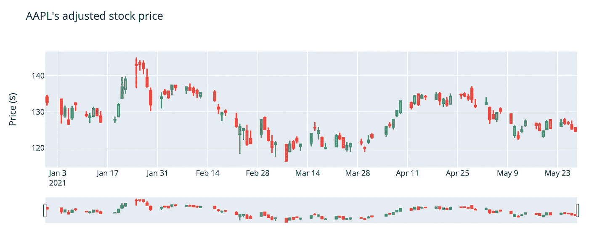
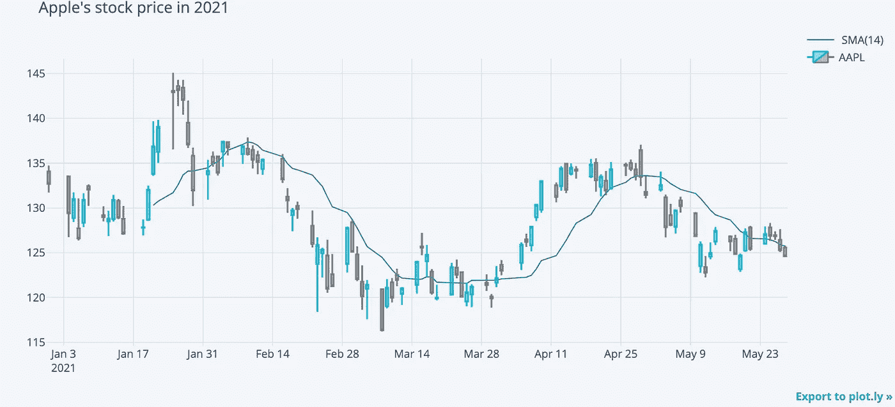
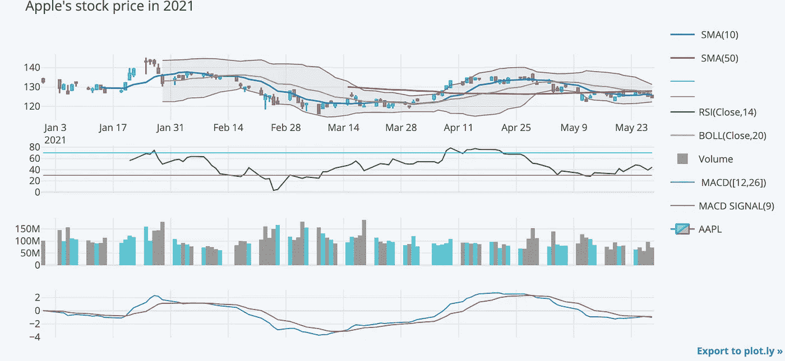

# 用 Python 创建交互式烛台图表的最简单方法

> 原文：<https://towardsdatascience.com/the-simplest-way-to-create-an-interactive-candlestick-chart-in-python-ee9c1cde50d8?source=collection_archive---------2----------------------->

马克西姆·霍普曼在 [Unsplash](https://unsplash.com/s/photos/trading?utm_source=unsplash&utm_medium=referral&utm_content=creditCopyText) 上的照片

## 仅用一行代码

简而言之，[烛台图表](https://en.wikipedia.org/wiki/Candlestick_chart)是一种金融图表，用于描述某些资产(股票、密码等)的价格变动。).与收盘价的简单折线图相比，它提供了更多关于价格动态的信息-它基于 OHLC 数据，这意味着它包含开盘价、最高价、最低价和收盘价(通常与成交量一起)。这些值可以以不同的采样频率(分钟、小时、天、周等)显示。)并经常被用作技术分析的基础。

在不深入识别烛台模式的情况下，我将向您展示如何用 Python 轻松创建交互式烛台图表。

# 烛台图表使用`cufflinks`

创建蜡烛图最简单的方法是使用一个名为`cufflinks`的库。这是一个在`plotly`顶部创建的包装器，提供了广泛的不同地块，烛台只是其中之一。这些图表绝不仅限于金融数据。

和往常一样，第一步是导入库。

然后，我们需要设置一些设置来使用`plotly`的离线模式，并显示笔记本中的数字:

我们还需要 OHLC 的实际数据。我们可以使用`yfinance`轻松抓取它(更多细节[在这里](/a-comprehensive-guide-to-downloading-stock-prices-in-python-2cd93ff821d4))。对于这个特殊的例子，我们下载 2021 年苹果股票的价格。

以及收盘价的快速可视化:

作者图片

这张图并没有说明股票价格随时间变化的情况。然而，我们可以做得更好，从价格中获得更好的洞察力。这就是我们使用`cufflinks`继续生成烛台图表的原因。

作者图片

就这么简单。请记住，为了方便起见，所有的图表都是静态图像，但它们在笔记本中是完全交互式的。此外，您可以将代码写成一行程序，正如本文的副标题所承诺的那样。然而，这种形式是更可取的，你很快就会明白为什么。

在这一点上，我几乎可以听到你说:“当你可以在`plotly`中创建相同的图表时，你为什么要使用包装库呢？尤其是在图书馆没有积极维护的情况下。”的确，`cufflinks`没有被主动维护(至少通过查看对[回购](https://github.com/santosjorge/cufflinks)的最新提交)。为了证明我的观点，我将向你展示什么是`cufflinks`的明显优势。但是首先，我将在`plotly`中处理关于创建类似图表的部分。最简单的一个可以用下面的代码片段创建，在我看来，它没有用`cufflinks`创建的好。

作者图片

总的来说，在`plotly`创造剧情并不比在`cufflinks`难多少。但现在我会给你看后者在对比中脱颖而出的原因。想象一下你想给情节添加更多信息的情况。因此，除了烛台，你还想有一定的技术指标，如简单的移动平均线。您可以通过一行额外的代码轻松地将它添加到`cufflinks`中:

作者图片

有了这一行，我们就增加了一条基于收盘价计算的 14 天移动平均线。我们可以很容易地进一步发展。

作者图片

好吧，这可能有点过了。关键是在我们的图表中添加技术指标是多么容易。通过几条额外的线，我们添加了两条移动平均线(10 天和 50 天)，相对强弱指数(RSI)，布林线，移动平均线收敛/发散(MACD)，和成交量。更好的是，`cufflinks`至少提供了一些更受欢迎的指标，您可以直接从[代码库](https://github.com/santosjorge/cufflinks/blob/master/cufflinks/quant_figure.py)中了解更多(不幸的是没有文档，尽管您可以从详尽的目录中了解很多)。

# 外卖食品

*   `cufflinks`是一个基于`plotly`的包装器库，它提供了大量开箱即用的高质量可视化。
*   其中之一是烛台图表，你可以很容易地添加各种技术指标。
*   `cufflinks`似乎没有被积极开发，所以将来会有一些兼容性问题的风险

您可以在我的 [GitHub](https://github.com/erykml/medium_articles/blob/master/Quantitative%20Finance/candlestick_chart.ipynb) 上找到本文使用的代码。此外，欢迎任何建设性的反馈。你可以在[推特](https://twitter.com/erykml1?source=post_page---------------------------)或评论中联系我。

*免责声明:前方加盟商链接*

如果你有兴趣发展你的 Python 技能，并专注于定量金融，你可能想看看一个叫 Quantra 的平台。我写了一篇短文，展示了这个平台的一些特性，并描述了我个人的使用体验。

如果您喜欢这篇文章，您可能还会对以下内容感兴趣:

 [## 有助于时间序列分析的 5 种绘图类型

### 以及如何使用 Python 快速创建它们！

towardsdatascience.com](/5-types-of-plots-that-will-help-you-with-time-series-analysis-b63747818705)  [## 如何用 Python 下载上市公司的收益日历

### 用几行代码了解公司的最新收益

towardsdatascience.com](/how-to-download-the-public-companies-earnings-calendar-with-python-9241dd3d15d)  [## 介绍我的书:Python 金融烹饪书

### 我的短篇小说从中型文章到图书合同

towardsdatascience.com](/introducing-my-book-python-for-finance-cookbook-de219ca0d612)