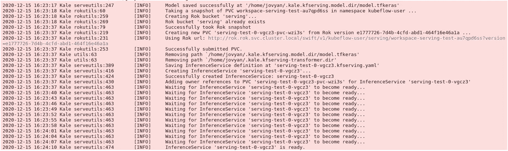
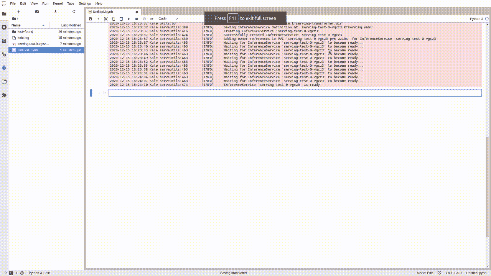

# 在 Kubernetes 上提供 ML 模型的最简单方法

> 原文：<https://towardsdatascience.com/the-simplest-way-to-serve-your-ml-models-on-kubernetes-5323a380bf9f?source=collection_archive---------17----------------------->

## 从 Jupyter 笔记本到生产就绪的机器学习 API，只需一行代码

图片来自 [Pixabay](https://pixabay.com/?utm_source=link-attribution&utm_medium=referral&utm_campaign=image&utm_content=1283608) 的[像素](https://pixabay.com/users/pexels-2286921/?utm_source=link-attribution&utm_medium=referral&utm_campaign=image&utm_content=1283608)

拥有一个训练有素的模型作为可扩展的 API 是每个机器学习项目的最终目标。有人可能会说，监控是后来的事，但当你准备好终点时，香槟就会流出来。

> 在这个故事中，我们使用 Kale，Kubeflow 为数据科学家提供的超级食物，来部署一个 ML 模型；它只需要一行代码！

**如今，由数据科学家训练出来的模型中，超过一半从未投入生产。**有时，挑战是组织性的，但大多数时候，技术障碍似乎是不可逾越的。无论哪种方式，**一款未投产的车型都无法提供业务影响。**

**那么，数据科学家如何控制从笔记本电脑到服务的整个流程，而不需要依赖大量的 ML 工程师和基础架构架构师呢？**

这个故事演示了我们如何将机器学习模型部署为可扩展的 API，将编排部分留给了 Kubernetes，将繁重的工作留给了 KFServing。为此，**我们用** [**羽衣甘蓝**](https://github.com/kubeflow-kale/kale)**[**kube flow**](https://www.kubeflow.org/)**为数据科学家提供超级食物；它只需要一行代码！****

> **[学习率](https://www.dimpo.me/newsletter?utm_source=article&utm_medium=medium&utm_campaign=kale_serving&utm_term=kale_kubeflow_serving)是为那些对 AI 和 MLOps 的世界感到好奇的人准备的时事通讯。你会在每周五收到我关于最新人工智能新闻和文章的更新和想法。在这里订阅！**

# **从笔记本到上菜**

**让我们开始吧。在这个故事中，我将首先向你展示你能用羽衣甘蓝和 KFServing 做什么，然后告诉你怎么做。**

**因此，按照这种自上而下的方法，让我们假设您已经在著名的时尚 MNIST 数据集上拟合了一个简单的 Keras 模型。下面的代码使用了一个简单的三层神经网络，在这个问题上达到了 80%的准确率。当然，我们可以做得更好，但这不是本文的重点。**

**准备好模型后，您所要做的就是将它作为一个可伸缩的 API，导入必要的函数并添加以下代码行:**

**Kale 会自动识别您正在尝试为 TensorFlow 模型提供服务，它会创建相应的推理服务。几秒钟后，您将有一个端点准备好响应您的请求。**

****

***推理服务*准备好了——图片由作者提供**

**我知道 MNIST 的例子和它的各种变种被认为是一个已经解决的无聊问题。但是这个过程不需要修改任何`tf.keras`模型的一行代码就可以工作。此外，Kale 还支持 Scikit Learn 和 XGBoost 模型，对 PyTorch 的支持即将推出。**

**最后但同样重要的是，如果您打印我们创建的`kfserving`对象，Kale 将为您提供一个链接。通过该链接，您将进入模型的用户界面，在这里您可以查看模型服务器的性能，检查您的部署的详细信息，并直接从您的 pod 观看日志流。**

****

**监控您的模型服务器—按作者分类的图像**

# **但是怎么做呢？**

**为了实现这个令人印象深刻的结果，我们使用 Kubeflow，这是一个开源项目，致力于使 ML 项目的部署更加简单、可移植和可伸缩。来自[文档](https://www.kubeflow.org/):**

> **Kubeflow 项目致力于使在 Kubernetes 上部署机器学习(ML)工作流变得简单、可移植和可扩展。我们的目标不是重新创建其他服务，而是提供一种简单的方法来将 ML 的最佳开源系统部署到不同的基础设施上。无论你在哪里运行 Kubernetes，你都应该能够运行 Kubeflow。**

**但是我们如何开始呢？我们需要 Kubernetes 集群吗？我们应该自己部署整个系统吗？我的意思是，你看过库伯弗洛的清单回购吗？**

**不要慌；最后，在 Kubeflow 上运行一个笔记本，我们需要的只是一个 GCP 或 AWS 账户和你的旧的`ipynb`笔记本文件！我们将使用 MiniKF。MiniKF 是一个单节点 Kubeflow 实例，预装了许多优秀的特性。具体来说:**

*   **[**Kale**](https://github.com/kubeflow-kale/kale)**:**kube flow 的编排和工作流工具，使您能够从笔记本电脑开始运行完整的数据科学工作流**
*   **[**Arrikto Rok**](https://www.arrikto.com/rok-data-management)**:**一个数据版本化系统，支持可再现性、缓存、模型血统等等。**

**因此，要在 GCP 上安装 Kubeflow，请遵循我在下面提供的指南:**

** [## 有了 MiniKF，Kubeflow 比以往任何时候都更容易访问

### 10 分钟入门 Kubernetes 最好的机器学习平台。

towardsdatascience.com](/kubeflow-is-more-accessible-than-ever-with-minikf-33484d9cb26b) 

或者，如果您喜欢 AWS:

 [## AWS 上的 Mini Kubeflow 是您的新 ML 工作站

### 通过 AWS 上的 MiniKF 加速您的机器学习模型开发

towardsdatascience.com](/mini-kubeflow-on-aws-is-your-new-ml-workstation-eb4036339585) 

# 更深入

如果你想了解更多关于羽衣甘蓝、Rok 和 Kubeflow 的知识，羽衣甘蓝回购[示例](https://github.com/kubeflow-kale/kale/tree/master/examples)是一个很好的起点。您也可以关注由您的真实媒体发布的教程:

*   [将 Kubeflow 变成您的 ML 工作站](/kubeflow-is-your-perfect-machine-learning-workstation-91c5d26d4790)
*   [从 Jupyter 到 Kubeflow 管道，点击一下](/jupyter-is-ready-for-production-as-is-b36f1d1ca8f8)
*   [如何使用时间旅行调试你的 ML 模型](/how-to-use-time-travel-to-debug-your-ml-pipelines-efb5263372c0)
*   [如何使用 KATIB 优化你的模型](/hyperparameter-tuning-should-not-be-part-of-your-ml-code-44c49e80adb6)
*   [如何对你的 ML 项目进行版本控制](/the-way-you-version-control-your-ml-projects-is-wrong-42910cba9bd9)

最后，当你准备好了，就可以进入 Arrikto 团队提供的 [codelab](http://codelabs.arrikto.com/codelabs/minikf-kale-katib-kfserving/index.html?index=..%2F..index#0) 来实现从笔记本到端到端服务的 ML 管道，或者观看最新的 KubeCon 教程:

# 结论

这个故事展示了使用 MiniKF、Kale 和 KFServing，只需一行代码就能为机器学习模型提供服务是多么容易。真的没有比这更好的了！

我们研究了*什么*和*如何*，并看到了我们使用 MiniKF 部署 Kubeflow 环境进行实验的步骤。现在，轮到您使用 MiniKF、Kale 和 KFServing 来训练和部署 ML 模型了！

> [Learning Rate](https://www.dimpo.me/newsletter?utm_source=article&utm_medium=medium&utm_campaign=kale_serving&utm_term=kale_kubeflow_serving) 是为那些对 AI 和 MLOps 的世界感到好奇的人准备的时事通讯。你会在每周五收到我关于最新人工智能新闻和文章的更新和想法。订阅[这里](https://www.dimpo.me/newsletter?utm_source=article&utm_medium=medium&utm_campaign=kale_serving&utm_term=kale_kubeflow_serving)！

# 关于作者

我的名字是[迪米特里斯·波罗普洛斯](https://www.dimpo.me/?utm_source=article&utm_medium=medium&utm_campaign=kale_serving&utm_term=kale_kubeflow_serving)，我是一名为[阿里克托](https://www.arrikto.com/)工作的机器学习工程师。我曾为欧洲委员会、欧盟统计局、国际货币基金组织、欧洲央行、经合组织和宜家等主要客户设计和实施过人工智能和软件解决方案。

如果你有兴趣阅读更多关于机器学习、深度学习、数据科学和数据操作的帖子，请关注我的 [Medium](https://towardsdatascience.com/medium.com/@dpoulopoulos/follow) 、 [LinkedIn](https://www.linkedin.com/in/dpoulopoulos/) 或 Twitter 上的 [@james2pl](https://twitter.com/james2pl) 。此外，请访问我的网站上的[资源](https://www.dimpo.me/resources/?utm_source=article&utm_medium=medium&utm_campaign=kale_serving&utm_term=kale_kubeflow_serving)页面，这里有很多好书和顶级课程，开始构建您自己的数据科学课程吧！

所表达的观点仅代表我个人，并不代表我的雇主的观点或意见。**