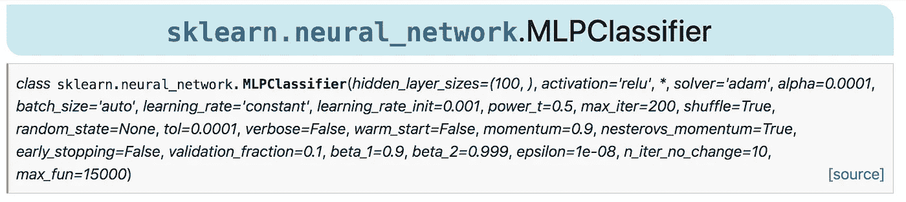

# 用 Python 训练神经网络的最简单方法

> 原文：<https://towardsdatascience.com/the-simplest-way-to-train-a-neural-network-in-python-17613fa97958?source=collection_archive---------15----------------------->

## PyTorch 和 TensorFlow 并不是 Python 中唯一的深度学习框架。还有另一个类似于 scikit-learn 的库。


由[乌列尔 SC](https://unsplash.com/@urielsc26?utm_source=medium&utm_medium=referral) 在 [Unsplash](https://unsplash.com?utm_source=medium&utm_medium=referral) 上拍摄的照片

说到 Python 中的经典机器学习算法，scikit-learn 是我的首选。它有许多算法，支持稀疏数据集，速度快，有许多实用功能，如交叉验证，网格搜索等。

谈到高级建模，scikit-learn 多次失败。如果你需要助推，神经网络或 t-SNE，最好避免 scikit-learn。

scikit-learn 有两个基本的神经网络实现。有用于分类的 MLPClassifier 和用于回归的 MLPRegressor。

虽然 MLPClassifier 和 MLPRegressor 有一组丰富的参数，但没有自定义神经网络层的选项(除了设置每层的隐藏单元数)，也没有 GPU 支持。



sklearn 中一个[多层感知器](https://scikit-learn.org/stable/modules/generated/sklearn.neural_network.MLPClassifier.html#sklearn.neural_network.MLPClassifier)的一组丰富的论据(图片由作者制作)。

# 认识 scikit-neuralnetwork

Gif 来自 [giphy](https://giphy.com/gifs/kitp-YknAouVrcbkiDvWUOR)

scikit-neuralnetwork 解决了上面提到的 scikit-learn 的问题。虽然已经有像 PyTorch 或 Tensorflow 这样的优秀库，但对于那些来自 scikit-learn 生态系统的人来说，scikit-neuralnetwork 可能是一个不错的选择。

> 来自 scikit-neuralnetwork 的开发者:
> 
> scikit-neuralnetwork 是一个没有学习悬崖的深度神经网络实现！该库实现了多层感知器，作为强大的 pylearn2 库的包装器，该库与 scikit-learn 兼容，具有更加用户友好的 Pythonic 界面。

## 安装 scikit-neuralnetwork

安装 scikit-neuralnetwork (sknn)与安装任何其他 Python 包一样简单:

```
pip install scikit-neuralnetwork
```

## 定制神经网络

让我们从 Iris 数据集定义 X_train 和 y_train 来运行下面的示例:

```
from sklearn.datasets import load_irisdata = load_iris()
X_train = data['data']
y_train = data["target"]
```

sknn 提供了一种制作定制神经网络的简单方法。scikit-learn 用户对熟悉的 API 会有宾至如归的感觉:

```
from sknn.mlp import Classifier, Layernn = Classifier(
    layers=[
        Layer("Maxout", units=100, pieces=2),
        Layer("Softmax")],
    learning_rate=0.001,
    n_iter=25)
nn.fit(X_train, y_train)
```

X_train，y_train 变量是 numpy 数组，所以你可以直接用 sknn 的神经网络代替你的 scikit-learn 模型。它甚至支持稀疏数据集。

## 卷积神经网络

Gif 来自 [giphy](https://giphy.com/gifs/blog-daniel-keypoints-i4NjAwytgIRDW)

sknn 支持卷积神经网络。最后，你将能够在 scikit-learn 生态系统中的 [MNIST](http://yann.lecun.com/exdb/mnist/) 上获得最高水平的分数。

```
from sknn.mlp import Classifier, Convolution, Layernn = Classifier(
    layers=[
        Convolution("Rectifier", channels=8, kernel_shape=(3,3)),
        Layer("Softmax")],
    learning_rate=0.02,
    n_iter=5)
nn.fit(X_train, y_train)
```

## 递归神经网络


由[安德烈斯·坎钦](https://unsplash.com/@bethewerewolf?utm_source=medium&utm_medium=referral)在 [Unsplash](https://unsplash.com?utm_source=medium&utm_medium=referral) 上拍摄的照片

RNNs 呢，比如长短期记忆(LTSM)或者门控循环单元(GRU)？rnn 通常用于建模序列，如时间序列或文本数据。

通过阅读文档，似乎没有对 RNNs 的直接支持。它支持本地和定制层，这使得 RNN 的实现成为可能。

> 来自文档:
> 
> 你可以使用这个特性来实现循环层，比如 LSTM 或者 GRU，以及任何其他不被直接支持的特性。请记住，这可能会影响未来版本的兼容性，也可能会暴露代码中的边缘情况(例如，序列化、确定性)。

如果你打算和 RNNs 一起工作，我建议你学习 PyTorch 或者 TensorFlow。如果你需要一个快速入门指南，我不久前写了一篇关于它的文章:

</lstm-for-time-series-prediction-de8aeb26f2ca>  

## 管道


照片由[昆腾·德格拉夫](https://unsplash.com/@quinten149?utm_source=medium&utm_medium=referral)在 [Unsplash](https://unsplash.com?utm_source=medium&utm_medium=referral) 上拍摄

scikit-learn 有管道，它将特征转换和建模打包到一个管道中。

管道减少了过度拟合的机会，并且通常减少了各种错误的机会。在进行交叉验证或网格搜索时，它们也非常有用。

许多机器学习库不支持 scikit-learn 管道，所以我们需要自己实现它。scikit-neuralnetwork 的伟大之处在于它完全支持 scikit-learn 管道。

下面是一个管道示例，用于缩放特征和训练简单的神经网络。

```
from sknn.mlp import Classifier, Layerfrom sklearn.pipeline import Pipeline
from sklearn.preprocessing import MinMaxScalerpipeline = Pipeline([
        ('min/max scaler', MinMaxScaler(feature_range=(0.0, 1.0))),
        ('neural network', Classifier(layers=[Layer("Softmax")], n_iter=25))])
pipeline.fit(X_train, y_train)
```

查看流失预测文章，了解管道的高级用法。我展示了如何分别处理分类特征和数字特征:

</churn-prediction-770d6cb582a5>  

## GPU 支持

Gif 来自 [giphy](https://giphy.com/gifs/zotac-LO8XMhCkXYuSLu6LqX)

与 scikit-learn 不同，scikit-neuralnetwork 支持 GPU，因为它基于[千层面](https://lasagne.readthedocs.io/)库。注意，GPU 支持需要支持 CUDA 的 NVIDIA GPU。如果你有一台 MacBook，你很可能有一个不支持 CUDA 的镭龙 GPU。

> 来自千层面文档:
> 
> 感谢 Theano，Lasagne 透明地支持在 GPU 上训练你的网络，这可能比在 CPU 上训练它们快 10 到 50 倍。目前，这需要一个支持 CUDA 的 NVIDIA GPU，以及一些额外的软件供 Theano 使用。

要使用 GPU 后端，您只需导入:

```
# Use the GPU in 32-bit mode, falling back otherwise.from sknn.platform import gpu32
```

> 来自文档:
> 
> 警告:由于库的设计方式，这只有在你的程序还没有导入`*theano*`模块时才有效。如果在命令行上设置了`*THEANO_FLAGS*`，它们不会被覆盖。

# 结论


照片由[费德里科·朗塞洛蒂](https://unsplash.com/@feeedderico?utm_source=medium&utm_medium=referral)在 [Unsplash](https://unsplash.com?utm_source=medium&utm_medium=referral) 拍摄

如果你精通 sklearn 库，那么 scikit-neuralnetwork 可能是熟悉深度学习的一个很好的起点。

当我们需要一个神经网络来替代 sklearn 算法时，scikit-neuralnetwork 也很有用。

如果你刚刚开始深度学习，或者你打算长期从事这个领域，我建议你学习 PyTorch。

# 在你走之前

```
- [Deploy Your 1st Machine Learning Model in the Cloud](https://gumroad.com/l/mjyDQ) [Ebook]- [How To Create Date Series in SQL](https://dataanalysis.substack.com/p/how-to-create-date-series-in-sql) [Article]- [Free skill tests for Data Scientists & Machine Learning Engineers](https://aigents.co/skills)- [Become a Cloud Developer using Microsoft Azure [Course]](https://imp.i115008.net/c/2402645/895504/11298)- [Master SQL, the core language for Big Data analysis [Course]](https://imp.i115008.net/c/2402645/828410/11298)
```

*上面的一些链接是附属链接，如果你通过它们进行购买，我会赚取佣金。请记住，我链接课程是因为它们的质量，而不是因为我从你的购买中获得的佣金。*

在 [Twitter](https://twitter.com/romanorac) 上关注我，在那里我定期[发布关于数据科学和机器学习的](https://twitter.com/romanorac/status/1328952374447267843)消息。


照片由[Courtney hedge](https://unsplash.com/@cmhedger?utm_source=medium&utm_medium=referral)在 [Unsplash](https://unsplash.com/?utm_source=medium&utm_medium=referral) 拍摄