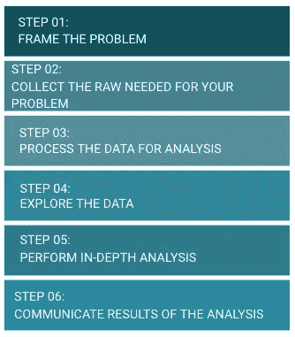

# 数据分析中的六大陷阱及其规避

> 原文：<https://towardsdatascience.com/the-six-traps-in-data-analysis-and-how-to-escape-them-ea9d2e3bad46?source=collection_archive---------62----------------------->

图片:[来源](http://memegenerator.net/instance/85161853)

任何从事数据分析工作的人都知道遵循流程开展工作的重要性。这样，我们保证不会跳过重要的步骤，我们可以对时间表有一个清晰的概念——我们从哪里开始，我们想去哪里——以及在这个过程中发现了哪些挑战。

一个已定义的过程也有助于报告分析的当前状态，并且它帮助我们组织我们自己来交付一个更好质量的分析。

我们在文献中有一些参考资料可以利用。[数据页面](https://www.linkedin.com/posts/women-in-data_what-is-your-data-science-process-do-you-activity-6707328826029965313-Vz59/)中的女性发布了一个金字塔，显示了分析过程中几个有趣的点。

有六个步骤:框定问题，收集问题所需的原始数据，处理数据进行分析，探索数据，进行深入分析，并交流分析结果。

图片作者，灵感来源[[https://www . LinkedIn . com/posts/women-in-data _ what-is-your-data-science-process-do-you-activity-6707328826029965313-Vz59/](https://www.linkedin.com/posts/women-in-data_what-is-your-data-science-process-do-you-activity-6707328826029965313-Vz59/)]

每一步都有其目的，并在生成有价值的信息方面起着关键作用。

在本文中，我们将介绍数据分析通常遵循的步骤，以及随之而来的陷阱和如何逃脱它们…

# 每一步的陷阱！

在下图中，我们可以初步了解步骤和陷阱之间的关系:

图片作者，灵感来源[[https://www . LinkedIn . com/posts/women-in-data _ what-is-your-data-science-process-do-you-activity-6707328826029965313-Vz59/](https://www.linkedin.com/posts/women-in-data_what-is-your-data-science-process-do-you-activity-6707328826029965313-Vz59/)]

正如我们所看到的，不是所有的步骤都包含陷阱，有些步骤不止一个。

现在您已经对数据分析过程有了一个大致的了解，是时候更深入地了解每一个步骤了！

# 台阶

**步骤 01:框定问题**

这是开始分析后所有问题的答案。

当我开始一项分析时，我喜欢认为，为了便于理解这项工作，我们必须首先列出两点:

1-我们想回答什么问题？

在我们分析的最后，我们想要得到什么问题的答案？这很好地指导了接下来的步骤。基于此，我们将更好地知道我们的分析采用哪种策略。

此时，重要的是与相关人员交流并保持一致，是什么问题导致了这一分析请求，需求是如何产生的，等等。

此外，这让我们怀疑我们所花的时间是否会产生价值。

**2-分析结论中有哪些可行的见解？**

根据我们想要回答的问题的答案，您想要如何处理这些信息？你想要什么样的决策？

没有这些答案，你就可能陷入**【不知道解决哪个问题】**的陷阱，开始没有方向的分析。此外，考虑到沟通不畅的风险，分析结论可能与预期有所不同…

这些答案也将极大地指导数据的选择，将被使用的假设，选择哪种抽样方法，并且也质疑这个问题:我们正在研究正确的问题吗？有没有其他的角度可以考虑？

因此，在这一步花费必要的时间，因为我们识别问题的方式将决定分析的背景、目标、意义和范围。

重要的是记住提到的问题的答案，当新的疑问出现时，我们将能够总结分析的目标，并强化你已经做出的决定。

此外，请记住，可能会遇到新的问题，这些问题将补充范围并加强所采用的前提和方法。

**第二步:收集你的问题所需的原始资料。**

在这一步，我们需要从来源收集数据来回答提出的问题。

在提取数据或创建数据库之前，我会做一个很好的练习，就是画出我认为能回答这些问题的最终输出，无论是在纸上还是在 excel 中。通过这种方式，我们可以可视化重复或不必要的数据，这些数据可能会妨碍他们的分析，无论是在提取性能还是混淆公众。

而这里的陷阱**“带来数据解决宇宙中所有问题”**都能碰到。有时，当我们开始提取数据时，保留多余的数据是很常见的，比如“如果他们要求这些数据怎么办？最好把它留在数据库里..”突然，我们有了很多数据，但这些数据无助于回答这个问题，这给我们带来了更多的工作，因为对于那些从事数据分析的人来说，有一件事是事实:

如果你要处理这些数据，你有责任保证质量。

为什么我们要浪费时间去做无济于事的数据质量分析？

**步骤 03:处理用于分析的数据**

在这一步，我们将了解提取，做数据质量，并清理数据。

这看起来是一个简单的步骤，但数据很难保持一致。相反，许多数据的格式与您所需要的不同:字段为空或者与预期的不同，与团队认为的类别不同，等等。

提出这些错误是我们工作的一部分，更重要的是，与负责人分享这些错误，以确保公司能够看到这些错误。因此，更容易对这种校正的交付进行优先级排序，其他区域也知道，并且公司更有信心它没有使用错误的数据。

**步骤 04:浏览数据**

随着数据的提取和验证，是时候进入探索的世界了。在这个阶段，我们很可能想要了解两个变量之间的关系，分析它们在不同数据集群中的行为，比较不同的场景，等等。

当你开始分享对你的分析的第一个见解时，许多其他问题出现了:

——“你为什么不也分析一下这个变量？”

——“为什么不用这个前提模拟一个结果呢？

-“你为什么不改变日期范围？”

诸如此类……而在那些时刻我们可以进入所谓的**【下兔子洞】**，灵感来自小说《爱丽丝梦游仙境》。

在小说中，爱丽丝掉进了一个兔子洞，这个兔子洞把她带到了一个充满奇特生物的神奇地方，揭示了一个荒谬的逻辑，最后当她受到女王士兵的攻击时，爱丽丝醒来，发现整个旅行是一场梦…

**什么意思？**

有时候我们进入了一个分析和更多分析的循环，持续了很长时间却没有意识到。

自然，好奇随着结果而产生，但我们必须永远记住这个问题:

这个额外的分析能帮助我们回答主要问题吗？

如果是这样，花点时间，但是给自己相当多的时间不要卡住。如果没有，把它写在你的待办事项清单上。

另一个常见的陷阱:**《糟糕的时刻》**。这是关于遭受这些各种各样的问题，开始怀疑分析的目标，如果你是在遵循正确的道路…这是相当普遍的，你经常最终独自承受痛苦。在这些时候，保持冷静并与团队分享这些痛苦和见解是非常重要的。他们将帮助你验证，提出新的假设，并加强分析的重点。

为此，利用所有可用的沟通渠道:会议、电子邮件等。

又一个陷阱:**“我没有结果”。**

通常，数据分析任务需要很长时间，特别是当我们处理有错误的数据，或者不同的业务规则时，它经常会给人一种我们没有交付的感觉。

但是，有必要记住，识别数据中的错误，甚至是对图形**的怀疑也被视为交付。**

我们不需要仅仅为了有这种接近的感觉而结束分析。

**步骤 05:进行深入分析**

在分析中深入细节很重要，这既是为了验证数据，也是为了支持结果和结论。**这可以避免你的分析出现偏差。**
你需要了解数据中反映不同行为的变量是什么，并在那个层面上分析信息。
例如，在一项房地产销售分析中，一处房产的价值会因州、城市和社区级别的不同而有很大差异，因此在分析中必须将这些因素都考虑在内。

**步骤 06:传达分析结果**

如果没有关于问题和洞见的结果的交流，就没有完整的分析。

这给你一种封闭的感觉，这里是最后一个陷阱:**“不相信自己”**。不要羞于展示结果。如果你已经深入分析并讨论了所采用的方法和策略，你肯定会为可能出现的任何问题做好准备。

如果有任何你不知道答案的问题，可以说**你不知道，你将研究**。认识到你没有所有的答案是你作为专业人士成熟的一部分。

# 结论

到目前为止，我所说的一切都是基于我的经验，我从每次分析中学到的教训，以及我今天如何处理每个陷阱。

我相信无论你的工作是什么，都应该是令人鼓舞的，总是激励你的，所以你必须克服这些可能让你坚持甚至让你放弃的时刻。

总会有挑战要克服，没关系的！停下来反思:你是如何克服的？下次你就已经知道如何逃跑了。

你有什么问题吗，你还记得其他陷阱吗，或者你有什么建议吗？在评论里发帖！

感谢 [Manu](https://medium.com/@manueleferreira) 和 [Madu](https://medium.com/@mariaeduardanubi) ！