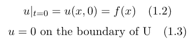

# 热量方程的解

> 原文：<https://towardsdatascience.com/the-solution-of-the-heat-equation-71c503c36801?source=collection_archive---------4----------------------->

## 两种方法:分离变量和傅立叶变换

图片由作者提供。欲知详情，请向下滚动至增刊:)。

热传导方程是最著名的偏微分方程之一。它不仅在物理学中非常重要，而且在许多其他领域也非常重要。有时候一个看似无解的偏微分方程可以化为一个我们知道如何求解(或者很快就会知道如何求解)的热方程。这方面的一个例子是 Black-Scholes PDE 的解决方案，它模拟了股票价格和期权价格之间的关系。

我的物理知识仅限于高中物理，而且因为遗忘机制，越来越差。然而，这个职位的任务是解决热方程，也作为典型的抛物型偏微分方程，热方程也在纯数学研究。理解它是如何解决的，并不需要太多的物理学知识(所以我在这个题目中也不是完全没用)。这篇文章将关注解决方案，而不是物理意义。

热量方程非常详细的推导可以在[保罗的在线笔记](https://tutorial.math.lamar.edu/Classes/DE/IntroPDE.aspx)中找到。

格式说明:这篇文章中有很多公式，我用了不同的颜色使它们不那么杂乱。黑色部分很重要，至少是解方程的程序部分。蓝色部分不太重要，它们是附加的细节或一些背景。棕色中有两个公式，它们是属性。我还在公式周围使用了不同的字体和方块来突出事物。

# 问题的表述

考虑⊆ ℝⁿ大学，这是一个开放的和成立的集合，热方程给出如下

方程 1.1 热量方程

其中 u 是空间矢量 x 和时间 t 的函数。不考虑热扩散系数(设为 1)。等式右边是拉普拉斯算子，定义为二阶导数。t 在区间(0，∞)中取值，x 在区域 u 内。我们有以下边界条件

边界条件

这意味着在物体的边缘，温度是零，开始时，每个点的温度由函数 f: U→ℝ.给出

# 变量分离

顾名思义，这种方法将变量 x 和 t 分开，放在等式的不同一边。这是可能的，因为 x 和 t 是独立变量，这意味着 x 不是 t 的函数，反之亦然。该方法的第一步是假设解具有以下形式

等式 2.1 我们的假设

我们选择这种形式的唯一原因是这样行得通。这是解热方程的第一个难点。现在，我们将等式 2.1 代入等式 1.1，得到

将等式 2.1 替换为等式 1.1

我们知道偏导数是如何工作的:当计算关于 t 的导数时，其他变量作为常数处理。因此，我们可以在 LHS(左手边)上分解出 v(x ),在 RHS 上分解出 w(t ),得到等式 2.3。从等式 2.3 到等式 2.4 是微不足道的。把它写得更简洁

等式 2.5 是等式 2.4 的紧凑形式

现在变量是分离的:在 LHS 上只有 x，在 t 上只有 t。使等式 2.5 中的等式成为可能的唯一条件是 LHS 和 RHS 都等于相同的**常数**。

等式 2.6 两边只可能等于一个常数

从方程 2.6 我们得到两个常微分方程(方程中只涉及一个变量)

等式 2.8 的一般解可以立即看出，它是

方程 2.9 方程 2.8 的一般解

其中 c 是某个常数。同时，方程 2.7 的解不是如此平凡，我们需要解下面的微分方程

其中 v(x)定义在整个 U 上，我们设 **λ = -** 。v(x) = 0 是边界条件，即边上的热量为零，U 上各点的热量由 f(x)给出，与方程 1.2 相同。等式 2.10 中陈述的问题被称为*斯特姆-刘维尔问题*(只是一个旁注，我们不需要知道这个来求解等式 2.10)，它具有一般形式

方程 2.21 斯特姆-刘维尔问题

其中 *p* 和 *r* 为非负函数，p，q，r 为具有边界条件的[a，b]上的连续函数

Sturm-Liouville 问题的边界条件

Sturm-Liouville 问题并不总是有非平凡解。如果存在非平凡解，那么λ就是边值问题的**特征值**，解就是**特征函数**。回到热方程，方程 2.10 的特征函数和解是

对于特征根(异根、重根、虚根)特征对应的微分方程的解，我发现[这个](https://www.math.stonybrook.edu/~scott/mat127.spr21/SecondOrderLinearDiffEqNotes.pdf)很有帮助。

回想一下我们讲过的边界值是 v(x) = 0 在 U 的边界上，如果我们考虑**最简单的情况——一维杆上的热传导**，U 可以是一个区间例如[0，L]。λ有三种情况

**情况 1: λ = 0。**这是最简单的一个，得出方程 2.10 的解是 v(x) = Ax + B 的形式，代入边界条件后，我们会发现在这种情况下，只有平凡解。因此，零不是特征值。

**案例二:λ < 0。**在这种情况下，两个根都是真实的，解决方案在形式中

等式 2.22 两个实根，λ < 0

把 v(0) = v(L) = 0 代入边界条件，可以看出 A 和 B 都应该为零(e 的某次方总是正的)，因此，一个正的λ又不是一个特征值。

**案例三:λ > 0。在这种情况下，没有真正的根，解看起来像**

方程 2.23 没有实根，λ > 0

把 v(0)= 0 代入方程 2.23，我们马上看到 A 一定为零。然后我们代入 v(L) = 0，现在我们有了

因此，v(x)由下式给出

等式 2.25

这是一个本征函数，我们已经得出结论，只有正的本征值。已经很接近胜利了。结合我们之前得到的 w(x)的解

概述

我们可以把第 n 个解写成如下

等式 2.26

根据叠加原理，方程 2.26 中描述的所有解的线性组合也是一个解。这意味着如果我们总结一下

等式 2.27 是等式 2.26 的总和

等式 2.27 是最终解，这正是**傅立叶正弦级数**，其中寻找 Dₙ只是寻找傅立叶级数中系数的问题，可以使用公式找到

如果你对傅立叶级数感兴趣，点击[这里](/orthogonal-system-and-fourier-series-bec96510db98)。

# 使用傅立叶变换

这种方法扩展了以前的分离变量法，以求解定义在无限或半无限区间上的偏微分方程。想想傅立叶级数和傅立叶变换的区别:傅立叶变换把*周期的*连续函数分解成频率分量，傅立叶级数用那些正弦和余弦函数来近似一个*非周期的*连续函数——它是傅立叶变换的一个**近似**(傅立叶变换可以认为是傅立叶级数的极限)。这可能有助于理解这两种方法给出的最终解之间的差异。

傅立叶变换和傅立叶逆变换被定义为

等式 3.1 傅立叶变换等式 3.2 傅立叶逆变换

它将一个函数从**时域**转换到**频域**。注意，傅立叶变换和反函数在这个符号中不是完全对称的。因为角度符号破坏了对称性。[7]在介绍这种方法之前，我们需要熟悉卷积理论和傅里叶变换的两个性质。两个函数 f 和 g 的卷积是在(-∞，∞)上的如下积分，记为 f*g。

等式 3.3 卷积

卷积理论认为

> 两个函数的卷积的傅立叶变换是它们的傅立叶变换的乘积。

形式上这意味着

等式 3，4 卷积定理

现在我们可以转移到两个属性:

1.  时间导数是可以拉出来的，用傅里叶变换的定义很容易证明。请注意，傅立叶变换是一个线性运算符。

等式 3.5 属性 1

2.对函数导数的有趣影响。这可以通过两次分部积分来证明。

等式 3.6 属性 2

事实上，一般来说，如果 *f(x)，f’(x)，…，f⁽ⁿ⁻ ⁾(x)* 都是傅立叶变换的，并且如果 *f⁽ⁿ⁾(x)* 存在(其中 n 是自然数)，那么

等式 3.7

为了使用傅立叶变换来求解热方程，第一步是在以下两个方程的两侧执行傅立叶变换——热方程(等式 1.1)及其边界条件

催单

这意味着我们可以做到以下几点

这里我们稍微改变一下符号，以便更清楚地利用傅立叶变换的特性(等式 3.5、等式 3.6)，这就给出了

我们很容易看出，方程 3.10 是一个常微分方程，所以它的解是

方程 3.12 方程 3.9 的解

其中 A(ω)是ω的函数。我们可以这样处理ω，因为在方程 3.10 中，微分是关于 t 的，因此，ω被当作常数。将方程 3.12 代入方程 3.11，我们得到

等式 3.13

这一步实际上是微不足道的。现在我们已经开始

等式 3.14

傅里叶变换(频域)后的解已经找到。然而，我们怎样才能从方程 3.14 出发呢？答案是我们需要“逆向工程”来利用卷积定理——我们需要一个函数 S(x，t ),使得

等式 3.15

这个不难，用傅里叶逆变换就行了

等式 3.16

再看 3.14，这个其实和

等式 3.17

它是频域中两个函数的**乘积**。这是使用卷积定理(等式 3.4)的时候了，该定理说傅立叶变换将时域中的卷积变为频域中的乘积。如果我们颠倒这一过程，频域中的乘积可以转换回时域中的卷积。这意味着在等式两边的傅立叶变换反向之后。3.17 我们可以得到

等式 3.18

方程 3.18 给出了边值问题的最终解。

# 摘要

这篇文章的主题是热量方程，但我们不讨论推导(这个模型是如何获得的)，而是关注热量方程的解。介绍了求解热传导方程的两种方法，一种是定义在有界区域上的热传导方程的分离变量法。另一种是用傅里叶变换求解，它把第一种方法推广到无限域上的方程。这篇文章的封面图片中包含了一个例子。在补充资料中，你可以找到相应的公式。

*补充*

本帖的封面图片展示了热量方程及其解

等式 4.1

在区间[0，1]上。沿着一维杆的初始热分布由下式给出

等式 4.2

随着时间的推移，棒上的热分布变得越来越均匀。

**资源**:

*热度方程。于 2021 年 9 月 27 日访问*

*[2]保罗·道金斯。 [*分离变量*](https://tutorial.math.lamar.edu/Classes/DE/SeparationofVariables.aspx) 。于 2021 年 9 月 28 日访问*

*[3]迪特尔克。 [*求解热量方程*](https://www2.math.upenn.edu/~deturck/m241/solving_the_heat_eqn.pdf) 。于 2021 年 9 月 27 日访问*

*[4]西瓦吉·加内什。[斯特姆-刘维尔问题](http://www.math.iitb.ac.in/~siva/ma41707/ode7.pdf)。于 2021 年 9 月 28 日访问*

*[5] Arfken，G. B .，& Weber，H. J. (1999 年)。[物理学家的数学方法](https://aapt.scitation.org/doi/10.1119/1.19218)。*

*[6] Helena McGahagan，[用傅里叶变换求解热方程](https://web.math.ucsb.edu/~helena/teaching/math124b/)。于 2021 年 9 月 29 日访问*

*[7] Weisstein，Eric W. [傅立叶变换](https://mathworld.wolfram.com/FourierTransform.html)。来自 math world——一个 Wolfram 网络资源*