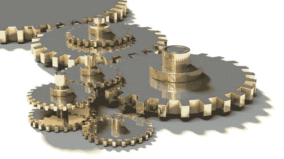
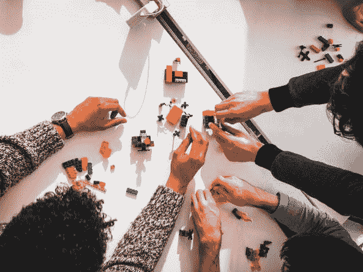

# 学习新数据或编程技能的阶段

> 原文：<https://towardsdatascience.com/the-stages-of-learning-a-new-data-or-programming-skill-9b35e5b3af75?source=collection_archive---------36----------------------->

## 解释掌握新数据或编程技能通常需要的基本步骤

图片来源:https://unsplash.com/photos/bJhT_8nbUA0[的 Jukan tate isi](https://unsplash.com/photos/bJhT_8nbUA0)

许多人令人钦佩地寻求学习数据科学、数据分析、编程语言或其他一些数据或编程技能，以便在专业上发展自己和/或寻求新的职业道路。令人兴奋的是，在线学习这些技能变得更加容易。但这种在线学习也可能助长对学习这些技能之一所需要的东西的不切实际的理解，因为它可能会将潜在的学习者从帮助潜在的学习者了解该领域期望的专家的物理社区中移除。

本文的目标是通过解释掌握新数据或编程技能通常需要的基本步骤来帮助纠正这种情况。这将有助于告知学习技能所需的高层次期望，同时也有助于你选择正确的课程或课程集，以确保你发展所有三个阶段。

对于数据技能，我指的是任何数据领域，如数据科学、数据分析或数据工程，或者某个数据领域中某人可能寻求学习的任何特定技能或实践，而对于编程技能，我指的是学习和用编程语言编码所必需的技能。

以下是掌握这些主题的三个基本学习阶段:

第一阶段:掌握题目的基本概念

阶段 2:完成指导项目

阶段 3:完成一个自我指导的项目

# 第一阶段:掌握基本概念

图片来源:qimono at[https://pix abay . com/illustrations/cog-wheels-gear-wheel-machine-2125178/](https://pixabay.com/illustrations/cog-wheels-gear-wheel-machine-2125178/)

掌握基本概念需要学习相关的词汇、句法和关键方法。通常程序清楚地教授每个概念，一次一个。例如，当学习一门新的编程语言时，您可能会学习主要的命令和语法规则，对于数据科学，您可能会一次学习一个最著名的机器学习模型。

这不同于广泛应用概念，在这个阶段，你可能还不能处理将所有概念混合在一个复杂的问题中(这是阶段 2)。程序通常在这一点上按顺序教授材料(尽管这对非线性学习者来说可能很难)。

例如， [W3Schools](https://www.w3schools.com/python/) 为大多数编程语言和数据科学技能提供基础的第一阶段教学。它们提供了一系列练习，贯穿一门新语言的基本语法成分，在这个过程中，复杂性稍微增加了一些。

现在，仅仅表演第一阶段并不能完全掌握主题。在一次练习一个片段后，你还必须过渡到第二阶段，在那里你开始学习如何在完成一个更复杂的问题时将它们结合起来。

# 第二阶段:引导项目

图片来源:https://unsplash.com/photos/lG-6_ox_UXE[的邦尼瓦尔·塞巴斯蒂安](https://unsplash.com/photos/lG-6_ox_UXE)

在这里，你通过一个指导项目练习将所有的部分组合在一起。这个指导性项目是一个模型，展示了在实际项目中每个组件是如何组合在一起的。我将这些比作构建乐高积木套件:按照一步一步的指示来构建一个很酷的模型(而不是从零开始构建自己的对象，这是阶段 3)。他们握着你的手直到完成，来说明在一个复杂的项目中把所有孤立的技能和概念放在一起会需要什么。

# 第三阶段:独立项目

在第三阶段，你把学到的所有东西集中在一起，独自完成一个项目。不像在第二阶段，当他们握着你的手，你现在有斗争的自由，这是学习所必需的。你正在发展自己形成和执行一个项目的技能。

图片来源:https://unsplash.com/photos/UVyOfX3v0Ls[的霍莉·曼达里奇](https://unsplash.com/photos/UVyOfX3v0Ls)

与此同时，你正在学习如何在现实生活项目中“野外”实施这些技能。在前面的阶段，教师经常溺爱他们的学生:提供你可能在教科书中找到的、学习基本概念所必需的、干净的、完全现成的例题。就像乐高玩具一样，这个项目的组件已经被修饰过，可以制作出你正在制作的东西。在第三阶段，当你必须找到你需要的部分和/或想出如何利用你现有的部分时，你通常会开始体验现实世界项目中常见的混乱。

例如，在数据科学学习者中，这个阶段是学生第一次学习处理为他们的问题找到正确数据的复杂性的时候；确定给定数据集的最佳问题；和/或清除不一致的数据。在此之前，大多数示例可能已经清理了与构建它们的特定任务相匹配的数据。

学习如何开发自己的项目，往往需要一定的试错。在这个过程中，你的导师可能会扮演更多的后座角色，检查你做了什么，回答你可能会有的任何问题，并在必要时轻轻推你一下。根据我的经验，自己探索策略是学习阶段 3 的最好方法。希望在这一切结束的时候，你会产生一个漂亮的项目，你可以展示给未来的雇主或任何你想留下深刻印象的人。

# 结论

这是发展对新数据或编程技能或领域的初步掌握的三个最常见的阶段。现在，它们是学习新技能通常需要的技能水平，但是在你完成这些之后，还有很多更高的学习水平。例如，掌握基本的数据科学概念，完成一个指导项目，并学习如何开展自己的自我指导的数据科学项目，这足以让你成为数据科学社区的新成员，但你仍然是一名新手数据科学家。作为一名数据科学家，你能学到什么以及如何成长，这只是冰山一角。

照片致谢#5:乔治·巴科斯在[https://unsplash.com/photos/VDAzcZyjun8](https://unsplash.com/photos/VDAzcZyjun8)

现在，尽管称它们为*阶段*，但并不是每个人都按顺序学习它们，特别是考虑到各种各样的情有可原的情况和学习风格。例如，有些人可能完成了他们正在学习的领域中特定技能子集的所有三个阶段，然后回到第一阶段学习另一个子集。大多数教育项目都会或多或少地包括这三个阶段。

然而，一些教育项目可能完全缺乏或不能为一两个阶段提供足够的资源。评估一个项目是否充分包括了这三个方面，这是一个有效的方法来确定他们在教学方面有多好，以及他们是否值得你的金钱和/或时间。当选择学习一项新技能时，我会推荐一个包含这三者的项目或项目组合。如果你想做的或者正在完成的项目缺少其中的一两个阶段，你可以试着在网上找到另一种方法(希望是免费的)来完成这个阶段。例如，在线课程和教程经常无法提供第三阶段(在某些情况下，第二阶段)，所以在你完成一个后，我会建议你找一个项目来做。

最后，当你在学习中遇到困难时，可能是因为你需要回到以前的阶段。例如，当许多学习者进入第二阶段时，当他们看到一些核心概念以新的方式应用时，他们必须定期回到第一阶段来复习这些概念。同样，在完成第三阶段的一个项目时，复习第二阶段甚至第一阶段的材料也没有错。

现在，要小心，因为你可能会错误地认为这是。学习任何东西都会令人沮丧。有时候，你遇到的困难并不是源于需要复习或重新学习过去的材料，而是你只需要坚持学习新材料，直到你开始理解为止。在这种情况下，一些学生回到一套材料中，在其中他们可以感到安全和自信，而不是挑战自己。然而，即使在这种情况下，就像倒车时摇晃汽车，然后开车越过一个凸起，快速后退可以帮助你向前越过障碍。在这种情况下，最重要的是了解你自己——你的学习倾向和你通常如何应对——并尽可能多地咨询该领域的导师和/或专家，他们会帮助你确定克服任何挑战的最佳方法。

*最初发布于此:*[https://ethno-data . com/the-stages-of-learning-a-new-data-or-programming-skill/](https://ethno-data.com/the-stages-of-learning-a-new-data-or-programming-skill/)*。有关该网站和其他文章的更多信息，请访问*[*https://ethno-data.com/*](https://ethno-data.com/)*。*

*也感谢《数据科学》杂志发表这篇文章。关于他们工作的更多细节，见* [*本*](/about-towards-data-science-d691af11cc2f) *。*