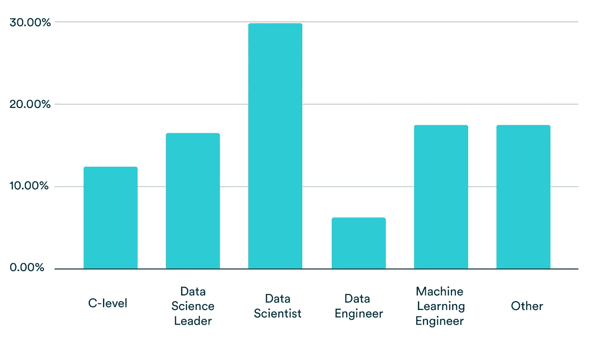
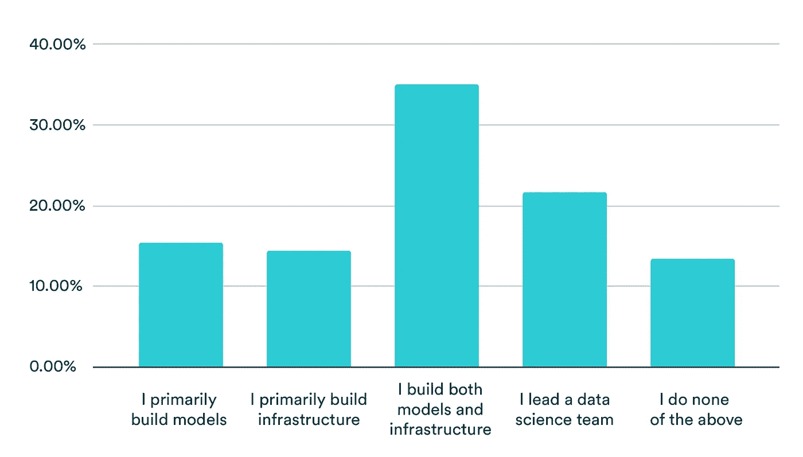
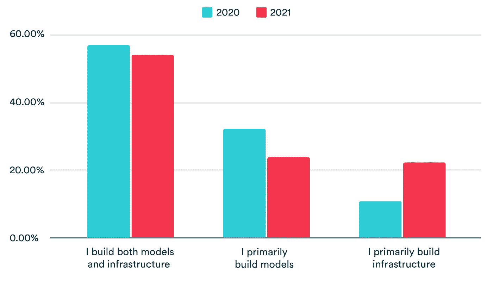
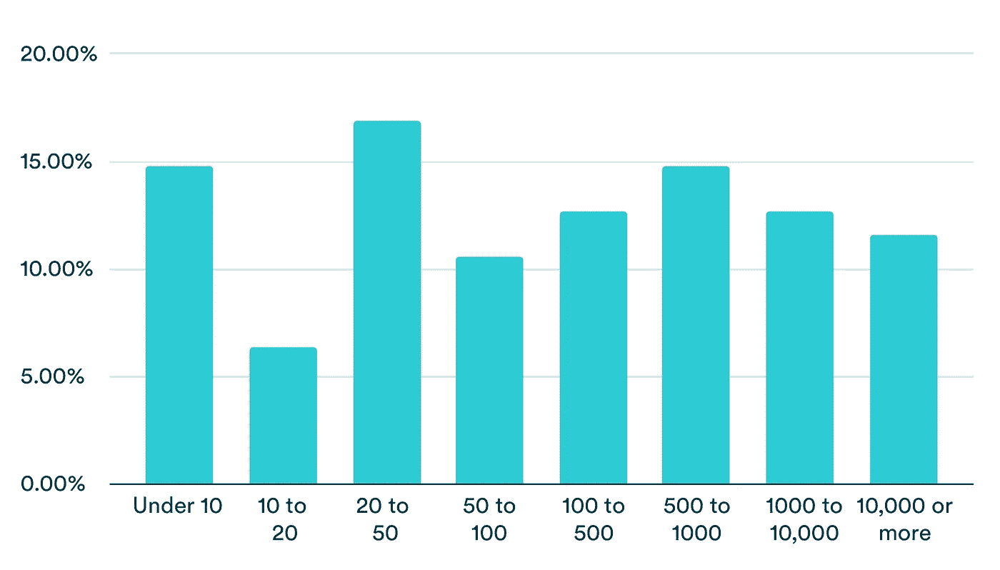
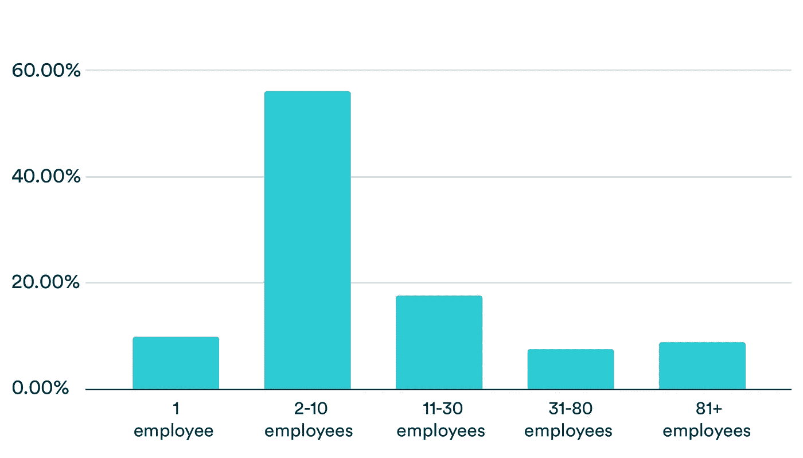
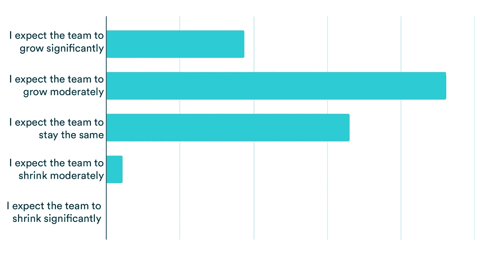
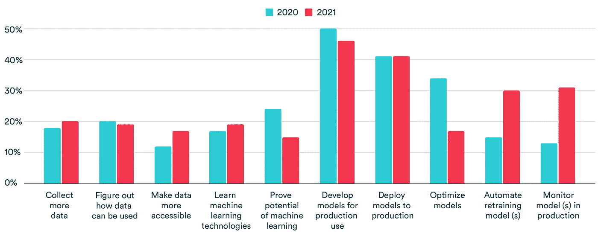
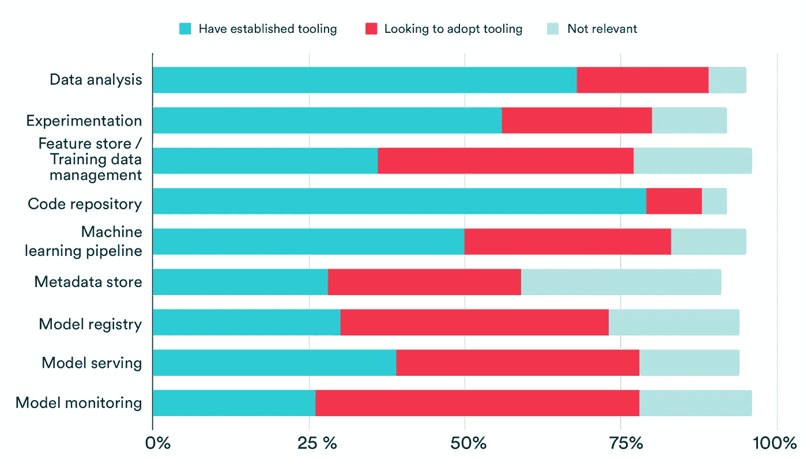

# MLOps 2021 的状态

> 原文：<https://towardsdatascience.com/the-state-of-mlops-2021-507ab7c2fdd1?source=collection_archive---------25----------------------->

## 不仅仅是炒作。许多团队都支持 MLOps

图片由[理查德·霍恩](https://unsplash.com/@richardhorne?utm_source=unsplash&utm_medium=referral&utm_content=creditCopyText)在 [Unsplash](https://unsplash.com/s/photos/wind?utm_source=unsplash&utm_medium=referral&utm_content=creditCopyText) 上拍摄

# 人口统计数据

对于 2021 年 MLOps 调查，我们从 [Valohai 社区](https://valohai.com/blog/)收集了 100 份回复。虽然 Valohai 产品与 MLOps 相关，但我们发布的内容更广泛地与数据科学相关。

从地理上看，受访者主要来自欧洲、美国、印度和中国。27%的受访者在技术领域工作，其次是金融服务(14%)、咨询(12%)和医疗保健(12%)。虽然技术领域绝对过于宽泛，无法提供深刻的见解，但我们的轶事证据表明，金融和医疗保健行业正大量参与 MLOps 场景，并拥有成熟的机器学习计划。然而，这两个部门也有独特的挑战需要 MLOps 来解决，即围绕透明度、隐私和安全性的监管。

# 角色

不出所料，最大的受访者群体是数据科学家，占 30%。其次是 18%的 ML 工程师，18%的其他，16%的数据科学领导者。令人惊讶的是，数据工程师的比例相当低，只有 6%。

## 你的头衔是什么？

作者图片

我们从之前的研究和在线讨论中发现，数据科学中的头衔和角色在这一点上还远远没有固定下来。因此，我们提出了一个相关的问题，即什么最能描述受访者的角色，35%的受访者回答说他们的重点是构建模型和基础架构。相比之下，较小的团队可以专注于其中一个(15%只构建模型，14%只构建基础设施)。

## 哪一项最能描述您的角色？

作者图片

我们已经注意到，我们围绕角色定义(即数据科学家与机器学习工程师)发布的内容似乎引发了大量辩论，这些结果似乎证实了角色绝不是明确的。例如，一家公司的数据科学家可能对构建基础设施和设置工具至关重要，而在另一家公司，该任务是更专业的工程师角色。

## 哪一项最能描述您的角色(仅限 IC 角色)？

作者图片

然而，如果我们只关注三个答案(不包括领导团队，以上都不包括)，并比较 2020 年的结果，我们可以看到专注于建设基础设施的群体有所增长。虽然至多是一个微弱的信号，但总的来说可能会有一些专门化发生。

# 组

机器学习相关的角色仍然广泛的原因可能在于大多数参与机器学习的团队相对较小，没有专业化的空间(至少目前没有)。我们询问您的组织中有多少员工从事机器学习或数据科学工作，最受欢迎的答案是 2–10 人(56%)。即使在拥有 1000 多名员工的公司中，11-30 名员工从事 ML 工作也是最常见的答案。

## 你的公司有多少员工？

作者图片

## 贵公司有多少员工从事数据科学或机器学习工作？

作者图片

未来研究的一个令人兴奋的领域可能是数据科学团队的重要性(在公司规模的背景下)、机器学习成熟度和财务成功之间的关系。一群新生的公司正在围绕机器学习构建他们的价值主张。看看这些组织是否从底层开始更好地构建以增强人工智能能力，这将是一件有趣的事情。

## 在接下来的 3 个月里，你预计你的团队会有怎样的变化？

作者图片

然而，更直接的是，机器学习领域正处于大规模招聘热潮中。事实上，65%的受访者预计他们的 ML 团队将在未来三个月内增长，而只有 2%的人预计团队将缩小。

# 焦点区域

与去年一样，我们询问受访者未来三个月的工作重点(最多 3 个选项)。结果再次表明，机器学习模型的产品化取得了重大进展。

## 在接下来的三个月里，你的重点是什么(最多 3 个选择)？

作者图片

与去年相比，生产中的监控型号增长最为显著(13%至 31%)。支持这种热情的是监控领域的大量工具，这些工具脱颖而出(包括 Arize、Fiddler、superwise.ai 等。).

模型的自动化再训练也获得了类似的受欢迎程度(从 2020 年起翻了一番)，30%的受访者专注于为此建立机器学习管道。虽然并非详尽无遗，但结果支持团队在过去一年中朝着 MLOps 迈出了大步，实现机器学习系统(而不是项目)是首要任务。

“机器学习的证明潜力”的下降也支持了这一点，因为它通常表明建立了第一个机器学习概念证明。在过去的一年中，优化模型似乎在优先级上后退了一大步。

# 工具作业

在实践中，工具是实现 MLOps 的重要部分。在调查中，我们询问了受访者他们有什么工具，他们希望实现什么(在接下来的三个月中)，以及目前什么是不相关的。拼接 MLOps 工具的方法有很多，但没有一种方法能够与现有工具保持一致。如前所述，市场上有广义和狭义的解决方案，它们适合不同的目的。

作为调查的基础，我们使用了我们的 MLOps 堆栈蓝图，它包含以下组件:数据分析、实验、功能存储(或培训数据管理)、代码存储库、机器学习管道、元数据存储、模型服务和模型监控。

## 您目前在哪些领域建立了工具？

图片作者。总数低于 100%,因为某些参与者选择不回答。

看看那些已经建立了工具代码库的领域。考虑到 Git 十多年来一直是软件开发的标准，并且数据科学家也采用了它，这并不奇怪。此外，数据分析(68%)和实验(56%)也相当成熟。

在产品化方面，50%的受访者认为他们有足够的机器学习管道工具，33%的受访者在未来几个月内寻找解决方案。模特服务分成 39%和 39%。

受访者对新解决方案最感兴趣的领域是模型监控(52%)、模型注册(43%)和特征存储/培训数据管理(41%)。与已经拥有监控解决方案的受访者相比，寻求此类解决方案的受访者数量翻了一番。

总的来说，在实验方面，工具更加成熟，而产品化则不那么成熟。然而，考虑到“目前不相关”是几乎每个组件中相对较小的一部分，在采用工具时似乎没有犹豫。

# 结论

MLOps 和产品化机器学习模型的数据科学场景作为一个整体在哪里是一个没有好答案的问题。然而，MLOps 2021 调查的状态为我们提供了令人鼓舞的证据，表明生产中的机器学习正在加速发展——不仅是在头条新闻中，而且是在行动中。

调查结果代表了我们社区的一小部分，因此自然会有偏差，但对于希望投资 MLOps 工具的决策者或希望深入研究 MLOps 的个人贡献者来说，趋势看起来令人鼓舞。

*最初发表于*[*【https://valohai.com】*](https://valohai.com/state-of-mlops/)*。*