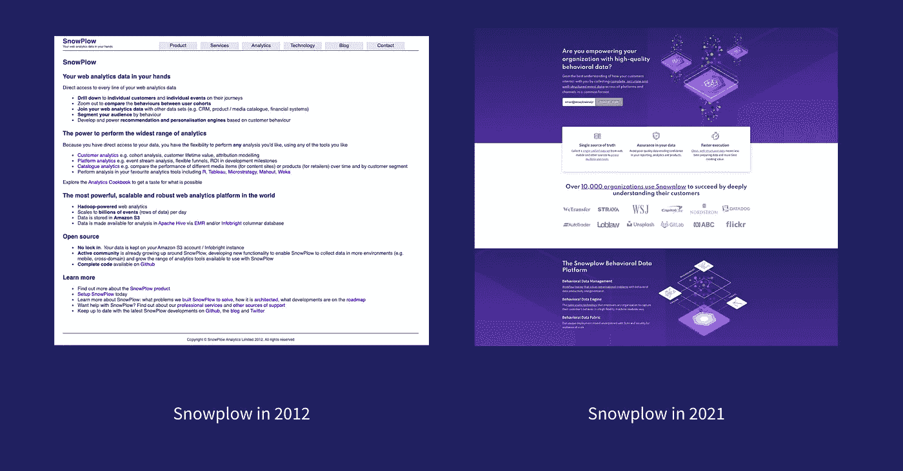
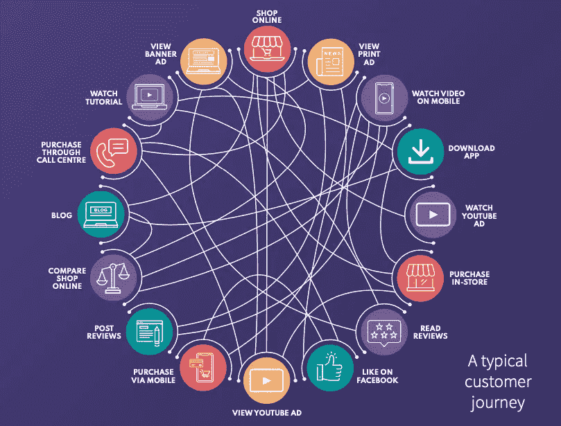

# 2021 年网络分析的现状

> 原文：<https://towardsdatascience.com/the-state-of-the-web-analytics-landscape-in-2021-a93f1163ad14?source=collection_archive---------18----------------------->

## 过去几十年来网络的变化对我们如何衡量网站上的活动有很大的影响

在过去 25 年左右的时间里，网络分析已经有了很大的发展。从最初的 Webtrends 和分析原始服务器日志文件以了解服务器上请求最多的页面，web analytics 现在可以帮助企业比以往更详细地了解他们的 web 应用程序和平台上正在发生的事情。

但我们是如何走到今天这一步的呢？在这段时间里，技术发生了巨大的变化，人们使用网络的方式也发生了巨大的变化，值得回顾一下我们已经走了多远，并理解为什么事情会以这样的方式发展。

在 21 世纪初，网络是一个非常简单的地方。我们有几乎没有互动的静态网站。Javascript 和 CSS，这些赋予网络光泽并使其更具吸引力的语言远没有现在复杂。不仅支撑网络本身的技术比今天更加基础，人们使用网络的方式也更加简单。几乎没有人拥有我们今天所说的“智能手机”，即使他们有，无线互联网也非常受限，你可以在上面访问的网站也是如此(iPhone 直到 2007 年才发布)。大多数人通过一台电脑上网——通常是每家一台。

# 处于婴儿期的网络

当人们浏览网页时，他们可以在网上做的事情也更少了。电子商务仍处于起步阶段，你可以在上面购买的商品和产品范围有限(Amazon.com 才刚刚从卖书拓展开来)。有一些社交媒体平台(MySpace，脸书东部时间。2004)，但没有智能手机的普及，对用户生活的影响很小。人们上网是为了浪费时间的想法并不常见。用户更有可能去他们的电脑“上网”(就像是一个活动或事件)，而不是总是能即时访问互联网。

经[扫雪机](http://snowplowanalytics.com/)许可|归功于扫雪机团队

互联网上的内容消费几乎完全基于文本和图像，主要是文本。连接速度远远不够快，无法实现可靠的点播音乐或视频播放。

不仅从用户的角度来看是不同的，对于品牌和企业来说也是不同的。许多品牌根本没有任何在线存在(当然不是在社交媒体上)。即使你这样做了，你的在线营销和广告选择也仅限于静态横幅广告(通过在网站上保留一个位置有限的时间来付费)、电子邮件简讯和通过谷歌的付费搜索广告(谷歌至少在此时已经确立了自己作为头号搜索引擎的地位)。

在这个更加受限的网络时代，网络分析很容易迎合这种用户行为。这种页面视图->访问->访问者模型(后来更普遍地称为页面视图->会话->用户)，通过单一设备，从单一位置，出于单一目的，到简单和静态的网站，意味着理解用户在你的网站上做什么是相对简单的。

# 哪里赢得了网络(分析)

2005 年，谷歌收购了海胆，并更名为谷歌分析。它在网站的每个页面上放置了一小块 Javascript 代码，可以即时跟踪页面浏览量、设备类型和流量来源。谷歌还让谷歌分析免费使用。这被证明是谷歌的一个非常明智的举动，让他们在行业中掀起了波澜——无论是对他们自己还是整个行业。

随着时间的推移，GA 进一步开发了功能，包括事件跟踪(例如，跟踪网站周围的表单和点击等交互)、电子商务跟踪以及与其他谷歌营销产品(如谷歌 AdWords 和谷歌网站管理员工具)的集成。

鉴于用户行为和网络技术比今天简单得多，GA 有能力帮助分析师回答这个时候有意义的问题。加上其免费的价格点，谷歌能够给大众带来网络分析。

# 网络革命

然而，随着时间的推移，人们使用网络的方式发生了显著的变化。iPhone 于 2007 年发布，改变了用户在旅途中和在家的浏览方式，2010 年的 iPad 也是如此，只是程度稍轻。网络连接变得更快、更可靠(包括宽带和移动网络)，这使得视频和音乐流媒体点播以及直播成为可能。

Web 技术和框架(如 React、Angular 和 Vue)已经开发出来，使得 web 应用程序在 21 世纪初还只是白日梦。今天你可以在网上购买比以前更多的商品(汽车、股票/股份/期权、杂货、ISAs 等)，这使得用户更频繁地访问网络。不仅如此，我们现在可以通过在线和移动银行管理我们的财务，开始与在线约会应用程序和服务建立关系，用健身应用程序跟踪我们的健康状况等。

如果你是一家企业，情况也是如此(通过 Xero 或 Quickbooks 处理财务，通过 Zendesk 提供客户支持，使用 BrightTalk 进行虚拟活动等)。我们比以往任何时候都有更多的理由使用互联网和网络。

由于人们现在可以在网上使用或购买的商品种类如此之多，而且大多数人在多种设备上使用网络，因此顾客的旅程比以往任何时候都更加复杂。现在网上研究网下购买(ROPO)非常普遍。在上下班途中看到社交媒体应用上的动态定向视频广告后，在收到触发式营销电子邮件后，在家里的桌面网络浏览器上进行研究和购买之前，开始移动用户之旅，其他类似和更复杂的用户之旅在今天已司空见惯。

经 Snowplow | [许可来源](https://snowplowanalytics.com/resources/rethinking-modern-web-analytics/) |归功于斯蒂尔顿设计有限公司

所有这些社会和技术的变化意味着，今天分析师所分析的网站在外观和行为上都与他们在网站只是静态页面和几个按钮和表单时大不相同。

然而，今天大多数最流行的网络分析工具仍然使用数据模型和框架，就好像我们仍然在分析简单的网站，用户只有一台设备。

# 打破遗传范式

以 Google Analytics 为例:GA 依赖于页面浏览量作为其关键的点击类型，以便通过相同的 cookie ID(而不是用户)将页面浏览量集分割成会话，然后将这些会话绑定到同一个 cookie。GA 中的大多数指标和维度都与会话的概念相关，例如设备类型、登录页面、渠道、转换率、跳出率等。因此，GA 要求您发送页面浏览量，以便 GA 可以构建会话。

这种方法有两个关键问题。

首先，GA 中的会话是一个复杂且混乱的概念。它结合了基于 GA 何时收到点击量的超时窗口、基于您希望营销或广告活动应用多长时间的活动超时窗口、跨域跟踪问题、推荐排除、更改收购来源、午夜等。对这些可配置选项的任何更改都会影响会话的定义方式，因此会影响与会话概念相关的所有指标和维度。由于所有这些指标都可能因配置中的微小变化而发生如此剧烈的变化，因此很难对它们有信心。

其次，考虑一个不太适合页面视图->会话->用户框架的 web 应用程序，例如[twitter.com](https://twitter.com/)。用户可以访问 twitter.com/home，滚动浏览他们的时间表，悬停在用户的头像上查看个人资料卡片，喜欢并转发个人推文，从这个页面关注或取消关注用户，还可以自动刷新你的订阅。从传统意义上来说，这可以在一个页面视图中完成，因为 URL 没有重新加载。如果 Twitter 使用 GA 进行网络分析，在没有极端定制的情况下，他们可能会有很高比例的“会话”,只包含少量的页面浏览量和很高的跳出率。大多数 web 分析工具所采用的标准数据模型并不适合当今的 web。

标准化的页面视图->会话->用户范式并不适合 2021 年的许多网络体验。[宝马汽车定制](https://configure.bmw.co.uk/en_GB/configure/F22/ZVA2/FCCL1,P0300,S01CA,S01CB,S01DF,S0216,S0230,S0249,S0255,S0258,S02LP,S02PA,S02VB,S0302,S0423,S0428,S0431,S04AE,S04CG,S04NE,S0507,S0521,S0575,S05A1,S05DA,S05DC,S0606,S0650,S0654,S0698,S06AC,S06AE,S06AK,S06AM,S06AP,S06CP,S06NH,S0812,S0850,S0853,S0880,S08KA,S08R9,S08S2,S08S3,S08SM,S08TF,S08TG,S0925)，像 [Udemy](https://www.udemy.com/) 这样的在线学习提供商，或者像 [Twitch](https://www.twitch.tv/) 这样的流媒体服务，都是标准的网络分析数据模型不再适用的网络应用。

值得注意的是，有许多网站仍然符合这种模式——例如，大多数出版商和电子商务网站通常都符合这种模式，因为用户会从产品页面转向搜索结果页面、结账和确认页面，或者用户会阅读文章。对于那些企业来说，这种模式仍然适用。然而，越来越多的企业不符合这种模式，甚至出版商和电子商务企业也开始改变他们的网络体验，远离我们可能称之为“传统”的网站模式。

# 从网站到数码产品

有一个有效的论点是，上述 web 应用程序更适合于产品分析，而不是 web 分析，因此需要一组不同的工具来满足一组不同的需求，而传统的 web 分析工具不能做到这一点。虽然越来越多的这种“产品”类型的应用程序出现在被认为是“传统”的网站上，但在很多情况下确实如此。另一个缺点是，专业产品分析工具通常缺乏 web 分析工具擅长提供的高层次视角。我们看到产品分析和网络分析工具越来越接近，这种趋势可能会在未来几年内持续下去。

总的来说，许多现代网络分析工具普遍装备不良，无法提供理解复杂网络用户旅程中用户行为所需的深度细节。这不是一个启示，也不是一个不受欢迎的观点。这一挑战已被市场上最大的参与者接受，试图帮助分析师更好地回答传统网络分析工具难以解决的问题。

谷歌分析 4 是谷歌的最新版本，从界面到底层数据模型，彻底改变了谷歌分析的工作方式。GA4 不再使用传统的页面视图->会话->用户框架，而是转向使用事件->用户数据模型。这是一个巨大的变化，也是使用 GA4 的网络分析师思维方式的变化，他们已经使用 Universal Analytics(“旧”GA)很多年了。GA4 还提供了将数据导出到 Google BigQuery 的能力，无需额外付费——这是第一次提供对 SQL 数据仓库中事件级数据的大规模访问。

谷歌的这一重大变化表明，他们承认需要对网络分析进行新的审视，而 GA4 基于 Firebase 的事实表明，谷歌如何看待这两个世界越来越近。

# 超越 GA4——网络分析的未来

然而，GA4 并不能解决所有问题。诸如可靠的跨设备归属、非现场测量、在尊重用户隐私的同时整合 CRM 等其他渠道，这些仍然是所有在线企业面临的挑战，GA4 不会解决这些问题，也不会解决构建不当的指标问题。

总而言之，网络分析工具一直在努力跟上过去 10-15 年来不断变化的用户行为和技术进步。网络分析解决方案需要为企业和分析师提供定制他们的跟踪和数据模型的能力，以真正适合他们的客户使用的网络应用程序，从而充分了解这些用户表现出的行为。如果没有这种来自丰富而详细的行为数据的理解，企业就不能指望在所有接触点提供最佳的用户体验。