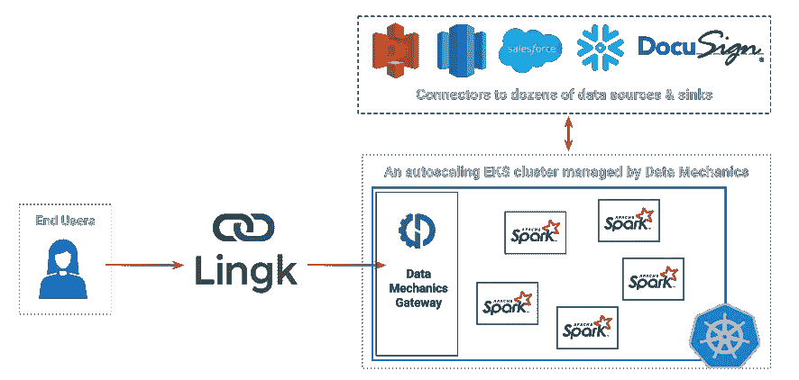
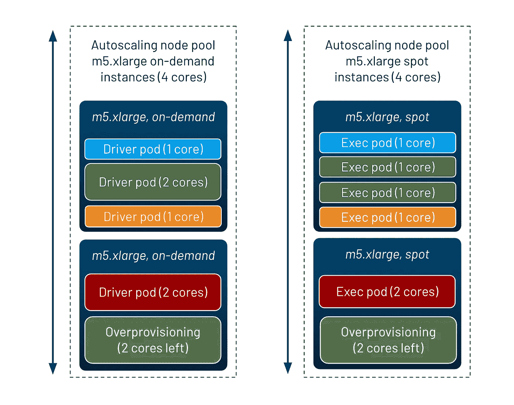
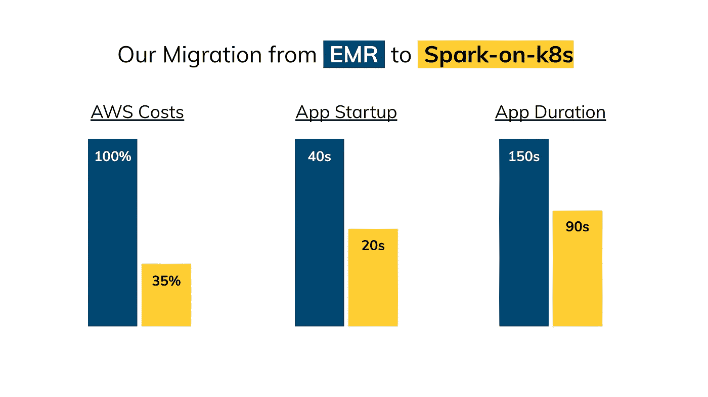

# 从 EMR 迁移到 Kubernetes 上 Spark 的故事

> 原文：<https://towardsdatascience.com/the-story-of-a-migration-from-emr-to-spark-on-kubernetes-a2decd6de0a4?source=collection_archive---------17----------------------->

在这篇文章中，Lingk 的联合创始人讲述了他们从 EMR 迁移到由数据力学管理的 Spark-on-Kubernetes 平台的故事:他们的目标、解决方案的架构&他们必须解决的挑战，以及他们获得的结果。

# 此次迁移的目标

[Lingk.io](https://www.lingk.io) 是一个数据加载、数据管道和集成平台，构建在 [Apache Spark](https://www.datamechanics.co/apache-spark) 之上，服务于商业客户，拥有教育领域的专业知识。在他们的可视化界面上，只需点击几下鼠标，他们的客户就可以从几十个来源加载数据、消除重复数据和丰富数据。

在引擎盖下，Lingk 使用 AWS EMR ( [ElasticMapReduce](https://aws.amazon.com/emr) )来驱动他们的产品。但是他们面临着一些问题:

*   EMR 要求他们的 Devops 团队进行过多的基础架构管理，而 Spark 经验有限。选择正确的集群实例类型、内存设置、spark 配置等。
*   他们的 AWS 总成本很高，他们直觉认为 EMR 的自动缩放策略不是很有效，而且浪费了大量计算资源。
*   Spark 应用程序平均需要 40 秒才能启动。Lingk 的最终用户需要等待很长时间，特别是如果他们正在建立一个新的数据管道或集成。
*   核心 Spark 应用程序停留在早期版本，因为将 Spark 升级到 3.0+导致了无法解释的性能退化。

他们决定在数据机制的帮助下，迁移到 Kubernetes 上的 Spark。他们此次迁移有三个目标:

1.  降低他们的总基础设施成本
2.  简化他们的数据团队运营工作
3.  改善 Lingk 平台的最终用户体验

*** [*数据机制*](https://www.datamechanics.co) *是一个云原生的 Spark 平台，可在 AWS、GCP 和 Azure 上使用。* [*阅读更多*](https://medium.com/r?url=https%3A%2F%2Ftowardsdatascience.com%2Fspark-on-kubernetes-the-easy-way-585e558abf59) *关于他们的服务以及它是如何建立在 Spark-on-Kubernetes 开源之上的。*

# 迁移后的目标体系结构

Lingk 的新数据平台建立在长期运行的托管 Kubernetes 集群(EKS)之上，部署在他们的 AWS 帐户中。Data Mechanics 负责管理该集群，从初始配置到长期维护(使用最新的 Spark 和 Kubernetes 更新来保持其最新状态)，并根据负载按需自动扩展。

lingk+数据力学架构。图片作者。

像 Jupyter 笔记本支持和气流集成这样的额外集成也是可能的，尽管在这种情况下，Lingk 会使用 Data Mechanics gateway 公开的 REST API 简单地触发 Spark 作业。因此，Lingk 的团队不再需要管理 EMR 集群，他们只需通过 API 提交 Dockerized Spark 应用程序，并享受无服务器的体验。

该团队可以控制 Spark 使用的 docker 图像，这带来了 3 个额外的好处:

1.  应用程序启动速度更快，因为所有依赖项都在 Docker 映像中完成。
2.  CI/CD 流程更简单—合并 PR 时会自动构建 Docker 映像。
3.  Docker 映像包括 Spark 分发版本身(没有全局 Spark 版本)，这意味着所有应用程序都可以在同一个集群上高效运行，并且很容易逐步升级到 Spark 3.0。

使用 Data Mechanics 提供的一个[公共 Spark-on-Kubernetes docker 映像](https://www.datamechanics.co/blog-post/optimized-spark-docker-images-now-available)作为基础，很容易开始使用基于 [docker 的开发工作流](https://www.datamechanics.co/blog-post/spark-and-docker-your-spark-development-cycle-just-got-ten-times-faster)，并打包所需的依赖项。

# 迁移过程中应对的挑战

迁移的主要技术挑战是停止使用 HDFS 作为中间存储，而是使用 S3——因为 HDFS 很难在 Kubernetes 上设置和维护。这需要更改一些应用程序代码，但最终的体系结构更加健壮，因为计算资源现在与存储资源完全分离(允许群集在不使用时几乎完全缩减)。

一些性能优化也很关键:

1.  调整容器大小以最大化实例上容器的装箱。小型容器用于大多数应用程序(它们很短，处理的数据量很小)，大型容器用于较长应用程序的尾部。这些设置由数据力学平台自动调整。
2.  调整默认的分区数量，以保证 Spark 中的最佳并行性——因为许多 Spark 作业受到太多小分区的影响(从 Spark UI 中可以看到，因为平均任务持续时间< 50 毫秒)。
3.  启用动态分配(从 Spark 3.0 开始，它适用于 Kubernetes 上的 Spark)，以加速长时间运行的管道(对于第 99 百分位最长的应用程序，速度提高了 5 倍！)通过让他们请求更多的遗嘱执行人。
4.  启用少量过度配置，以确保群集始终有备用容量供应用程序启动。

示例节点池配置说明了我们实施的一些优化。图片作者。

*这些优化详见技术指南:* [*如何在 Kubernetes 上设置、管理& Monitor Spark(附代码示例)*](/how-to-guide-set-up-manage-monitor-spark-on-kubernetes-with-code-examples-c5364ad3aba2) *。*

# 迁移取得的成果

EMR => Spark-on-K8S 迁移中获得的结果。图片作者。

从 EMR 到 Spark-on-Kubernetes 的迁移是一大胜利:

*   在最终用户体验方面，Spark 应用程序启动时间减半，平均应用程序持续时间减少了 40%。
*   在成本方面，AWS 成本降低了 65%以上。Lingk 的总拥有成本(包括数据机制管理费)降低了 33%。这些节省来自对所有 Spark 应用程序使用单个 Kubernetes 集群的成本效益，以及上一节中描述的性能优化。

Lingk 还能够将 Spark 升级到 3.0(逐渐地，由于他们的 Spark 分发的 docker 化)，这在其平台中实现了新的面向用户的功能。

> *“利用数据机制激发专业知识和平台降低成本，同时让我们晚上睡个好觉，实现我们梦想的计划。”* ***戴尔·麦克罗里，Lingk 的联合创始人&首席产品官。***

*原载于* [*数据力学博客*](https://www.datamechanics.co/blog-post/migrating-from-emr-to-spark-on-kubernetes-with-data-mechanics) *。*