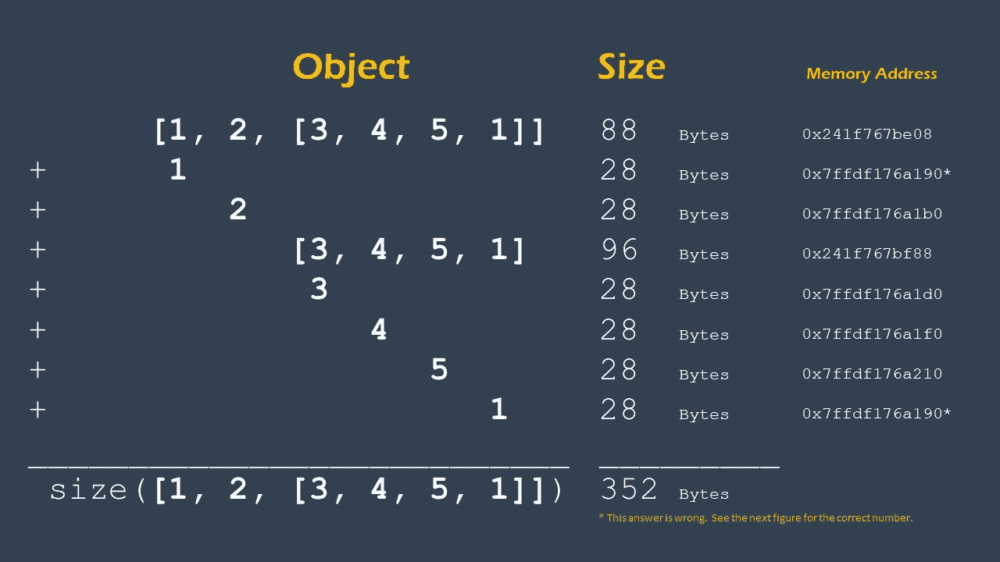
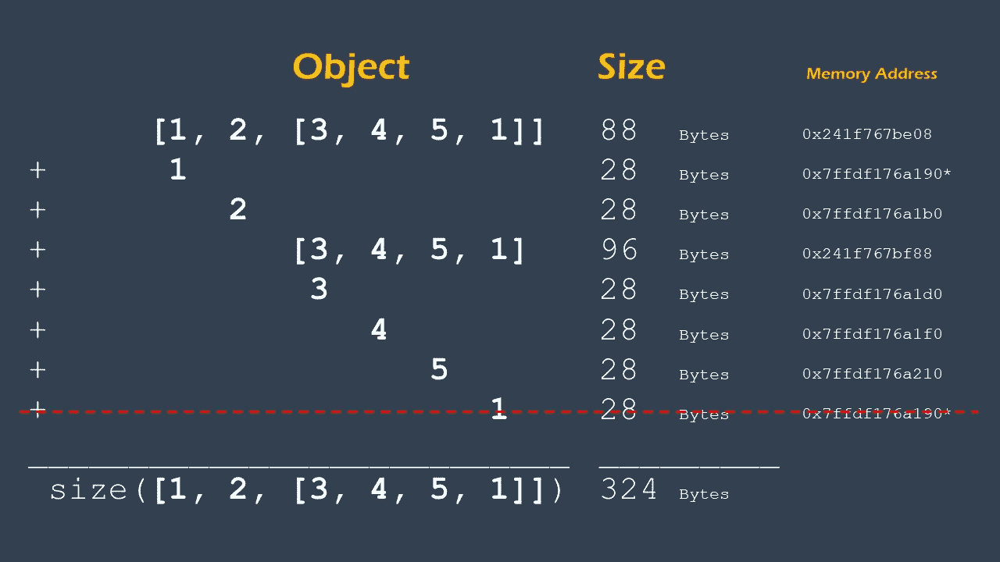

# 内存中 Python 对象的意外大小

> 原文：<https://towardsdatascience.com/the-strange-size-of-python-objects-in-memory-ce87bdfbb97f?source=collection_archive---------9----------------------->

## 数据科学

## 一个 Python 对象占用多少内存？


由[巴迪·阿巴斯](https://unsplash.com/@bady?utm_source=unsplash&utm_medium=referral&utm_content=creditCopyText)在 [Unsplash](https://unsplash.com/s/photos/abstract?utm_source=unsplash&utm_medium=referral&utm_content=creditCopyText) 上拍摄的照片

# 故事

我正在为一个数据科学项目用 Python 编写一本大字典。Resouce Monitor(一个显示硬件使用信息的 windows 实用程序)在短时间内显示了巨大的内存使用量。我知道我的代码草案并不是最佳的，但是内存利用率与我的字典长度的增长率并不相称。看起来我的字典长度和字典对象在内存中的大小没有线性关系。我决定在记忆中检查我的字典的大小。我确信应该有一个 Python 函数能给我答案，对吗？当然，我用谷歌找到了那个神奇的功能。经过一个小时的研究，我加入了 Python 程序员小组，他们意识到这个问题没有直接的解决方案。为什么？阅读这篇文章。

# 基础

如果你不熟悉 Python 如何管理内存，我推荐你先看看我的下面这篇文章。用通俗易懂的语言解释了 Python 如何给对象分配内存。

</python-memory-and-objects-e7bec4a2845>  

正如我在文章中解释的，Python 对象存储在堆内存(即动态内存)中。您可以通过使用一个名为`id()`的函数来获得堆内存(也称为 Heap)上的对象地址。你可以在上面的文章里读到更多的细节。

但是在那篇文章中，我们没有讨论堆上对象的大小。内存中一个对象的大小是多少？在这里，我给你这个问题三个答案。一个简单但错误，下一个稍微复杂一点，更准确，最后一个解是我们能得到的最正确的解。

我为什么要给你一个简单却错误的答案？原因是如果你先看到正确答案，你可能不明白为什么答案有点复杂。此外，你可能没有很好地理解这背后的原因。毕竟我们是在看文章，了解代码背后的原因和解决方案；否则，StackOverflow 几乎对所有事情都充满了正确且经过验证的解决方案。

# 简单而错误的答案

在 Python 中，测量内存中对象大小的最基本函数是`sys.getsizeof()`。让我们用几个例子来看看这个函数。

```
>>> sys.getsizeof(1)
28
>>> sys.getsizeof('Python')
55
>>> sys.getsizeof([1, 2, 3])
88
```

这三个例子以字节为单位显示了一个整数、一个字符串和一个列表的大小。乍一看，一切似乎都很好，你想知道为什么要写这篇文章，对不对？给我几分钟，我可能会说服你(就像我第一次看其他例子时被说服一样)。让我们看另一个例子。

```
>>> sys.getsizeof('')
49
>>> sys.getsizeof('P')
50
>>> sys.getsizeof('Py')
51
>>> sys.getsizeof('Pyt')
52
```

首先，我有一个空字符串。用了 49 个字节！然后我有一个只有一个字符的字符串，它的大小是 50 字节。我添加了更多的字符，似乎每个字符都为我的 string 对象的大小增加了一个字节。我们如何解释这一现象？其实很简单。在 Python 中，像几乎所有其他东西一样，字符串是一个对象，而不仅仅是字符的集合。一个对象(在这种情况下是一个字符串对象)，除了它的值(即字符的集合)之外，还有不同的属性和相关的组件。当我们创建一个对象时，Python 将所有这些信息存储在内存中。因此，即使对于空字符串，我们也有开销。

让我们检查同样的事情来获得一个列表。

```
>>> sys.getsizeof([])
64
>>> sys.getsizeof([1])
72
>>> sys.getsizeof([1, 2])
80
```

我们在这里看到同样的故事。一个列表对象有 64 字节的开销。每增加一项，其大小就增加 8 个字节。好吧，一开始很奇怪，但现在说得通了。我们再看一个例子(我向你保证，这个更有趣)。

```
>>> sys.getsizeof([1, 2])
80
>>> sys.getsizeof([3, 4, 5, 1])
96
>>> sys.getsizeof([1, 2, [3, 4, 5, 1]])
88
```

首先，我有一个`[1, 2]`列表，占用 80 字节内存。我有另一个列表`[3, 4, 5, 1]`，它占用了 96 个字节。到目前为止，一切都说得通。对于一个列表对象，我们有 64 个字节的开销，每个附加项有 8 个字节。现在，我将第二个列表嵌套在第一个列表中。结果列表将类似于`[1, 2, [3, 4, 5, 1]]`。当我得到这个新列表对象的大小时，它的大小是 88 字节。什么？！！新嵌套列表的大小(即 88 字节)甚至小于我的第二个列表的大小(即 96 字节)。怎么可能呢？

让我们回放一下。首先，我有一个包含两个项目的列表(即整数)。正如我们所料，它占用了 80 字节的内存。当我们添加一个新的条目时，这是一个列表，它给我的列表增加了 8 个字节。好像不管怎样，一个附加项都要 8 个字节。似乎列表对象不是存储项目，而是存储对项目的引用(即内存地址)。确实如此。当您创建一个 list 对象时，list 对象本身占用 64 字节的内存，并且由于对其他对象的引用，每个项目都会在 list 的大小上增加 8 字节的内存。这意味着在前面的例子中，`[1, 2, [3, 4, 5, 1]]`的列表像`[reference to obj1, reference to obj2, reference to obj3]`一样存储在内存中。每个引用的大小是 8 个字节。在这种情况下，`obj1`、`obj2`和`obj3`被存储在内存的其他地方。因此，要获得我们的列表对象的实际大小，除了获得列表的大小之外，我们还需要包括每个成员对象(我们称之为 items)的大小。

# 更复杂和更准确的答案

正如我们从上一节中了解到的，`sys.getsizeof()`只给了我们对象的大小和它在内存上的属性。它不包括被引用对象(例如，列表中的项目)的大小及其属性。要获得对象的实际大小，我们必须遍历对象的所有组件(例如，列表对象中的项目)并将它们的大小相加。下图就是一个例子。



图片由作者提供。

如上图所示，一个对象比如`[1, 2, [3, 4, 5, 1]]`的大小是 352 字节。但是，这个计算有一个错误。如果您查看图中的对象列表，您会在第 2 行和第 8 行看到相同的内存地址(用*突出显示)。好像主链表中的`1`(即整数对象)和嵌套链表中的`1`存储在同一个内存地址。正如我在上一篇文章中解释的那样( [link](/python-memory-and-objects-e7bec4a2845) )，Python 一次性存储[-5，256]之间的整数，并将所有引用指向同一个内存地址(用于内存优化)。因此，最好使用它们的内存地址(通过`id()`)来识别重复项，并计算一次它们的内存大小。因此，在我们的例子中，我们必须在对内存大小求和之前删除重复项。下图是正确答案，324 字节。



图片由作者提供。

# 尽可能准确

之前的解决方案比我们最初的计算更准确，但不幸的是，它仍然有一些警告。当你加载一个类时，一些你想不到的其他元素(比如 obj。__dict__ 或 obj。__slots__)，也可能存储在内存中。手动跟踪这些元素很困难，有时甚至是不可能的。搜索附加到对象的所有元素的一个更好的方法是使用 Python 垃圾收集器接口中的函数`gc.get_referents()`。

如果你不熟悉 Python 垃圾收集器，我推荐你[阅读这篇文章](https://stackify.com/python-garbage-collection/)。垃圾收集器跟踪堆中的所有对象和相关元素，并在程序不再需要它们时删除它们。

这里我们可以利用垃圾收集器接口( [link](https://docs.python.org/3/library/gc.html) )来查找所有链接到我们想要知道其内存大小的对象的元素。下面的代码循环访问附加到原始对象的所有对象和元素，并将它们的大小添加到对象的总大小中。

# 其他资源:

我还发现了下面这篇文章提供的一个很好的解决方案。尽管该解决方案适用于有限的对象集，但它看起来很可靠。

<https://goshippo.com/blog/measure-real-size-any-python-object/>  

# 摘要

测量内存中 Python 对象的大小不是一件容易的事情。没有一个内置的简单的解决方案来找到对象的实际大小。在本文中，我们了解了为什么测量物体的实际尺寸不容易。此外，我还提供了一个适用于 Python 中许多(不是所有)对象的解决方案。

在推特上关注我的最新报道:[https://twitter.com/TamimiNas](https://twitter.com/TamimiNas)