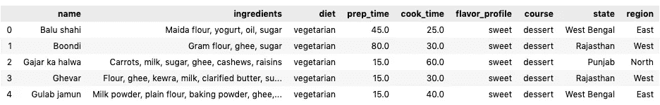
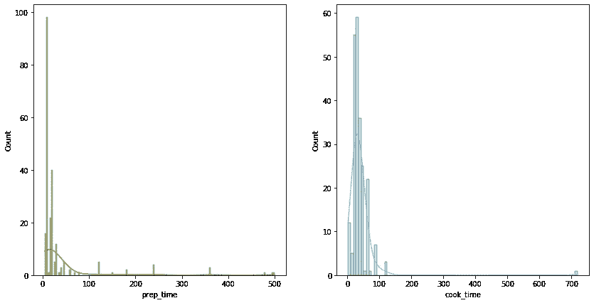
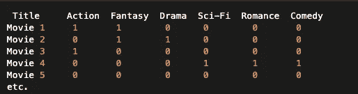
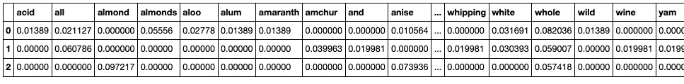
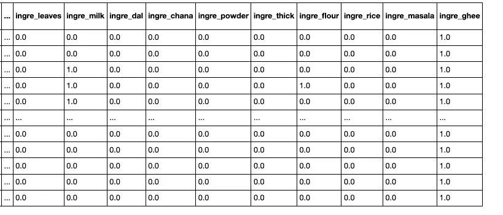

# 挣扎和提示:我从自己的分类项目中学到了什么

> 原文：<https://towardsdatascience.com/the-struggles-and-the-tips-what-i-learn-from-doing-my-own-classification-project-dc1e70937b09?source=collection_archive---------17----------------------->

## [实践教程](https://towardsdatascience.com/tagged/hands-on-tutorials)

## 与 Iris 数据集不同，一旦你开始在一些非常规的数据集上做你的第一个项目，1001 个问题就出现了


照片由[屋大维丹](https://unsplash.com/@octadan?utm_source=medium&utm_medium=referral)在 [Unsplash](https://unsplash.com?utm_source=medium&utm_medium=referral) 上拍摄

因此，已经到了建议你“找到你自己的数据集，并产生一些有趣的分析”的地步。如果数据集不那么受欢迎，或者任务更模糊，定义更不明确，并且 Kaggle 上没有数百个可用的笔记本，那就更好了。从我(可能是很多人)的经验来看，这样的数据集乱七八糟，有遗漏的条目，有太多/太少的观察，所有的特征都是最原始的形式。我的数据集没有什么不同，在经历了第一个项目后，我很乐意分享我的过程，并强调一些我在这个过程中遇到的数据问题以及我是如何处理它们的。



我正在使用的数据帧的快照

首先，我正在处理的数据集是关于来自 [Kaggle](https://www.kaggle.com/nehaprabhavalkar/indian-food-101/code) 的印度美食，它已经被许多人用于 EDA 任务。它只包含大约 250 个观察值(盘)和 9 个特征。尽管得到的样本量如此之小，我还是决定尝试一下，看看能否从这个数据集建立一个好的机器学习模型。故事是这样的，按时间顺序:

# “定义问题”阶段:仅有 2 个数值变量！！


沃洛德梅尔·赫里先科在 [Unsplas](https://unsplash.com?utm_source=medium&utm_medium=referral) h 拍摄的照片

让我感兴趣的第一个问题是从其他变量中预测烹饪时间，因为我认为味道太容易预测了——比方说，辛辣的菜肴肯定有一些特定的成分；另一方面，饮食相当简单，因为它只是二元的(素食者对非素食者)；每个州和地区都有各种各样的菜肴，所以用配料和口味作为这些菜肴地理位置的指标是没有意义的；最后，知道一道菜属于哪道菜不是很有趣，也没有帮助。然而，能够预测烹饪或准备时间可以帮助我们研究那些不太明显的特性组合(配料、口味等)，这些特性组合使得一道菜烹饪起来慢/快。

数据集中只有两个数值变量(准备时间和烹饪时间)，如果烹饪时间被设置为目标变量，准备时间将是唯一的连续自变量，这对于回归任务来说并不理想(事实上，我已经尝试过了，并且得到了一个很大的难以减少的 RMSE)。

为了解决这个问题，我通过将我的目标变量离散化为 3 个范围，将其转换为一个分类任务:1-quick ( <30 mins), 2-medium (30-60 mins), and 3-slow (> 1hr)。

```
>> bins = [0, 30, 60, 720]>> group_names = ['quick', 'medium', 'slow']>> df_train['cook_time'] = pd.cut(df_train['cook_time'], bins, labels=group_names)
```

# “预处理数据”阶段 1:缺失值

```
>> df.isnull().mean().round(4)*100name               0.00 
ingredients        0.00 
diet               0.00 
prep_time         11.76 
cook_time         10.98 
flavor_profile    11.37 
course             0.00 
```

超过 10%的观测值包含至少一个 NA 值。对于这样一个小数据集，删除所有这些行将留下非常少的数据点来训练模型，因此它不是这里的一个选项。相反，我将使用 sklearn 的*估算*模块估算 *prep_time* 和 *flavor_profile* 的缺失值。 *cook_time* 不应被估算，因为它是我们的目标变量，因此事先使用其他数据填充它没有意义，所以我们必须删除该特性的所有缺失值。我们从估算准备时间开始。看一看烹饪和准备时间的分布，我们可以看到它们都高度向右倾斜:



准备和烹饪时间直方图

因此，最合适的方法是使用 mode 来替换缺失值，而不是使用 median 或 mean。代码如下:

```
from sklearn.impute import SimpleImputerimp = SimpleImputer(missing_values=np.nan, strategy='most_frequent')df.dropna(subset=['cook_time'], inplace=True)*# fit transform the prep_time column* 
df['prep_time'] = imp.fit_transform(df['prep_time'].values.reshape(-1, 1))
```

对于 flavor_profile，我将使用 k-最近邻来估算其缺失值。因此，这必须在预处理所有其他列之后进行，在本例中，大多数列目前都是多种格式的字符串，下面将详细介绍其中一些。预处理其他特征后，该部分的代码为:

```
from sklearn.impute import KNNImputer
imputer = KNNImputer(n_neighbors=3)df= imputer.fit_transform(df)
```

# “预处理数据”阶段 2:配料栏


照片由 [Calum Lewis](https://unsplash.com/@calumlewis?utm_source=medium&utm_medium=referral) 在 [Unsplash](https://unsplash.com?utm_source=medium&utm_medium=referral) 上拍摄

我有两种方法可以设计这个功能:对最受欢迎的成分进行热编码，或者对每种成分使用原始的 TF-IDF 分数。从实验来看，后者比前者有更好的准确率。对于这两种方法，我使用了 **TF-IDF 分数**来衡量一种成分代表了整道菜的多少特征。(你可以在这里阅读更多关于 TF-IDF [。这个想法是，普通的配料，如盐、胡椒等，可能并不代表一道菜的烹饪时间，也不代表它的味道，因为很多菜都含有这些配料。另一方面，可能存在一些成分的组合，表明这道菜将需要很长时间来烹饪，我们正在尝试挖掘这种模式。](https://monkeylearn.com/blog/what-is-tf-idf/)

我将在下面总结我是如何使用这两种方法的:

## 一个热门编码:

这种方法被广泛用作构建电影推荐算法的示例，其中我们将每部电影的类型编码为以下格式:



电影类型—一个热编码

我会做同样的事情，但不是一个热编码所有的成分，我只选择最“tf-idf 重要”的成分烹饪时间。首先，我将配料栏分为 3 类烹饪时间:

```
quick_dish = df[df['cook_time'] == "quick"]['ingredients']
medium_dish = df[df['cook_time'] == "medium"]['ingredients']
slow_dish = df[df['cook_time'] == "slow"]['ingredients']
```

然后我把它们变成一个长文档:

```
**def** one_doc(dishList):
    string = ''
    **for** dish **in** dishList:
        string = string + " " + dish
    **return** string

quick = one_doc(quick_dish)
medium = one_doc(medium_dish)
slow  = one_doc(slow_dish)
```

其输出如下所示:

```
' Maida flour, yogurt, oil, sugar Gram flour, ghee, sugar Flour, ghee, kewra, milk, clarified butter, sugar, almonds, pistachio, saffron, green cardamom Cashews, ghee, cardamom, sugar Milk, cottage cheese, sugar Yogurt, milk, nuts, sugar Refined flour, besan, ghee, powdered sugar, yoghurt, green cardamom Firm white pumpkin, sugar...
```

然后我用 sklearn 的 TfidfVectorizer 计算他们的 TF-IDF 分数:

```
vectorizer = TfidfVectorizer()
vectors = vectorizer.fit_transform([quick, medium, slow])
feature_names = vectorizer.get_feature_names()
dense = vectors.todense()
denselist = dense.tolist()
pd.DataFrame(denselist, columns=feature_names)
```



由此产生的 tfidf 数据帧“虚拟”

然后，我提取了每个烹饪时间类型的“重要”成分，我在这里任意定义为每个文档中得分最高的 60 种成分，总共最多为 180 种成分(考虑到重复)，这是理想的，因为最初我不想有比观察更多的特征，但是您可以改变这个数字，并查看哪个阈值给出最高的准确性。

```
all_important_ingre = []
**for** index, item **in** enumerate(denselist):
    scores = {feature: tfidf **for** feature, tfidf **in** 
              zip(feature_names, item)}
    sorted_words = sorted(scores.items(), key=**lambda** x: x[1], 
                          reverse=**True**)
    **for** word, score **in** sorted_words[:60]:
        all_important_ingre.append(word)

top_ingre = list(set(all_important_ingre))
```

我的 all_important_ingre 变量现在将存储所有不同的重要成分，我们准备创建一个虚拟编码数据帧:

```
zeros = np.zeros((len(df_train), len(top_ingre)))
dummies = pd.DataFrame(zeros, columns = top_ingre)ingredients = df_train['ingredients']
sep_ingre = ingredients.apply(str.split, sep= ", ")
**for** i, dish **in** enumerate(sep_ingre):
    dish = list(map(str.lower, dish))
    indices = dummies.columns.get_indexer(dish)
    dummies.iloc[i, indices] = 1
dummies*# joining the original dataframe*
df = df.join(dummies.add_prefix('ingre_'))
```



最终表格的一部分如下所示

**我认为这种方法没有产生最佳结果的原因**:除了有数百种成分和更少的观察值之外，当用 PCA 和 t-SNE 可视化时，我们的数据无法聚类成不同的组。似乎表明一种成分是否在一道菜里并不足以让算法学习和做出决定，因为我们的数据框架已经由除了 *prep_time* 之外的所有分类变量组成(这也是为什么保留原始 tf-idf 分数——第二种策略——有助于模型更好地执行)。

## 原始 TFIDF 分数

对于这种方法，我决定保留所有的配料，因为不像仅仅用二进制来表示一种配料是否包含在一道菜里，原始的 tfidf 分数已经表明该配料是否不重要。换句话说，在前面的方法中，配料 X 在菜肴 A 上的得分为 1，如果它在两个菜肴中都有，则在菜肴 B 上的得分为 1，这使得 A 中的 X 与 B 中的 X 相同；但是在这种方法中，X 可能比 B 更能指示菜肴 A 的烹饪时间，因此 X 在 A 处的得分是 0.6，而 X 在 B 处的得分可能只有 0.1。此任务的过程类似于前面的方法，但更简单:

```
vectorizer = TfidfVectorizer()
vectors = vectorizer.fit_transform(df_train['ingredients'])
feature_names = vectorizer.get_feature_names()
dense = vectors.todense()
denselist = dense.tolist()
dummies = pd.DataFrame(denselist, columns=feature_names)
one_hot_encode_data = one_hot_encode_data.join(dummies.add_prefix('ingre_'))
```

就是这样！

我建议两种方法都尝试一下，除非你的数据框架强烈表明，基于上述理由，一种方法会比另一种更好。简单地连接到前面的部分，这是我们继续使用 KNNImputer 为 *flavor_profile* 估算缺失值的地方。

# “模型构建”阶段:一些好的实践

这些是我在做这个项目之前不知道的事情，但是在了解它们之后，我为自己节省了很多工作！

*   使用[*sk learn . model _ selection . cross _ val _ score*](https://scikit-learn.org/stable/modules/generated/sklearn.model_selection.cross_val_score.html?highlight=cross%20val%20score#sklearn.model_selection.cross_val_score)*轻松对数据集进行**交叉验证**。它返回每一次折叠所达到的准确度分数(或者您选择的另一个度量)的列表。在我对模型的所有评估中，我使用交叉验证的分数(这个列表的平均值和标准偏差)。我的所有模型(逻辑回归、随机森林、多重贝叶斯、SVM)在应用于重采样数据集时都提高了 10-20%。*

```
**# example*
rf = RandomForestClassifier(random_state=0)
scores = cross_val_score(rf, X, y, scoring='accuracy', cv=4, n_jobs=-1)
print('Mean Accuracy: %.3f (%.3f)' % (mean(scores), std(scores)))*
```

*   *对于你的**基线模型**，使用[*sk learn . dummy . dummy classifier*](https://scikit-learn.org/stable/modules/generated/sklearn.dummy.DummyClassifier.html?highlight=dummy%20classifier#sklearn.dummy.DummyClassifier)*。*它使用简单的规则对数据进行分类，如使用最频繁的类别标签，或随机统一生成预测。*

```
*model = DummyClassifier(strategy='most_frequent')
scores = cross_val_score(model, X, y, scoring='accuracy', cv=4, n_jobs=-1)
print('Mean Accuracy: %.3f (%.3f)' % (mean(scores), std(scores)))*
```

*   ***做错误分析**:除了准确性，我们还应该考察 f1 的得分和召回率。最初，我只对类 3 进行了重新采样(因此在此之后，类 1 有 131 个示例，类 3 有 131 个示例，但类 2 只有 84 个)。在这个数据集上拟合模型，我观察到所有 3 个类的准确度和精确度都非常高。但是二班的召回率很差。进一步的检查表明，许多类别 2 的例子被预测为属于类别 1。正是这种过度预测的行为让我意识到，相比其他班级，2 班的代表性不足。通过修正重采样方法来修正这个问题，提高了类 2 的召回率，从而产生了一个总体上更好、更一致的模型。这是一个例子，说明研究你的模型所犯的错误是多么富有成效。*

*除了参数调整，特征工程和特征选择是构建机器学习模型不可或缺的两个过程。特性工程应该总是在特性选择之前，特性选择在参数调整之前。在**特征工程**中，我经常会想到一些常见的任务，比如缩放/标准化特征、创建新列(我们预处理‘成分’列的方式也是特征工程)，以及更多特定于上下文的任务，比如处理不平衡的数据集，如下所述。对于**特征选择**，我使用了 sklearn 的*特征选择*模块，而[选择 KBes](https://scikit-learn.org/stable/modules/generated/sklearn.feature_selection.SelectKBest.html) t 是我最喜欢的技术之一。我在我构建的 4 ML 模型上尝试了“chi2”和“mutual_info”方法，每个模型都有我迄今为止拥有的 3 个数据集(一个是“前特征工程”，一个是“后特征工程，预重采样”，以及重采样数据集)。对于每一次拟合，我根据精度改变保留的特征数量(参数 k ),并选择产生最佳结果的阈值。*

# *“特征工程”阶段:不平衡数据集*

**

*照片由 [Piret Ilver](https://unsplash.com/@saltsup?utm_source=medium&utm_medium=referral) 在 [Unsplash](https://unsplash.com?utm_source=medium&utm_medium=referral) 上拍摄*

*大大提高我的模型性能的一件事是在烹饪时间的 3 个类别中有一个平衡的数据集。目前，我有 131 道快菜，84 道中菜，只有 12 道慢菜。[不平衡学习](https://imbalanced-learn.org/stable/references/index.html)是一个建立在 scikit-learn 基础上的包，它提供了处理不平衡数据集的工具，如重采样、计算平衡精度分数等。这里，我使用一种称为 SMOTENC 的过采样策略对类 2 和类 3 进行过采样，以便它们具有与类 1 相同的观察结果。SMOTE 是过采样的常用技术；SMOTENC 构建于 SMOTE 之上，但可用于具有数值和分类特征的数据帧。*

```
*X_resampled, y_resampled = SMOTENC(categorical_features=range(1, 
11),random_state=0,sampling_strategy='minority').fit_resample(x_full2, y_full2)*
```

*值得注意的是，虽然过采样有助于产生更好的结果，但它也有一些缺陷，因为它精确地复制了少数类的例子。因此，如果少数类中只有一个示例，那么在重新采样的数据帧中就会有数百个它的副本。这将导致严重的过度拟合。对多数类进行欠采样通常会更好。然而，由于我们的数据集非常小，这不是一个好策略。事实上，我的各种模型在 3 类中表现得非常好，但它与 1 类和 2 类的一些示例更加混淆。*

# *“模型调整”阶段:堆叠模型*

**

*由[马库斯·斯皮斯克](https://unsplash.com/@markusspiske?utm_source=medium&utm_medium=referral)在 [Unsplash](https://unsplash.com?utm_source=medium&utm_medium=referral) 上拍摄的照片*

*我通常会在对一些选定的模型进行参数调整后停下来，结束一天的工作。但是当我看到[这篇关于改进 ML 模型的文章](https://www.dummies.com/programming/big-data/data-science/10-ways-improve-machine-learning-models/)时，我看到了堆叠模型，这是一种我以前没有尝试过的技术。堆叠是一种有效的集成方法，其中通过使用各种机器学习算法生成的预测被用作第二层学习算法[【1】](https://blogs.sas.com/content/subconsciousmusings/2017/05/18/stacked-ensemble-models-win-data-science-competitions/)中的输入。我们构建堆叠分类器的方式类似于我们制作管道的方式，具有我们在之前的调优阶段已经实现的所有最佳参数:*

```
*models = [
('lr', LogisticRegression(C=2.976351441631316, max_iter=500) ),
('svm', SVC(random_state=0, C=6.158482110660261) ),
('rfc', RandomForestClassifier(n_estimators=130, random_state=0, max_depth=46))]level1 = LogisticRegression()stacking = StackingClassifier(estimators=models, final_estimator=level1, cv=5)* 
```

*之后，我们将在经过特征工程和特征选择的数据集上拟合模型。据观察，在单个模型上产生最佳结果的 k 值(即使所有模型具有相同的最佳 k 值)并不是组合模型的最佳 k 值。因此，我们也应该改变这个阈值，看看哪个 k 值表现最好。*

# *一些结束语…*

*最后，我的性能最好的模型是随机森林和 SVM 的堆叠模型，使用了 mutual_info 特征选择技术，达到了 81%的交叉验证准确率。我认为用你的数据集和模型做大量的试验(和错误)是必要的。你测试的越多，你就越有把握获得最好的结果。众所周知，建立一个好的 ML 模型是一个探索和修正的循环，所以要有耐心，把任务分解，一次一个阶段地攻克它。我希望这篇文章能帮助你建立自己的项目，尤其是初学者。如果你做到了这一步，非常感谢你的阅读，祝你的项目好运！*

*这个笔记本的完整版本可以在这个 Github repo 中找到:*

*<https://github.com/irenechang1510/indian-cuisine-EDA>  

请随时通过我的 LinkedIn 联系我，如果您有任何问题，我很乐意与您联系！

[1] Güne，Funda。*为什么堆叠集合模型赢得了数据科学竞赛？*SAS 数据科学博客，2017 年。[https://blogs . SAS . com/content/潜意识音乐/2017/05/18/stacked-ensemble-models-win-data-science-competitions/](https://blogs.sas.com/content/subconsciousmusings/2017/05/18/stacked-ensemble-models-win-data-science-competitions/)*