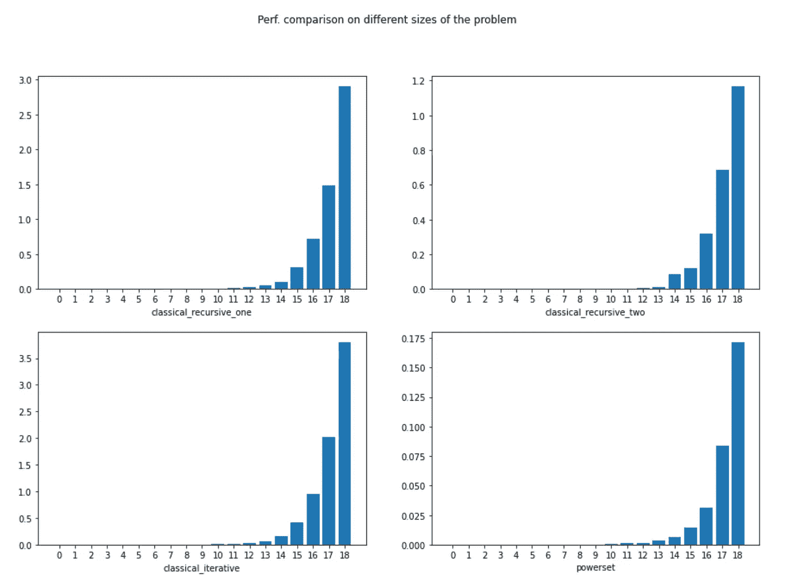

# Python 3 中集合的子集(幂集)

> 原文：<https://towardsdatascience.com/the-subsets-powerset-of-a-set-in-python-3-18e06bd85678?source=collection_archive---------12----------------------->

## 查看递归、迭代和其他实现来比较它们的性能

我第一次想到这个问题是当我在一个与工作相关的项目中测试一个组件的时候。那时，我已经意识到，为了正确地测试组件，我应该生成看起来像是 2ⁿ独特的情况( **n** 是元素*类型*的数量)。2ⁿ…odd 巧合还是什么？

经过一番思考，我意识到这是一个通用的答案，因为这些是您可以从具有 **n** 个元素类型的集合中生成的子集*类型*的数量。我说了很多次类型，因为我想强调我在寻找可能的测试签名，不管内容是什么。

假设我们有一个函数， *f* ，它需要三个参数(三个是必须的，我们将用一个**断言**来说明)。如果我们允许 **None** (或者 **null** 取决于编程语言)作为输入，我们有多少种可能性？ **None** (或 **null** )是一个泛型类型，通常分配给面向对象编程语言(如 Python 或 Java)中所有标准类型共有的对象(这是因为标准类型通常继承一些原始对象，如*‘Object’*)。答案是 8，因为我们要么把一些内容放在一些参数中，要么我们不⇔ 0 或 1，所以 2ⁿᵘᵐᵇᵉʳ ᵒᶠ ᵖᵃʳᵃᵐᵉᵗᵉʳˢ.

我将使用 Python3，使用生成器(因为是指数级的，所以我想节省内存)。幸运的是，有多种方法可以生成集合的幂集(通常这样称呼)。看到其中的差异还是挺有意思的。总的来说，我们有:

1.  递归实现 I；
2.  递归实现 II；
3.  迭代实现；
4.  使用*工具*中的**链条**和**组合**。

# 递归实现 I

我真的很喜欢这个(可能是因为这是我唯一一个从上到下起草的，其他的都是，稍微修饰一下，收集起来的)。在这个问题上，我以一种归纳的方式思考……这个问题，大小为 n，和它更小的表亲，大小为 n-1，一样多。我认为这是一个使用向后递归的好方法，在我们退出递归调用时构建解决方案。

我想强调一点。尽管*【隐藏】*，这个解决方案具有在所有递归实现中使用的思想——即完整的解决方案 *S([H|T])=[H|S(T)，S(T)]*(*H*——是初始列表的头部元素， *T* 是尾部(列表中的其余元素)。对于那些有 Prolog 背景的人来说，这应该看起来非常直观。

看着下面的代码，你可能会问，我们在哪里连接这两个解决方案(一个有 H，一个没有 H)。答案在循环的**中，考虑到了 **yield []** 部分。**

```
def classical_recursive_one(elems):
    yield [] # first return the result we’re sure about 
    for i in range(len(elems)):
        for x in classical_recursive_one(elems[i+1:]): 
            # induction part 
            yield [elems[i]] + x sth = [‘neigh’, ‘category’, ‘purpose’]
for x in classical_recursive(sth):
    print(x)
```

结果:

```
[] 
['neigh'] 
['neigh', 'category'] 
['neigh', 'category', 'purpose'] 
['neigh', 'purpose'] 
['category'] 
['category', 'purpose'] 
['purpose']
```

# 递归实现 2

这个方法再次使用了向后递归，其思想是通过获取当前位置的元素或不获取当前位置的元素来构造解决方案:

```
def classical_recursive_two(elems):
    """ Given a list of elements return a generator 
    that will generate all the subsets """
    if len(elems) <= 1:
        yield elems
        yield []
    else:
        for item in classical_recursive_two(elems[1:]):
            yield [elems[0]] + item
            yield itemsth = [‘neigh’, ‘category’, ‘purpose’]
for x in classical_recursive_two(sth):
    print(x)
```

结果:

```
['neigh', 'category', 'purpose'] 
['category', 'purpose'] 
['neigh', 'purpose'] 
['purpose'] 
['neigh', 'category'] 
['category'] 
['neigh'] 
[]
```

我将解释*其他*部分。这就是所有的乐趣所在。这反映了我在构建解决方案时提到的两个决策分支。所以**对于**子问题的所有可能解(这就是为什么需要**对于**，通过 2 个产量构造两个**新的**可能解。很简单…

# 迭代实现

这是做这件事的老方法。尽管如此，它还是很优雅。它利用了难以置信的特性😄从 1 到 2ⁿ的所有数字都是不同的。如果我们以 2 为基数写这些数字，那么这些 1 和 0 位可以解释为:“如果 1，则从列表中取出元素，如果 0，则不取出元素”。但是，嘿，我们实际上可以用一些比特运算魔法来做到这一点:

```
def classical_iterative(elems):
    powerset_size = 2**len(elems)
    counter = 0
    j = 0

    for counter in range(0, powerset_size):
        results = []
        for j in range(0, len(elems)):
            # take the element if on bit position j it says to take it (i.e. 1 appears)
            if((counter & (1 << j)) > 0):
                results.append(elems[j])
        yield results

sth = [‘neigh’, ‘category’, ‘purpose’]
for x in classical_iterative(sth):
    print(x)
```

结果:

```
[] 
['neigh'] 
['category'] 
['neigh', 'category'] 
['purpose'] 
['neigh', 'purpose'] 
['category', 'purpose'] 
['neigh', 'category', 'purpose']
```

# 使用 itertools 中的链和组合

这是为手懒的人准备的…尽管如此，这是对 itertools 的聪明使用。*链*用于将多个序列视为单个序列和组合来生成…所有可能的组合。这有什么特别之处，以及它与我们的问题有什么关系。恰好所有可能的 n 种组合的总和实际上是 2ⁿ.这是一个冗长的问题，需要一些时间来真正理解这个属性…本质上，如果您不理解这个解决方案，请尝试理解这个属性:

```
from itertools import chain, combinationsdef powerset(iterable):
    "powerset([1,2,3]) → () (1,) (2,) (3,) (1,2) (1,3) (2,3) (1,2,3)"
    s = list(iterable)
    return chain.from_iterable(combinations(s, r) for r in range(len(s)+1))sth = [‘neigh’, ‘category’, ‘purpose’]
for x in powerset(sth):
    print(list(x))
```

结果:

```
[] 
['neigh'] 
['category'] 
['purpose'] 
['neigh', 'category'] 
['neigh', 'purpose'] 
['category', 'purpose'] 
['neigh', 'category', 'purpose']
```

# 性能比较

好了，现在我们已经画出了解决方案，哪一个实际上更快。让我们来测试一下:

```
import matplotlib.pyplot as plt
from time import timedef time_me(func, elems):
    start = time()
    # Because it's a generator we want to evaluate it
    list(func(elems))
    end = time()
    return end - start

def gather_times(func, min_value, max_value):
    times = []
    print(f"Gathering running times for {func.__name__}:")
    for value in range(min_value, max_value):
      test_elems = list(range(1, value))
      times.append(time_me(func, test_elems))
    print(times, '\n')
    return times START = 3
STOP = 22
FIG_SIZE = (15, 10)funcs = [classical_recursive_one, classical_recursive_two, classical_iterative, powerset]
fig, axs = plt.subplots(2, 2, figsize=FIG_SIZE)
fig.suptitle('Perf. comparison on different sizes of the problem')
for i in range(2):
    for j in range(2):
        sol_func = funcs[i * 2 + j]
        sol_times = gather_times(sol_func, START, STOP)
        axs[i][j].bar(range(STOP-START), sol_times)
        axs[i][j].set(xlabel=sol_func.__name__)
        axs[i][j].set_xticks(range(STOP-START))
```



[图片由作者提供]

请看每幅图的 y 轴。您将看到，尽管所有方法都有指数级的运行时间(因为问题本身就是如此)，但是 powerset 解决方案是最好的。相比之下，我的方法在迭代后的速度方面几乎是最差的…没关系，现在我们知道在生产中使用哪一个了。