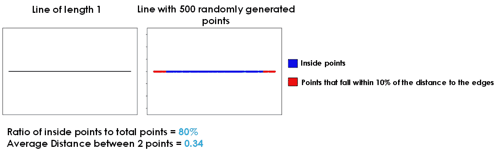
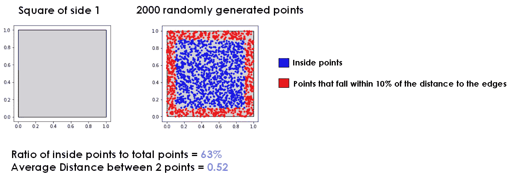
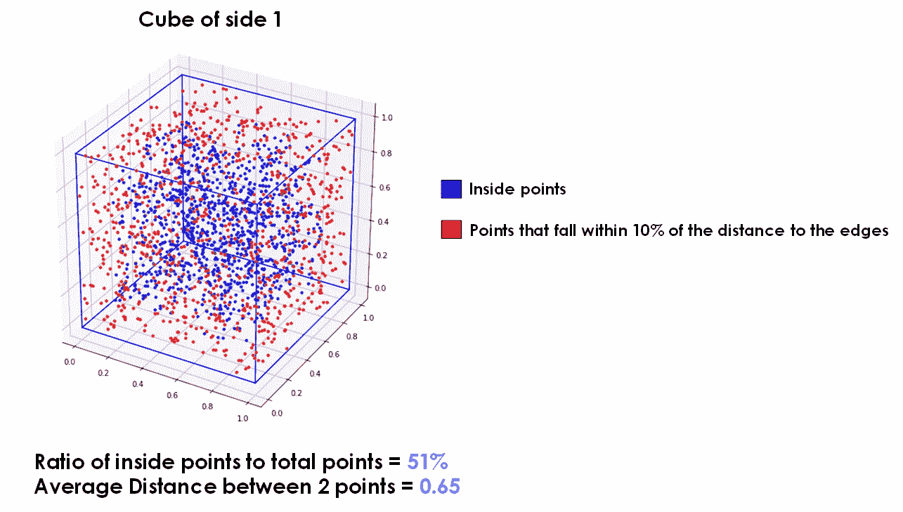
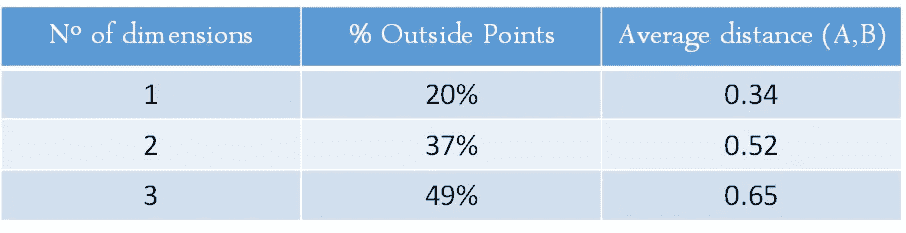
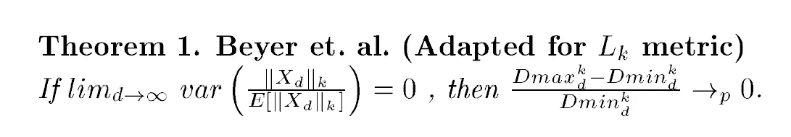
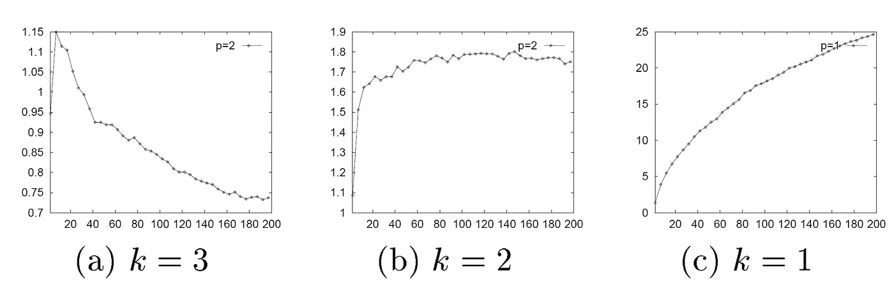
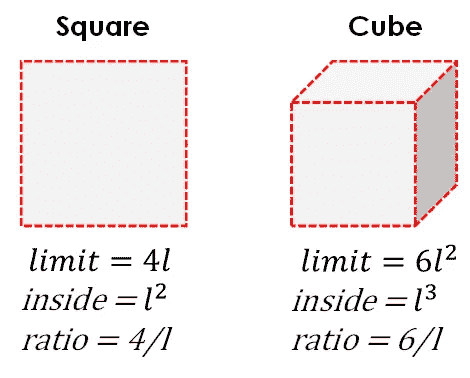

# 高维空间中距离度量的惊人行为

> 原文：<https://towardsdatascience.com/the-surprising-behaviour-of-distance-metrics-in-high-dimensions-c2cb72779ea6?source=collection_archive---------9----------------------->

## 了解距离度量如何在高维🧊中失去其意义和功能


丹尼尔·利维斯·佩鲁西在 [Unsplash](https://unsplash.com/s/photos/cube?utm_source=unsplash&utm_medium=referral&utm_content=creditCopyText) 上的照片

# 0)简介

[**距离度量**](https://aigents.co/blog/publication/distance-metrics-for-machine-learning) ，像欧几里德、曼哈顿、闵可夫斯基等等，**在我们增加数据的维度数量**(特征)的时候损失很大。就好像它们冲淡并失去了它们的意义。变得不可靠。

这不是很容易理解，而且它与更多的功能等于更好的机器学习模型的一般理解相冲突，**这远不是真的**。

减少我们的数据的维度是应该总是尝试去做的事情，以便去除冗余或有噪声的特征。**您可以在本文** **中了解到关于特征选择** [**的所有信息。**](/an-introduction-to-feature-selection-dd72535ecf2b)

此外，当我们要使用计算距离度量的算法时，**像 PCA 或核 PCA** 这样的降维技术是一个非常聪明的处理选择，可以应用于我们的数据。

有一篇 [**机器学习领域的名义论文**](https://www.researchgate.net/publication/30013021_On_the_Surprising_Behavior_of_Distance_Metric_in_High-Dimensional_Space) 讲的是距离度量专门遭受维数灾难。

然而，这篇论文并不令人惊讶地直观，并且有许多复杂的数学公式，所以在这篇文章中，我将以简单渐进的方式解释为什么像欧几里德距离这样的距离度量在高维计算时会遭受如此多的损失。

**首先，我们将看看什么是著名的维数灾难**，以及它如何影响我们的机器学习算法。

然后，我们将具体了解**它如何使距离度量失去意义**，并浏览本文最重要的部分。

**最后，我们将把所有的东西融合在一起**，以一种高度可视化的方式，引入其他资源和见解，从而解决这个难题。

<https://z-ai.medium.com/subscribe>  

## Lets get to it! 🏁

# 1\. What is the Curse of Dimensionality?👻

**维度的诅咒**是指在高维度(有很多特征)中分析或摆弄数据时出现的某些行为或效果，这些行为或效果在维数较低时不会出现。

**我们人类的直觉和理解仅限于三维世界。**如果保持在这个参照系之内，我们可以直观地推导出事情为什么会发生，逻辑上得出一些假设。然而，我们很难理解当我们被带离这个有限的维度空间时会发生什么。

正因为如此，当我们的数据有很多维度时，高维度对我们的模型和算法的影响可能会**逃脱我们的直觉**，尽管我们知道这样一个事实，即更多的特征并不总是导致我们的机器学习管道中更好的结果。

***更多特征究竟是如何影响机器学习的？***

## 让我们来看看吧！👓

# 2.更高维度如何影响我们的机器学习算法？🔎

大多数时候，我们倾向于将包含许多特征的数据集扔给我们的模型，然后等待看结果如何，希望如果结果不够好，**更多的特征会起作用**。然而，事实远非如此。

机器学习管道中最重要的步骤之一是**选择那些真正改善我们模型的特性**并保持它们简洁、可理解和可扩展。这是通过[特征选择](/an-introduction-to-feature-selection-dd72535ecf2b)或降维技术完成的，这可以被视为特征选择。

让我们看看当我们添加更多的特征时会发生什么，从而为我们的数据添加维度:

*   **随着维度数量的增加，我们的数据变得更加稀疏**。每一个新的维度都增加了特征空间的体积，使我们的数据有更高的区分机会，因此，它在高维空间中比在低维空间中更分散的可能性更大。这意味着，如果我们需要更多的同类训练样本，以便我们的模型能够了解它们，并能够在未来很好地预测它们，进行概括。
*   **训练我们的模型需要更长的时间:**随着维度数量的增加，特别是对于参数模型，我们会增加训练它们所需的时间。
*   **增加噪声并降低模型性能:**引入对我们的模型没有增加多少价值的特征并因此增加维数，使得我们的模型从这些“噪声”或不相关的特征中学习，并可能导致其性能降低。参见*休斯现象——在训练样本数量固定的情况下，分类器或回归器的平均(预期)预测能力首先会随着使用的维度或特征数量的增加而增加，但超过某个维度后，它会开始恶化，而不是稳步提高。*
*   **我们的模型更复杂:**更多的特征和维度导致模型比那些特征数量少的模型更复杂、更难解释。
*   **距离指标失去了它们的意义:**最后，随着我们增加数据的维度，我们数据集的两点之间的平均距离也会增加。这就像用来计算距离的度量变得模糊不清，失去了它的意义。此外，对我们的数据点在高维空间中的分布也有进一步的影响。

## 最后一个似乎有悖直觉，所以让我们深入探究一下，找出原因！🧊

# 3.更高的维度如何影响距离度量？🏙️

我一直在说，随着我们增加数据的维度数量，**距离度量有点失去了它们的意义**。然而，我从未展示过这是真的任何例子。

让我们缩小范围，从头开始研究这个现象:**一条简单的直线➖！**

## 3.1 —一维:简单的直线

让我们看一条长度为 1 的直线(一维)。



一维空间(一条线)的度量—作者图片

上图显示了长度为 1 的一维空间(直线)。

**首先，**如果我们沿着这条线随机产生 500 个点，并计算落在 1 维空间界限的 10%距离内的点(从 0 到 0.1 和 0.9 到 1 的那些点)，并计算这些点相对于总点数的比率，我们得到总点数的大约 **20%落在该类别内**(在点之外的**点，红色点)，80%在剩余空间内**

这是一个需要计算的重要指标，我们稍后会看到原因。此刻，只要记住落在一维空间边缘或界限附近的点的比例:**大约 20%。**

**其次**，如果我们从这 500 个点中随机选取任意两个点，计算它们之间的距离，并重复这个过程 10000 次(足够的次数来确保我们得到一个有代表性的样本)，选取的两个随机点之间的平均距离为 **0.34** 。

这是我们要考虑的第二条信息:我们数据中任意两点之间的**平均距离**，正如我们将看到的，随着维度数量的增加，它会变得更大。

让我们来看看正方形的⬜️！

## 3.2–2 维:一个完美的正方形

现在，让我们看看在一个由边长为 1 的正方形定义的二维空间中会发生什么。



二维空间(正方形)的度量—作者图片

和前面的例子一样，我们**在我们的二维空间内随机生成**一系列**点**，在本例中为 **2000** 。

然后，我们计算这些点中有多少是在我们的二维空间的边缘附近(在与整个空间共享中心的边长为 0.8 的正方形之外，或者在到边的距离的 10%之内)，并将这个数字除以总点数，以得到有多少随机生成的样本在边缘附近的想法。

这次大约是 37%,比一维示例中多 17%。

**其次是**，我们**计算随机选择的两个点之间的距离**10.000 次，然后对结果取平均，得到我们数据集的任意两个点之间的平均距离 **0.52:比一维示例中的**多 0.18！****

你可以开始看到这里发生了什么，对吗？随着我们增加维度，接近我们特征空间的边缘或界限的点的数量增加，并且任意两点之间的平均距离也增加。

让我们在我们能够可视化的最后一个维度空间中检验一下这个:一个 3D 的立方体🏗️!

## 3.3–3 维:一个完美的立方体

为了结束这条路线，并让你相信这是一件真实的事情，在解释为什么会发生之前，让我们看看一个单面的三维空间的数字:一个立方体。



三维空间(立方体)的度量—作者图片

这一次我将跳过指标是如何计算的以及它们的含义，因为我们已经看过两次了。

**可以观察到的图案****仍然在那里**:不在‘内部’立方体内的点的**比率为 49%** ，比正方形高 12%，并且两个随机选择的点之间的平均**距离为 0.65** ，**比我们的二维示例中的**高 0.13**。**

你可能想知道。**总是这样吗？**如果我们计算有多少个点不接近 N 维空间的极限，N 的范围从 1 到 8 维，我们得到以下输出:

```
For 0 Dimensions the proportion of points inside is 0.80
For 1 Dimensions the proportion of points inside is 0.63
For 2 Dimensions the proportion of points inside is 0.51
For 3 Dimensions the proportion of points inside is 0.40
For 4 Dimensions the proportion of points inside is 0.32
For 5 Dimensions the proportion of points inside is 0.26
For 6 Dimensions the proportion of points inside is 0.20
For 7 Dimensions the proportion of points inside is 0.18
For 8 Dimensions the proportion of points inside is 0.13
```

如您所见，**随着我们增加数据的维度数量**，越来越多随机创建的样本(可能在任何地方)走向空间的极限或极端。

如果我们有一个超球体形状的无限维空间，所有的点都在这个♾️维空间的表面:如果它是一个橙子，每个点都在表皮上，我们就没有多汁的内部。

**此外，任意两点之间的距离变得越来越相似**，因此使用距离度量(例如 K-means 所需的度量)来评估两点的接近程度没有什么意义，因为几乎每个点都与所有其他点一样接近。

下表总结了我们刚才看到的 1 维、2 维和 3 维示例。



包含前面提到的 1 维、2 维和 3 维指标的表格

让我们用通俗的语言看看这篇论文说了些什么，然后结束这一切，揭开这个神秘现象的面纱🔮！

# 4.高维空间中距离度量的惊人行为💯

我们谈到的论文(你可以在这里找到)从范数 K 距离度量的角度解决了这个问题。L1 范数是[曼哈顿距离](https://xlinux.nist.gov/dads/HTML/manhattanDistance.html#:~:text=Definition%3A%20The%20distance%20between%20two,y1%20%2D%20y2%7C.&text=Lm%20distance.)，L2 范数是著名的[欧几里得距离](https://en.wikipedia.org/wiki/Euclidean_distance#:~:text=In%20mathematics%2C%20the%20Euclidean%20distance,being%20called%20the%20Pythagorean%20distance.)，等等。

**它首先介绍了诅咒维度**，探讨了如何以一种特殊的方式影响距离度量。然后，讨论并提供证据表明，较高的范数度量比较低的诅咒度量遭受更多的诅咒。

论文的每一页都覆盖着如下丑陋的数学公式，吓走了恐惧的读者。



高维空间中距离度量的惊人行为。定理 1。

然而，他们的结论很容易解释，而且非常有影响力:

*   在高维空间中**数据变得更加稀疏。**
*   随着维度数量的增加，**的邻近概念**或最近点失去了它的效用，**变得不那么有意义**。
*   随着维数接近无穷大，最远点到另一个点和最近点之间的距离比变得接近 1: **最近邻问题变得难以定义。**
*   **某个 *Lk* 范数或距离度量的 k 值与**度量随着尺寸增加而降低的程度直接相关。
*   **k 的这个值越高，由高维度中的距离度量提供的最近和更远的邻居之间的对比度越差**:对于非常高的维度，较低的范数度量，如曼哈顿(L1 范数)可能比较高的范数度量如 L2 欧几里德距离表现得更好。

这些最后的结果可以在下图中看到:



高维空间中距离度量的惊人行为。图一。

这些图表显示了随着数据维度(x 轴)的增加，最远的点和最近的点之间的距离。我们可以看到，对于 k = 3，这种差异开始走向 0。对于 *k = 2* ，当我们增加维度时，这种差异似乎收敛到一个恒定值，而对于 *k = 1* ，这种差异发散到无穷大。

这意味着**更高的范数度量**(更高的 k 值)**在最远的点和最近的点之间提供了更差的对比度**(因为当我们增加维数时，这两点之间的距离收敛到 0)。

在证明了这一点之后，本文继续探索分数距离度量 *(0 < k < 1)* ，表明这些可以提供比以前研究的距离度量更好的结果和对更高维度的更大弹性。

论文最后显示，在高维度(20 个用于合成数据，168 个用于 [Musk 数据集](https://archive.ics.uci.edu/ml/datasets/Musk+(Version+2))，32 个用于[乳腺癌](https://archive.ics.uci.edu/ml/datasets/Breast+Cancer+Wisconsin+(Diagnostic))，34 个用于[电离层](https://archive.ics.uci.edu/ml/datasets/ionosphere))中，分数范数距离度量比 K-means 聚类算法中的更高范数距离度量工作得更好，K-means 聚类算法试图将数据类别识别为不同的聚类。

**牛逼！**探究了一下这篇论文的内容之后，**让我们解释一下为什么会发生这一切，然后用一个令人敬畏的、有见地的结论来总结**。

# 5.把一切都包起来，✔️

**好吧，那么为什么会这样呢？**我们可以从所有这些中得出什么实际的隐含结论？

**为什么我们的距离度量会在高维空间中丢失？**为什么随着维度的增加，我们的点越来越接近 N 维空间的极限？为什么两个随机点之间的距离会增加？为什么我们的数据在高维空间更稀疏？

让我们回到广场。正方形定义的空间内部的尺寸为 L*L(正方形的面积)。这是我们的数据点所在。对于正方形来说，这个空间的边界是它的周长: **4L** 。

如果我们计算**极限值/内部值**的比值，我们得到 4L/L*L，也就是平方的 **4/L。**

让我们对立方体进行同样的推理。立方体内部的空间为 L*L*L，空间的极限为 6L*L，由立方体的 6 个平方面定义。

因此，如果我们执行相同的计算，并得到立方体上的极限/内部的比率，我们得到 6L*L/L*L*L，这是 **6/L，高于正方形的情况！**



正方形和立方体的极限/内侧比的比较。图片作者。

如果一直这样下去，计算一个 N 维立方体的 ***极限/内*** 的比值，这个数就一直变得越来越大，分母总是有一个 L，但名子越来越大。

这告诉我们什么？简单:随着我们增加特征空间的维度，相对于总的特征空间，处于极限的空间比例变得更大。这就是为什么当我们为一条线、正方形和立方体随机创建点时，我们看到越来越多的点接近极限。**瞧！问题回答**。👌

**我挑战你对一个圆和一个球做同样的事情。看看能不能得出类似的结论！**小提示:**如果你把你的无限维球形空间想象成一个无限维的橙子，你的所有数据点都将靠近果皮，没有一点会在里面美味的水果中游动。🍊**

**接下来。为什么我们的数据在高维空间更稀疏？**基本上，如果我们增加维度或特征，我们的数据就有更大的机会与其他数据点区分开来。

假设你有一个关于人的数据集。如果只有人的年龄，基本上可以做出四五组:很年轻的人，年轻人，中年人，老年人，老年人。如果现在你加入另一个维度，比如性别，你就把可能的组合翻倍了。如果你加上第三个因素，比如身高，如果我们按照身材矮小、正常和身材高大来分组，那么分组的可能数量就是原来的三倍。**看到我要去哪里了吗？**

**维度越多，我们的数据就越有可能与众不同，**变得独一无二，这就是数据变得越稀疏的原因。这也是为什么两个随机点之间的距离随着更多维度而增加的答案:**每个数据点都变得越来越独立，与其他数据点不同！**

**最后，**为什么最远的点和最近的点之间的**距离越来越小**直到 0？这在一定程度上与我们刚刚看到的数据变得更加独特和稀疏有关。随着维度的增加，我们会使数据点之间的差异更大，并给它们更高的区分机会。

随着维数的增加，我们的数据变得越来越稀疏。这意味着**特征空间被占据的比例减少。**

随着空间变得越来越大，数据变得越来越稀疏，最近的点和最远的点之间的差异变得越来越小，直到它在无穷多个维度上达到 0。**塔兰！**

数据在高维空间中确实表现古怪。

**底线:**在计算距离度量时，使用[特征选择](/an-introduction-to-feature-selection-dd72535ecf2b)或[特征重要性](/random-forest-for-feature-importance-ea90852b8fc5)和降维技术的组合，尽量保持你的特征数量适中。您将会看到，除了促进[可解释性](/explainable-artificial-intelligence-14944563cc79)和减少培训时间之外，这在很多情况下会导致模型性能的提高。

<https://z-ai.medium.com/subscribe>  

**仅此而已！** *更多关于机器学习的资源请查看* [*以下回购*](https://howtolearnmachinelearning.com/books/machine-learning-books/) *，希望大家喜欢！*

请继续关注我的下一篇帖子！

在那之前，保重，享受人工智能！

*感谢阅读！*