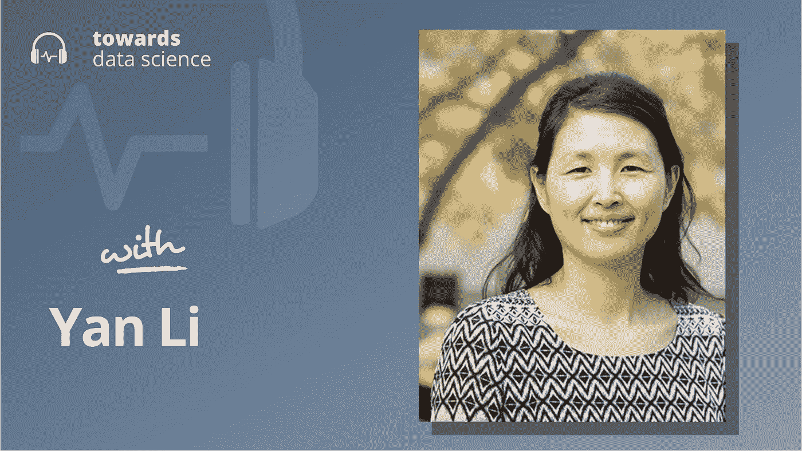

# 全球人工智能慈善事业的惊人挑战

> 原文：<https://towardsdatascience.com/the-surprising-challenges-of-global-ai-philanthropy-7a37718f9679?source=collection_archive---------27----------------------->

## [播客](https://towardsdatascience.com/tagged/tds-podcast)

## 李岩分享了在全球范围内利用技术造福人类的经验

[苹果](https://podcasts.apple.com/ca/podcast/towards-data-science/id1470952338?mt=2) | [谷歌](https://www.google.com/podcasts?feed=aHR0cHM6Ly9hbmNob3IuZm0vcy8zNmI0ODQ0L3BvZGNhc3QvcnNz) | [SPOTIFY](https://open.spotify.com/show/63diy2DtpHzQfeNVxAPZgU) | [其他](https://anchor.fm/towardsdatascience)

*编者按:这一集是我们关于数据科学和机器学习新兴问题的播客系列的一部分*，*由 Jeremie Harris 主持。除了主持播客，Jeremie 还帮助运营一家名为*[*sharpes minds*](http://sharpestminds.com)*的数据科学导师初创公司。*

我们最近录制了一些播客，内容是关于人工智能现在和将来会造成的问题。我们已经讨论了人工智能的安全性、一致性、偏见和公平性。

这些是重要的话题，我们将继续讨论它们，但我也认为不要忽视人工智能和类似工具在此时此地给世界带来的价值是重要的。因此，在本期播客中，我采访了李岩博士，他是一名研究数据管理和分析的教授，也是致力于将技术用于人道主义公益的非营利组织 Techies Without Borders 的联合创始人。Yan 拥有开发和部署技术解决方案的第一手经验，可用于从西藏到海地的世界各地的贫困国家。

以下是我在对话中最喜欢的一些观点:

*   当你试图在偏远或贫困地区开发技术时，你会遇到令人惊讶和违反直觉的限制。许多我们认为理所当然的基础设施——从自来水、电力到可靠的互联网——根本不存在。解决技术问题，比如提供一种新的医疗诊断工具，需要一些开箱即用的思维，这种思维通常对可用的基础设施做出更少的假设，强调独立的功能和本地存储。Yan 提供了几个这样的例子，并解释了她不得不开发的特定解决方案在不同的地区会有所不同。
*   发展中国家的人们通常更怀疑技术，更不信任算法和应用程序的输出。出于这个原因，严指出，算法可解释性的价值在这些情况下增加。由于当地医生不理解或不信任黑盒医疗诊断算法的预测，因此黑盒医疗诊断算法的预测未被使用并不罕见，因此无国界技术人员投入了大量精力来确保预测不透明。
*   将数据用于社会公益最具挑战性的一个方面是，并不总是清楚哪些指标需要优化。在盈利性创业公司的背景下，目标要清晰得多:增加收入，降低成本。非营利组织需要数据分析师首先解决一个更加抽象和哲学的问题:如果我们不能用美元来衡量我们的进展，那么定义成功的标准是什么？对于数据专家来说，这是一个独特的挑战，也是深入理解获取相关业务指标的过程的好方法。

你可以点击查看[无国界技术人员。](https://techieswithoutborders.us/)

## 章节:

*   0:00 介绍
*   2:15 无国界技术人员的基础
*   11:09 提供这些技术的限制
*   17:00 了解当地经济和基础设施
*   18:40 信任的概念
*   28:45 确定 TWB 的指标
*   33:10 远程跟踪全球项目
*   35:48 解决方案的修改
*   39:00 隐私问题
*   44:25 总结