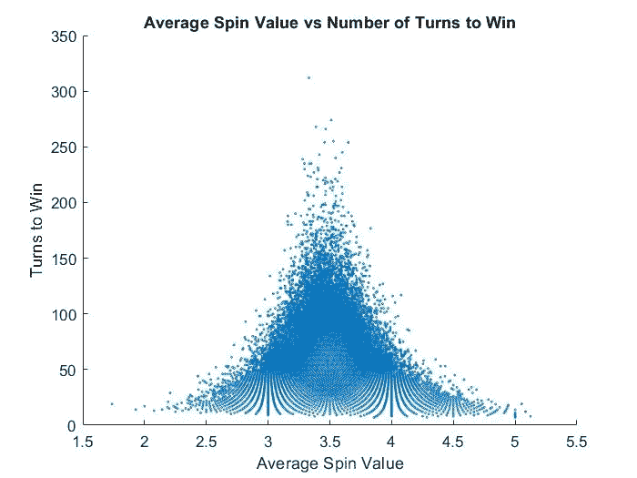
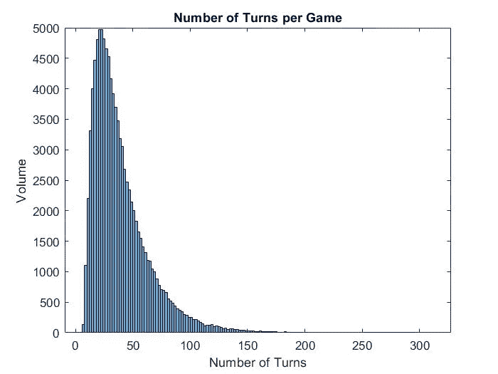
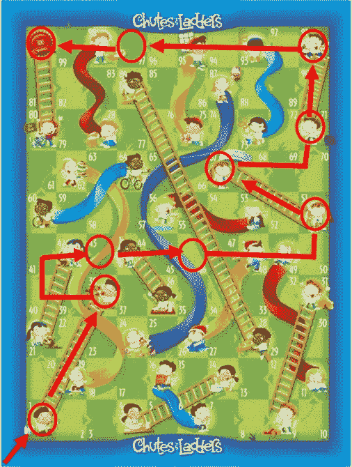
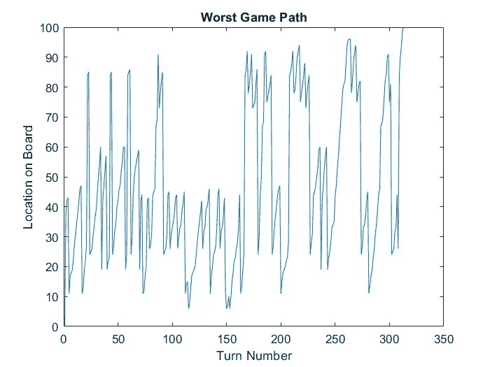
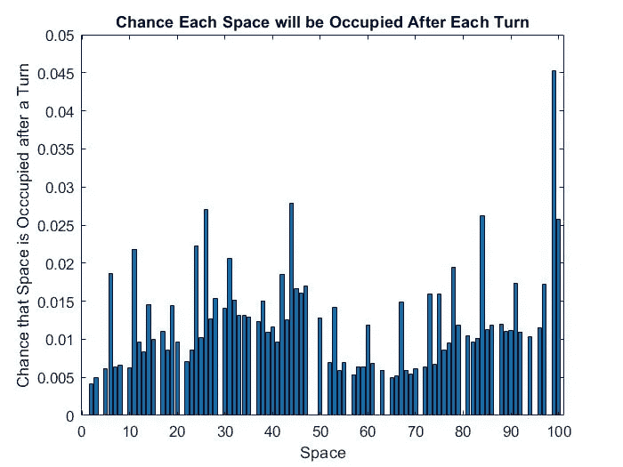

# 斜道和梯子中令人惊讶的有趣数学

> 原文：<https://towardsdatascience.com/the-surprisingly-interesting-mathematics-within-chutes-and-ladders-40f931c18489?source=collection_archive---------11----------------------->

## 我写了一个 MATLAB 程序，模拟 100，000 个滑梯游戏。这是结果。



图片由作者提供

## 简介:

滑道和梯子是一个基于完全随机机会的游戏。不涉及任何策略。你的棋子移动完全取决于你每回合旋转的数字。虽然这对某些人来说是一个相当无聊的游戏，但它为那些对数据科学感兴趣的人提供了一个游戏模拟器的坚实基础。

## 滑道和梯子规则:

这个游戏极其简单。轮到你时，你转动一个转盘，得到一个 1 到 6 之间的数字。从空格 0 开始，你移动你的棋子到转盘给你的空格数。如果你在梯子上着陆，你爬上梯子到上面的空间。如果你降落在滑道上，你会滑到下面空间。第一个到达第 100 个空间的人就是赢家。

## 游戏编码:

一开始，我让一个随机数生成器在 1 到 6 之间选择一个数字。然后，棋子被移动到新的空间。如果棋子落在滑道或梯子上，它会被带到新的空间。

```
while gameover == 0 % keeps the loop going if game is not overturns = turns + 1; % keeps track of amount of turnsspin = randi(6); % random number between 1 and 6spin_data(length(spin_data) + 1) = spin; % adds spin value to datasetstart = start + spin; % moves pawnif turns == 1 % if first turnstarting_spin = spin; % adds dial value to first spin datasetendfor i = 1:length(ladder_start) % checks if pawn should go up ladderif start == ladder_start(i)start = ladder_end(i);breakendendfor i = 1:length(chute_start) % checks if pawn should go down chuteif start == chute_start(i)start = chute_end(i);breakendend
```

该程序也有检查棋子是否正好到达第 100 个空格以获胜的部分。

```
if start > 100 % if space is above 100start = start - spin; % takes pawn back to original spotendif start == 100 % if pawn reaches exactly 100gameover = 1; % ends gamebreakend
```

平均转盘值、第一次转盘值、最佳和最差转弯量，甚至空间着陆的次数等所有数据都被记录下来，并用于制作图形，以帮助显示滑道和梯子内的数学。

## 结果:

在滑道和梯子中到达第 100 个空间的平均圈数是 38.93 圈，标准差是 24.81。下面是每场游戏回合数的直方图。



图片由作者提供

最好的滑梯游戏只需要旋转 7 次转盘。从空间 0 开始，他们旋转了一个 1，这将他们带到了梯子上的第 38 个空间。然后他们旋转了一个 5 和一个 3，把他们带到了第 46 个空间。另一个 5 导致另一个梯子送他们到空间 67。刻度盘旋转 4 把他们送上第三个梯子到空间 91。最后，6 和 3 的刻度盘将它们放在第 100 个空格上，如下所示。



图片由作者提供

最糟糕的滑梯游戏进行了令人难以置信的 312 圈。即使每一轮只花了你 10 秒钟，你仍然需要 52 分钟来完成游戏(假设你只是一个人玩)。下面是在这个可怕乏味的游戏中采取的路线。



图片由作者提供

如你所见，当棋子到达 80 以上的空间时，有 9 个不同的时间，只是为了它不得不滑回到 20 或 30。

在这一点上，我开始想知道你的开始旋转是否会影响你需要旋转多少次才能获胜。事实证明，确实如此:

*   开始旋转 1 圈:平均 35.482 圈获胜
*   开始旋转 2 圈:平均 40.508 圈获胜
*   开始旋转 3 圈:平均 39.713 圈获胜
*   开始旋转 4 圈:平均 37.999 圈获胜
*   开始旋转 5 圈:平均 39.977 圈获胜
*   开始旋转 6 圈:平均 39.857 圈获胜

在你的第一个回合中旋转 1 可以大大减少获胜的预期回合数。这是因为它会把你直接送到第 38 个空间，就像之前提到的最好的滑梯游戏一样。旋转一个 4 会给你更大的获胜机会，因为这将把你送上通往空间 14 的梯子。总的来说，2 是最差的开始值，因为它没有连接到它的梯子，它阻止你在下一个回合到达空间 9(它有梯子)。

因为你的开始旋转确实对你的预期胜率有一些影响，我想知道你在比赛过程中的平均旋转值是否对你的胜率有任何影响。


图片由作者提供

事实证明，平均而言，旋转较低或较高的数字确实会增加您获得较低的预期成功机会。这与 100%的时间没有关系(最好的游戏平均旋转值为 3.86)，但有趣的是，模拟中有更多的 3 和 4 旋转平均游戏时间更长。

就像我在我的[垄断模拟](/simulating-monopoly-finding-the-best-properties-using-matlab-130fe557b1ae)中所做的那样，我想找出每回合后哪些空间最有可能被占据。这些结果如下所示:



图片由作者提供

空的空间是梯子或滑道的起点，所以它们不会以棋子结束。异常高的空间是有梯子或滑道末端的空间。正如你所看到的，在 20-40 之间有一个更高的曲线，一旦超过 75。第 99 个空格非常高，因为玩家会被困在这个空格中，试图旋转 1 来得到正好 100。这导致多回合结束时，玩家不会从第 99 点开始移动。

## 结论:

滑道和梯子可能是随机的，但这并不意味着游戏中没有任何模式。马上旋转 1 会增加你的胜算。平均较低或较高的旋转值也可以帮助你赢。这些都无法控制，但它仍然是我在游戏中发现的有趣的东西。

如果您对这类内容感兴趣，我推荐您阅读我关于棋盘游戏模拟的其他文章:

*   [机器学习:井字游戏](/applying-machine-learning-to-tic-tac-toe-47d954671c73)
*   [模拟垄断](/simulating-monopoly-finding-the-best-properties-using-matlab-130fe557b1ae)
*   [机器学习:连接 4 个](/i-taught-a-machine-how-to-play-connect-4-df261da4e23f)
*   [我如何打造最好的卡坦板](https://medium.com/codex/the-best-and-worst-catan-board-setups-989df4ba550a)