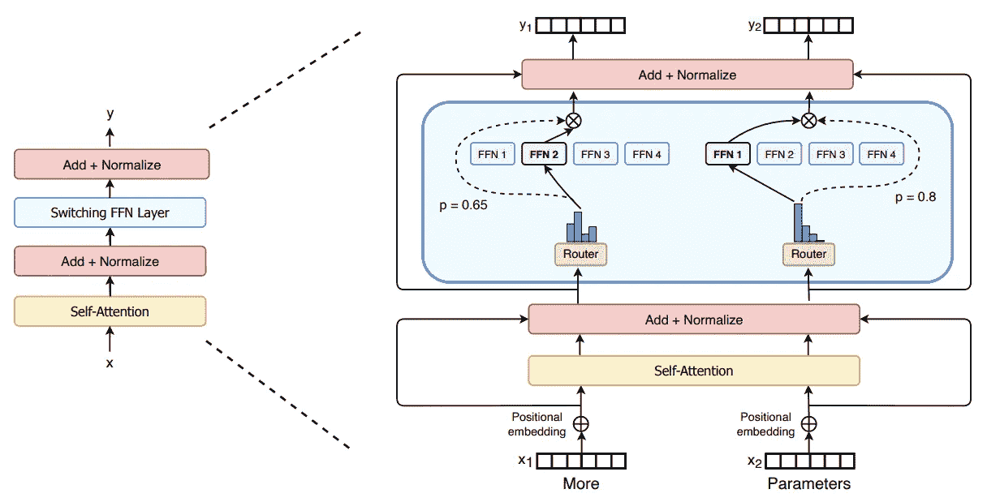

# 开关变压器

> 原文：<https://towardsdatascience.com/the-switch-transformer-59f3854c7050?source=collection_archive---------21----------------------->

## 谷歌大脑的语言模型可以自动开关

在过去的三年里，基于 Transformer 的语言模型(LMs)一直在自然语言处理(NLP)领域大出风头。变形金刚通常是在大量非结构化文本上预先训练的巨大网络，捕捉通常有用的语言属性。然后，预训练的模型可以针对无数的最终任务进行微调，如问题回答或机器翻译，即使是在适量的标记数据上(见[本文](/trends-in-model-pre-training-for-natural-language-understanding-d34424cf5715)了解预训练 LMs 的最新趋势)。谷歌在多项 NLP 基准测试中的记录保持者 [T5 型号](https://arxiv.org/abs/1910.10683)，最近被它自己的[开关变压器](https://arxiv.org/abs/2101.03961)超越。

托马斯·詹森在 [Unsplash](https://unsplash.com?utm_source=medium&utm_medium=referral) 上拍摄的照片

> 并非所有的知识总是有用的。事后看来，这一观察结果有些明显，是开关变压器效率的关键，因为它将推理成本从模型的总大小中分离出来。

开关变压器目前因其一万亿个参数而获得[媒体报道](https://venturebeat.com/2021/01/12/google-trained-a-trillion-parameter-ai-language-model/)。虽然这款车型的尺寸的确引人注目，但我觉得它的效率故事更引人注目。鉴于谷歌大规模运营的历史记录，这一成就不难预料；主要的构建模块(Tensorflow、 [MeshTensorflow](https://github.com/tensorflow/mesh) 、TPUs)已经存在很长时间了。更值得注意的是，在相同的计算成本(以每个输入令牌的 FLOPS 数衡量)下，开关变压器的预训练速度比其 T5 前身快得多。考虑到建造越来越大的模型的持续趋势，看到扩大模型大小并不一定意味着使用更多的能源是非常令人鼓舞的。

## 术语免责声明

我将使用名称*开关变压器*来指代新提出的*架构*，而不是其具体的 1.6 万亿实例化。该论文从多个维度对这一架构进行了评估，包括层数、自我关注度和“专家”(下文将详细介绍)。该模型的特定实例具有特定的配置和参数计数，其名称类似于 *Switch-Base、Switch-Large、Switch-XXL* 和 *Switch-C* (后者具有 1.6 万亿个参数)*。*当对比 Switch Transformer 和它的 T5 前身时，作者特别仔细地比较了两种架构的兼容实例。为了使文章简单，我会说得不那么精确，但是请记住，*开关转换器*不仅仅指的是*开关-C，*的最大实例化。

# 变压器“开关”什么？

与硬件网络交换机如何将传入的数据包转发到其目标设备类似，交换机变压器通过模型路由输入信号，仅激活其参数的子集。隐含的假设是，并非模型中存储的所有信息都与特定输入相关。这有些直观——大概在预培训期间遇到的 Python 3.9.1 的文档在阅读莎士比亚戏剧时没有太大帮助。并非所有的知识在任何时候都是有用的，这一点在事后看来有些明显，这是开关变压器效率的关键，因为它将推理成本从模型的总规模中分离出来。

## 建筑细节

本节假设您熟悉 Transformer 架构。如果没有，你可以看看无数教程中的一个，像[插图变压器](http://jalammar.github.io/illustrated-transformer/)。简而言之，一个变形金刚是一个很深的*多头自我关注*层堆栈。在标准架构中，每一层的末端都有一个前馈网络(FFN ),用于聚合来自多个头部的输出。开关变压器用*多个*ffn 代替这个*单个* FFN，称他们为“专家”(可以说是双曲线)。在每一次向前传递时，在每一层，对于输入中的每个令牌，模型恰好激活一个专家。换句话说，在正向传递过程中，开关变压器使用的参数与层数相同的标准变压器大致相同(加上*路由*参数，其大小可以忽略不计)。

图 2 来自[开关变压器纸](https://arxiv.org/pdf/2101.03961.pdf)。左:标准变压器块。右图:一个开关变压器块。将*单* FFN 换成*多*ffn(名为“专家”)。每个令牌通过其指定的专家传递。

复制 FFN 权重而不是模型的一些其他参数(如自我关注中的键/查询/值矩阵)的决定似乎是实验性的。作者报告说，他们试图将专家添加到模型的其他部分，导致了训练的不稳定性。

## 模型如何决定启用哪个专家？

给定一个中间令牌嵌入 *x* (由下面的层产生)，模型需要选择一个 FFN 专家来通过它。决策过程依赖于一系列简单的操作:

1.  嵌入 *x* 乘以路由矩阵 *Wᵣ* (与模型的其余部分一起训练的可学习参数)以获得每个专家的分数:*分数= x * Wᵣ*
2.  分数被标准化为概率分布，因此它们在专家中总计为 1:*p = soft max(分数)*
3.  嵌入 *x* 以最高概率通过专家 *i* 。最后，输出(即，更新的令牌嵌入)是由专家产生的激活，由它的概率得分加权:*x’=pᵢ*eᵢ(x)*

# 开关变压器的贡献

## 说明单个专家就可以了。

诚然，神经网络中条件计算的基本思想(每个输入只激活参数的一个子集)并不新鲜。四年前发表的类似[2]的先前研究在 LSTMs 的背景下探索了*专家混合层*:在这样的层上，网络选择多个专家并汇总他们的输出。先前的工作假定至少需要两个专家来可靠地训练路由参数；以前的直觉是，一个专家与给定输入的相关性只能相对于其他专家来衡量——因此需要对比至少两个专家。

开关变压器表明，在存在鼓励专家之间统一使用的附加损耗项的情况下，选择单个专家*可能*足以训练有用的路由参数。不可否认，要更深入地了解*为什么*这次损失如此有效，还需要进一步的调查。一个潜在的解释(论文中没有提到)是，当每一层上的每个令牌激活一个*单个*专家时，一个训练批次由*多个令牌组成。*由于新增加的损失项鼓励专家多样性，多标记批次将在*多个专家*之间进行某种间接比较。

激活单个专家节省了 FLOPS 和通信成本(因为只有一个专家需要将其输出发送到网络的其余部分)。

## 它为训练不稳定提供了解决方案。

与传统变压器相比，开关变压器需要跨越额外的障碍。**首先，关闭模型某些部分的硬切换机制引入了稀疏性。**已知模型稀疏会导致训练不稳定，换句话说，稀疏模型可能对随机种子敏感(随机种子决定了初始参数值、训练数据的混排、要丢弃的值等)。)，所以不同的训练跑可以导致不同的表现。为了对抗训练的不稳定性，作者建议通过将它们的标准偏差从 0 缩小来降低参数的初始值。

第二，为了降低计算成本，**Switch Transformer 使用了 *bfloat16* 格式(“谷歌大脑浮点”)**，与更标准的 *float32 形成对比。*精度低是训练不稳定的另一个原因。作者通过让专家在内部使用 float32 来解决这个问题，同时向网络的其余部分公开 bfloat16 API。由于每个专家都生活在一个器件上，float32 值永远不会离开芯片，器件间的通信保持低分辨率。

## 它提供了一个关于规模和效率的有趣研究

> 考虑到建造越来越大的模型的持续趋势，看到扩大模型大小并不一定意味着使用更多的能源是非常令人鼓舞的。

通过改变计算预算和参数计数等方面，本文得出了以下有趣的观察结果:

1.  将专家池从 1(相当于标准的转换器)增加到 2、4、8 等等，直到 256，显示了性能的持续增加，而没有额外的计算成本(因为无论池的大小如何，只有一个专家被激活)。
2.  开关变压器比普通变压器更快地解决了同样的困惑。例如，基于交换机的模型达到完全收敛的基于 T5 的模型的 LM 性能所需的时间约为 7 倍。

# 下游性能

作者表明，Switch-Base 和 Switch-Large 实例化不仅在语言建模方面，而且在一系列下游任务(如分类、共指消解、问题回答或摘要)方面，都超过了它们的 T5-Base 和 T5-Large 对应物。

# 参考

1.  Fedus 等人:[开关变压器:利用简单有效的稀疏性扩展到万亿参数模型](https://arxiv.org/pdf/2101.03961.pdf) (2021)
2.  沙泽尔等人:[异常庞大的神经网络:稀疏门控的专家混合层](https://arxiv.org/abs/1701.06538) (2017)