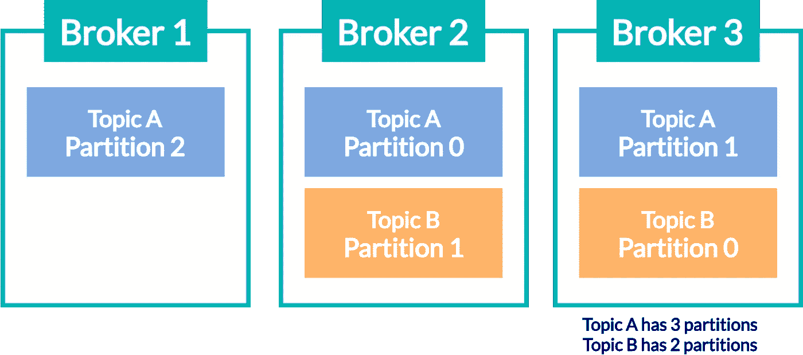
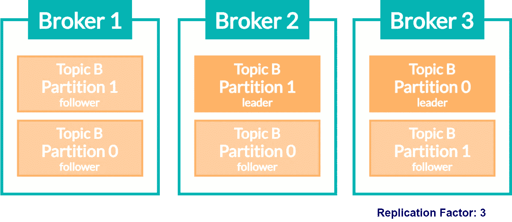
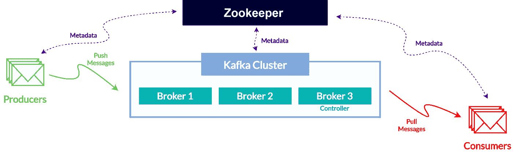

# 关于阿帕奇卡夫卡内部的事情！

> 原文：<https://towardsdatascience.com/the-thing-about-apache-kafka-internals-5ae69c17985f?source=collection_archive---------25----------------------->

## 详细描述了 Kafka 的保证背后的实体，如容错、数据持久性等。

(图片来自 Photogenica Sp。授权给 Wojciech Nowak)

## 介绍

Apache Kafka 文档是关于这个平台的最佳知识来源之一。它包括介绍性信息、快速入门指南、实现细节、API 描述等。

最近，在浏览网页时，我遇到了一个很好的比喻，它很好地描述了卡夫卡哲学背后的事件流的概念。

> “事件流是人体中枢神经系统的数字等价物。”

坦率地说，关于不仅是事件流的简要描述，还有 Apache Kafka 本身，已经没有什么可说的了。它接收记录，存储它们，并在必要时提供访问。就像神经系统一样！

记住上面提供的简短介绍，尽管它具有文学价值，但它没有带来关于 Apache Kafka 的内部细节，因此，在接下来的章节中，我将讨论 Kafka 的一些技术细节(如**代理、数据分发、数据复制和数据保留**)。

> **注意！**
> 
> 建议之前有 Apache Kafka 的经验的人从这篇文章中受益。因此，如果你对 Kafka 没有太多的经验，或者你没有听说过它，请参考介绍性文章—“[为 Apache Kafka 设置场景”](/setting-the-scene-for-apache-kafka-f4c051f08ecd)。

## 经纪人

你应该已经知道卡夫卡是作为一个集群工作的。每一个都由分布在不同数据中心的一个或多个服务器组成。单个 kafka 服务器被称为**代理**(或引导服务器)，可以通过整个集群中的唯一 id 号来识别。

阿帕奇卡夫卡中的经纪人-作者图片

代理管理偏移量，将消息保存在磁盘上(更准确地说，是 kafka 在 linux 上运行时的文件系统缓存)，并处理与客户端(发布者和订阅者)的通信(接收消息、获取数据请求和处理心跳)。根据硬件能力，单个代理每秒可以处理数百万条消息。

代理可以在 kafka 集群中相互合作，因此，一旦一个客户端连接到任何 kafka 代理，它就连接到整个集群中的所有代理。在集群中的所有代理中，有一个代理作为领导者(控制者)工作。这种主服务器是自动选择的(你将在最后一段——Zookeeper & Broker 发现中读到这一点),并处理管理操作(即分配分区给其他代理)。

## **数据分发、数据复制**

整个集群中的每个分区都由一个代理拥有，这个代理被称为分区的*领导者。分区也可以分配给多个代理，换句话说，分区可以在集群中复制。在这种情况下(当复制因子大于 1 时)，消息被复制并存储在整个集群的其他代理中。*

洞察 Kafka Brokers(主题和分区的分布)-作者图片

通过使用一种称为**主备份模型**的机制，消息在集群中复制，这意味着其中一个分区作为领导者工作，而其他分区试图与领导者同步，作为追随者工作。

洞察 Kafka 集群(主题和分区复制)-作者图片

这种体系结构提供了数据冗余，防止数据丢失、数据流中断(在某些条件下)以及由于领导者分布在不同的代理上而导致的消息服务延迟。

## **数据保持**

在存储消息时，Kafka 提供了一种保留机制。正确配置的 Kafka 集群可以防止延迟、过载甚至故障。根据需要和特定用途，有几种选择来形成配置。

首先，Kafka 可以在给定的**时间段**内存储消息(例如，4 小时或 10 天)。另一种可能性是设置阈值的大小**(例如，5GB)，在这种情况下，当达到这些限制时，从集群中删除“遗留”数据。**

大多数情况下，保留机制是在整个 Kafka 集群上配置的。但是，对于某些用途，还可以在单个主题上设置保留。通过这种方式，存储指标和日志的主题可以将保持期设置为 6 小时。而作为*事件源*的主题可以存储开始以来的数据。

主题配置的最后一种方式是**日志压缩**。在这种情况下，只有使用给定密钥发送的消息才会存储在该主题中。

## **动物园管理员&经纪人发现**

由于一个客户机只需要连接到一个代理就可以连接到整个集群，因此每个代理都必须知道所有不同代理的存在(也知道集群中的所有主题和所有分区)。

这就是为什么每个代理都必须连接到 Apache Zookeeper，它存储了给定集群中与实体(如代理、主题、实践等)相关的所有数据。此类“数据”被称为*元数据*(或配置数据)，由现有主题列表、kafka 集群内创建的所有主题的确切分区数量、副本位置以及哪个节点被选为领导者的信息组成。

动物园管理员在阿帕奇卡夫卡平台中的作用-作者图片

说到领导节点(或控制器)——Zookeeper 是一个执行“控制器选举”的地方。如果集群中的一个节点发生故障，控制器的工作就是向适当的分区发送关于这种故障的信息，并选择新的引导分区。

> **免责声明**！
> 
> 有计划将动物园管理员从阿帕奇卡夫卡项目中移除。Kafka 的过渡版本将同时拥有传统模式(带 zookeeper)和不带它的新模式。在以后的版本中，zookeeper 可能会从 Apache Kafka 项目中完全删除。在这种情况下，本段将不再有效。如果你想知道 kafka 将如何执行 broker discovery 和 Zookeeper 现在完成的所有工作，请参考文章底部提到的来源中的第三个位置。

## **总结**

Apache Kafka 有许多方面，其中包括人们必须知道的实体(如主题、分区、偏移量)、生产者和消费者特性、交付示意图或 Kafka 集群的内部结构。

本文以一种让您理解数据的分布、复制和保留等方面的方式介绍了最后一种方法。所有这些立场使得 Kafka 的保证，如数据的容错性、高可用性和持久性成为可能。

了解了 Apache Kafka 的内部之后，您可以使用 Kafka 作为消息总线、集成点、摄取平台甚至整个系统的核心来构建更成熟的应用程序。

您已经阅读的文章并不是 Apache Kafka 平台之旅的终点。

还有很多东西要学。因此，如果你想扩展你对卡夫卡其他方面的知识，可以参考下面提到的资料。

致以最美好的祝愿。继续前进，祝你好运！

WN。

[1]阿帕奇卡夫卡 2.3 |文档 https://kafka.apache.org/documentation/

[2]卡夫卡:权威指南|尼哈·纳克赫德、格温·沙皮拉、托德·帕利诺|奥莱利媒体公司| 2017 年 11 月 1 日

[3]Confluent-removal-Zookeeper-Dependency-in-Kafka 的博文|[https://www . Confluent . io/Blog/removal-Zookeeper-Dependency-in-Kafka/](https://www.confluent.io/blog/removing-zookeeper-dependency-in-kafka/)

[4]阿帕奇动物园管理员文档|[https://zookeeper.apache.org/documentation.html](https://zookeeper.apache.org/documentation.html)