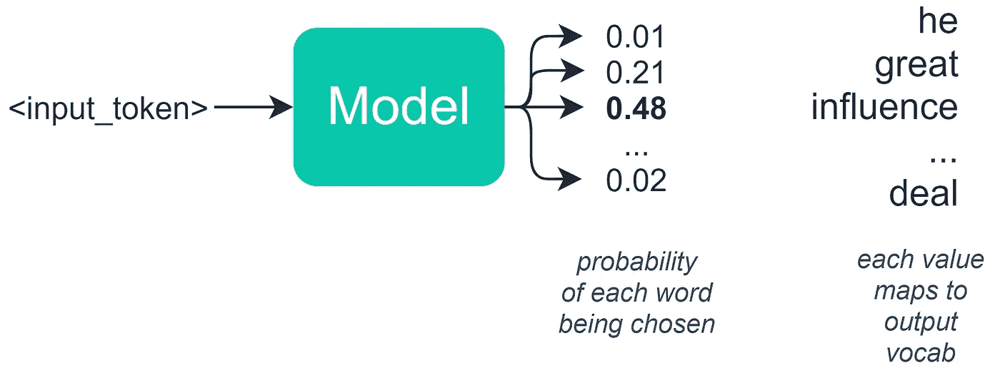
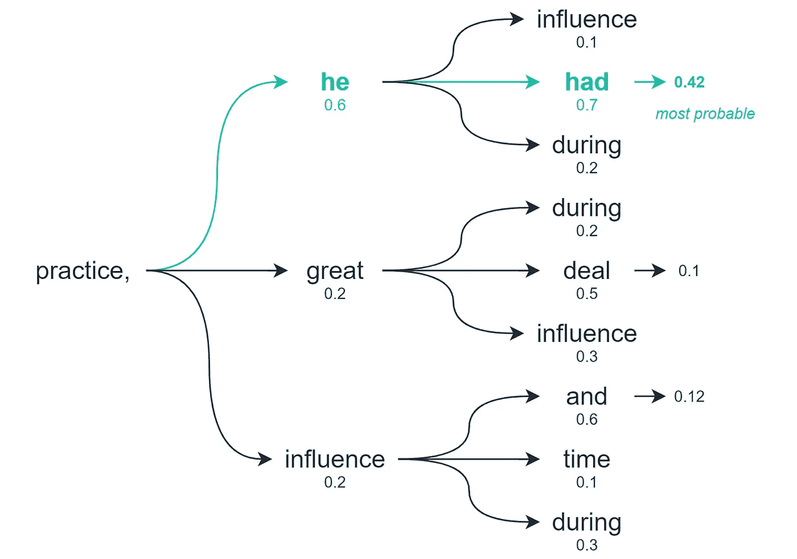

# 自然语言处理的三种解码方法

> 原文：<https://towardsdatascience.com/the-three-decoding-methods-for-nlp-23ca59cb1e9d?source=collection_archive---------9----------------------->

## 从贪婪到光束搜索


[赫塞·科林斯](https://unsplash.com/@jtc?utm_source=medium&utm_medium=referral)在 [Unsplash](https://unsplash.com?utm_source=medium&utm_medium=referral) 上拍照

O 自然语言处理(NLP)中序列生成的一个经常被忽视的部分是我们如何选择我们的输出标记——也称为**解码**。

您可能会想——我们根据模型分配的每个标记的概率来选择标记/单词/字符。

这是对的，在基于语言的任务中，我们通常会构建一个模型，将一组概率输出到一个数组中，数组中的每个值代表一个特定单词/单词的概率。

此时，选择概率最高的令牌似乎是合乎逻辑的？嗯，不尽然——这可能会产生一些不可预见的后果——我们很快就会看到。

当我们在机器生成的文本中选择一个标记时，我们有几个替代方法来执行这个解码——还有修改确切行为的选项。

在本文中，我们将探讨选择输出令牌的三种不同方法，它们是:

```
> Greedy Decoding> Random Sampling> Beam Search
```

理解每一种方法的工作原理非常重要——在语言应用程序中，解决输出不佳的方法通常是在这四种方法之间进行简单的切换。

如果您喜欢视频，我在这里也介绍了所有三种方法:

我在这里用 [GPT-2 测试了一个笔记本。](https://gist.github.com/jamescalam/402ded4a6ba5d6d6edea789b032d7247)

# 贪婪解码

我们最简单的选择是贪婪解码。这将获取我们的潜在输出列表和已经计算的概率分布，并选择概率最高的选项(argmax)。

这似乎是完全合乎逻辑的——而且在许多情况下，它运行得非常好。然而，对于较长的序列，这可能会导致一些问题。

如果您曾经见过这样的输出:

默认文本是我们输入到模型中的内容——绿色文本已经生成。

这很可能是由于贪婪的解码方法停留在一个特定的单词或句子上，并一次又一次地重复分配这些单词集的最高概率。

# 随意采样

我们的下一个选择是随机抽样。就像之前一样，我们有了潜在产出和它们的概率分布。

随机抽样基于这些概率选择下一个单词，因此在我们的示例中，我们可能有以下单词和概率分布:



随机抽样允许我们根据模型预先分配的概率随机选择一个单词

我们将有 48%的机会选择“影响力”，21%的机会选择“伟大”，等等。

这解决了我们陷入相同单词重复循环的问题，因为我们给预测增加了随机性。

然而，这引入了一个不同的问题——我们经常会发现这种方法过于随意，缺乏一致性:

因此，一方面，我们有**贪婪搜索**，这对于生成文本来说太严格了——另一方面，我们有**随机采样**，这产生了奇妙的乱码。

我们需要找到两者兼而有之的东西。

# 波束搜索

波束搜索允许我们在选择最佳选项之前探索输出的多个级别。



梁搜索，作为一个整体的'实践，他已经'得分高于任何其他潜在的路径

因此，贪婪解码和随机采样仅基于下一个单词/标记计算最佳选项，而波束搜索检查未来的多个单词/标记，并评估所有这些标记组合的质量。

从这个搜索中，我们将返回多个潜在的输出序列——我们考虑的选项的数量就是我们搜索的“波束”的数量。

然而，因为我们现在回到排序序列并选择最可能的—波束搜索可能导致我们的文本生成再次退化为重复序列:

因此，为了抵消这一点，我们增加解码`temperature`——它控制输出中的随机量。默认的`temperature`是`1.0`——将这个值推高一点`1.2`会产生很大的不同:

经过这些修改，我们得到了一个奇特但连贯的输出。

这个文本生成解码方法总结就到此为止！

我希望你喜欢这篇文章，如果你有任何问题或建议，请通过 [Twitter](https://twitter.com/jamescalam) 或在下面的评论中告诉我。

感谢阅读！

# 来源

[🤖带变压器的 NLP 课程](https://www.udemy.com/course/nlp-with-transformers/?couponCode=MEDIUM)

如果您对学习如何在 Python 中建立文本生成模型感兴趣，我写了这篇短文，介绍如何在这里建立:

[](/text-generation-with-python-and-gpt-2-1fecbff1635b) [## 用 Python 和 GPT-2 生成文本

### 如何在 Python 中应用前沿语言生成

towardsdatascience.com](/text-generation-with-python-and-gpt-2-1fecbff1635b) 

**除非另有说明，所有图片均出自作者之手*