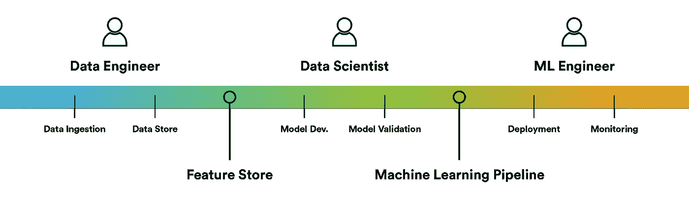
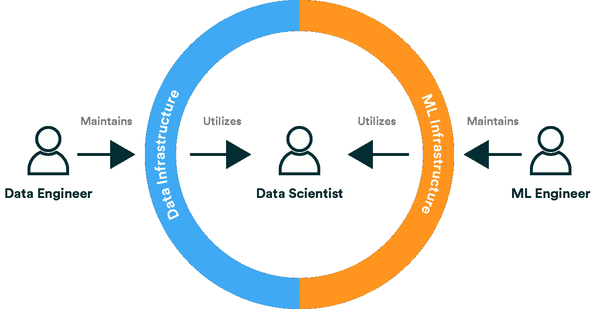

# 机器学习团队中的三个角色(以及连接它们的两种技术)

> 原文：<https://towardsdatascience.com/the-three-roles-in-a-machine-learning-team-and-two-technologies-to-connect-them-9660dccf5b57?source=collection_archive---------42----------------------->

## 机器学习管道和特征存储如何帮助连接数据科学家和工程师。

照片由 [Aaron Burden](https://unsplash.com/@aaronburden) 在 [Unsplash](https://unsplash.com/?utm_source=medium&utm_medium=referral)

# 角色正在分化

我们几年来一直在跟踪的一个趋势是，数据科学专业如何从完全独立、无所不能的独角兽转向更加专业化的工作。这并不意味着在几个领域拥有深厚知识的个人消失了，而是对数据科学的需求增加了，团队的人数也增加了。在更大的群体和更活跃的就业市场中，专业化的空间更大。

不仅仅是厨房里有更多的厨师，而且机器学习解决方案的范围也更加雄心勃勃。

考虑[团队的能力](/rethinking-the-roles-of-data-scientists-engineers-and-architects-9da1ca06e203)变得越来越重要，而不是期望每个人都成为机器学习相关领域的专家。这与软件工程角色分为后端、前端和开发运维工程师非常相似。

机器学习系统往往有以下三种不同类型的贡献者:

他们每个人都专注于机器学习系统的不同部分。自然，每个角色之间都有重叠，我们可以确定系统中这些角色最容易合作的几个关键部分。

作者图片

# 数据工程师

数据是机器学习的基础，但在机器学习相对较新的复苏之前，数据已经成为一个热门话题。多年来，数据工程师一直承担着为各种其他应用程序(如商业智能)构建数据基础设施的任务，很明显，采用机器学习将需要他们的能力。

那么，他们构建数据基础架构意味着什么呢？简而言之，他们创造了接收、存储、转换和分发数据的系统。确切的术语完全取决于他们所处理的用例及数据的类型，例如，数据仓库或数据湖是否是正确的解决方案。

数据工程师围绕数据问题与数据科学家交流。最常见的话题可能是 it 的可用性。数据科学家需要访问数据来进行实验和训练模型，而数据工程师则负责提供便利。

# 特征存储:数据工程和数据科学的交叉点

最近，[特征存储](/what-are-feature-stores-and-why-are-they-critical-for-scaling-data-science-3f9156f7ab4)已经成为数据工程和数据科学之间的一个解决方案。特征存储将用于机器学习的数据整合到单个位置，并允许数据科学家定义数据转换，该数据转换将信息提取为对 ML 模型非常有价值的信号(即，特征)。从特性库中，特性可以不间断地交付给培训渠道和生产。

# 数据科学家

数据科学家的任务是为业务问题寻找数据驱动的解决方案。例如，他们可能会查看用户数据以找到有意义的用户群，并构建模型将这些用户分类，以区分最终用户体验并提高参与度。

虽然数据科学家的主要目的是探索数据和构建模型，但清理和争论数据往往是他们工作流程中最耗时的部分。这就是为什么特征库正在成为端到端 ML 基础设施的重要组成部分。

数据科学家的主要关注点是构建机器学习算法。然而，科学家的环境和最终目的地——生产环境——之间往往有相当大的距离。

许多团队已经为促进 ML 模型生产的个人扮演了机器学习工程师的角色。

# 机器学习管道:数据科学和机器学习工程的交叉点

生产环境不同于研究环境。生产中的模型将需要执行，即使当底层世界改变和数据漂移出现时。许多团队已经意识到，模型将需要像第一次一样，以同样严格的纪律反复再培训。

[机器学习管道](https://valohai.com/machine-learning-pipeline/)是数据科学和 ML 工程的交汇点，训练和测试模型的过程已经被编码。然后，可以根据需要频繁运行管道。在管道上合作比数据科学和工程之间的移交更可取，因为它确保所有最初的意图和知识都被带到生产中。

# 机器学习工程师

使机器学习能够在云上训练和服务的技术(如 Kubernetes)通常不是数据科学家核心能力的一部分。

因此，机器学习工程师作为 ML 的产品化专家应运而生。为了大致描述工作流的特征，数据科学家构建并验证模型，而工程师则确保它从模型扩展到生产系统。

然而，与数据工程一样，思维已经转向平台，其目标更多地是建立一个共享系统，工程师和科学家在其中协作，而不是交接。虽然数据工程师负责数据管理平台(或特征库)，但 ML 工程师负责 MLOps 平台，该平台包括用于训练、版本化和服务模型的组件。

此外，ML 工程师还想出了如何监控生产模型，以确保提供的预测具有预期的质量，并且服务本身在任何时候都是可用的。监控通常还与要素存储和数据工程联系在一起，因为重要的是基础数据自上次模型定型以来是否发生了变化。

角色分化提供了个人专业化的希望，因此更有生产力。此外，对组织的承诺是从每个业务问题一个人扩展到每个业务问题一个团队的能力。

作者图片

然而，团队必须采用一种平台方法，而不是将每个角色分别孤立起来以实现这些承诺。采用允许不同职位的专家合作并一起构建生产机器学习系统的流程和技术(通常归类于 [MLOps](https://valohai.com/mlops/) )是至关重要的。

*最初发表于*[T5【https://valohai.com】](https://valohai.com/blog/the-three-roles-in-an-ml-team/)*。*