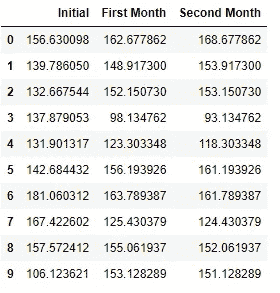
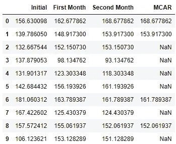
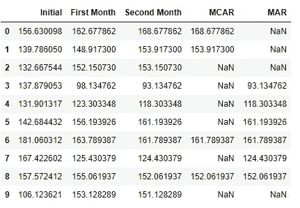
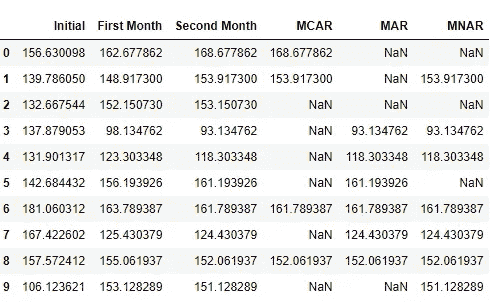
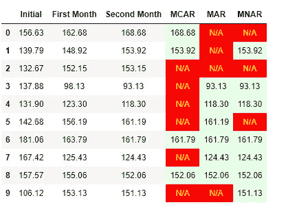

# 每个数据专家都应该知道的三种缺失数据

> 原文：<https://towardsdatascience.com/the-three-types-of-missing-data-every-data-professional-should-know-d988e17d6ace?source=collection_archive---------28----------------------->

## 数据科学。分析。数据工程。

## 以及了解它们的重要性


[迈特·沃尔什](https://unsplash.com/@two_tees?utm_source=medium&utm_medium=referral)在 [Unsplash](https://unsplash.com?utm_source=medium&utm_medium=referral) 上拍照

# 介绍

如果你问数据科学家，他们希望避免但无法避免的一个数据问题是什么，很可能他们都会回答缺失数据。

> 你知道他们是怎么说的吗，生命中唯一确定的事情就是死亡和税收？对于数据科学家来说，缺失数据可能是第三大问题。

一般来说，缺失数据会限制我们的机器学习(ML)模型的有效性，尤其是在应用于现实世界的用例时。

如果我们仔细想想，让 ML 模型变得更好的最受欢迎的建议之一是获得更多的数据和更多的观察。因此，如果缺失数据起到相反的作用，也就不足为奇了:削弱模型，模糊我们试图解释或解决的现象。

在《缺失数据:一个温和的介绍》一书中，三位作者收集了数据，发现缺失数据不仅在三年出版的期刊( ***没错，出版期刊*** )中普遍存在，而且据估计平均缺失数据量超过 30%。

因此，是时候让我们投入一些资源来讨论缺失数据，并提出适当的应对措施了。

虽然处理缺失数据的常见方法是简单的删除或简单的插补，但这些解决方案并不总是合适的。以数据删除为例，您可能实际删除了高达 30%的数据，降低了数据集的统计能力，尤其是对于小数据。

本文是介绍，也是讨论缺失数据处理的系列文章的第一篇。

# 缺失数据的三种类型

## **模拟数据集:体重管理数据集**

为了帮助我们理解缺失数据，生成一些我们可以使用的模拟数据将会很有帮助。

```
#PRELIMINARIES
import random
import numpy as np
import pandas as pdfrom numpy import random
```

假设我们的数据集将与一个**体重管理程序**有关，在该程序中获取初始体重(lbs 中的*)。让我们不要讨论一个人实际上可以安全地失去多少，但为了说明的目的，让我们假设这些都是可能的。*

在接下来的两个月里，随后测量体重。

```
#INITIAL WEIGHTS
random.seed(19)
initial_weights = random.normal(150,30,10)
```

在计划的第一个月之后，让参与者的体重为:

```
random.seed(20)
first_weigh_in = random.normal(145,20,10)
```

因此，我们现在拥有的是一个包含初始权重和第一个月权重的数据集。由于我们对数字生成进行了随机化，我们观察到第一个月的体重低于第一个月(表示体重下降)，以及第一个月的体重高于第一个月(表示体重增加)。

对于第二个月——称重，让我们假设那些减肥的人决心继续减肥，因此更有可能减掉更多的体重(大约 3 到 5 公斤),或者如果他们增加了一些体重，也只是少量的(大约 1 到 2 公斤)。

然而，那些体重增加的人要么没有动力，反而增加了更多，要么受到减肥者的鼓舞，因此开始减肥。

我们可以将这种关系编码如下:

```
first_month_diff = first_weigh_in - initial_weightssecond_weigh_in = [None] * 10random.seed(21)
for i in range(len(first_month_diff)):
    if first_month_diff[i] > 0:
        second_weigh_in[i] = first_weigh_in[i] + random.randint(-3,7)
    else:
        second_weigh_in[i] = first_weigh_in[i] + random.randint(-5,3)
```

让我们来看看我们的完整数据集:

```
df = pd.DataFrame({"Initial":initial_weights,
                  "First Month": first_weigh_in,
                  "Second Month": second_weigh_in})
df
```



看看我们的数据集，试着记住哪些参与者(1-10)在几个月内体重持续下降，哪些增加了。

## 模拟三种缺失数据机制

为了使这个模拟有意义，**我们将在“第二个月称重”观察中应用三种不同的机制**。

因此，对于每个机制，**可获得初始称重和第一个月称重观测值**。

## 第一类:完全随机失踪(MCAR)

完全随机缺失是一种由于**完全随机原因**导致数据缺失的机制；对于数据可能丢失的原因，没有特定的结构。

例如，很有可能在第二个月的称重期间，一名参与者碰巧生病而错过了称重。也有可能是与你正在研究或测量的现象完全无关的事情，比如去健身房/测量中心的路上发生了汽车故障。其他原因包括数据管理，例如意外删除。

这是最简单的编码机制:

```
random.seed(25)
df["MCAR"] = random.binomial(1,0.5, size=10)*df['Second Month']
df["MCAR"] = df["MCAR"].replace(0, np.nan)
df
```



## 类型 2:随机缺失(MAR)

例如，假设体重增加的人在第一个月没有减肥，反而变得没有动力，并故意不在第二个月的称重中出现。

也就是说，这对于 MAR 来说是很重要的一点:**最初和第一个月的观察结果决定了第二个月的观察结果是否会缺失**。

这种系统关系可以编码如下:



**请注意，数据缺失并不取决于第二个月的权重值本身**。例如，如果你看一下 10 号人，他在第二次称重时体重减轻了一些，但是因为我们只看最初的和第一次称重的信息，他从来没有机会发现并选择不测量这些信息。

## 类型 3:非随机缺失

现在，这就变得有点棘手了。假设在第二个月有所增加的人没有参加第二个月的称重。

在这种情况下，**数据丢失的概率与丢失数据本身的价值直接相关**。我们称这种数据为“非随机缺失”或 MNAR 数据。

与 MAR 不同，其中丢失的概率与**其他观测数据**相关，MNAR 具有与丢失的观测数据本身直接相关的结构**。**

以下结构可以编码如下:

```
random.seed(34)
df["MNAR"] = [df["Second Month"][i]*random.binomial(1,(1/(df["Second Month"][i]*4/df["First Month"][i]))) if (df["Second Month"][i]- df["First Month"][i] > 0) else df["Second Month"][i]\
for i in range(10)]df["MNAR"] = df["MNAR"].replace(0, np.nan)
df
```



在我们考虑的三种机制中，MNAR 造成了最难克服的情况。

如果你仔细观察我们建立的关系，我们会发现在第二个月增加的体重越多，在第二个月的称重中丢失的概率就越高。

> **但是棘手的部分实际上是这样的:数据科学家不知道这种关系的知识，因为没有观察到这些。**

因此，这是对 MAR 和 MNAR 之间的观察结果进行分类的挑战:要分类为 MNAR，必须确定**丢失变量和丢失它的概率**之间的关系，但是对于 MAR，可以**通过单独查看观察到的可用数据**来建立这种关系。

# **最终数据集**



在我的 Github 页面上找到的增强表格可视化的代码

# 结束语

对于研究人员来说，缺失数据类似于税收和死亡；它们不可避免。本文向我们介绍了三种类型的缺失数据，它们主要由控制缺失的机制(或结构)来识别。

确定数据缺失的机制非常重要，因为并非所有类型都可以被忽略。例如，在 MCAR 和马尔那里，缺失可以被忽略，对我们正在研究的现象几乎没有影响。

然而，对于 MNAR，不正确地认识这些将导致有偏见的研究和在现实世界应用中不太有效的模型。

虽然没有放之四海而皆准的解决方案，但根据缺失的基本机制，可以采用一系列技术来处理缺失数据。例如，处理缺失数据最常用的方法:删除，可能仅适用于 MCAR 数据集。平均值和中间值插补可能适用于 MCAR 和马尔

在本系列的下一篇文章中，我们将讨论如何像专家一样处理丢失的数据。

[像专家一样处理“缺失数据”——第一部分——删除方法](/handling-missing-data-like-a-pro-part-1-deletion-methods-9f451b475429)

[像专家一样处理“缺失数据”——第 2 部分:插补方法](/handling-missing-data-like-a-pro-part-2-imputation-methods-eabbf10b9ce4)

[像专家一样处理“缺失数据”——第 3 部分:基于模型的&多重插补方法](/handling-missing-data-like-a-pro-part-3-model-based-multiple-imputation-methods-bdfe85f93087)

让我知道你们的想法！

模拟的完整代码在我的 [Github 页面](https://github.com/francisadrianviernes/Data-Preprocessing-and-Feature-Engineering/blob/master/Simulating%20Missing%20Data.ipynb)找到。

# 参考

麦克奈特，P. E. (2007)。*缺失数据:温柔的介绍*。吉尔福德出版社。