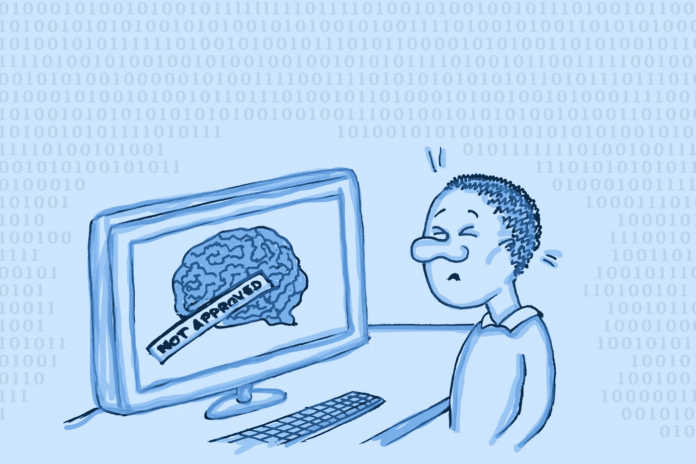

# 将人工智能从人脑中分离出来的时候到了

> 原文：<https://towardsdatascience.com/the-time-has-come-to-decouple-ai-from-human-brains-4c8abc047240?source=collection_archive---------17----------------------->

## 我们可能需要摆脱人类思维的局限

人工智能和人类大脑可能需要分道扬镳。作者图片

 在1956 年的夏天，10 位科学家在达特茅斯学院会面[发明了人工智能](https://web.archive.org/web/20080930164306/http://www-formal.stanford.edu/jmc/history/dartmouth/dartmouth.html)。来自数学、工程、心理学、经济学和政治学等领域的研究人员聚在一起，想知道他们是否能够如此精确地描述学习和人类思维，以至于可以用机器来复制。不到十年后，这些科学家在机器人技术、自然语言处理和计算机视觉领域取得了重大突破。

尽管从那时起已经过去了很长时间，机器人技术、自然语言处理和计算机视觉仍然是当今最热门的研究领域。可以说，我们专注于教人工智能像人一样移动，像人一样说话，像人一样看东西。

这样做的理由很清楚:通过人工智能，我们希望机器能够自动完成驾驶、阅读法律合同或购买食品杂货等任务。我们希望这些任务能够比人类更快、更安全、更彻底地完成。这样，人类将有更多的时间进行有趣的活动，而机器则承担我们生活中无聊的任务。

然而，研究人员越来越认识到，人工智能在模仿人类思维时，可能会继承人类的偏见。这个问题在亚马逊的[招聘算法](https://www.reuters.com/article/us-amazon-com-jobs-automation-insight-idUSKCN1MK08G)和美国政府的 [COMPAS 算法](https://www.propublica.org/article/machine-bias-risk-assessments-in-criminal-sentencing)中显而易见，前者歧视女性，后者过度惩罚黑人。无数其他例子进一步说明了人工智能中的偏见问题。

在这两种情况下，问题都始于有缺陷的数据集。亚马逊的大多数员工是男性，许多被监禁的人是黑人。虽然这些统计数据是普遍的文化偏见的结果，但算法无法知道这一点。相反，它得出的结论是，它应该复制它得到的数据，这加剧了数据中的偏见。

手动修复可以消除这些偏见，但它们也伴随着风险。如果执行不当，善意的修正会使一些偏见变得更糟，甚至引入新的偏见。然而，人工智能算法的最新发展使得这些偏见越来越不重要。工程师们应该接受这些新发现。新方法限制了偏差污染结果的风险，无论是来自数据集还是工程师本身。此外，新兴技术意味着工程师自己需要更少地干预人工智能，消除更多无聊和重复的任务。

 [## 为什么 Python 中的装饰者是纯粹的天才

### 用一个@符号来分析、测试和重用你的代码

towardsdatascience.com](/why-decorators-in-python-are-pure-genius-1e812949a81e) 

# 当人类知识为王的时候

想象以下场景:你有一个来自各行各业的人的大数据集，跟踪他们是否有过 COVID。标签 COVID / no-COVID 已经由人输入，无论是医生、护士还是药剂师。医疗保健提供者可能对预测新条目是否可能已经具有 COVID 感兴趣。

有监督的机器学习对于解决这类问题来说很方便。一种算法可以接受所有数据，并开始理解不同的变量，如一个人的职业、总收入、家庭状况、种族或邮政编码，如何影响他们是否感染了疾病。例如，该算法可以估计一名来自纽约、有三个孩子的拉丁裔护士患 COVID 的可能性。因此，她接种疫苗的日期或她的保险费可能会得到调整，以便通过有效分配有限的资源来挽救更多的生命。

这个过程乍看起来非常有用，但也有陷阱。例如，过度工作的医疗保健提供者可能会错误标记数据点，从而导致数据集中的错误，并最终导致不可靠的结论。这种错误在上述就业市场和监禁系统中尤其具有破坏性。

有监督的机器学习似乎是许多问题的理想解决方案。但是人类过多地参与了制作数据的过程，因此这不是万灵药。在一个仍然遭受种族和性别不平等的世界里，人类偏见无处不在，具有破坏性。依赖于如此多人类参与的人工智能总是有包含这些偏见的风险。

将人类的偏见融入有监督的人工智能不是前进的方向。作者图片

# 当数据为王

幸运的是，有另一种解决方案可以抛开人为的标签，只处理至少在某种程度上客观的数据。在 COVID-predictor 示例中，消除人为的 COVID /无 COVID 标签可能是有意义的。首先，数据可能由于人为错误而出错。另一个主要问题是数据可能不完整。社会经济地位较低的人往往较少获得诊断资源，这意味着他们可能已经患有 COVID，但从未检测为阳性。这种缺失可能会扭曲数据集。

因此，为了让结果对保险公司或疫苗供应商更可靠，去掉标签可能是有用的。一个无人监管的机器学习模型现在将继续进行数据聚类，例如通过邮政编码或一个人的职业。通过这种方式，可以获得几个不同的组。然后，模型可以很容易地将新条目分配给这些组之一。

之后，人们可以将这些分组数据与其他更可靠的数据进行匹配，如某个地理区域或某个行业的超额死亡率。通过这种方式，可以获得某人是否患有 COVID 的概率，而不考虑一些人可能比其他人更容易获得测试的事实。

当然，这仍然需要一些手工工作，因为数据科学家需要将分组数据与关于超额死亡率的数据进行匹配。然而，对于保险公司或疫苗供应商来说，结果可能要可靠得多。

# 派遣机器去寻找赏金

同样，这一切都很好，但是您仍然将修改疫苗数据或保险单的工作留给了流程另一端的人。在疫苗的情况下，负责人可能会决定以后给有色人种接种疫苗，因为他们往往较少使用医疗系统，因此如果他们生病，医院不太可能人满为患。不用说，这将是一项基于种族主义假设的不公平政策。

让机器来做决定有助于规避决策者根深蒂固的偏见。这就是强化学习背后的概念。您提供与以前相同的数据集，没有人为的标签，因为它们可能会扭曲结果。你也给它一些关于保险政策或疫苗如何工作的信息。最后，你选择几个关键目标，比如不过度使用医院资源、社会公平等等。

在强化学习中，如果机器找到满足关键目标的保险单或疫苗日期，就会得到奖励。通过对数据集的训练，它找到优化这些目标的政策或疫苗日期。

这一过程进一步消除了人工数据输入或决策的需要。虽然它还远非完美，但这种模式不仅可以更快更容易地做出重要决定，而且更加公平，不受人类偏见的影响。

还有很多要修正。作者图片

# 进一步减少人为偏见

任何数据科学家都会告诉你，并不是每个机器学习模型——无论是有监督的、无监督的还是强化学习——都非常适合每个问题。例如，保险提供商可能希望获得一个人是否有 COVID 的概率，但希望自己找出保单。这就改变了问题，使得强化学习不适合。

幸运的是，即使在模型的选择有限的情况下，也有一些常见的实践对无偏见的结果大有帮助。其中大多数都源于数据集。

首先，当你有理由怀疑一个特定的数据点可能受到现有不平等的不当影响时，隐藏不可靠的数据是明智的。例如，因为我们知道 COVID / no-COVID 标签可能由于各种原因而不准确，所以省略它可能会导致更准确的结果。

然而，这种策略不应该与蒙蔽敏感数据相混淆。例如，可以选择隐藏种族数据以避免歧视。然而，这可能弊大于利，因为机器可能会学习一些关于邮政编码和保险单的信息。在许多情况下，邮政编码与种族密切相关。结果是，一名来自纽约的拉丁裔护士和一名来自俄亥俄州的白人护士，如果数据完全相同，最终可能会得到不同的保险政策，这可能是不公平的。

为了确保这种情况不会发生，可以在比赛数据中增加权重。一个机器学习模型可能会很快得出结论，拉丁美洲人更容易获得 COVID。因此，它可能会要求这部分人缴纳更高的保险费来弥补这一风险。通过给予拉丁裔人比白人稍微有利的权重，人们可以进行补偿，这样拉丁裔人和白人护士最终确实得到相同的保险政策。

不过，应该小心使用加权的方法，因为它很容易使小组的结果产生偏差。例如，想象一下，在我们的 COVID 数据集中，只有少数美洲土著人。碰巧的是，这些美国土著都是出租车司机。该模型可能已经在数据集中的其他地方得出了一些关于出租车司机及其最佳医疗保险的结论。如果土著美国人的权重被夸大了，那么一个新的土著美国人可能最终会得到出租车司机的政策，尽管他们可能有不同的职业。

从一个不完美的模型中手动消除偏见是非常棘手的，需要大量的测试、常识和人类礼仪。还有，这只是权宜之计。从长远来看，我们应该放弃人类的干预以及随之而来的偏见。相反，我们应该接受这样一个事实:如果让机器独自为正确的目标而努力，它们就不会像人类那样可怕和不公平。

 [## 为什么开发人员会爱上函数式编程

### 从 Python 到 Haskell，这种趋势不会很快消失

towardsdatascience.com](/why-developers-are-falling-in-love-with-functional-programming-13514df4048e) 

# 以人为中心的人工智能很棒，但我们不应该忘记人类是有缺陷的

让人工智能像人类一样移动、说话和思考是一个光荣的目标。但是人类也说和想可怕的事情，特别是对弱势群体。让一个人类数据科学家团队过滤掉人类偏见和无知的所有来源是一项太大的任务，特别是如果团队本身不够多样化的话。

另一方面，机器还没有在种族和经济差异的社会中成长起来。他们只是获取任何可用的数据，并做任何他们应该做的事情。当然，如果数据集不好或者有缺陷的人干预太多，它们会产生不好的输出。但是数据集的许多缺陷可以通过更好的模型来弥补。

在这个时候，人工智能是强大的，但仍然经常带有人类的偏见。以人为中心的人工智能不会消失，因为有太多平凡的任务，人工智能可以取代人类的手。但是我们不应该忘记，如果我们让机器去做它们的事情，我们通常可以取得更好的结果。

*本文原载于* [*建于*](https://builtin.com/artificial-intelligence/decouple-ai-humans) *。*