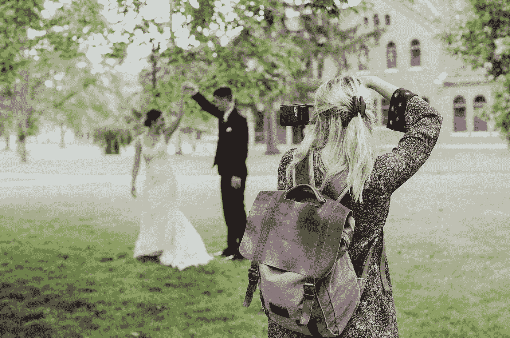

# 那次我编写了一个有偏见的算法

> 原文：<https://towardsdatascience.com/the-time-i-coded-a-biased-algorithm-4ae4fba62bf6?source=collection_archive---------9----------------------->

## 数据科学伦理问题在晚上困扰着我，并让我在实践中负责任

玛利亚·克拉夫特在 [Unsplash](https://unsplash.com?utm_source=medium&utm_medium=referral) 上的照片

我经常看到有人从客观的角度谈论 AI 和数据科学的偏见和解决方案，而偏见是高度主观的。每当模型实现者决定包含或排除某些东西时，潜在的偏差就可能出现。所以，我希望从一个数据科学从业者的角度讲一个故事。

我最近证实，我可以自由地分享一个来自[我过去实习](https://medium.com/codex/ds-undergrad-journey-part3-my-internship-research-experience-907aaa57c497)的个人故事。很遗憾地承认，我不小心设计并编写了一个计算机视觉算法，后来证明是有偏见的。

# 背景

我在一家中国 IT 公司做人工智能实习生，其中一个客户是一家国际婚纱摄影工作室。我对这对不寻常的组合感到非常惊讶，因为我没想到摄影师会需要人工智能。但是你看，一场婚礼拍上千张照片，不费吹灰之力。你可以一直按下相机的快门，这样就能保证在某个地方拍出完美的照片，捕捉到完美的瞬间。

但这就是棘手的地方。一本婚礼相册装不下这么多照片。手动检查这么多婚礼的这么多照片非常**费时费力**，所以我的工作是**尽可能自动化照片选择过程**。

根据客户的说法，婚礼相册通常包含 3 种类型的照片:

*   只有新娘或新郎(一个人)的，
*   有新娘和新郎(两个人)的，和
*   2 人以上的集体照。

不幸的是，算法无法为每个类别选择一张完美的照片，因为计算机没有美感，但它们可以删除绝对无用的照片。例如，我们不需要相框中没有人的照片。所以，电脑可以帮助我们缩小到几百张照片，而不是几千张，以减轻工作量。

那么我们如何做到这一点呢？

# 履行

## 数据

我需要从大量的图像数据开始。结婚照的分辨率很高，所以我在电脑上获得了大约 20 对夫妇的几千张照片，这些照片占据了我所有的存储空间。

## 算法设计

要处理图像数据，计算机视觉算法和深度学习是必由之路。更具体地说，因为我是根据图像中的人数对图像进行分类，所以我需要一个对象检测算法来计算出现的次数。我试着数人的躯干和脸。当人们不面对摄像机时，人脸检测效果不太好。

如果我数 3 个人，图像肯定是一张集体照。如果我数 2 的话，这张照片极有可能是情侣照。两人不是情侣的场合相当少见。当我数到 1 的时候，我还实现了性别分类，这样我就可以把新娘和新郎的照片分开。原型在我的测试集上运行良好，我们已经准备好为我们的客户进行更大规模的测试。

现在，你感觉到什么不对吗？因为如果你这样做了，你会成为比我更好的数据科学家。正如我所说，我们的客户是一家国际婚纱摄影工作室，但我们没有考虑同性伴侣的情况。

当遇到任何一对同性伴侣时，该算法都会出现小故障。由于它运行性别分类来区分新娘和新郎，当遇到两个新娘或两个新郎时，它就失灵了。

## 算法重新设计

为了解决这个问题，我改用了面部识别。通过面部识别，我可以命令模特检查谁是这对新婚夫妇，并将准确度提高到一个全新的水平。由于面部识别不涉及性别，这不是一个简单的二元概念，我认为它对同性伴侣以外的更多情况也是有效的。

但面部识别的不便之处在于，需要有人手动识别这对夫妇的身份，并将他们的脸输入数据库。如果数据库里没有他们的信息，面部识别就会失败。在某种程度上，面部识别将人类元素重新引入了本应自动化的领域。我们的客户认为这不足以大幅削减成本，因此没有跟进。

# 反射

那次实习已经过去一年半了，但我还是经常想起这个项目。我想知道为什么我没有考虑我的测试数据之外的更多情况，为什么我的团队也没有意识到我的设计中的潜在偏差，以及我可以做些什么来避免一开始就出现的偏差。

> “为了训练 AI 造福人类，AI 的创造者需要代表人文。”———费·

我很害怕这么说，但我想如果我再做一次，我可能会在那种情况下犯完全相同的错误，重新编写有偏见的算法。

有时，偏见和错误是由于人类无意识的选择而产生的。我在一个同质团队中，每个人的大脑都和我的一样。尽管我在最初设计我的模型时确实短暂地考虑过面部识别而不是性别分类，但由于人力成本的原因，我放弃了更复杂的面部识别的想法。但最终，事实证明人类的参与是必不可少的。在我试图纠正这个问题后，实际上很难实现自动化。人类总是与算法实现紧密交织在一起。有时候，自动化的衍生物根本不值得。

此外，我相信数据科学和人工智能将从多元化的从业者团队中受益匪浅。任何一个数据科学家都不可能像他/她的用户那样思考问题，感受他/她的用户的感受，但是在一起，来自不同想法的不同观点有更好的机会。

这一经历让我对未来数据科学实施中的每一个决定都格外谨慎。我真心希望你也能从中吸取一些东西。

感谢您的阅读！希望这对你有帮助。

PS:考虑到这个博客的背景，我会为这个博客使用一个更好的图片，但是我不能过早地泄露这个大转折。