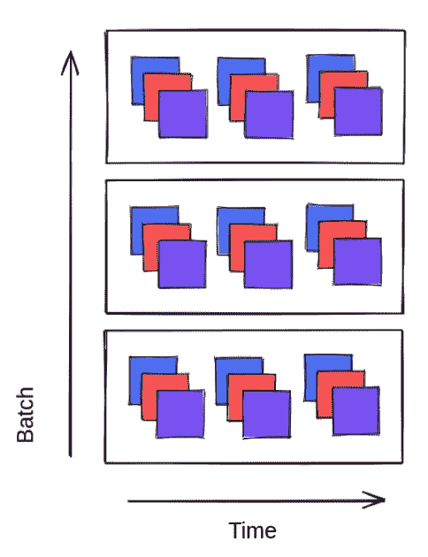
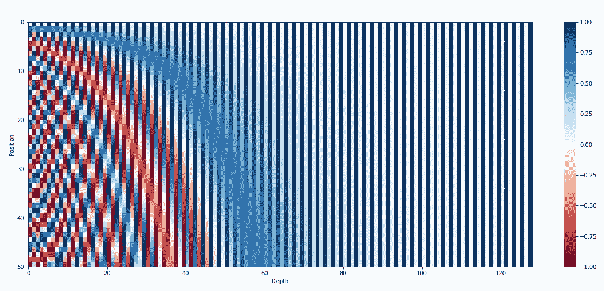
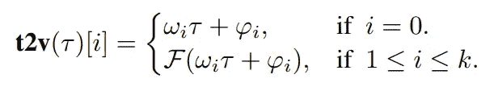
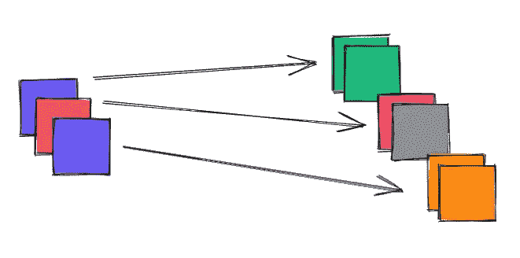
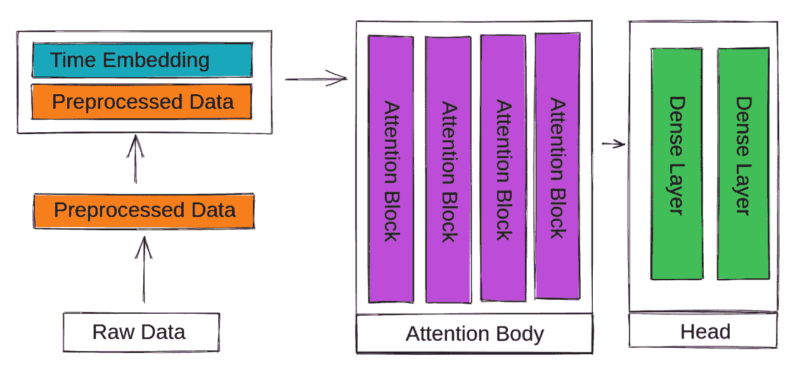

# 时间序列转换器

> 原文：<https://towardsdatascience.com/the-time-series-transformer-2a521a0efad3?source=collection_archive---------1----------------------->

## 所有你需要知道的最先进的变压器神经网络架构，适应时间序列任务。包括 Keras 代码。

图片来自 [Pixabay](https://pixabay.com/?utm_source=link-attribution&utm_medium=referral&utm_campaign=image&utm_content=4240338) 的[romnyepez](https://pixabay.com/users/romnyyepez-12641300/?utm_source=link-attribution&utm_medium=referral&utm_campaign=image&utm_content=4240338)

# 目录

*   介绍
*   预处理
*   可学习的时间表示(时间 2 向量)
*   体系结构
*   锦囊妙计(训练变形金刚时要考虑的事情)

# 介绍

[他们说，你需要的只是关注。是不是更稳健的卷积？用更少的参数挤出更多的学习能力仅仅是一种黑客手段吗？应该是稀疏的吧？原作者是如何想出这个架构的？](https://arxiv.org/abs/1706.03762)

变压器架构

*   它比 RNNs 更好，因为它不是递归的，并且可以使用以前的时间步长特征而不会丢失细节
*   它是众多任务中表现最好的架构，包括但不限于:NLP、Vision、回归(It 扩展)

从现有的 RNN 模型转换到注意力结构是相当容易的。输入具有相同的形状！

# 预处理

将转换器用于时序任务不同于将其用于 NLP 或计算机视觉。我们既不标记数据，也不将它们切割成 16x16 的图像块。相反，我们遵循一种更经典/古老的方式来准备数据进行训练。

有一点是绝对正确的，那就是我们必须在与输入相同的值范围内输入数据，以消除偏差。这通常在[0，1]或[-1，1]范围内。通常，建议对所有输入要素应用相同类型的预处理管道来消除这种偏差。个别用例可能会免除这一点，不同的模型和数据是独一无二的！想一想你的数据的来源。

## 流行的时间序列预处理技术包括:

*   只是缩放到[0，1]或[-1，1]
*   标准缩放(去除平均值，除以标准偏差)
*   幂变换(使用幂函数将数据推向更正态的分布，通常用于有偏差的数据/存在异常值的情况)
*   离群点去除
*   成对差异或计算百分比差异
*   季节性分解(试图使时间序列平稳)
*   设计更多的特性(自动化的特性提取器，分桶到百分位数，等等)
*   时间维度中的重采样
*   在要素维度中进行重采样(不使用时间间隔，而是使用要素上的谓词来重新安排时间步长-例如，当记录的数量超过 N 个单位时)
*   滚动值
*   聚集
*   这些技术的组合

同样，预处理决策与问题和手头的数据紧密相关，但是这是一个很好的开始列表。

如果你的时间序列可以通过季节性分解等预处理变得平稳，那么你可以通过使用更小的模型(训练速度也更快，需要的代码和工作量更少)获得高质量的预测，例如 [NeuralProphet](https://github.com/ourownstory/neural_prophet) 或 [Tensorflow Probability](https://blog.tensorflow.org/2019/03/structural-time-series-modeling-in.html) 。

深度神经网络可以在训练期间(我们将在后面使用 Time 2 Vec)自行学习线性和周期分量。也就是说，我建议不要将季节性分解作为预处理步骤。

其他决策(如计算聚合和成对差异)取决于数据的性质以及您想要预测的内容。

将序列长度视为一个超参数，这导致我们得到一个类似于 RNNs: `(batch size, sequence length, features)`的输入张量形状。

这是一张所有尺寸都设置为 3 的图。

输入形状

# 可学习的时间表征

对于工作注意力，您需要将时间的含义附加到输入要素中。在原始的 NLP 模型中，叠加的正弦函数的集合被添加到每个输入嵌入中。现在我们需要一个不同的表示，因为我们的输入是标量值，而不是不同的单词/标记。

kazemnejad 博客中的位置编码可视化。

[时间 2 Vec 纸](https://arxiv.org/abs/1907.05321)派上用场。这是一种可学习的、互补的、模型不可知的时间表示。如果你过去学过傅立叶变换，这应该很容易理解。

只需将每个输入要素分解为一个线性分量(一条线)和尽可能多的周期(正弦)分量。通过将分解定义为函数，我们可以通过反向传播来学习权重。

时间 2 Vec 分解方程

对于每个输入要素，我们以与时间无关(时间分布图层)的方式应用相同的图层。这种可学习的嵌入不依赖于时间！最后，连接原始输入。

这是学习时间嵌入的图示，对于每个输入特征类别(每个特征 1 个学习线性分量和 1 个学习周期分量)，学习时间嵌入**不同**。

> 这并不意味着每个 time-step 将携带相同的嵌入值，因为 time2vec 嵌入的计算取决于输入值！

最后，我们将这些连接在一起，形成注意力模块的输入。

# 体系结构

我们将使用多头自我关注(通过不同的密集层/矩阵设置 Q、K 和 V 以依赖于输入)。下一部分是可选的，取决于你的模型和数据的规模，但我们也将完全抛弃解码器部分。这意味着，我们将只使用一个或多个注意力阻断层。

在最后一部分，我们将使用几个(一个或多个)密集层来预测我们想要预测的任何东西。

我们的建筑

每个注意块由自我注意、层标准化和一个前馈块组成。每个模块的输入尺寸等于其输出尺寸。

可选地，在头部分之前，你可以应用某种池(例如全球平均 1D)。

# 诡计多端

使用变形金刚时需要考虑的事项和注意事项，以充分利用您的模型。

*   **起步小**

不要为超参数而疯狂。从一个单一的、不起眼的注意力层、几个头部和一个低维度开始。观察结果并相应调整超参数——不要过度拟合！根据数据缩放模型。然而，没有什么能阻止你安排一个巨大的超参数搜索任务:)。

*   **学习率热身**

导致更大稳定性的注意力机制的一个关键部分是学习率热身。以一个小的学习速率开始，逐渐增加直到你达到基本速率，然后再降低。你可能会对指数衰减的时间表和复杂的公式感到疯狂，但我只会给你一个简单的例子，你只要大声朗读下面的代码就应该能够理解:

*   **使用 Adam(或变体)**

非加速梯度下降优化方法不适用于变压器。Adam 是一个很好的初始优化器选择。留意更新的(可能更好的)优化技术，如 AdamW 或 NovoGrad！

*感谢一路看完！*

## 参考

[1]关注是你所需要的，Ashish Vaswani 和 Noam Shazeer 和 Niki Parmar 和 Jakob Uszkoreit 和 Llion Jones 和 Aidan N. Gomez 和 Lukasz Kaiser 和 Illia Polosukhin，2017 年

[2] Time2Vec:学习时间的向量表示，赛义德·迈赫兰·卡泽米和里沙布·戈埃尔和塞佩赫尔·埃格巴利和贾纳汉·拉马南和贾斯普里特·萨霍塔和桑杰·塔库尔和斯特拉·吴和卡塔尔·史密斯和帕斯卡尔·普帕特和马库斯·布鲁贝克，2019 年