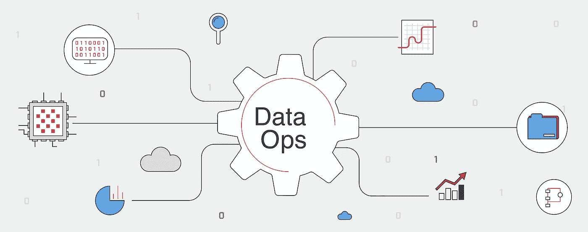

# 开始使用数据操作管道的三大方法

> 原文：<https://towardsdatascience.com/the-top-3-ways-to-get-started-with-dataops-pipelines-16b84d88d9ea?source=collection_archive---------18----------------------->

## DataOps 方法提供了一种新的方式来提高数据分析的质量和速度。

DataOps 图形，经 Ascend 的 dataops.dev 许可

数据和数据系统的激增——受高级数据分析用例数量不断增加的推动——使数据操作成为现代组织的主流。DataOps 方法在数据团队中越来越受欢迎，提供了一种提高数据分析质量和速度的新方法。

传统上，数据管道很少依赖自动化，需要密集编码。随着组织现代化并开始关注自助服务分析和机器学习，公司开始采用 DataOps，这带来了软件工程视角和管理数据管道的方法，类似于 DevOps 趋势。

DataOps 方法符合敏捷软件开发的口头禅:变化是不可避免的。人们必须设计流程和技术来拥抱变化。变化也不仅限于模式变化，它还包括转变业务需求、向新的利益相关者交付数据和报告、集成新的数据源等等。通过专注于支持快速变更管理和迭代流程的自动化工具，DataOps 实现了组织目标，如增加数据团队对业务的产出，同时降低开销。

**数据运营战略的优势**

DataOps 从业者专注于“降低变革成本”，将数据转化为商业价值。这种价值可能表现为分析师和数据科学家更易于使用的数据集、更快的变更请求周转时间，以及更少的数据集中的错误。如果他们还没有这样做，拥有数据和分析目标的公司(无论规模大小)都需要利用 DataOps。事实上， [Gartner](https://www.gartner.com/smarterwithgartner/gartner-top-10-data-and-analytics-trends-for-2021/) 最近将 DataOps 列为其 2021 年十大数据和分析趋势之一，作为更大的“XOps”运动的一部分。数据和分析团队应考虑将 DataOps 整合到他们的程序中，以利用其灵活的设计、自动化、敏捷的编排和可扩展性。

对数据操作和自动化工具的投资能够实现以下改进:自动化测试确保数据质量，即使代码逻辑发生变化；版本控制提供了更改和回滚的快速可审计性；CI/CD 将开发和试运行环境与生产环境分开。一般来说，DataOps 使数据团队能够跟上不断加速的数据开发生命周期。

**需要克服的潜在挑战**

数据运营和数据管道影响着“金三角”的所有三个部分——人员、流程和技术。当涉及到实施任何新的方法和随之而来的技术时，其部署和管理方式以及实施的流程可能会有不一致之处。

使用 DataOps 的公司需要确保所有三个方面的增长和发展，以保持数据管道的健康。例如，如果相关人员喜欢更“瀑布”的方法，而不是更敏捷、迭代的方法，那么一个在技术上大量投资以支持变更管理的公司将不会释放价值。人们对更好的变更管理(即版本控制、数据质量测试和 CI/CD 管道部署)和更频繁的部署的前景感到兴奋，但由于缺乏测试覆盖面，在频繁破坏生产分析后，他们可能会受到影响。为了应对这些挑战，金三角的三个方面需要协同工作，并进行整体管理和开发，以实现成功的数据运营战略。

**开始使用 DataOps 管道的三大方法**

与任何新兴实践和新技术一样，开始可能是一项艰巨的任务。对于 DataOps，管道是一个很大的组成部分。为了有所帮助，以下是在您的组织内实现数据操作管道的几种战术方法。

1.  **优先考虑自助服务以提高速度:**添加自助服务，以便组织内的所有利益相关者，无论其角色和职责如何，都有能力推动他们的目标。随着需求的快速变化，依赖于某些团队的过程将不可避免地成为瓶颈，并迫使优先级折衷。相反，如果项目的驱动团队被授权自我创建必要的工件，他们将能够在不需要跨团队沟通及其内在复杂性的情况下实现他们的目标。例如，数据工程团队可以创建更灵活的数据集，并引入允许数据分析师团队在不添加新功能请求的情况下进行更深入挖掘的工具。创建更多自助服务将允许积压的团队赶上进度，并使用额外的带宽投资于其他数据运营流程和技术。
2.  **通过自动化测试&部署降低变更流程的风险:**投资自动化测试和部署(例如 CI/CD)以建立对数据质量的信心并加速变更管理。光是这一点对于数据运营来说还不够，但这是一个可以迅速开始获得回报的关键部分，例如，让团队有更多时间专注于新的开发，而不是处理无意的中断或脆弱的部署流程。更频繁地交付具有所需变更的可信数据，会导致以业务为中心的团队更加依赖这些数据。
3.  **从小处着手，逐步扩展:**识别棘手问题，一次解决几个。如果一个报告经常不准确，添加几个测试来提供覆盖面。随着时间的推移扩展测试套件。如果部署过程很繁琐，并且延迟了部署和更新，请确定适当的位置来创建一点自动化。换句话说，与其在数据运营所需的所有移动部分投入大量资金(这需要很长的准备时间和利益相关方的支持)，不如从小处着手。

确定哪种方法对特定组织最有意义，以及以何种顺序，取决于 DataOps 社区中的广泛讨论。这类似于软件社区在开始敏捷开发时所经历的细微差别。测试驱动的开发是一个需求吗，或者即使是事后开发，测试也是重要的一部分吗？重要的是不要迷失在方法的细微差别中，而是要坚持 DataOps 实践的核心原则。只有这样，您的团队才能释放 DataOps 的真正潜力，并为企业创造有意义的价值。