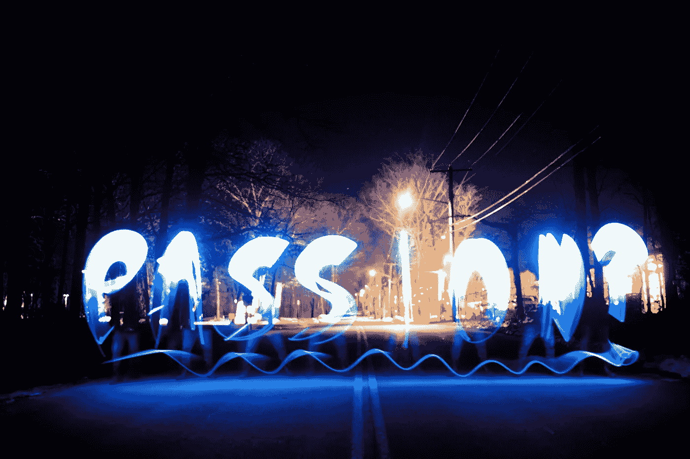

# 五大数据科学面试问题

> 原文：<https://towardsdatascience.com/the-top-5-data-science-interview-questions-14fa4dfbdf49?source=collection_archive---------34----------------------->

## 意见

## 下一次面试要准备什么


在[Unsplash](https://unsplash.com/s/photos/job-interview?utm_source=unsplash&utm_medium=referral&utm_content=creditCopyText)【1】上由 [Tim Gouw](https://unsplash.com/@punttim?utm_source=unsplash&utm_medium=referral&utm_content=creditCopyText) 拍摄的照片。

# 目录

1.  介绍
2.  你为什么对数据科学感兴趣？
3.  你遇到过哪些问题？
4.  你和利益相关者合作过吗？
5.  什么是常见的项目陷阱和注意事项？
6.  执行一个带回家的项目
7.  摘要
8.  参考

# 介绍

我不想列出难以置信的具体问题来快速记忆，而是想强调一些更概念性的问题，这些问题可能看起来微不足道，但最终会成为数据科学应用中的一个关键因素。您会注意到，这些问题不完全是技术性的，而是展示了您作为一名数据科学家是如何工作的。大家可以学习 SQL，Python，R 等。，但让你与众不同的是你如何处理数据科学项目、问题以及围绕这些项目和问题的人。话虽如此，我将讨论更多的'*行为*'数据科学面试问题，也许你将来会遇到其中的一些问题/任务(*或作为面试官自己问这些问题*)。

# 你为什么对数据科学感兴趣？



照片由[卡肖恩·埃尔南德斯](https://unsplash.com/@galacticfantastic?utm_source=unsplash&utm_medium=referral&utm_content=creditCopyText)在[Unsplash](https://unsplash.com/s/photos/passion?utm_source=unsplash&utm_medium=referral&utm_content=creditCopyText)【2】上拍摄。

再一次，这个问题看起来你在准备面试的时候可能会忽略掉。然而，事实并非如此。面试官会想知道你为什么对数据科学感兴趣，因为这将向他们展示你有激情和动力取得成功，即使工作变得困难或难以承受。

棘手的部分是——你如何回答这个问题，当展示时，不说是最好的方法。虽然他们可能不会直接问这个问题，但你的行动会为你说话。例如，你在面试开始之前和之后的交流方式可以显示出你对数据科学的兴趣。为了更好地说明这个问题，我将介绍哪些事情不应该做(*一般是*)，以及哪些事情应该做。

> 不要做什么:

*   立即询问薪酬(*谁知道呢，在他们看到你对实际工作的兴趣后，你可能会获得更高的薪酬，因为这将表明你热爱数据科学以及这家公司，坦率地说，这从长远来看对他们有利*
*   谈论数据科学这个新的、时髦的工作

> 你应该做什么:

*   展示你在努力学习数据科学，例如，证书、写作、视频和任何课外活动，向他们展示你对数据科学感兴趣(*你对他们来说是完全陌生的，所以他们不会知道你做的每件事，在面试前、面试期间和面试后谨慎使用这些信息，这将有助于你获得工作*
*   根据你个人的想法，提及一些关于数据科学对你自己、公司和其他相关人员的积极影响

总的来说，尽管听起来很简单也很老套，但做好你自己，合适的工作就会来找你——比如，不要假装自己不适合某家公司，而是专注于你真正喜欢的数据科学。

# 你遇到过哪些问题？


照片由[蒂姆·高](https://unsplash.com/@punttim?utm_source=unsplash&utm_medium=referral&utm_content=creditCopyText)在[Unsplash](https://unsplash.com/s/photos/problem?utm_source=unsplash&utm_medium=referral&utm_content=creditCopyText)【3】上拍摄。

这个问题是测试你对一个项目的认知。虽然只讨论一个完美的工作环境和项目看起来不错，但最有可能的是，你会在未来的工作中遇到一些问题。也就是说，面试官会想知道你是如何处理这些问题的，因为这可以作为你将来会怎么做的一个指标。

> 不要做什么:

*   责怪他人或公司

> 你应该做什么:

*   对你的错误保持透明，因为这没什么，尽早认识到这一点总是更好
*   讨论常见的问题，并提出各自的解决方案
*   讨论你从这个问题中学到了什么

# 你和利益相关者合作过吗？


[DocuSign](https://unsplash.com/@docusign?utm_source=unsplash&utm_medium=referral&utm_content=creditCopyText) 在[Unsplash](https://unsplash.com/s/photos/business?utm_source=unsplash&utm_medium=referral&utm_content=creditCopyText)【4】上拍摄的照片。

当然，作为一名数据科学家，与利益相关者合作是有益的。然而，你可能并没有和被贴上利益相关者标签的人一起工作过。因此，重要的是要知道，从本质上讲，与任何有共同兴趣的人一起工作都可以被视为利益相关者。传统上，我会说利益相关者是产品经理。然而，另一个数据科学家、经理、业务分析师、软件工程、UI/UX 研究员，以及您公司或您实际客户中的几乎任何人都可以被视为利益相关者。

公司之所以会问这个问题，是因为他们希望你能够向没有学习过数据科学的人或者不在产品或工程团队的人(比如销售团队)解释数据科学，并且你需要在没有任何数据科学知识的情况下向他们解释模型如何工作或其好处。例如，您可能甚至不想将数据科学作为一个模型，而是作为一个自动完成人类通常会做的事情的工具。根据具体情况，您可以添加更多的技术术语，但重要的是要意识到其他人可能不知道的东西——尤其是如果这是一次性的解释。但是，如果您不止一次地与某人合作，那么创建一些文档来总结您正在进行的数据科学项目可能会有所帮助，以便可以参考。

# 什么是常见的项目陷阱和注意事项？


克里斯多夫·高尔在[Unsplash](https://unsplash.com/s/photos/code?utm_source=unsplash&utm_medium=referral&utm_content=creditCopyText)【5】上的照片。

这个问题比刚才的“*问题*”更具体一点。在这个上下文中，陷阱意味着**这个项目可能会出什么问题**。作为数据科学家，您需要知道模型实现后会发生什么。期望包括但不限于资源、相关人员、客户影响和金钱方面的考虑。

> 以下是数据科学项目中的一些常见陷阱，在数据科学面试中提出来可能会有所帮助:

*   你需要多少数据？
*   你的模型多久需要训练一次？
*   你的模特训练可能会失败，你应该准备一些东西作为后备
*   你的型号有多贵？
*   您的模型是否占用了其他当前流程的其他资源？
*   你预计你的模式会对企业和客户产生什么影响？
*   您的模型在某些数据上可能表现不佳
*   如果您有一个预测不正确的分类模型，会发生什么？

如您所见，数据科学项目有许多问题、考虑事项和陷阱。重要的是要意识到这些陷阱，以及现在就开发的解决方案，而不是事后才开发。要记住的一个关键短语是积极主动，而不是被动反应。

# 执行一个带回家的项目


在[Unsplash](https://unsplash.com/s/photos/data-science?utm_source=unsplash&utm_medium=referral&utm_content=creditCopyText)【6】上由 [Myriam Jessier](https://unsplash.com/@mjessier?utm_source=unsplash&utm_medium=referral&utm_content=creditCopyText) 拍摄的照片。

这一点不是一个问题，而是一些数据科学面试中可以期待的东西。数据科学的独特之处在于它涉及许多跨职能学科。测试这种技能的一个方法是指定一个带回家的评估，这通常是故意模糊的。关键是看你在没有太多信息的情况下会怎么做，一个可以被数据科学解决的问题。

> 做什么:

*   问问题，就像你在真实工作中一样
*   可能会故意遗漏一些信息，他们可能想知道你是如何提问或提出问题的
*   通常，数据科学家遵循类似的流程，即:

问题陈述、数据收集、探索性数据分析、算法类型、算法比较、最终模型(s *)* ，以及结果和讨论。

# 摘要

如您所见，这些问题或任务都不是特别技术性，但这并不意味着它们不重要。这些问题以及你如何回答这些问题对你的面试以及你的实际工作都至关重要。成为一名全能的数据科学家并不止步于编码和统计，还包括解决问题、业务能力、产品能力、利益相关者或客户沟通以及热情。

> 总而言之，以下是您在下一次数据科学面试中可能遇到的问题和任务:

```
* Why are you interested in Data Science?* What problems have you encountered?* Have you worked with stakeholders?* What are common project pitfalls and considerations?* Perform a take-home project
```

我希望你觉得我的文章既有趣又有用。如果您同意或不同意这些数据科学面试问题，请随时在下面发表评论。为什么或为什么不？你认为还有哪些问题很重要？这些当然可以进一步澄清，但我希望我能够对一些不太技术性，但仍然重要的数据科学面试问题有所启发。感谢您的阅读！

*请随时查看我的个人资料、*[*Matt Przybyla*](https://medium.com/u/abe5272eafd9?source=post_page-----14fa4dfbdf49--------------------------------)*等文章，也可以在 LinkedIn 上联系我。*

# 参考

[1]照片由 [Tim Gouw](https://unsplash.com/@punttim?utm_source=unsplash&utm_medium=referral&utm_content=creditCopyText) 在[Unsplash](https://unsplash.com/s/photos/job-interview?utm_source=unsplash&utm_medium=referral&utm_content=creditCopyText)(2016)上拍摄

[2]照片由[卡肖恩·埃尔南德斯](https://unsplash.com/@galacticfantastic?utm_source=unsplash&utm_medium=referral&utm_content=creditCopyText)在[Unsplash](https://unsplash.com/s/photos/passion?utm_source=unsplash&utm_medium=referral&utm_content=creditCopyText)(2021)拍摄

[3]照片由 [Tim Gouw](https://unsplash.com/@punttim?utm_source=unsplash&utm_medium=referral&utm_content=creditCopyText) 在[Unsplash](https://unsplash.com/s/photos/problem?utm_source=unsplash&utm_medium=referral&utm_content=creditCopyText)(2016)上拍摄

[4]照片由[文件设计](https://unsplash.com/@docusign?utm_source=unsplash&utm_medium=referral&utm_content=creditCopyText)在[Unsplash](https://unsplash.com/s/photos/business?utm_source=unsplash&utm_medium=referral&utm_content=creditCopyText)(2021)上拍摄

[5]Christopher Gower[在](https://unsplash.com/@cgower?utm_source=unsplash&utm_medium=referral&utm_content=creditCopyText) [Unsplash](https://unsplash.com/s/photos/code?utm_source=unsplash&utm_medium=referral&utm_content=creditCopyText) 上拍摄的照片，(2017)

[6]米利安·耶希尔在 [Unsplash](https://unsplash.com/s/photos/data-science?utm_source=unsplash&utm_medium=referral&utm_content=creditCopyText) 上拍摄的照片，(2020)