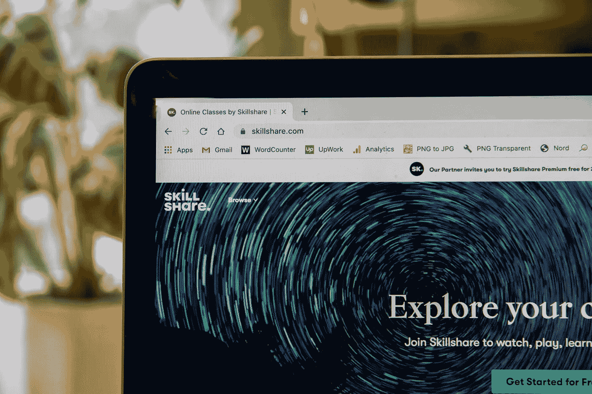
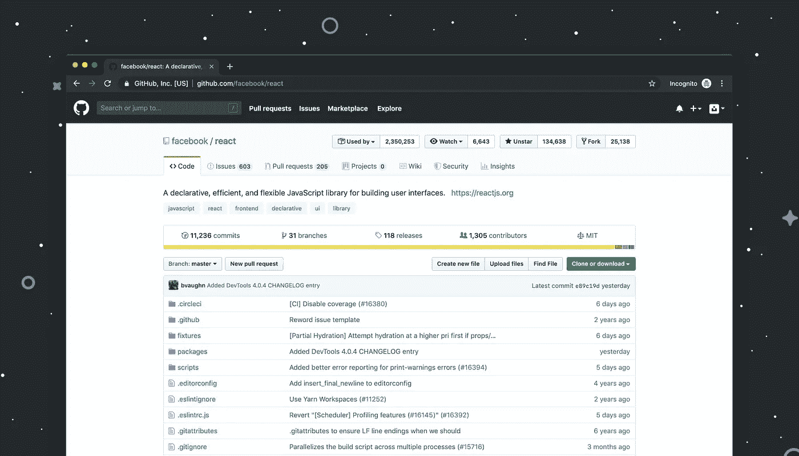

# 成为数据科学家的五大途径

> 原文：<https://towardsdatascience.com/the-top-5-paths-to-become-a-data-scientist-49f085755555?source=collection_archive---------32----------------------->

## 意见

## 成为一名成功的数据科学家的最佳方式是什么？如何做到？


由 [Bostan Florin Catalin](https://unsplash.com/@bostanflorin?utm_source=unsplash&utm_medium=referral&utm_content=creditCopyText) 在[Unsplash](https://unsplash.com/s/photos/person-trail?utm_source=unsplash&utm_medium=referral&utm_content=creditCopyText)【1】上拍摄的照片。

# 目录

1.  介绍
2.  传统研究生硕士学位
3.  证书
4.  训练营
5.  油管（国外视频网站）
6.  在线教程
7.  摘要
8.  参考

# 介绍

随着新技术、竞争和世界事件的出现，成为数据科学家的道路已经发生了很大变化。虽然有一些屡试不爽的传统方式可以成为数据科学家，但这可能不是你的首选方式。除了更短的教育经历之外，您还可以采取更多快速流程来开始并跟上您的数据科学之路。最后，许多人可以访问几乎免费的资源。我将讨论成为数据科学的五大途径，并讨论如何成为数据科学，以及为什么它对您来说可能是最好或最差的选择。也许，您可以组合几个或所有路径。最终，将由您来决定您的数据科学学习之旅如何进行。也就是说，了解你所有的选择是至关重要的——这也是我将在下面讨论的。

# 传统研究生硕士学位


由[瓦西里·科洛达](https://unsplash.com/@napr0tiv?utm_source=unsplash&utm_medium=referral&utm_content=creditCopyText)在[Unsplash](https://unsplash.com/s/photos/degree?utm_source=unsplash&utm_medium=referral&utm_content=creditCopyText)【2】上拍摄。

我不是在写数据科学的本科学位，因为我实际上并没有追求一个学位，但是，我已经完成了数据科学的研究生学位。我确实认为我将要讨论的关于研究生院的一些观点也适用于本科教育。我参加了南方卫理公会大学(SMU)，我很高兴我做到了。虽然很贵，但我学到的几乎所有材料都适用于真实世界的数据科学用例。然而，有时我希望我在大学时学习了软件工程或统计学，以便更好地装备自己，但是正如我们将在下面看到的，有其他方法来学习数据科学的其他特定方面。

这里有一份非常全面的[顶级数据科学研究生项目列表](https://www.mastersindatascience.org/schools/23-great-schools-with-masters-programs-in-data-science/) [3】，这份列表实际上帮助我决定申请哪些项目— *拥有数据科学硕士项目的最佳 23 所学校*:

  

> 完成数据科学学位的好处:

*   专攻数据科学，不像本科生那样可能会包括无用的额外课程
*   年纪越大，越容易开始研究生的问题
*   与已经是数据科学家的学生或有志于在类似领域发展事业的学生合作
*   这有助于建立职业关系，并从中学习
*   我个人选择了我所在州的一所学校，这样公司就会熟悉那所学校
*   很多时候，GRE 是不需要的
*   因为这些是特定的项目，你可以得到经济资助
*   研究生院可以是面对面的也可以是远程的
*   研究生院通常会增加一生一次的经历，比如:
*   会议、研讨会和类似静修的体验，让您沉浸在数据科学中，向行业领导者学习
*   有些学校可以更有声望，其中 ***有时*** 可以带来更多的就业前景
*   有些项目可以在一年内完成
*   一些公司更喜欢研究生学位( ***这个要求正在改变*** )
*   拥有学校自豪感，建立长久的联系

总体而言，从更传统的研究生课程中学习数据科学可以确保在数据科学领域获得体面的职业生涯。当然，也有缺点，比如价格和不方便。然而，如果你的情况就是这样，那么你可能要开始考虑其他项目了。

> 以下是数据科学研究生学位项目中可能会遇到的一些不利因素:

*   价格，有些价格在 60，000 美元以上
*   可能需要很长时间才能完成
*   可能会不方便，例如面对面

如你所见，与缺点相比，我可以指出更多的优点。这是我的亲身经历，所以这个经历可能和你不一样。也就是说，对我的赞成和反对持保留态度，并考虑其他选择，比如下面这些。

# 证书



由 [Lewis Keegan](https://unsplash.com/@skillscouter?utm_source=unsplash&utm_medium=referral&utm_content=creditCopyText) 在[Unsplash](https://unsplash.com/s/photos/udemy?utm_source=unsplash&utm_medium=referral&utm_content=creditCopyText)【4】上拍摄的照片。

如果您想要一个涵盖特定课程和主题的更定制的计划，那么认证是学习和成为一名成功的数据科学家的好方法。同样，如果你不确定你想成为哪种类型的数据科学家，那么这条道路也是一个更好的选择。例如，你可能想成为计算机视觉工程师、自然语言处理工程师( *NLP* )、机器学习工程师、数据工程师或研究科学家。当你参加一个较长的项目时，比如硕士学位，你可能很难知道你想成为什么类型的数据科学家，在这个项目中，你只有一门特定主题的课程，比如 NLP。想象一下，支付数千美元获得一个学位，而你只学习了大约 6 个小时的数据科学特定主题——这种情况是认证的亮点；你可以在同一个主题下参加无数的认证，但是在这个主题下涵盖不同的材料或者有不同的例子可以学习。

> 完成数据科学认证的好处:

*   方便的
*   更便宜的选择
*   许多可以在你自己的时间内完成
*   有些证书来自更大的财富 500 强公司，如果你完成了，当然会对你申请那家公司有所帮助
*   你可以用你目前的工作来补充认证
*   所以你不必牺牲你的正常工资
*   有时你工作的公司会支付这些证书的费用，因为它们不像研究生学位那样昂贵，而且可以根据你工作的具体项目进行定制
*   按照这种思路，证书可以帮助你从事目前的工作
*   你可以在网上展示你的证书，并在简历中突出显示
*   算作几乎真实世界的经验，因为这些认证高度关注具体的问题和用例(*通常是*)
*   认证通常会进行排名和审查，比大学更是如此，尤其是因为可能只有 100 人注册学位课程，而可能有成千上万的学生参加数据科学证书课程，这有助于帮助您做出最佳决策

完成认证有几个好处，无论是方便，更便宜的价格，还是能够在自己的时间内完成它们。几乎可以说，一般来说，证书并不那么有名，但是，我相信教育正在发生转变——人们不想要大笔学生贷款，他们不想在一个没有定制的项目上花费数年时间，他们想要一个灵活的项目。因此，越来越多的人报名参加认证并炫耀这些证书，这为那些只申请没有传统正规教育的职位的人创造了一个更好的观点和视角。

> 完成数据科学认证的缺点:

*   ***有时候*** 不会被雇主视为经验不足
*   可能是由不可靠的来源造成的

上面，你可以看到我努力列出了一些认证的缺点，作为数据科学的学习途径。同样需要注意的是，认证质量存在较大差异，通常情况下， ***多数*** 研究生学位 ***倾向于*** 更加稳定和卓越。

# 训练营


照片由[heylogostechie](https://unsplash.com/@heylagostechie?utm_source=unsplash&utm_medium=referral&utm_content=creditCopyText)在[Unsplash](https://unsplash.com/s/photos/bootcamp?utm_source=unsplash&utm_medium=referral&utm_content=creditCopyText)【5】上拍摄。

起初，一个训练营或一组认证似乎没有什么区别；然而，仍有一些重要的问题需要注意。训练营的主要区别之一是有一个预定的或有序的学习路径。此外，你还可以在同一个训练营项目中与同学一起工作、学习和合作，有时甚至是面对面。我发现这一点是有益的，因为你们都在努力实现同一个目标，认证有时会更侧重于个人。

> 完成数据科学训练营的好处:

*   比较便宜的
*   更快的
*   更方便
*   往往是有序的或在特定的学习时间表
*   有些提供学费补偿，或者如果你在 6 个月内没有找到数据科学的工作，你就不必支付学费
*   面对面和远程
*   同志意识、学习和他人之间的合作
*   类似于学位课程，但是更短、更快
*   也可以在下班后完成这些训练营——你现在的工作
*   包括顶点计划
*   声誉良好的导师和未来的合作公司

特别是一个训练营，虽然我没有亲自参加，但我已经了解了他们的计划流程，并有几个朋友和一个同事与他们一起完成了训练营，他们也取得了令人难以置信的成功。这个训练营被命名为[总会](https://generalassemb.ly/education/data-science-immersive/austin?ga_campaign=immersive-remote&ga_variation=dsi-tile)【6】:

<https://generalassemb.ly/education/data-science-immersive/austin?ga_campaign=immersive-remote&ga_variation=dsi-tile>  

> 完成数据科学训练营的缺点:

*   现在训练营变得越来越受欢迎，我开始看到一些也变得越来越贵
*   有些有时并不为人所知

那么，在前三条成为数据科学家的道路中，你会选择哪一条呢？到目前为止，研究生学位可以总结为更有声誉和信息量，认证最灵活，也是最便宜的，而训练营的结构与研究生学位相似，但速度更快，通常也更便宜。

# 油管（国外视频网站）


克里斯蒂安·威迪格在[Unsplash](https://unsplash.com/s/photos/youtube?utm_source=unsplash&utm_medium=referral&utm_content=creditCopyText)【7】上拍摄的照片。

现在，我们进入了一个更独特、更不传统的领域。成为数据科学家的第四条道路是免费的，有很多小时的数据科学内容，可能有数百万小时。最大的问题是，由你来决定哪些视频值得信任。一个很好的方法是查看视频的点击率，以及评论中的总体情绪。有时，它可能会很乱，比上面提到和讨论的路径更不结构化，这取决于个人，可能不值得麻烦。如果你是 ***完全*** 数据科学的新手，你会完全相信自己会挑选有质量的视频——这是另一回事，有时，质量和正确性可能会有所欠缺。在这里，我们已经介绍了许多缺点，但什么是优点，我们为什么要以这种方式学习数据科学？

> 从 YouTube 学习数据科学的好处:

*   自由的
*   方便的
*   内容的多样性
*   许多简单明了的用例，有时当我们学习理论而没有看到例子时，会感到紧张和困惑
*   视人而定，视觉学习可能更有益
*   如果你喜欢你正在做的事情，视频会更有趣，有时会让你学到更多
*   视频可以包含数据科学的最新信息—

> 例如，一个研究生学位可能使用几年前的教学大纲，并且没有任何关于 XGBoost 的信息，即使你花了数千美元学习旧的算法

*   只需搜索一个非常具体的例子，就可以为您量身定制

看，有优点，随着时间的推移，像这样的在线视频变得越来越受欢迎，越来越有声誉，并且充满了更多的内容。

> 从 YouTube 学习数据科学的缺点:

*   你可能花了几个小时学习一些不正确的东西——如果你正在努力学习，但目前还不知道它，你怎么知道它是正确的还是错误的？
*   杂乱无章的视频
*   故意拖延时间
*   常常不知道从哪里开始

虽然在通往数据科学的道路上有更多的缺点，但它可能是未来的趋势，从这个来源开始学习是有益的，因为你可以自由选择你的数据科学主题，同时享受娱乐。

# 在线教程



卢克·切瑟在[Unsplash](https://unsplash.com/s/photos/github?utm_source=unsplash&utm_medium=referral&utm_content=creditCopyText)【8】上拍摄的照片。

你可能会问，在线教程和 YouTube 有什么不同？嗯，当我提到在线教程时，我指的是无数的 GitHub、Python 代码和 Jupyter 笔记本的例子，以及每秒钟在网上发布的类似文章。其中许多都有端到端的代码，您只需插入数据，就能快速看到基线结果。有时，这些信息量可能会让人不知所措，而且是不正确的，所以这是一个有保留地选择最后一条路的理由。实践真实世界的用例是很重要的，许多在线网站都有教程，涵盖从数据摄取、探索性数据分析、业务指标隔离、功能工程、模型构建到机器学习算法比较、结果和讨论及其各自的可视化。

> 从在线教程中学习数据科学的好处:

*   自由的
*   易于使用
*   你可以用自己的时间做这件事
*   可以找到与您的数据科学问题相关的具体示例
*   从也在学习的人那里，而不是从可能忘记包括机器学习基础知识的经验丰富的老师那里
*   GitHub 有无数的例子
*   有简单易懂的 Jupyter 笔记本，上面有例子和解释
*   竞争还包括常见的业务问题，这些问题可能与您的业务相关

选择在线教程有几个好处，就我个人而言，在我的日常工作中使用这种方法最多。像 Stack Overflow、GitHub 和 Kaggle 这样的地方有不同的例子和解释，有时比学位更直接，也更有益处——T4 和免费的 T5。

> 从在线教程学习数据科学的缺点:

*   与上面的路径类似，你可能会学到一些不正确的东西，这可能会令人沮丧
*   这么多例子可以选择，你挑哪个？
*   有时人们会混淆示例和数据科学主题

总的来说，如果你正在寻找一些帮助，无论是从头到尾学习数据科学的整个主题，还是通过快速的谷歌搜索，在线教程都可以证明是最通用的，有时也是最有益的快速学习数据科学的方法。

# 摘要

我们已经讨论了许多成为数据科学家的不同途径。他们中的许多人有一些相同的品质，但他们也有一些不同之处。那么，你会选择哪一条或哪几条道路来成为数据科学家呢？回答这个问题时，有一些基本因素需要考虑。

```
**Common factors include the following:*** age* current job * price* convenience* specialization* flexibility* reputability 
```

你也可以选择不止一条道路，我相信很多人已经这样做了。因此，总结一下，以下是你可以成为数据科学家的所有顶级或最常见的途径:

1.  ***传统研究生硕士***
2.  ****认证****
3.  ****训练营****
4.  ****YouTube****
5.  ****在线教程****

*我希望你觉得我的文章既有趣又有用。如果您同意或不同意我讨论的数据科学途径，请随时在下面发表评论。你选择了哪条路？你是只拿一个，还是五个都拿，为什么？*

*在这里，你可以找到我之前，也是最近的一篇讨论五大数据科学资格的文章[9]:*

*</the-top-5-data-science-qualifications-94b55b19444a>  

以上是我的观点，我与这些公司没有任何关系。感谢您的阅读，我真的很感激！

请随时查看我的个人资料和其他文章，也可以在 LinkedIn 上联系我。

# 参考

[1]Bostan Florin Catalin 在 [Unsplash](https://unsplash.com/s/photos/person-trail?utm_source=unsplash&utm_medium=referral&utm_content=creditCopyText) 上拍摄的照片，(2020)

[2]2018 年 [Unsplash](https://unsplash.com/s/photos/degree?utm_source=unsplash&utm_medium=referral&utm_content=creditCopyText) 上[瓦西里·科洛达](https://unsplash.com/@napr0tiv?utm_source=unsplash&utm_medium=referral&utm_content=creditCopyText)的照片

[3]MastersInDataScience.org 由 2U，Inc.
2U，Inc .[拥有并运营，是拥有数据科学硕士项目的 23 所最佳学校](https://www.mastersindatascience.org/schools/23-great-schools-with-masters-programs-in-data-science/)，(2021)

[4]Lewis Keegan 在 [Unsplash](https://unsplash.com/s/photos/udemy?utm_source=unsplash&utm_medium=referral&utm_content=creditCopyText) 上拍摄的照片，(2020)

[5]照片由[盖拉格斯捷](https://unsplash.com/@heylagostechie?utm_source=unsplash&utm_medium=referral&utm_content=creditCopyText)在[Unsplash](https://unsplash.com/s/photos/bootcamp?utm_source=unsplash&utm_medium=referral&utm_content=creditCopyText)(2018)拍摄

[6]大会，[大会数据科学](https://generalassemb.ly/education/data-science-immersive/austin?ga_campaign=immersive-remote&ga_variation=dsi-tile)，(2021)

[7]照片由 [Christian Wiediger](https://unsplash.com/@christianw?utm_source=unsplash&utm_medium=referral&utm_content=creditCopyText) 在 [Unsplash](https://unsplash.com/s/photos/youtube?utm_source=unsplash&utm_medium=referral&utm_content=creditCopyText) 上拍摄，(2018)

[8]Luke Chesser 在 [Unsplash](https://unsplash.com/s/photos/github?utm_source=unsplash&utm_medium=referral&utm_content=creditCopyText) 上拍摄的照片，(2019)

[9] M.Przybyla，[五大数据科学资格](/the-top-5-data-science-qualifications-94b55b19444a)，(2021)*