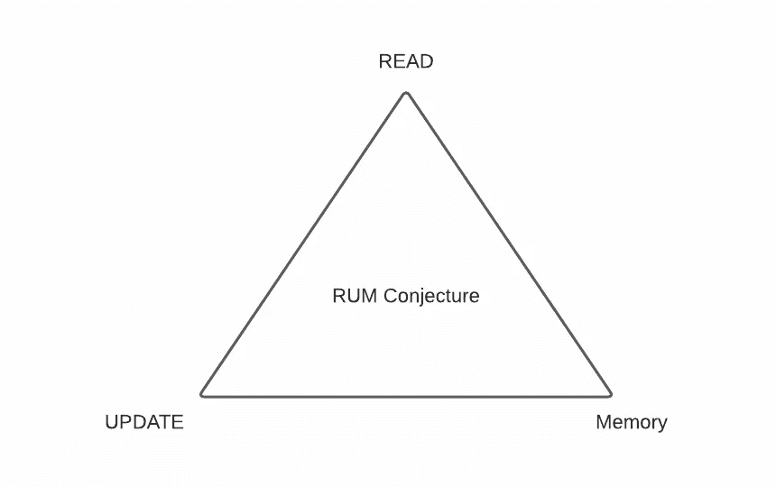

# 现代存储系统背后的权衡

> 原文：<https://towardsdatascience.com/the-tradeoffs-behind-modern-storage-systems-5bf8db680982?source=collection_archive---------39----------------------->

由作者提供

数据库一直是应用程序的中心。如果您正在构建一个 web 应用程序，数据库是应用程序的一个关键组件。您需要呈现存储中的数据。您需要有一个存储引擎，在您的应用程序状态中保持单一的真实来源。由于我们可以在互联网上消费大量的数据，创建一个有效的数据存储算法是必不可少的。

1970 年，数据库研究人员优化了数据库算法，以尽量减少磁盘上的随机访问。五十年后，我们希望优化磁盘上的存储引擎，减少内存上的随机访问。因此，为了创造出色的用户体验和更准确的数据预测，我们希望基于特定标准优化我们的存储引擎。

我们通常优化存储引擎的标准是什么？

当我开始我的分布式系统之旅时，我看到了一篇名为 RUM 猜想的论文。文章指出，我们通常希望在读优化、写(更新)优化和内存优化中优化存储引擎的算法和数据结构。

虽然您希望在存储引擎中有一个针对读取、更新和内存效率的完美解决方案，但我们无法同时拥有这三者。我们需要妥协我们的设计。如果我们想拥有读优化的存储引擎，我们就要牺牲更新和内存。这个猜想类似于著名的 CAP 定理。

在本文中，我想解释更多关于 RUM(读取、更新、内存)开销的内容，以及在这三者中的某一个上优化数据存储的一些例子。

# 读取开销

读取开销是读取主数据的总数据量。如果你存储数据的位置是随机的，你需要做更多的操作来找到数据。如果您想优化读取，您将需要创建一个辅助数据的索引，以便进行快速检索。这些辅助数据导致了读取开销。

如果您创建一个四叉树来对附近的位置进行更快的读取，那么您读取的数据总量将是您遍历的所有四叉树和您从数据库中获得的附近数据。你需要读取所有这些数据来得到*那个*附近的位置。读取开销可以通过所有数据与要搜索的主数据的比率来衡量。

更新开销是更新主数据所需的访问量。当存储引擎需要对任何其他数据位置执行写入以完全更新初始数据时，会产生更新开销。例如，如果您想要对包含索引的数据库进行更新，您需要对数据库旁边的索引进行更新。

# 内存开销

内存开销是存储主数据时占用的内存量。它包括需要在主数据旁边存储辅助数据。这通常是数据结构在速度和内存之间的折衷。为了更快地读写而进行的优化会占用内存。您占用的内存是用于存储主要数据的额外内存。

让我们思考一下为什么我们不能同时优化这三者的一些场景。为了更好地说明这三者之间的折衷，让我们来看看在所有三个频谱上优化的系统和假设。

# 读取优化

读取优化通常执行较低的读取开销。基于散列的索引就是一个例子。您可以在存储引擎上创建一个基于哈希的索引，以提高读取速度。为了进行读取，您需要调用一个散列函数来定位主数据。但是，在更新时，您还需要更新您的主要数据和散列函数。有时，您必须重新划分您的散列函数以防止任何冲突。在这种情况下，更新将受到影响。假设您正在考虑基于哈希的函数中的冲突。在这种情况下，您将需要为您的内存创建开销来存储额外的空块，以降低冲突的可能性。在这种情况下，你的记忆也会受损。

读取优化存储系统的一些例子是用于常数读取访问的基于散列的索引和用于对数时间访问的 B 树和跳转列表。

优化更新意味着，您希望确保更新开销尽可能低。为了降低更新开销，我们可以将更新后的数据存储在某个有条件的辅助空间中，比如一个缓冲区，该缓冲区最终将刷新到批量数据中。我们将追加每一次更新，有效地形成一个不断增长的日志。

虽然我们最小化了更新开销，但是我们增加了读取开销和存储缓冲区的内存。如果我们想要读取我们的数据，我们可能需要进行多次合并来获得数据的当前状态。每次缓冲区被刷新到主存储器时，我们还需要重新组织数据。如果我们重新组织数据以最小化读取开销，我们会增加更新开销。

更新优化系统的一些例子是 [LSM 树](https://en.wikipedia.org/wiki/Log-structured_merge-tree)、分区 B 树和 FD 树。

# 内存优化

与读取和更新优化一样，内存优化通过最小化访问和更新主数据所需的内存来减少内存开销。系统通常试图通过压缩数据或将数据存储在密集阵列中来优化它们。为了进行读取，我们需要扫描所有的值或者解压缩数据。要进行更新，我们需要解压缩并更新数据。

内存优化应用的一些例子是有损索引结构，如[布隆过滤器](https://en.wikipedia.org/wiki/Bloom_filter)、计数-分钟草图、有损编码和[位图](https://en.wikipedia.org/wiki/Bitmap)。

如果我们想在这三个方面都进行优化，这是否意味着我们注定要失败？应用程序变得越来越复杂，访问、更新和存储数据的需求也比以前更高。

# 构建 RUM 访问方法

尽管存在权衡，但许多存储引擎应用程序试图通过平衡 RUM 权衡与硬件、工作负载模式和应用程序的变化来发挥创造力。

因此，数据管理技术变体可以创建优化访问方法的动态方式。例如，我们可以通过在 RUM 空间中部分导航并在集合中覆盖整个空间来构建多址策略。我们还可以根据数据访问模式进行调优，以减少 RUM 开销。

# 结论

数据存储通常基于读取、更新和内存进行优化。您可以使用基于特定属性的优化数据结构——例如，使用 LSM 树优化更新操作，使用 B 树优化读取操作。但是，您不能将这三个属性结合起来创建一个与每个 RUM 方面和每个开销相等的数据结构。

现在您已经了解了 RUM 开销，您可以使用这些知识来评估最适合您的应用程序和当前工作负载的数据库。RUM 猜想为您提供了一个基本的经验法则来评估您将用于新应用程序及其替代方案的数据库开销。

希望你觉得解释有用！如果您有任何其他问题，请在下面随意评论，以便其他人也可以从中学习。如果你有什么意见和其他新的发现，也请在这里提出来向你学习！

# 资源

关于朗姆猜想有一些很棒的资源。对于现代存储系统背后的算法，我们仅仅触及了皮毛。如果您想了解更多信息，请查看下面的参考资料！

*   [朗姆猜想](https://stratos.seas.harvard.edu/files/stratos/files/rum.pdf)
*   [现代存储系统背后的算法](https://www.youtube.com/watch?v=wxcCHvQeZ-U)

*最初发表于*[*https://edward-huang.com*](https://edward-huang.com/distributed-system/2021/01/24/the-trade-offs-behind-modern-storage-systems/)*。*