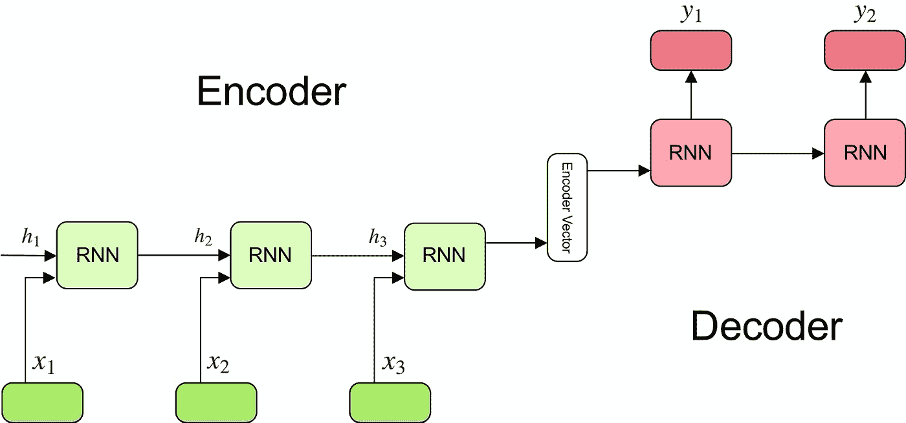
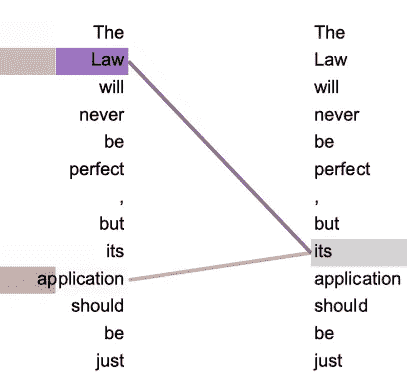
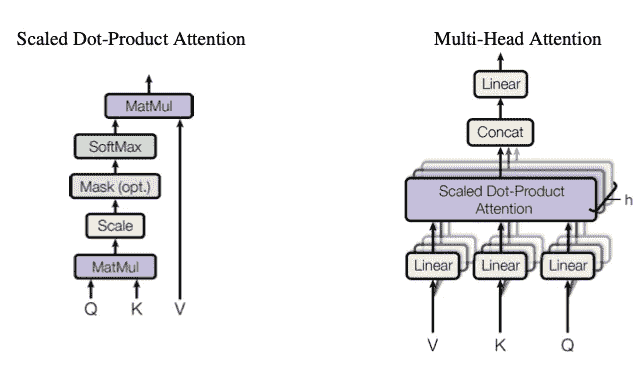
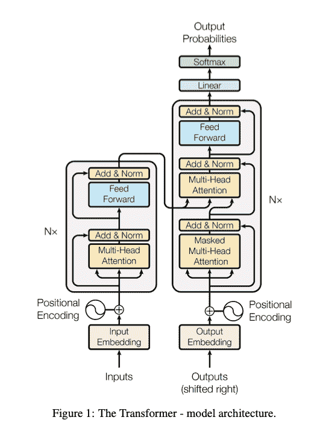

# 平凡的变压器

> 原文：<https://towardsdatascience.com/the-trivial-transformer-85530426190a?source=collection_archive---------30----------------------->

## [入门](https://towardsdatascience.com/tagged/getting-started)

## **向非专业人员快速解释复杂的 NLP 模型**

我想以一个简短的免责声明开始这篇文章:我可能为这篇文章选择了一个糟糕的名字。变压器不仅不简单，而且它是一个极其复杂的数学模型，有数百万个参数，所以在看了几页矩阵代数和 20-30 个非常糟糕的比喻之后，我决定抽象出相当比例的细节来支持一般概念。这些细节可以通过查看我下面的参考文献列表来找到，这应该会填补我今天拼命逃避的一大块数学。既然已经给出了免责声明，让我们从一些背景开始…

# **背景**

我相信变压器可以通过它的一个应用程序的镜头得到最好的理解，所以我们将从简短地看一下机器翻译的历史及其演变开始，这将把我们带到神经机器翻译的发展和变压器的基础。

著名词典“维基百科”将机器翻译定义为**“计算语言学的一个子领域，研究如何使用软件将文本或语音从一种语言翻译成另一种语言**”。简而言之，机器实现了语言间翻译的自动化。有些人可能会停止阅读，有一个阿尔伯特·爱因斯坦时刻，并大喊“谁需要极其复杂的模型？我们可以硬编码精确翻译的定义和规则！”

不幸的是，翻译并不那么简单。语言不是一对一的，所以英语中的一个单词可能等同于另一种语言中的许多单词。例如“我的名字是吉尔”(4 个单词)->“施密吉尔”(希伯来语，2 个单词)。这还有其他几个问题，包括具有多重含义的单词，这对具有评估上下文和语气的巨大能力的人来说可能是微不足道的，但对计算机来说可能不是那么明显。此外，语言也在不断变化:“Tik Tok”不再是过去的意思了。

这些问题需要更复杂的模型，我们将在下面看到一些尝试，这些尝试最终形成了今天的变压器架构。

# **前期努力**

机器翻译(MT)始于 20 世纪 50 年代初，由麻省理工学院和乔治敦大学在冷战时期发起，旨在实现俄语和英语之间的自动翻译。这些努力没有取得太大的进展，也从来没有与人类翻译竞争过，因此在 1964 年被以 MT 为中心的 ALPAC 委员会取消了资助，因为这是对时间的巨大浪费。

直到 20 世纪 90 年代，统计算法(统计机器翻译)通过最少的硬编码最终获得了足够的性能来部署和使用，机器翻译才再次兴起。这些算法最近在 2012 年被积极开发，当时谷歌建立了一个足以在一天内填满 100 万本书的 SMT 系统——谷歌翻译。

# **神经机器翻译**

神经机器翻译始于 2013-2014 年左右，并迅速受到欢迎，这得益于 Sutskever 等人和 Cho 等人的开创性论文。这些早期模型使用递归神经网络(RNN 的)，这些模型采用一系列文本，学习如何以最佳方式在向量中表示它们，然后学习使用这个向量来逐个破译另一种语言中最可能的单词序列的意思。

由于神经网络的黑盒性质，我们通常不太清楚这些向量表示实际上“意味着什么”，但由于我们同时优化了表示学习(编码)和表示解码(解码)，我们直观地优化了整体翻译。

在下面的例子中，我们可以看到这一点。

序列到序列 RNN

这种架构有两个主要缺陷:

1.  **并行化** —模型是顺序的，一个 RNN 层的输出是下一个 RNN 层的输入。换句话说，我们不能同时运行几个计算，因为每个计算都依赖于所有以前的计算。这使得训练 S-L-O-W。
2.  **长程相关性** —该架构有一个主要的新近偏差，丢失了句子中早先的信号，而支持“更相关”的新近单词。然而，这些信息并不总是更相关。以这句话为例:“在野生动物园里，我走过去抚摸一只老虎”。虽然“宠物”和“走过”这两个词出现的时间要近得多，但很明显，“野生动物园”对预测你是否真的去抚摸老虎要重要得多。这个问题与被称为“消失梯度”的信号损失密切相关。

尽管已经有很多尝试来解决这个问题(LSTM 和 GRU 层有专门的门来帮助你有效地传播信息)，但实际上他们经常做不到。幸运的是，变形金刚模型在这里拯救了世界！

# **变压器概念#1 —注意**

注意力在实践中实际上是一个非常简单的概念——它是你实际上有多关心每一条信息，并在做决定时相应地权衡它的想法。Transformer 神经网络做同样的事情——它查看每一条信息，确定它与决策的实际相关性，并相应地赋予它一个权重。然后，在实际做出决定时，它会按比例权衡所有信息。这可以从下面的图像中看出:

注意力可视化图 4(来源:注意力是你需要的全部，原创论文)

注意力实际上解决了上述两个 RNN 问题:

1.  **并行化** —我们可以在一个集群中分离单词，并分别计算它们的注意力分布，因此它可以比 RNN 快得多。
2.  **长程相关性** —所有单词现在都根据它们的实际预测值进行加权，所以顺序不再重要！

# **Transformer Concept #1b —成比例的点积关注+多头关注**

《变形金刚》中使用的注意力类型是独一无二的，因为它在**本身**(自我注意力)上计算注意力。本质上，它就像一本不断问自己的字典— *“我想知道我的哪些部分对利用我来做预测的人最有用”*然后根据它们的重要性来突出这些部分。

比例点积注意力是自我注意力，计算如下:每个单词有一个**查询**向量，我们可以把它想象成《鲨鱼池》中的亿万富翁马克·库班。库班向每一个关键人物提出“问题”，我们可以把他看作是推销产品的商人，他问道:“那么，是什么让你如此大胆地认为你可以在这个市场上赚钱？”。基于响应，他根据他实际想要投资多少来权衡每个**值** **(** 乘积)，并在实际做出决策时考虑所有这些权重(实际兼容性是通过取 Q 和 K 的点积并按表达式缩放来计算的，因此命名为缩放点积)。解码器使用“**屏蔽**”(依赖于过去的上下文)版本，因为它在整个翻译过程中只能查看已经解码的单词。

**多头注意力**是缩放点积注意力的重复版本，将注意力应用到已经以有意义的方式过滤/转换的相同向量的几个副本上，然后汇总结果。库班(仍然是 T2 的提问者 T3)再次走向每一个 T4 的关键人物 T5，但是现在，他不是只问一个问题，而是准备了一份完整的问卷。他再次权衡每个问题，但现在在做决定时会考虑所有问题的总和。

缩放的点积和多头注意力架构(来源:注意力是你所需要的，原文)

# **变压器概念# 2——剩余连接、位置编码**

我们之前说过，当实际上通过注意力对价值进行加权时，位置并不重要，并且所有的价值都可以被同时计算，而无需排序。然而，当我们实际构建句子时，这是灾难性的，因为句子中的单词确实有自然的顺序。为了解决这个问题，我们在模型的开头构建了位置编码，这样就可以跟踪位置，并且我们可以按顺序组装句子。

我们必须确保的顺序是，我们的模型将这些编码考虑在内(作为输入)，但不会修改它们并完全扭曲我们的顺序。为此，我们构建了残差或“跳过”连接，这样我们既可以将信息用作下一个计算层的输入，同时又可以“向前跳过”。这允许我们的编码不加修改地继续通过网络，因此所有层获得的句子编码听起来不像是尤达所说的(是的，这是故意的)。

# **变压器概念#3 —线性层，Softmax**

当我们穿越我们的网络时，我们将会生成一个非常复杂和有意义的 n 维向量，对于一个不是 500 维思考者或完全精神错乱的人来说，它实际上毫无意义。我们如何“转变”(看我在那里做了什么？)这个向量变成有意义的东西？

这就是线性层的用武之地。它将我们的向量延伸回输入字典的维度，每个值/词被赋予一定的权重。接下来的一层是 softmax 层，它为向量中的每个值分配概率。最终，我们获得一组与每个单词相关的概率，然后我们简单地选择概率最高的单词，并对下一个单词重复整个过程！

# **整个故事**

架构，来源:注意力是你所需要的(原文)

从前，有人建立了一个微小的数百万参数模型，名为“变压器”。变压器接受输入的单词，对它们进行编码，跟踪它们的位置(**位置编码**，然后学习哪些给定的单词可以用来预测其他使用**自我关注**的单词。它通过询问自己几个问题的调查来做到这一点，然后汇总响应(**多头**、 **Add + Norm** )。

一旦有了有意义的矢量编码，它就把它们输入解码器，解码器通过“跳过它们”来保留未修改的位置编码(“T8”剩余连接“T9”)。然后，它继续学习编码器的哪些部分对解码最重要，并重复整个庞大的过程 6 次。

最后，它想出了一个巨大的矢量。遗憾的是，由于没有人能够理解这个向量，它将它扩展到字典大小(**线性层**)，计算每个单词的概率( **Softmax 层**)，然后逐一预测每个位置最有可能的单词。最后，经过数百万次计算后，它把“我的名字是吉尔”翻译成了“施密·吉尔”，很多人工智能研究者都非常兴奋。

# **结论**

变压器是 NLP 中的革命性架构。它已被广泛用于顶级性能的现代模型，如**伯特**(来自变压器的双向编码器表示)和 **GPT** (生成式预训练变压器)。虽然它很复杂，但它是一个优雅的架构，如果你有*的注意力跨度*来坐几个小时阅读其他的先决条件论文和观看许多解释性的视频，我在下面链接了这些视频。

最后的结论:我为这篇文章选择了一个非常糟糕的名字。

[https://papers . nips . cc/paper/2017/file/3 F5 ee 243547 dee 91 FBD 053 C1 C4 a 845 aa-paper . pdf](https://papers.nips.cc/paper/2017/file/3f5ee243547dee91fbd053c1c4a845aa-Paper.pdf)

[https://www.youtube.com/watch?v=K-HfpsHPmvw&feature = emb _ title](https://www.youtube.com/watch?v=K-HfpsHPmvw&feature=emb_title)

[https://medium . com/@ adityahiruvengadam/transformer-architecture-attention-is-all-you-need-AEC CD 9 f 50d 09](https://medium.com/@adityathiruvengadam/transformer-architecture-attention-is-all-you-need-aeccd9f50d09)

[https://towards data science . com/transformers-explained-65454 c0 F3 fa 7](/transformers-explained-65454c0f3fa7)

[https://jalammar.github.io/illustrated-transformer/](https://jalammar.github.io/illustrated-transformer/)

[https://www . smartling . com/resources/101/a-brief-history-of-machine-translation/](https://www.smartling.com/resources/101/a-brief-history-of-machine-translation/)

[https://medium . com/synced review/history-and-frontier-of-the-neural-machine-translation-DC 981d 25422d](https://medium.com/syncedreview/history-and-frontier-of-the-neural-machine-translation-dc981d25422d)