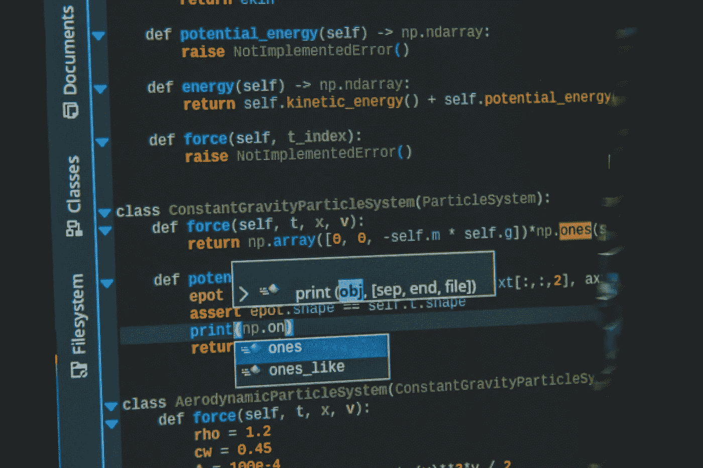
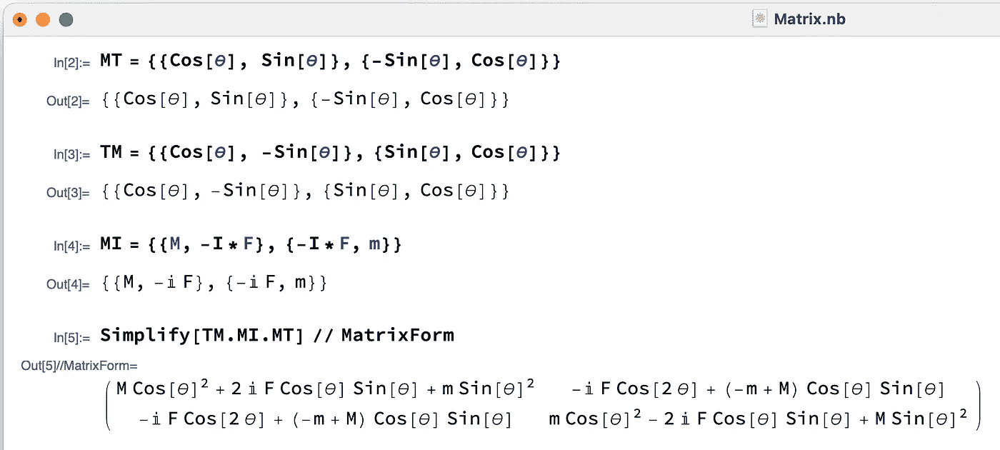
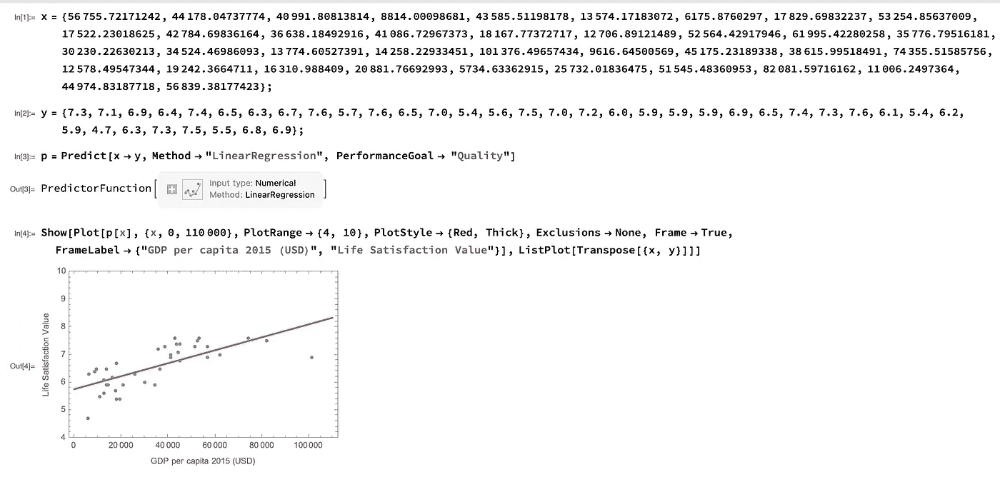

# 顶级数据科学家必须知道的两个最重要的软件

> 原文：<https://towardsdatascience.com/the-two-most-important-software-that-top-data-scientists-must-know-37ba059c9aa1?source=collection_archive---------10----------------------->

照片由[áRPád Czapp](https://unsplash.com/@czapp_arpad?utm_source=unsplash&utm_medium=referral&utm_content=creditCopyText)在 [Unsplash](https://unsplash.com/s/photos/software-engineer?utm_source=unsplash&utm_medium=referral&utm_content=creditCopyText) 上拍摄

几年前，当我还是一名大学生时，我与一些朋友和教授讨论哪种软件是科学多任务处理、写作和演示的最佳软件。

讨论了一会儿后，我们几乎一致得出结论，如果有人有钱购买 Wolfram Mathematica(或简称 Mathematica)许可证，那么就没有理由使用 Mathematica 之外的其他软件进行科学多任务处理。几乎从来没有！另一方面，如果有人想以高质量的水平撰写和展示科学成果，那么 [LaTeX](https://www.latex-project.org) 是各方面的首选。

许多软件产品允许用户进行科学的多任务处理和演示，但是我下面讨论的软件，在我看来，是最适合这些任务的。显然，在这篇文章中，我提出了我自己对这些软件的看法，以及为什么它们是最好的，所以，我完全知道其他人可能不同意我的候选名单。另一方面，我的观点是基于对多年来处于研究生涯最高职位的许多人的观察。

在这篇文章中，我想讨论为什么下面的软件在数据科学和机器学习的背景下很重要，以及为什么顶级数据科学家和机器学习研究人员在大多数情况下(80%-90%)使用这些软件。在这篇文章中，我给出了我作为这些软件的用户的个人想法，我不是在推广它们，而是建议将它们集成到您的数据科学项目中。

# 一. Wolfram Mathematica

理论物理学家史蒂夫·沃尔夫勒姆在 80 年代中期构思并开发了 Wolfram Mathematica。激发史蒂夫·沃尔夫勒姆的主要原因是，当时没有任何软件能够在粒子物理学中进行符号和数值计算，通常人们必须模拟和计算与粒子相互作用有关的不同量。从此，Mathematica 成为了学术界和研究机构中科学界的标准软件。

如果您访问 [Wolfram Mathematica](https://www.wolfram.com/mathematica/) 的官方网站，您会立即在第一页看到以下声明:

> wolfram Mathematica——世界上现代技术计算的明确系统

做出上述声明，即声称 **Mathematica 是世界上确定的系统**，这意味着 Wolfram Mathematica 的研究人员有胆量做出这样的声明。事实上，Wolfram Mathematica 公司对其产品的声明不仅仅是声明，而是事实。

假设你是一名 STEM 领域的研究人员或数据科学家或机器学习研究人员，问自己这样一个问题:一个顶级的多任务科学软件必须具备哪些特征？虽然我不知道你个人的答案是什么，但对我来说，主要的特征一定是:

1.  一体式—全部集成。
2.  执行符号和数值计算的高效率。
3.  最小和容易的代码编写。
4.  易于获取的文档。
5.  高质量的数据、数字和图像可视化。

现在让我来解释为什么 Mathematica 满足上面列举的所有五个特征。不管你的科学专长是什么，科学软件最重要的特征之一是完全集成的特征，即软件内置了一个地方，在那里你可以执行你需要的几乎所有事情。在 Mathematica 的例子中，这个地方就是如图 1 所示的 Mathematica 笔记本。

图一。执行计算时 Mathematica 笔记本的典型外观。作者出于教育目的创作的图形。

Mathematica notebook 基本上拥有用户进行科学计算所需的所有功能。它允许用户直接编写和操作文本，编写和运行代码，创建和可视化动态图形等。所有这些功能都在一个地方，Mathematica 笔记本。

在我上面的列表中，接下来的两个重要特征是高效的符号和数值计算，以及简单明了的代码编写。如果你看到图 1 中的计算，你会很容易意识到 Mathematica 满足这两个特征。

例如，在图 1 所示的代码中，我执行了符号计算来计算三个 2x2 矩阵的乘积，并在 Out[5]中显示了结果。所有这些计算都非常快速有效地执行，并且只用了四行代码！此外，如果您将光标放在您想要获得某些信息的函数名称上(例如 MatrixForm)，将出现一个弹出窗口，让用户可以单击信息按钮。这个功能解释了我在上面的列表中关于易于访问的文档的第四点。

有人能用 Mathematica 在数据科学和机器学习方面做什么？实际上，几乎可以用很少的代码行完成这些领域的所有工作。例如，使用 Mathematica，可以进行符号计算、数学计算、数值计算、代数运算、数据分析、图形计算、交互计算等。在数据科学方面，Mathematica 拥有所有必要的统计和数据分析功能。

在这一点上，我相信最好给出一个具体的例子来展示 Mathematica 在**机器学习**中的简单性和高效性。在之前的[文章](/five-regression-python-modules-that-every-data-scientist-must-know-a4e03a886853)中，我讨论了如何用不同的 Python 模块执行线性回归的各种方法。如果我使用我以前的[文章](/five-regression-python-modules-that-every-data-scientist-must-know-a4e03a886853)中使用的相同数据，并用 Mathematica 进行线性回归，我得到的结果如图 2 所示。

图二。使用 Mathematica 对之前[文章](/five-regression-python-modules-that-every-data-scientist-must-know-a4e03a886853)中使用的数据进行线性回归。作者出于教育目的创作的图形。

您可以看到用 Mathematica 执行线性回归需要多么紧凑和最少的代码行。为了绘制结果，只需要四行代码。当用 Mathematica 笔记本创建时，绘图的质量非常高，并且图形可以以不同的格式保存。Mathematica 的这个功能反映了我上面列表中的第五点。

# 二。乳液

我在读本科大学的时候，用微软 Word 准备了我的学士论文。太痛苦了！我浪费了太多的时间只是为了给方程编号并正确显示它们，在一些微小的错误后不得不重新开始。嗯，当我开始学习 LaTeX 时，这种情况发生了变化。

[LaTeX](https://www.latex-project.org) 是一款用于文档准备的开源软件，创建于 80 年代初。关于乳胶我能说什么？嗯，乳胶就是完美！很难找到任何其他接近 LaTeX 的软件用于文档准备和演示。LaTeX 可用于准备任何类型的文档，如文章、论文、书籍、信件、回忆录、幻灯片演示等。

由于 LaTeX 是开源软件，多年来它已经发展了很多，在我看来，它已经接近完美。LaTeX 还可以用于为会议和大会制作高质量的演示文稿。这可以通过使用[光束器组件](https://www.overleaf.com/learn/latex/Beamer)来实现。该软件包允许用户以 pdf 格式准备高质量和稳定的演示文稿。有了投影仪演示，你将会忘记会议期间那些尴尬的时刻，因为会议计算机或幻灯机不知何故与未知的东西不兼容，你的 Powerpoint 演示被完全弄糟。

# 讨论和评论

为什么你应该在数据科学和机器学习项目中使用上述软件？答案很简单:你需要它们，因为它们能节省你很多时间，并给你最好的结果。

关于术语“数据科学”和“机器学习研究者”，需要记住的最重要的事情之一是这两个重叠领域的“科学”和“研究”组成部分。

如果你是一名研究人员和科学家，你希望使用数据来实现科学发现，并以清晰简洁的方式呈现它们，而不要在技术细节上浪费太多时间来实现这些结果。你不希望浪费大部分时间去写很长的代码来实现和展示你的发现。你想使用软件来帮助你实现出色的结果，从而最大限度地减少你的工作时间，上面提到的两个软件都可以让你做到这一点。

不幸的是，现在许多“数据科学”的工作只是主要用 Python 写代码，与科学和研究没有什么关系。如果你在数据科学工作中使用 Mathematica，你会很快意识到使用其他软件浪费了很多时间，比如 Python。是的，Python 是一个非常好的软件，但它不是 Mathematica。我很有信心，如果基于 Mathematica 编写的话，很多基于 Python 的数据科学书籍会更薄。

如果你是一名数据科学家和/或机器学习研究人员，我建议你学习 Mathematica，并将其用于数据科学项目，使用 LaTeX 进行文档准备和演示。在这种情况下，您将会在代码编写上浪费更少的时间，并欣赏数据科学的[科学](https://medium.com/@damian.ejlli/are-you-already-a-data-scientist-e1c156da4643)部分。

为什么 Mathematica 在数据科学行业的工作中用得不多？这种现象主要有两个原因。**第一个原因**是由于大多数数据科学工作人员的懒惰和缺乏创新。从事数据科学工作的大多数人只有学士学位，其中一些人可能根本没有学位。

在他们的学士学习期间，这些人没有太多机会在学术界学习 Mathematica，因为他们在这个早期阶段没有太多问题要解决。根据我的经验，一个人通常会在博士学习期间欣赏 Mathematica 的全部功能，但在此之前不会。因为这个事实，这些未来的数据科学家走出去，开始用软件从事数据科学的工作，而这些软件在编写代码等方面浪费了他们很多时间。同样的情况很可能发生在那些未来的数据科学家一起工作的高级数据科学家身上。

**第二个原因**与这样一个事实有关:要获得 Mathematica，你需要[付费](https://www.wolfram.com/mathematica/pricing/)，而其他许多软件如 Python 和 R 都是免费的。事实上，Mathematica 相当昂贵，其价格可能是一个问题，但你真的得到你所付出的。

最后，我对数据科学家和/或机器学习研究人员的建议是开始在他们的项目中使用 Mathematica 和 LaTeX，我很确定你几乎不会回头看。

# 如果你喜欢我的文章，请与你可能对这个话题感兴趣的朋友分享，并在你的研究中引用/参考我的文章。不要忘记订阅将来会发布的其他相关主题。