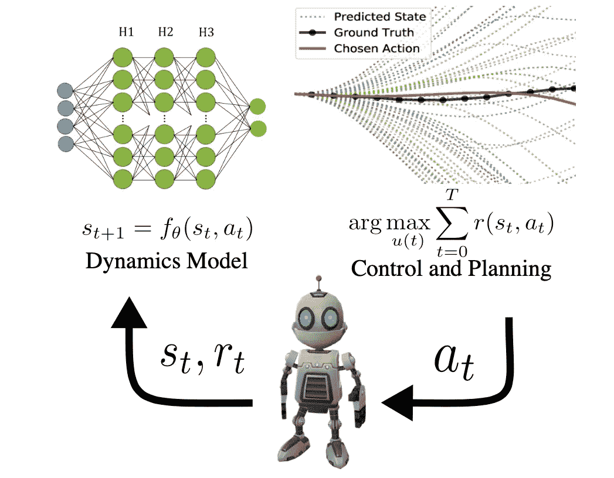
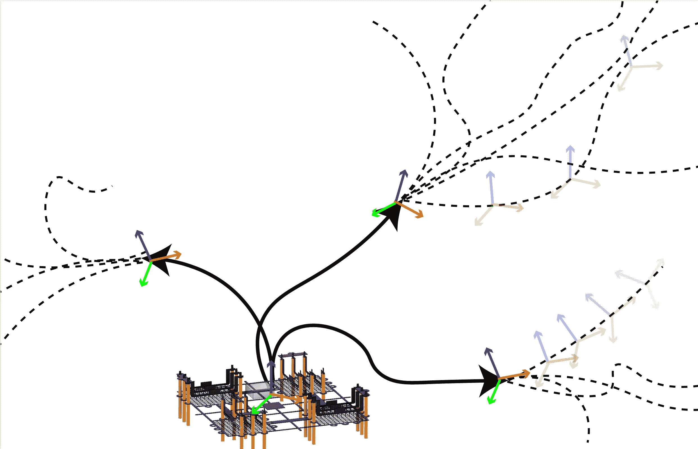

# 基于模型的强化学习的普遍性和未来

> 原文：<https://towardsdatascience.com/the-ubiquity-and-future-of-model-based-reinforcement-learning-f15d24059999?source=collection_archive---------37----------------------->

## [理解大数据](https://towardsdatascience.com/tagged/making-sense-of-big-data)

## 这是一个热门的研究子领域。

正如你们许多人所知，我正在[攻读博士学位，中心是](https://natolambert.me/quals_trim.pdf)基于模型的强化学习(MBRL)。这篇文章不是在谈论技术细节和最近的工作，而是为什么我对它的未来充满信心。除了它能表现得多好的前景(它比大多数 deep RL 年轻得多)，与人工智能安全和伦理人工智能专家的讨论表明，它更结构化的学习设置指向人类可以更好理解的系统。*对于许多公司来说，对系统如何做出决策有一定程度的了解可能是开始使用它的先决条件，否则他们无法进行真正的 A/B 测试和分析。*

我将首先向您展示 MBRL 在生物过程中丰富的相似性，然后展示使其更适合在面向社会的系统中安全部署的特性。在讨论了它在我们生物学中的基础之后，我讨论了它如何能导致可解释的和可概括的系统。

## 基于模型的强化学习综述

基于模型的强化学习与无模型的强化学习的不同之处仅在于对动力学模型的学习，但这对于如何做出决策具有实质性的下游影响。下面是一些*定义*的语句。

## 简单版本:

基于模型的强化学习(MBRL)是一种迭代框架，用于在部分理解的环境中解决任务。有一个代理反复尝试解决一个问题，积累状态和动作数据。有了这些数据，代理创建了一个结构化的学习工具——一个动力学模型——来推理世界。有了动力学模型，代理人通过预测未来来决定如何行动。通过这些动作，代理收集更多的数据，改进所述模型，并且有希望改进未来的动作。

## 学术版:

基于模型的强化学习(MBRL)遵循代理在环境中交互的框架，学习所述环境的模型，然后利用该模型进行控制。具体地，代理在由转移函数 xt+1 = f (xt，ut)控制的马尔可夫决策过程(MDP)中起作用，并且在每个步骤 r(xt，ut)返回奖励。利用收集的数据集 D :={ xi，ui，xi+1，ri}，代理学习模型 xt+1 = fθ (xt，ut)以最小化转换的负对数似然。我们采用基于样本的模型预测控制(MPC ),使用学习的动态模型，在有限的、递归预测的水平τ上优化预期回报，该水平来自从均匀分布 U(a)中采样的一组行为(参见[论文](https://arxiv.org/pdf/2002.04523)或[论文](https://arxiv.org/pdf/2012.09156.pdf)或[论文](https://arxiv.org/pdf/2009.01221.pdf))。

来源—作者。

## 基于模型的强化学习无处不在

这一部分基于神经科学的论文(恰当地命名)[提出了一个案例，即基于模型的学习在生物学中比无模型的学习更普遍。这一部分也非常适合那些从事物的最优控制方面(Bellman 更新)广泛接受强化学习培训并想知道神经科学社区如何构建迭代学习问题的人。](http://www.cns.nyu.edu/%5C~daw/dsd12.pdf)

现在，本文介绍基于模型的思维的起源。

> 这种区别是通过使用重估探针的任务来操作的，例如训练动物在饥饿时用杠杆挤压食物，然后在吃饱时测试表现。重估质疑一个行为(杠杆按压)的选择是否受到对其结果(食物，现在没有价值)的考虑的影响，或者仅仅是由先前的强化(在饥饿时发生)决定的。如果行为立即调整，以反映行动将获得的结果的新价值，这表明选择是“目标导向的”，也就是说，来自行动的具体结果的表示，或者用 RL 术语来说，是基于模型的。相反，对重估的不敏感性表明“习惯”，做出的选择不考虑结果身份的任何表示，而是基于先前实现的价值进行选择，如无模型 RL。

多巴胺的奖赏预测误差(RPE)假说认为，奖赏是在被预测到时**被接收的([论文](https://www.ncbi.nlm.nih.gov/pmc/articles/PMC4826767/#:~:text=Reward%20prediction%20errors%20in%20dopamine%20neurons&text=The%20response%20to%20the%20reward,less%20than%20predicted%2C%20reward%20occurs.))。一些作品暗示，这形成了强化学习的**无模型**版本，源于对学习者不需要对奖励建模，只需要预测它。这一理论遭到了一些反对，论文中尖刻地总结道:**

> 然而，证明大脑是聪明的要比理解它如何处理这种复杂性容易。

来自工程学科(可能是最优控制)的最新理论表明，控制、规划、虚拟部署等可以更好地匹配生物过程。这篇论文通过几个例子讨论了大脑是如何处理多个“事件和行为的连续偶然事件”的。我喜欢我在研究中经常使用的全新措辞——计算规划。从计算机科学的角度来看，这种规划技术类似于[模型预测控制](https://en.wikipedia.org/wiki/Model_predictive_control)——通过样本或凸优化，迭代优化行动序列，以实现通过状态空间的期望轨迹。

具体来说，这篇论文强调了在腹内侧前额叶皮层和眶额皮层(或大鼠前额叶皮层)进行的一系列目标导向行为(价值规划)实验。额外的实验是在建模发生的**进行的** (fMRI 是一种神奇的工具)，并在 hoppocampal 区域(具有空间映射能力)找到记录。我得到的要点是，大脑的这些区域通常与不同类型的计划相关联——我们对自己的一天有一个愿景，而不是我们下意识地计划如何拿起杯子。从控制设计的角度来看，这种 ***层级*** 也存在于大脑中是非常引人注目的——让一个控制器微调你的机器人上的所有问题是不太可能的。这种分级控制也有助于基于模型和无模型学习的完美结合。请考虑本文中描述的差异:

> 基于模型与无模型二分法的提出是为了抓住心理学中两类工具性行为(目标导向型和习惯型)之间的长期差异。

在我与同事讨论过的等级系统中，无模型控制将用于快速思考和简单的任务，如拿杯子，但我们希望我们的代理能够以结构化的方式推理未来，所以我们给他们一个模型。

来源—作者。

## 可解释性和 RL

今年我最喜欢 NeurIPs 的一个想法是一组实验，试图使我工作的 RL 系统可以解释。机器学习中的可解释性是什么意思？用户理解模型如何做出决定的能力(我在这里故意说用户，因为在某些情况下，负责的公司可能能够更快地理解决定，但我希望看到这样一个世界，当这些见解需要传递给用户时——不披露秘密算法酱，当然是因为资本主义)。

为什么香草无模型 RL 循环不可解释？当前机器学习社区最喜欢的函数逼近器，*神经网络，没有给出如何进行计算的洞察*(例如，与记录决策特征的决策树的随机森林相比)。从调试的角度来看，这个计算黑箱非常有限。它可以成为有趣的研究，因为它经常要么有效，要么无效，但当涉及更多真正的意外情况时，这就不太好了。

基于模型的 RL 可以通过使用**奖励集合**的计划获得某种程度的可解释性。通常在 RL 中，我们只试图优化一个奖励函数。如果通过仔细的设计或反向 RL(或通过拥有多个目标)，我们可以在奖励集合的存在下考虑我们的计划。基于模型的学习的一个普遍失败是行为利用了模型中的不准确性。目标是通过使用多个奖励函数，我们可以优化最坏的情况(哪个奖励函数看起来最差)。我们希望这也能带来更稳定的表现，而不是拿一个奖励的最大值。说服人们使用更加开放和易于理解的 ML 系统的最好方法是让它们更好地工作，对吗？

对于那些想要更多了解可解释性的人，我听说了很多关于微软研究院讨论可解释模型的[报告。我期待从中学到更多。](https://arxiv.org/abs/1802.07810)

## 用模型概括

我们希望我们的学习系统能够解决多个相关的任务(或者至少改进它们)，因为我们从这些任务的环境中积累了更多的数据。更好的是，我们希望我们的机器人能够根据过去的数据在相同的环境中解决**全新的任务**。这是泛化的目标。这场争论的关键在于以结构化的方式学习的潜在好处——通过动力学模型——允许我们的代理人对不同的场景进行推理。

为什么香草无模型 RL 循环不可推广？调整神经网络策略的优化在很大程度上取决于被优化的奖励函数/任务。这种微调，再一次缺乏人类手动操纵和理解这些网络的能力，使得*策略实际上只对那个任务*有用。

基于模型的 RL 希望通过反复利用动力学模型来缓解这一问题。这是一个强有力的假设，因为该模型仍然受到分布变化和其他问题的影响。例如，精确的模型并不能保证获得强大的性能(这是我们杜撰的一个问题[目标不匹配](https://arxiv.org/abs/2002.04523))。但鉴于我们对生物学如何工作的了解以及计算的日益可用性，使用我们必须的大型计算机来推理我们从数据中收集的模型是合乎逻辑的。关于一般化如何与模型一起工作的精彩演讲，请参见今年 NeurIPs Deep RL 研讨会上 Anusha Nagabandi 的演讲。

总之，我也认为基于模型的学习有助于强化学习的一个光明的年轻领域，离线学习。离线 RL 的思想是获取以前记录的数据，并用它创建一个策略，这可能会大大增加 RL 可以解决的问题的范围。如果您对此感兴趣，[请查看离线 RL](https://offline-rl-neurips.github.io) 的本次研讨会。

*像这样？最初贴在我的* [*简讯* ***民主化自动化***](https://democraticrobots.substack.com/) *上。订阅❤.*

<https://robotic.substack.com/> 