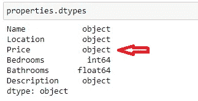
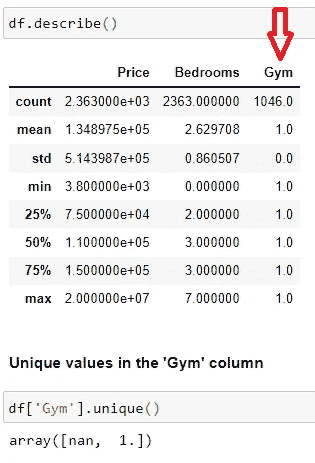
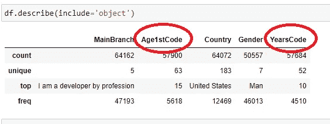
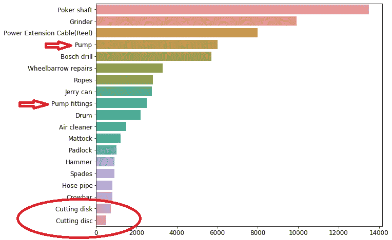
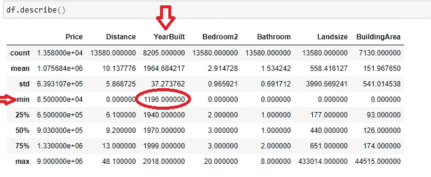
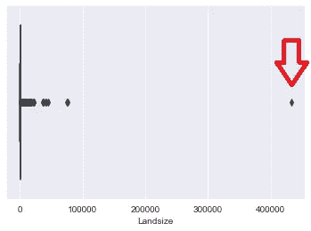
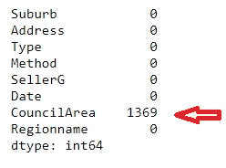
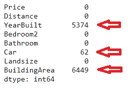

# 使用 Python 中的 4 个关键准则进行数据清理

> 原文：<https://towardsdatascience.com/the-ultimate-4-step-guide-to-clean-data-bd25f2f57956?source=collection_archive---------22----------------------->

## 高效识别和清理杂乱数据的实用指南


[摄影](https://unsplash.com/@thecreative_exchange?utm_source=medium&utm_medium=referral)在 [Unsplash](https://unsplash.com?utm_source=medium&utm_medium=referral) 上的创意交流

[数据清洗](https://www.mygreatlearning.com/blog/data-cleaning-in-python/)是从数据中去除错误和不一致的过程，以确保数据的质量和可靠性。这使得它成为为分析或机器学习准备数据时必不可少的一步。

在本文中，我将概述一个用于识别不干净数据的模板，以及有效清理它的不同方法。在清理之前，一定要按照我这里的[方便的 EDA 指南进行彻底的探索性分析(EDA)。](/11-simple-code-blocks-for-complete-exploratory-data-analysis-eda-67c2817f56cd)

</11-simple-code-blocks-for-complete-exploratory-data-analysis-eda-67c2817f56cd>  

## **1。移除不需要的观察值**

这些行不会给模型增加任何价值。

**A .重复**

这些是数据中出现不止一次的观察结果。它们可能是在数据收集过程中产生的，例如在收集数据或合并来自多个来源的数据时。

要检查重复项，运行代码`df.duplicated().sum()`。对于每组重复的值，第一次出现的标记为 False(0)，其他重复出现的标记为 True(1)。`sum()`返回所有 1 的总和，因此只返回重复的行。

```
data.duplicated(subset='Address').sum()###Results
202
```

上面的代码返回了重复`‘Address’`的重复次数。

**清理:**要删除重复项，运行下面的代码。

```
data.drop_duplicates(inplace=True)
```

您还可以删除基于特定列的重复项。默认情况下，`df.drop_duplicates`在删除时会考虑所有列。但是，有时您希望删除只有特定列相同的行。

```
df.drop_duplicates(subset=['first_name', 'email'],
                   keep='first', 
                   inplace=False)
```

一个例子是一个客户数据集，您可以删除具有相同`first_name`和`email`地址的行。参数`keep=''` 的默认值是`keep=’first’`，它选择保留哪一行，而丢弃所有其他重复的行。其他选项有`‘first’, ‘last’, False`。点击查看文档[。](https://pandas.pydata.org/docs/reference/api/pandas.DataFrame.drop_duplicates.html)

**B .无关的观察结果**

> 按列

这些列或**观察值不属于**我们正在解决的问题陈述。

根据您的问题陈述，有些列可能是无用的，或者对模型没有预测性影响。例如，**狗价**在预测**房价时是一个*无用的*特性，**去掉这个特性是明智的。

在其他情况下，可以用相同的值填充一列，例如，一个关于某个公司的**薪水**的数据集，该数据集具有一个要求**雇佣状态**的特性。在这种情况下，*每个人都填写了“是”*表示已被雇用，因此该特征对模型没有变化也没有影响。

**清洗:**要移除色谱柱，请使用`df.drop()`

```
df.drop(‘dog price’, inplace=True)
```

> 分类特征

根据与问题无关的某些*类别*，您可能需要删除*某些行*。

例如，如果我们预测**非洲市场**的**资产价值**，我们应该*移除非洲大陆以外的*资产**。另一个例子是，当我们只预测**住宅**房价时，去掉**商业**房产类型。**

要检查分类列中的不同类别，使用`Series.unique()`函数返回一个 python 列表。也可以使用 [Seaborn 条形图](https://www.geeksforgeeks.org/seaborn-barplot-method-in-python/)进行可视化，但是要小心，因为许多类别会导致许多条形图，使其不可读。

下面的代码显示了数据集中**唯一区域**的列表。

```
data['Regionname'].unique()###Results
array(['Northern Metropolitan', 'Western Metropolitan',
       'Southern Metropolitan', 'Eastern Metropolitan',
       'South-Eastern Metropolitan', 'Eastern Victoria',
       'Northern Victoria', 'Western Victoria'], dtype=object)
```

**清理:**假设我们要移除位于“北维多利亚”的所有房产。我们将首先创建一个没有“北维多利亚”的蒙版。首先使用`.isin()`获得带有“Northern Victoria”的行**，然后使用符号`~`否定该结果以表示“不在”。**

代码`~df['col'].isin(value)`返回真值和假值的[布尔掩码](http://www.developerjoe.com/blog/2017/11/27/boolean-masking)。然后，我们将这个掩码应用于数据集，只返回为真的行。

```
region_mask = ~data['Regionname'].isin(['Western Victoria'])
data = data[region_mask]
```

## 2.修复结构错误

这些是数据中的错误，可能是由于数据输入或数据传输造成的。一种可能的解决方案是将这些值转换成所需的名称或格式。

**A .错误的数据类型。**

> 列方式—更改整列的数据类型

列的数据类型很重要，因为它有助于 python 理解如何存储和操作数据。例如，[相关矩阵](https://www.geeksforgeeks.org/create-a-correlation-matrix-using-python/)只有在数据类型是整数或浮点数时才有可能。

通常，python 会将正确的类型分配给列，但是有时您需要显式地转换为适当的类型。

要检查每一列的数据类型，运行`df.dtypes`并检查每一列给出的数据类型是否有意义。



作者的数据类型错误

在我们上面的数据中，价格是一个“对象”,意味着它包含字符串和浮点数的混合数据。

**清理:**确定不正确数据类型的原因。或许**价格**包含**货币符号**，可以用`df.col.replace()`。

注意:如果列包含混合类型(有些是字符串，有些是纯整数)，replace 方法可能不适用于整数值，并将返回 nan。使用`df[‘Price’].apply(type).value_counts()`检查特定列中的各种类型。这篇文章完美地解决了这个问题。

> 数字特征-调查和清理

`df.describe()`显示数字特征的统计分析。在这里，检查每个特征的最小**值**和最大**值**，以及**标准偏差**。这有助于识别[指标变量](https://www.oxfordreference.com/view/10.1093/oi/authority.20110803100001406)为适当的分类特征。



作者的指示器/二元特征

**清理:**在上图中，列‘Gym’只有一个值，其他都缺失(Nan)。我们通过用 0 填充丢失的值来清除该列。

```
df['Gym'] = df['Gym'].fillna(0)
```

> 分类特征-调查和清理

最后，运行`df.describe(include=’object’)`来研究分类特征。这里，每个特性的**唯一值**的数量很重要，最流行类的频率( **freq** )也很重要。



在上图中，这两列显示为字符串而不是整数。

**错别字和不一致的措辞。**

> 分类特征

在数据输入过程中，如果相似的值以不同的方式表达，可能会出现错误。例如,“IT”和“信息技术”意思相同，但可能是不同的类别。`Series.unique()`这里又有用了。下图包含了`tools`名称的条形图。



作者分类不一致

**清洗:**我们可以看到两对相似的工具，命名不同。使用下面的`Series.replace()`方法。

```
tools['Name'].replace(['Pump fittings'],'Pump', inplace = True)tools['Name'].replace(['Cutting disc'],'Cutting disk', inplace = True)
```

## 3.如果理由充分，删除异常值

我应该强调，离群值是无辜的，直到被证明有罪。有时候，这些异常值很可能对模型有益。

因此，对每个特性进行尽职调查，只删除错误值或与问题陈述无关的值。

**A .可疑测量值**

> 数字特征-识别和清除错误和可疑值

在这些值中，一个属性在给定其他属性的情况下没有意义。例如，`year_built` 为 1995 而 `year_sold`为 1973 的属性。在这种情况下，您可能需要删除该行。

在下面的例子中，统计分析显示最古老的房子建于 1196 年，这可能是数据输入错误。



作者可能的数据输入错误的异常值

**清洗:**按年份过滤数据，只返回 1800 年以后建造的房屋。

```
data = data[data['YearBuilt'] > 1800]
```

**B .代表不同人群的异常值**

> 数字要素-查找和清除异常值

这些值太大或太小，不在我们当前问题陈述的预期范围内。同样，使用统计数据和图表很好地理解数据是很重要的。

在下面的方框图中，我们注意到一块土地的面积比其他的大得多。

```
sns.boxplot('Landsize', data=data)
plt.show()
```



在进一步分析这个异常值后，它似乎是一个错误，我们通过删除所有超过 400，000 的土地大小来清除它。

```
data = data[data['Landsize'] < 400000]
```

## 4.处理缺失数据

最后，让我们处理丢失的值。这是一些观察空白或数据损坏的地方。

这一步至关重要，因为如果存在缺失值，许多机器学习模型将不会运行。幸运的是，我们已经删除了不相关的和错误的数据，所以这一步涉及到用合适的替代值替换缺失值，这一过程也被称为插补。

> 分类特征-填充缺失值

列中缺少的值可能会提供信息；因此，我们用不同的、**唯一名称**填充它们，以便我们的模型知道这些值是不同的。

要获得分类列中缺失值的数量，请运行下面的代码。

```
data.select_dtypes(include='object').isnull().sum()
```



`df.select_dtypes(include=’object’)`仅返回分类列，而`.isnull().sum()`返回每列缺失值的数量。

在上面的数据集中，只有一个分类列缺少值。

**Cleaning:** 我们将用值‘missing’填充这个特性，本质上是在那个列中创建一个新的类别。

```
data['CouncilArea'].fillna('missing', inplace=True)
```

> 数字特征-填充缺失值

对于数字列，需要一个额外的步骤。这是因为我们期望我们填充的任何值都已经存在于该特征中，因此模型没有办法区分这些条目。

因此，在输入这些列之前，首先创建**一个新列**，指示该行是否有缺失值。把这些列想象成‘缺失’的指示器。

**数据:**我们使用与上面类似的代码，但是在选择列时使用`**exclude**=’object’`来排除分类特征。

```
df.select_dtypes(exclude='object').isnull().sum()
```



三列缺少值。

***清洗:第一步。创建指标特征***

```
df['YearBuilt_missing'] = 0
df.loc[df['YearBuilt'].isnull(), 'YearBuilt_missing'] = 1df['Car_missing'] = 0
df.loc[df['Car'].isnull(), 'Car_missing'] = 1df['BuildingArea_missing'] = 0
df.loc[df['BuildingArea'].isnull(), 'BuildingArea_missing'] = 1
```

上面的代码为每个缺少值的列创建了一个指示器列。

**清洁:第二步。替换丢失的值**

在这里，重置价值完全由你决定。您可以选择用平均值、中间值、零等来填充。理解特征是你做决定的好基础。

我将用零替换“汽车数量”和“建筑面积”**中缺失的值。缺失的“房产建造年份”将被替换为**平均年份**。**

```
average_year = int(df['YearBuilt'].mean())
df['YearBuilt'].fillna(average_year, inplace=True)df['Car'].fillna(0, inplace=True)
df['BuildingArea'].fillna(0, inplace=True)
```

## 结论

数据清理被认为是数据科学项目中最耗时的过程。我希望本教程中概述的 4 个步骤会让你的过程更容易。

请记住，每个数据集都是不同的，在清理之前，对问题陈述和数据的[彻底理解](/11-simple-code-blocks-for-complete-exploratory-data-analysis-eda-67c2817f56cd)是至关重要的。

我希望你喜欢这篇文章。每当我发表新的文章时，想要收到更多这样的文章，请在这里订阅。如果你还不是一个媒体成员，并且愿意支持我成为一个作家，请点击[这个链接](https://medium.com/@suemnjeri/membership)，我将获得一小笔佣金。感谢您的阅读！