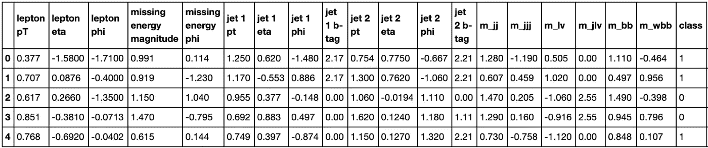
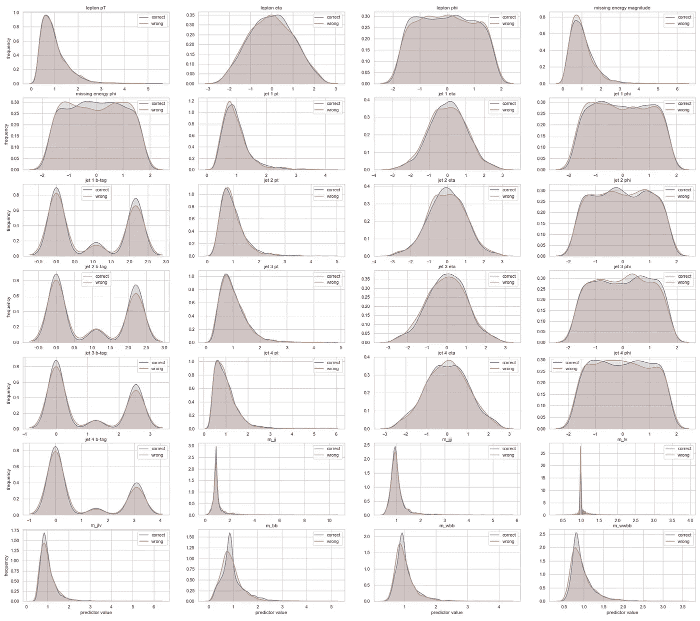
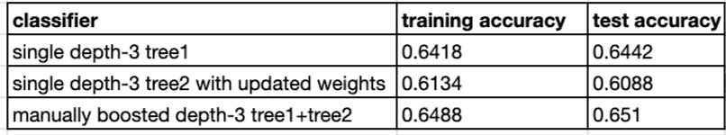
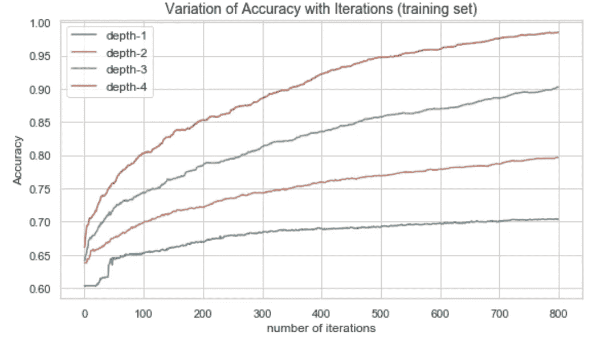
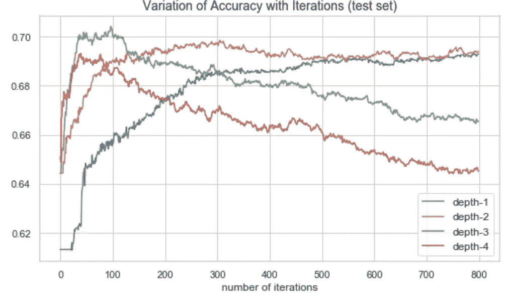
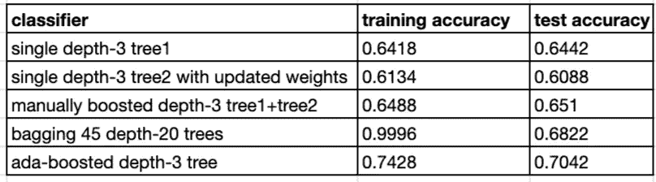

# 助推终极初学者指南

> 原文：<https://towardsdatascience.com/the-ultimate-beginner-guide-to-boosting-84e5a95136a1?source=collection_archive---------32----------------------->

## 假人的集合方法。包含动手 Python 代码的循序渐进教程。

由 [SpaceX](https://unsplash.com/photos/OHOU-5UVIYQ) 在 Unsplash 上拍摄的照片

*Boosting* 是来自*集成学习*范式的元算法，其中多个模型(通常称为“弱学习者”)被训练来解决同一个问题，并组合起来以获得更好的结果。这篇文章介绍了你所需要的一切，以便与助推起飞。杰出的计算理论家莱斯利·瓦里安推动了这一范式。

我最近写了关于 bagging 的文章，bagging 根据数据在多个引导上构建相同的模型，并结合每个模型的预测来获得总体分类或预测。

 [## 装袋教程——用人工智能分类希格斯玻色子粒子

### Python 代码集成学习实用指南

better 编程. pub](https://betterprogramming.pub/bagging-tutorial-classify-higgs-boson-particles-with-ai-941801559231) 

打包的一个巨大优势是我们可以并行化它。另一方面，boosting 通过从弱学习者开始并添加一个基于弱学习者残差训练的新模型来顺序工作。

Boosting 重复几次，每个模型都在原始数据集的变化版本上进行训练，并使用学习率进行正则化。与装袋不同，助推利用团队合作。每个运行的模型决定了下一个模型将关注的特性。因此，强化以一种适应性很强的方式依次训练弱的学习者。

每个模型可能不太适合数据，但整体的线性组合可以是富有表现力和灵活性的。添加到集合中的每个新的简单模型补偿了当前集合的弱点。

我们将通过注意单个分类器所犯错误的模式以及如何根据这些错误训练弱模型来提高准确性来激励 Boosting。

# 为什么升压有效？

让我们使用 UCI 机器学习库中希格斯数据集的一个小子集。[这份 2014 年的论文](https://www.nature.com/articles/ncomms5308)包含了关于数据的更多细节。

每一行代表高能质子束碰撞的实验。类别栏区分产生希格斯玻色子的碰撞(值 1)和只产生背景噪音的碰撞(值 0)。我们对使用 bagging 技术预测类别感兴趣。

我们将深度为 3 的决策树`tree1`与训练数据进行拟合。对于每个预测值，我们绘制一个比较两种分布的图:正确分类的样本和错误分类的样本的预测值。

正如我们在下图中证明的那样，正确预测和错误预测的样本值分布几乎相同。这一证据表明，样本被错误分类的可能性并不取决于其价值。因此，我们可以通过将决策树与另一个根据错误分类信息训练的树相结合来提高决策树的预测能力。这就是做助推背后的动力。

# 升压是如何工作的？

理解 boosting 的最好方法是从头开始使用两个分类器实现它的简化版本。

让我们将第一个分类器`tree1`定义为深度为 3 的简单决策树。第二个分类器`tree2`是另一个深度为 3 的决策树。`tree1`在原始训练数据集上进行训练。`tree2`在对`tree1`误分类的样本应用权重 2 后获得的改变后的训练数据集上进行训练。因此，`tree2`从弱学习者`tree1`的残差中学习。通过对两棵树的预测进行平均来计算总体分类。

结果表明如何通过在由另一个弱学习器产生的残差上训练一个弱学习器，并平均两个分类器的预测概率；我们提高了整体测试精度。这是助推机制的一个很好的例证。

# 梯度增强是如何工作的？

直观地，我们添加到我们的集成模型中的每个弱学习者模型从集成的错误中学习。因此，随着每一次加法，加权残差影响下一个弱学习者。如果我们将权重视为一个调整参数，那么我们可以使用最流行的优化技术:梯度下降来找到它的最优值。

 [## 你理解梯度下降和反向传播吗？大多数人不知道。

### 机器学习中一种常用优化算法背后的简单数学直觉。

pub.towardsai.net](https://pub.towardsai.net/do-you-understand-gradient-descent-and-backpropagation-most-dont-929d65f57a6c) 

为了掌握梯度推进是如何工作的，让我们重新考虑深度为 1、2、3 和 4 的几个决策树作为弱学习器。这一次，我们将应用学习率为 0.05 的梯度下降，并运行 boosting 进行 800 次迭代。

使用 boosting，我们在每个新的迭代中从以前的决策树的残差中学习，因此我们观察到训练集准确性不断增加，直到我们将过度拟合数据并观察到接近 100%的稳态。

如下图所示，树的深度对趋势有很大的影响:树越大，训练集的准确性越高，而不管迭代的次数。

深度 1 和深度 2 的树可能是非常慢的学习者，这需要更多的迭代次数。深度 3 和深度 4 的树学习速度更快；测试集的精确度在第一次迭代中稳步增加，直到达到峰值，然后随着迭代次数的增加而降低。深度 1 和深度 2 的树对数据的拟合不足，而深度 4 的树对数据的拟合过度最多。深度 3 表示最低的方差和最低的偏差。

基于我们刚刚制作的图表，弱学习者深度和迭代次数的什么组合看起来是最佳的？

在 97 次提升迭代之后发现的梯度提升的深度 3 决策树分类器在低方差和低偏差方面似乎是最佳的。

梯度提升比使用前一部分中更新的权重的手动提升的深度 3 树实现了更好的准确性。

精确度的提高表明梯度推进实际上很有帮助。特别是，与我之前的文章中通过装袋获得的[最佳精度相比，它的表现更好。](https://betterprogramming.pub/bagging-tutorial-classify-higgs-boson-particles-with-ai-941801559231)

# 结论

Bagging 和 boosting 是所谓的“集成”技术，通过聚合许多弱学习模型，如单决策树，大大提高了预测的准确性。

我们可以对每棵树单独进行套袋训练。因此，装袋技术更适合于并行化，例如，在多核 CPU 计算机上。提升是连续的，因为每个树都是使用前一个树构建的。

当模型过度拟合时，装袋对于减少方差是非常有用的。升压适用于降低欠拟合模型中的偏差。