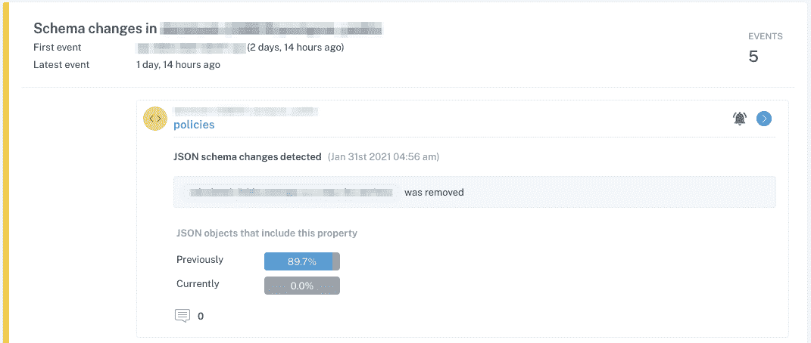
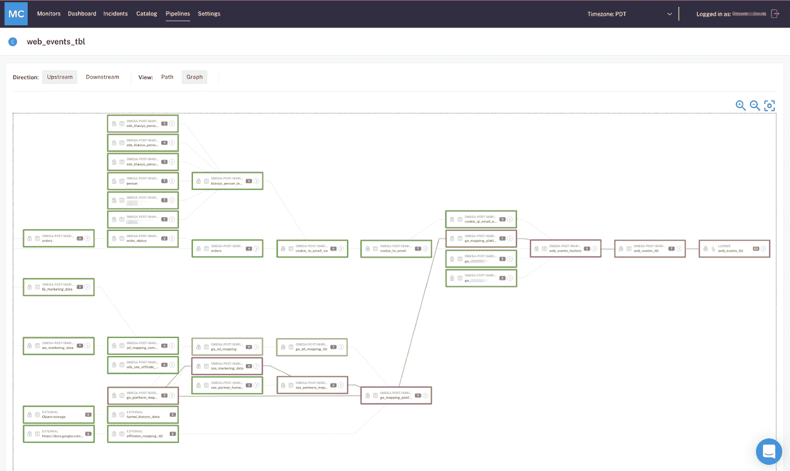
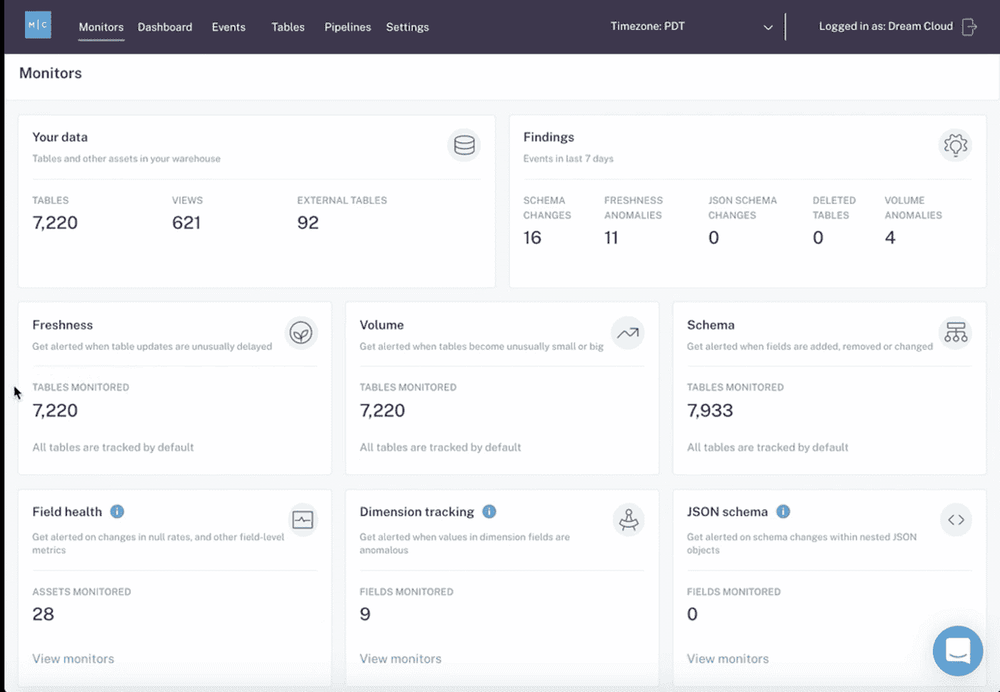

# 终极数据可观察性清单

> 原文：<https://towardsdatascience.com/the-ultimate-data-observability-checklist-f9c07613d4ba?source=collection_archive---------14----------------------->

## *数据可观测性不仅仅是建立一系列数据管道测试并期待最好的结果*

*形象承蒙*[安东尼](https://unsplash.com/photos/okEUu6AMO2Y) *上* [*下*](https://unsplash.com/) *。*

*您的数据团队正在投资* [***数据可观察性***](https://www.montecarlodata.com/what-is-data-observability/) *来应对贵公司的* [***新数据质量计划***](https://www.montecarlodata.com/how-to-fix-your-data-quality-problem/) *。太好了！但是这对你意味着什么呢？*

*以下是您在构建或购买数据可观测性平台时需要记住的一切。*

随着数据成为决策和产品开发中越来越重要的一部分， [**数据可靠性**](/what-is-data-reliability-66ec88578950) 和 [**质量**](/data-quality-youre-measuring-it-wrong-8863e5ae6491) 是数据工程和分析团队最关心的问题。

为了满足这种需求，团队越来越看好 [**数据可观察性**](/data-observability-the-next-frontier-of-data-engineering-f780feb874b) ，这是现代数据堆栈的一个新层，允许团队跟踪他们最关键的分析的健康状况，并在大规模数据中建立组织信任。正如强大的可观察性和监控有助于工程团队防止应用停机，数据可观察性工具提供可见性、自动化和警报，帮助数据团队最大限度地减少和防止[数据停机](https://www.montecarlodata.com/the-rise-of-data-downtime/)。

> 随着公司收集越来越多的(通常是第三方)数据，投资于数据可观察性变得越来越重要。引入新的数据源并扩大对新数据消费者的访问也自然会导致更复杂的管道——这增加了丢失、陈旧或不准确的数据对您的业务产生负面影响的机会。

借助数据可观察性，团队可以回答一些常见问题，如:

*   我的数据可靠吗？
*   *我的数据在哪里，什么时候会更新？*
*   *我如何知道这些数据何时被修改过？*
*   *哪些数据资产对我的业务最重要？它们是如何被使用的？它们新鲜准确吗？*

随着对数据可观察性需求的增加，一些团队正在构建他们自己的工具，而其他团队则寻求现有的解决方案。虽然我们对这种[不断增长的需求](https://cloudedjudgement.substack.com/p/data-observability-the-next-monitoring)感到无比兴奋，但我们也明白，消除噪音并准确理解您的数据可观测性平台需要提供什么是一项挑战。

以下清单将涵盖稳健的数据可观测性平台应实现的具体成果，分为四个关键类别:

*   了解数据停机时间
*   数据问题疑难解答
*   首先防止数据停机
*   用安全第一的方法保护您的数据

让我们开始吧。

## 了解数据停机时间

从根本上来说，数据可观察性平台应该监控您的数据的健康状况，并在您的下游数据消费者在其仪表板或查询中注意到问题之前，在管道破裂或作业运行不畅时向您的团队发出警报。知道监控什么问题可能是压倒性的，这就是 ML 驱动方法的关键所在。您的数据可观察性平台应该在注意到新鲜度、容量和模式变化时智能地出现，而不是依赖于手动测试来检查数据质量问题。

下面是您的数据可观察性平台应该自动检测的两个常见数据问题的示例。

在第一个示例中，我们看到一个表中的数据量出现了显著的意外下降，这表明可能计划了也可能没有计划的记录删除。

图片由作者提供。

在第二个例子中，我们看到存储在表字段中的 JSON 数据的模式变化，这同样可能是计划好的，也可能不是计划好的，但是在解析 JSON 值时绝对需要下游的变化。

**主动监控数据质量问题并发出警报**

这是任何数据观测平台的关键。正如软件工程师依靠监控来提醒他们任何中断或停机，数据团队应该能够依靠监控来自动通知他们数据健康的任何异常，而不是等待内部消费者或客户注意到出错(这种情况发生在惊人的 [57%的企业](https://www.marklogic.com/blog/the-staggering-impact-of-dirty-data/))。)

**基于数据集分配和事件类型智能路由警报**

警报只有在适当的团队(即数据所有者)收到时才有帮助。您的数据可观察性平台应该支持基于分配和事件类型的路由。

**数据质量监控流程的集中化、标准化和自动化**

数据可观察性应该应用于您的整个组织，标准化和集中化数据质量监控，以确保每个团队都使用相同的语言，并根据相同的剧本进行操作。

**根据历史数据自动生成规则**

借助机器学习，您的数据可观察性平台应该能够分析数据的趋势，以自动制定数百条规则，而您组织中的任何人都不需要编写一行代码-识别异常、空值或缺失数据，并相应地提醒您的团队进行进一步调查。

**让数据工程师能够根据特定业务需求设置自己的规则和阈值**

虽然自动化节省了人工，但您的数据组织最了解您的数据资产。因此，您的数据可观测性平台应该包括数据工程师、数据分析师和数据科学家根据业务需求或随着新管道和项目的引入，设置自己的阈值来监控数据的灵活性。

**基于现场历史趋势的自动化异常检测**

前面提到的基于 ML 的异常检测应该在字段级运行——而不仅仅是表级——基于关于数据的历史度量和统计。

[**自助数据发现**](https://www.montecarlodata.com/data-catalogs-are-dead-long-live-data-discovery/)

数据可观察性不仅仅包括异常检测。一个强大的数据可观察性平台将使用户能够通过索引所有资产(包括 BI 报告和仪表板)来搜索和发现他们需要的数据。在为任何给定的工作寻找合适的数据时，数据健康指标，加上业务环境，为您的数据消费者提供了强大的能力。

**针对标准数据质量维度和谱系的持续监控和警报**

针对质量维度的警报非常有用:当数据丢失、不完整或不准确时，它们会通知您。但是没有沿袭——跨所有管道和环境逐记录地跟踪所有数据集成操作——您将很难找出哪里出了问题。这两者都应该由您的数据可观察性平台提供。

## 数据问题疑难解答

第二类结果是对数据问题进行故障排除，以便您可以快速修复它们，这应该侧重于使您能够轻松了解哪些数据损坏以及损坏的原因，同时为您的团队提供工具，以便在下游和上游依赖关系影响业务之前对其进行跟踪。

*您的数据可观察性解决方案应能让您轻松、及时地访问最重要数据资产的端到端谱系，直至现场级别，从而轻松、有效地解决事故。图片由作者提供。*

**了解问题的业务影响并优先解决问题**

智能平台将能够根据下游数据消耗评估数据停机可能带来的业务影响，并相应地确定问题解决的优先顺序。

**通过合适团队的首选渠道智能地将警报发送给他们**

警报应该是有意义的交流，而不是白噪音。您的数据可观察性平台不仅应该支持将警报智能路由到正确的团队成员——理想情况下，这些警报应该通过他们首选的渠道(想想 Slack、电子邮件或 SMS 文本消息)来传递。

**通过简单的用户界面搜索和浏览数据资产**

在处理破损数据时，速度和可访问性很重要。一个简洁的界面可以帮助您的团队快速搜索和审查数据资产，使用目录和沿袭功能来确定事件的根本原因。

**收集和显示调查和解决问题所需的信息**

您的平台应该提供在警报或案例级别解决问题所需的所有相关信息，减少手动调查的需要，并加快解决问题的速度。

**通过端到端沿袭进行根本原因分析**

当您的平台提供对您的端到端沿袭的全面可见性时，您可以通过立即访问数据的整个生命周期来消除根本原因分析中的猜测。

**协作解决事件，并将其标记为已通知、已解决、无需采取措施或误报**

您的平台应该让每个受特定事件影响的人都在同一页面上，每个问题都有可见的状态报告，从而让生活变得更加轻松。

**访问包含完整事故信息的事故警报日志，以进行分析和报告**

全面的日志是必不可少的:它们帮助每个团队成员了解情况，减少常见问题类型的解决时间，并使数据主管能够分析和识别重复出现的问题。

**API 集成，以确保您的管道关键元素的监控和警报可以发送到适当的方**

现代数据可观察性平台应提供对所有属性的全面 API 访问，以便您可以定制适合现有技术堆栈的工作流，并使您的团队能够节省时间、避免重复工作和快速解决问题。

## 防止数据停机

无论您的数据可观察性平台在识别和提醒您数据停机方面有多么出色，如果您不能主动预防事故，您在维护可靠的数据管道方面所做的最大努力都将付之东流。一个真正的端到端数据可观察性解决方案将通过智能目录和沿袭功能，利用机器学习来理解数据中的历史模式，从而使数据质量监控更进一步。

*强大的数据可观察性平台将通过数据目录和数据监控仪表板支持数据发现，让用户了解最新的重要数据健康要素。图片由作者提供。*

**所有资产的数据质量和健康信息**

除了在出现问题时发出警报之外，数据可观察性工具还应该基于历史模式和数据事务的当前状态，随时提供所有资产的数据质量和健康状况的整体视图。

**通过血统一目了然地了解字段和字段类型**

当数据可观察性平台包括沿袭时，您应该获得数据字段和字段类型的“目录”级视图，提供数据资产和整体数据健康之间关系的概览。

**了解与表和字段沿袭相关的关键报告和仪表板**

数据可观察性应使数据团队能够了解哪些 BI 报告使用哪些字段，从而帮助确保模式更改不会无意中破坏 BI 报告或使下游数据消费者感到沮丧。

**分析字段级指标/统计数据，以及它们如何随时间变化**

您的数据可观察性平台应该能够理解数据是如何随着时间的推移而变化和发展的，这样您就可以在粒度级别上跟踪重要的指标。

**动态更新模式元数据和信息**

有了数据可观察性平台，您的元数据应该动态更新，而不需要手动更改。

**确定你的关键资产是什么，以及它们是如何被使用的**

您的数据可观察性平台应回答相关问题，包括:谁在使用这些数据，他们使用这些数据的目的是什么，他们何时访问这些数据，以及这些数据“停止运行”的频率(例如，过时、丢失等)。)?数据可观察性应包括帮助您了解如何使用[关键数据资产](https://www.montecarlodata.com/how-to-solve-the-youre-using-that-table-problem/)的洞察力，帮助实现版本控制，并允许您识别和淘汰过时的资产，确保您不会将错误的数据用于重要的业务决策或支持数字产品。

**通过分析表负载模式度量来评估及时性和完整性**

您的数据平台应该帮助您验证关于数据新鲜度和数据量的假设，确保您的预期符合现实。

# 保护您的数据

*当你选择一个数据观察平台时，安全应该是你最关心的问题。考虑依赖于数据只读访问的选项，并优先考虑 SOC2 认证。图片由*[*wk 100 Mike*](https://image.shutterstock.com/image-photo/security-lock-on-computer-circuit-600w-370732937.jpg)*at*[*Shutterstock*](https://www.shutterstock.com/)*提供，可通过作者购买标准许可证获得。*

数据可观察性平台不应要求数据离开您的环境—句号。最佳方法不需要存储或访问个人记录、PII 或任何其他敏感信息。相反，数据可观察性应该只提取关于数据使用的查询日志、元数据和聚合统计信息，以确保您最重要的数据资产尽可能值得信赖和可靠。

**静态监测数据**

您的数据平台应该采用安全第一的方法进行设计，这种方法可以监控静态数据，并且不需要访问您的数据仓库。

[**SOC2 认证**](https://www.montecarlodata.com/monte-carlo-is-soc-2-certified/)

您的数据可观察性平台需要通过 SOC2 认证，该平台测量包括安全性、可用性、处理完整性、机密性和隐私在内的控制措施。

**从查询日志和模式变更日志中快速识别重大变更**

您的平台应该使用元数据，如查询日志和模式更改日志，以便在更改破坏您的数据管道时自动发出警报。通过使用这些元数据而不是数据本身，您的平台提供了一个额外的安全层。

# 数据可观察性入门

最终，您的数据可观察性应该使与您的数据交互的每个人，从工程师到最终消费者，都能自信地回答一个复杂的问题:**“这些数据可信吗？”**

> 无论您是构建自己的解决方案还是从供应商那里购买解决方案，真正的数据可观察性都将增强整个组织的信任，并为团队利用数据开辟新的机会。同时，您的数据工程团队应该从持续的消防演习和手动调查中获得宝贵的时间，让他们专注于创新、解决问题和帮助您的业务增长。

***想了解更多关于数据可观测性平台的信息吗？伸出手去*** [***巴尔***](https://www.linkedin.com/in/barrmoses/) ***和其余的*** [***蒙特卡洛***](http://www.montecarlodata.com) ***团队。***

*请务必于太平洋标准时间 3 月 18 日上午 9 点参加我们的数据可观察性网络研讨会* *，了解最佳数据团队如何利用这种方法来防止数据管道中断并大规模解决数据质量问题！*