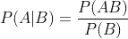

# 贝叶斯统计终极指南

> 原文：<https://towardsdatascience.com/the-ultimate-guide-to-bayesian-statistics-ed2940aa2bd2?source=collection_archive---------22----------------------->

安妮·尼加德在 [Unsplash](https://unsplash.com/s/photos/guide?utm_source=unsplash&utm_medium=referral&utm_content=creditCopyText) 上拍摄的照片

## 像贝叶斯一样思考

你可能在统计课上听说过贝叶斯定理。基于条件概率的神奇公式开启了一种解释事件概率的新方法。在这篇文章中，我将讨论贝叶斯统计的基础知识，以及在统计推断方面 Frequentist 和贝叶斯之间的区别。此外，贝叶斯统计的一些应用。

## 什么是贝叶斯统计

**贝叶斯统计**是基于概率的贝叶斯解释的统计理论。要理解贝叶斯统计，首先需要理解条件概率和贝叶斯定理。

1.  **条件概率**

**条件概率**基于一个事件已经发生的事实，测量另一个事件发生的概率。正如下面的公式所示，假设事件 B 发生，事件 A 发生，是事件 A 和 B 的联合概率与事件 B 发生的概率的除法。

条件概率

关于这个公式有两点需要注意。首先，不要被 P(A|B)和 P(AB)搞混了。前者是条件概率，后者是联合概率。即使我们观察到事件 A 和事件 B 以两种概率发生，事件发生的时间线是区分它们的关键。思考一个投掷两个公平骰子的例子。设事件 A 是第一个骰子是偶数，事件 B 是两个骰子之和是 6。联合概率是事件 A 和事件 B 同时发生的几率，除以所有情况。当投掷两个骰子时，有 36 (6*6)种结果，当事件 A 和事件 B 一起发生时，只有两种情况:我们投掷(2，4)或(4，2)。因此，联合概率 P(AB)是 2/36。条件概率 P(A|B)的计算方式不同。当 B 发生时，我们只有 3 种情况:(2，4)，(3，3)，(4，2)。在这三个结果中，有两个结果满足事件 A 的条件，在这种情况下，条件概率 P(A|B)是 2/3。如果用条件概率公式计算条件概率，需要知道 P(B)的概率，P(B)如上所述是 3/36。P(A|B)将是 2/36 除以 3/36，我们也得到 2/3。

第二，如果事件 A 和事件 B 是独立的，则条件概率 P(A|B)与 P(A)相同。这是因为事件 B 的发生不会为我们了解事件 A 带来任何有用的信息。当我们说事件 A 和事件 B 是独立的，这意味着事件 A 的发生不会影响事件 B，反之亦然。事件 A 和事件 B 的联合概率将等于 P(A)*P(B)。因此，两个独立事件的条件概率将是:

两个独立事件的条件概率

上面的公式表明，知道事件 B 发生对计算事件 A 发生的概率没有帮助。

**2。链式法则和求和法则**

根据条件概率，我们可以推导出两个事件的**链规则**:

链式法则

链式法则也适用于大量的事件。对于具有以下相关性的事件 X、Y、Z:

链式规则指定:

我们可以得出 N 个事件的联合概率如下:

除了链式法则，概率论中的另一个重要法则是**求和法则**，它通过整合联合概率来帮助推导出完整的概率:

求和规则

概率论的这两条规则是贝叶斯定理的基础，我将在下一节详细说明。

**3。贝叶斯定理**

离链式法则只有一步之遥，我们将得到贝叶斯定理:

贝叶斯定理

贝叶斯定理是贝叶斯统计的基础。它帮助贝叶斯以不同的方式解释统计推断。贝叶斯声称，随着更多的证据或信息变得可用，假设的概率可以更新。在统计推断过程中，我们试图使用我们拥有的数据来估计概率模型的参数。如果我们将 P(θ)视为我们试图从模型中估计的参数的概率，将 P(X)视为我们观察到的数据的概率，我们可以应用贝叶斯定理:

这里 P(θ|X)称为**后验概率**，是给定数据的观测参数θ的条件概率。另一方面，P(X|θ)被称为**似然函数**，在给定参数的情况下观察数据的概率。似然函数显示了参数对数据的解释程度。我们也称 P(θ)为**先验**概率，P(X)为**证据**。

## **频率主义者 vs 贝叶斯**

不知道频率主义者和贝叶斯的区别，我们永远无法完全理解贝叶斯。在下表中，我总结了它们的主要区别。

常客 vs 贝叶斯

让我们举一个估计下雨概率 P(θ)的例子来更好地说明差异。常客对于不确定性是客观的。对他们来说，下雨的概率 P(θ)是固定的，先验知识或辅助信息不会帮助他们估计它。相反，他们有一些关于θ的假设，并持续记录长时间的天气状况(X: x1，x2…xn)来帮助他们学习 P(θ)。常客把任何一天的天气状况视为随机变量。通过估计似然函数 P(X|θ)，即在给定下雨概率的情况下观察这些天天气状况的概率，他们可以使用 P 值或置信区间拒绝或接受他们的假设。或者，他们可以计算 argmax P(X|θ)相对于θ的值，以获得使观测数据 X 的似然性最大化的θ，这就是我们所说的最大似然估计(MLE)。对于像分类问题这样的机器学习问题，frequentist ists 首先选择一个模型，如逻辑回归，然后使用他们拥有的数据(X 和相应的标签 y)来使用 MLE 估计模型参数θs，最后使用训练的模型来预测新数据的标签。

另一方面，贝叶斯通过概率分布对不确定性建模。他们认为他们观察到的数据 X 是固定的，而θ是一个随机变量，并受先验信息的影响。因此，可以利用附加信息来估计概率 P(θ)。例如，不同月份下雨的概率是不同的，因此知道现在是几月将有助于估计下雨的可能性。他们使用贝叶斯定理作为 P(θ)来估计后验概率 P(θ|X)。对于分类问题，他们首先通过估计后验概率来训练模型:

然后应用求和规则用新数据 X_ts 进行标签预测 y_ts:

总之，频率主义者和贝叶斯在是否将参数θ视为随机变量的观点上分歧最大。贝叶斯认为参数是随机变量。他们根据数据和先验分布赋予不同的概率，即后验概率:

虽然常客认为他们应该将参数固定在一个值，但使用概率观点，我们可以将他们的心态写成如下:

然后他们进行实验收集数据，或者用观测数据 X 检验他们的假设θ是否为θ*，或者用 MLE 求θ*。

## 贝叶斯统计的应用

贝叶斯统计在进行推理时使用先验知识，并随着获取更多信息而更新后验信念。因此，它被用于机器学习和统计推断的各种应用中，给出可靠的结果。

1.  **线性回归正则化的贝叶斯解释**:

线性回归模型是用于解决机器学习中的回归问题的简单模型。我们通常在线性模型中使用正则化来处理过拟合。正则化是在拟合模型时将参数的大小添加到成本函数中。因此，它迫使模型选择较少的特征或减少特征参数的大小，并减少过度拟合的机会，尤其是当有大量特征时。根据惩罚的形式，我们有 L1(拉索)和 L2(岭)正规化。L1 正则化将参数的绝对值添加到成本函数，而 L2 正则化添加参数的平方。我们可以用贝叶斯定理来解释正则化。从贝叶斯的角度来看，参数由以下因素决定:

当忽略先验分布，只最大化似然函数来估计β时，我们将得到正则线性回归模型。然而，当添加关于先验分布的假设时，我们将正则化添加到模型中。加上拉普拉斯分布的先验，我们得到 L1 正则化。而对于 L2 正则化，我们增加了β服从均值等于零的正态分布的假设。更多细节和数学证明，可以参考[这篇文章](https://bjlkeng.github.io/posts/probabilistic-interpretation-of-regularization/)。

2.**潜在变量模型**

潜变量也叫隐藏变量，是我们不直接从数据中观察到的变量。然而，我们认为数据中存在一些隐藏的结构，可以提取出来用于更好的预测。

潜在变量 t，数据 X

条件概率和贝叶斯定理是构造隐变量模型的基础。对于被设置成聚类成 N 个组的数据，我们可以将似然函数写成如下:

我们可以使用潜在变量来处理数据中的缺失值，并且我们可以构建潜在变量模型来进行聚类，例如 [GMM](/gaussian-mixture-models-explained-6986aaf5a95) 用于客户聚类，或者 [LDA](https://www.jmlr.org/papers/volume3/blei03a/blei03a.pdf) 用于文本主题建模。

3 **。在线学习**

由于贝叶斯统计推断使用新的证据来不断更新后验概率，因此它对于使用以下公式的在线学习也非常有用:

在线学习

随着新数据 X_t 的到来，后验概率 P(θ)也从 P_t-1(θ)更新到 P_t(θ)。

贝叶斯统计不仅仅是关于贝叶斯定理或为不同条件概率指定的花哨术语，更重要的是，贝叶斯思维模式，我们可以使用先验知识进行初步猜测，并不断用新信息更新推论。希望这篇文章能帮助你更好地理解这种心态以及它与常客的区别。

感谢您的阅读！这是我所有博客帖子的列表。如果你感兴趣的话，可以去看看！

 [## 我的博客文章库

### 我快乐的地方

zzhu17.medium.com](https://zzhu17.medium.com/my-blog-posts-gallery-ac6e01fe5cc3)  [## 阅读朱(以及媒体上成千上万的其他作家)的每一个故事

### 作为一个媒体会员，你的会员费的一部分会给你阅读的作家，你可以完全接触到每一个故事…

zzhu17.medium.com](https://zzhu17.medium.com/membership)