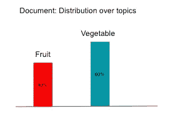
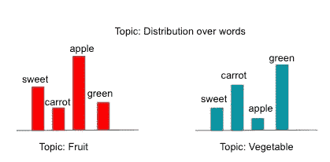
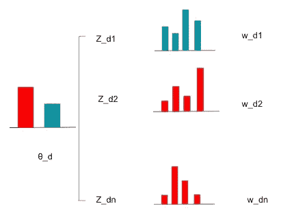
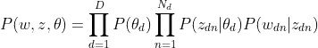
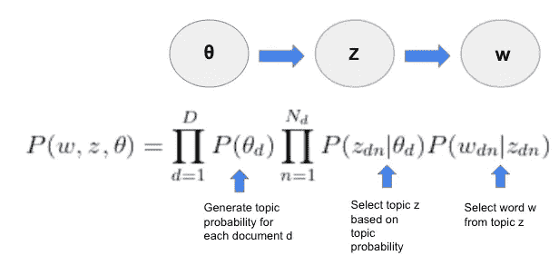

# 聚类算法和主题建模终极指南

> 原文：<https://towardsdatascience.com/the-ultimate-guide-to-clustering-algorithms-and-topic-modeling-3a65129df324?source=collection_archive---------27----------------------->

## 第 2 部分，LDA 模型的初学者指南

在我之前的帖子中，我介绍了聚类算法并详细讨论了 K-Means 算法，作为 ***主题建模*** 系列的第一部分:

> [第一部分:K-Means 入门指南](/wthe-ultimate-guide-to-clustering-algorithms-and-topic-modeling-4f7757c115)
> 
> 第 2 部分:LDA 初学者指南(本文)
> 
> 第 3 部分:使用 K-Means 和 LDA 进行主题建模(即将推出)

我们不能在不介绍 LDA 模型的情况下讨论主题建模。LDA 是**潜在狄利克雷分配**的简称。它是一个模型，主要用于理解文本数据集合中的潜在主题集，在协作过滤、基于内容的图像检索和生物信息学等方面也有其他应用。在本文中，我将讨论主题建模和 LDA 模型设置的更多细节。

## 主题建模和术语

主题建模是在一组文本数据上寻找潜在的 ***主题*** 的分析。研究主题有助于研究者理解文本中隐藏的语义结构。了解主题对于分类现有文本数据和生成新数据都很有用。在进一步详细讨论之前，我们需要指定一些在文本分析中使用的常规术语。根据 **Blei、ng 和 Jordan 2003** (参考文献中的详细引用)，术语表述如下:

*   ***单词*** 是文本数据的基本单位，从词汇集{1，…V}中索引；
*   一个 ***文档*** 是 N 个字的序列，定义为 **w** = (w_1，w_2，…w_N)，其中 w_N 是这个文档中的第 N 个字；
*   一个 ***语料库*** 是 M 个文档的集合，定义为 **D** = ( **w_** 1、 **w_** 2、…**w _**M)；
*   一个 ***题目*** 是分布词。LDA 模型将语料库中的每个文档视为主题的混合。

## LDA 模型设置

主题建模本质上是一个文本聚类问题。使用 LDA 模型，目标是通过研究语料库来估计两组分布:

*   每个主题中单词的分布
*   语料库中的主题分布

LDA 是一个三层的分层贝叶斯模型。与其深入研究数学细节，不如用一个例子来演示这个模型。

LDA 模型为语料库中的每个文档生成主题分布。例如，文档可以分布在两个主题上:40%在主题“水果”上，60%在主题“蔬菜”上:

作者图片

每个主题都是词汇集{“甜的”、“胡萝卜”、“苹果”、“绿色”}中所有单词的分布。看题目，我们看到一些概率比较高的词。例如，直觉上，单词“绿色”在主题“蔬菜”中出现的概率比在主题“水果”中出现的概率高

作者图片

我们需要定义两个潜在变量.)****，它们有助于从语料库到文档再到单词的文本生成过程。潜在变量是我们不能从数据中直接观察到的变量。然而，它揭示了数据中隐藏的结构，并且有利于建立概率模型。第一个潜在变量是θ，即主题在每个文档中的分布(40%“水果”，60%“蔬菜”)。第二个潜在变量是 Z (Z ∈{1，2..T})，呈现每个词的主题。我们可以在下图中看到文本生成过程:****

********

****LDA 中的文本生成。作者图片****

****对于每个文档 d，都有一个主题分布θ_d。对于文档 d (w_d i)中的每个单词 I，它是基于主题分布θ_d、该单词 di 的主题 Z 以及主题 Z_di 上的单词分布来生成的。假设文档 d 中的第一个单词是“green”，它是通过首先指定一个主题分布生成的:60%“水果”，40%“蔬菜”(θ_d)。然后对于第一个单词，我们对主题“蔬菜”(Z_d1)进行采样。在主题“蔬菜”中，我们从主题分布中抽取单词“绿色”(w_d1)。****

****在数学上，该过程可以被指定为下面的贝叶斯方程:****

********

****结合潜在变量，可以在下面的图表和步骤中查看层次结构，以便更好地理解:****

********

****作者图片****

****通过定义 P(θ_d)，P(Z_dn|θ_d)，P(w_dn|z_dn)的概率分布，我们可以计算出联合分布 P(w，Z，θ)，这是我们所拥有的观察语料库的概率。****

****LDA 中的狄利克雷来自于θ_d 服从[狄利克雷分布](https://en.wikipedia.org/wiki/Dirichlet_distribution)。给定训练模型的语料库，我们可以使用 EM 算法进行参数估计，或者使用 MCMC 进行完全贝叶斯推理。本文将不涉及该模型的数学细节。如果有兴趣，可以参考 2003 年 Blei，Ng，Jordan 的论文。而且，`gensim`是在主题建模中应用 LDA 的常用 Python 库。参考[这篇文档](https://radimrehurek.com/gensim/)了解更多细节，我也会在下一篇讨论应用时展示。****

****这都是为了这篇文章。在本系列的最后一篇文章中，我将比较和讨论 K-Means 和 LDA 在主题建模中的区别，并展示一个使用 Python 库在主题建模中应用这两种算法的例子。****

****感谢您的阅读！这是我所有博客帖子的列表。如果你感兴趣，可以去看看。****

**** [## 我的博客文章库

### 我快乐的地方

zzhu17.medium.com](https://zzhu17.medium.com/my-blog-posts-gallery-ac6e01fe5cc3)  [## 阅读朱(以及媒体上成千上万的其他作家)的每一个故事

### 作为一个媒体会员，你的会员费的一部分会给你阅读的作家，你可以完全接触到每一个故事…

zzhu17.medium.com](https://zzhu17.medium.com/membership) 

## 参考

*[1]大卫·布雷、安德鲁·吴和迈克尔·乔丹。2003.潜在狄利克雷分配。j .马赫。学习。第 3 号决议，无效(2003 年 1 月 3 日)，第 993-1022 号决议。*****